# 初级 HTML+CSS

三大语言：
html: 内容
css：表示
js：动态效果、网络应用

# HTML (HyperText Markup Language)

html 元素：

- openning tag: `<p>`
- content：例如文本
- closing tag: `</p>`

# CSS fundamentals

cascading style sheets 层叠样式表

css 描述 html 的视觉风格和展示。

一个 css 规则：

```
// declaration block
h1 {
  color: blue;
  text-align: center;
  font-size: 20px; // declaration/style
}
// h1: selector
// font-size: property
// 20px: value
```

为元素设置的 id 名不能重复，但 class 可以。所以我们通常使用 class 而不是 id，因为 class 可以多元素通用

颜色：
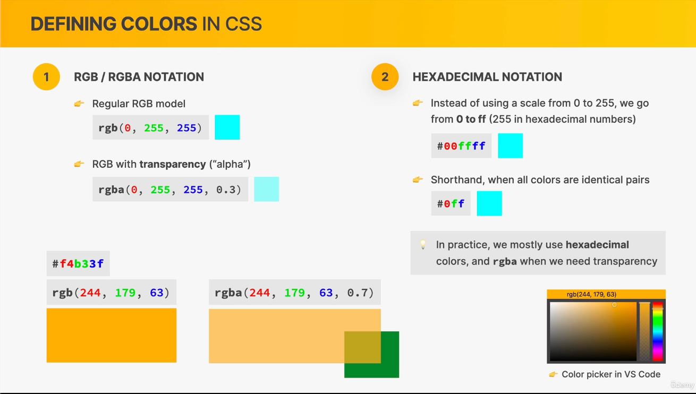
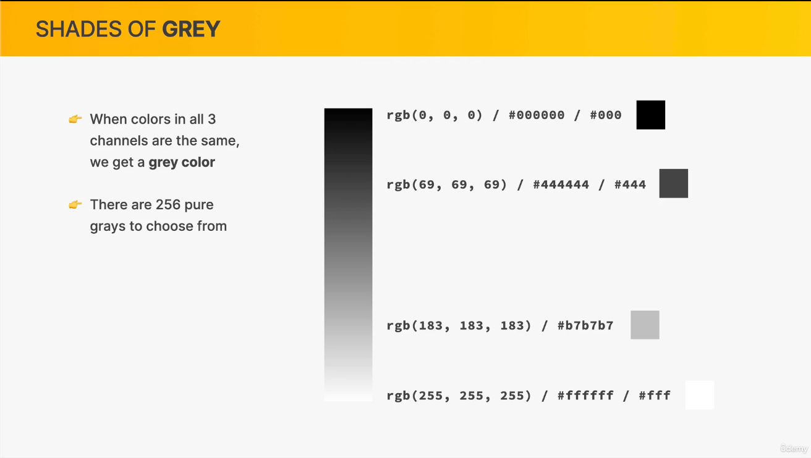

pseudo-classes

## conflicts

冲突 selector 之间的优先级：id > class > 元素，同级多个选最后一个
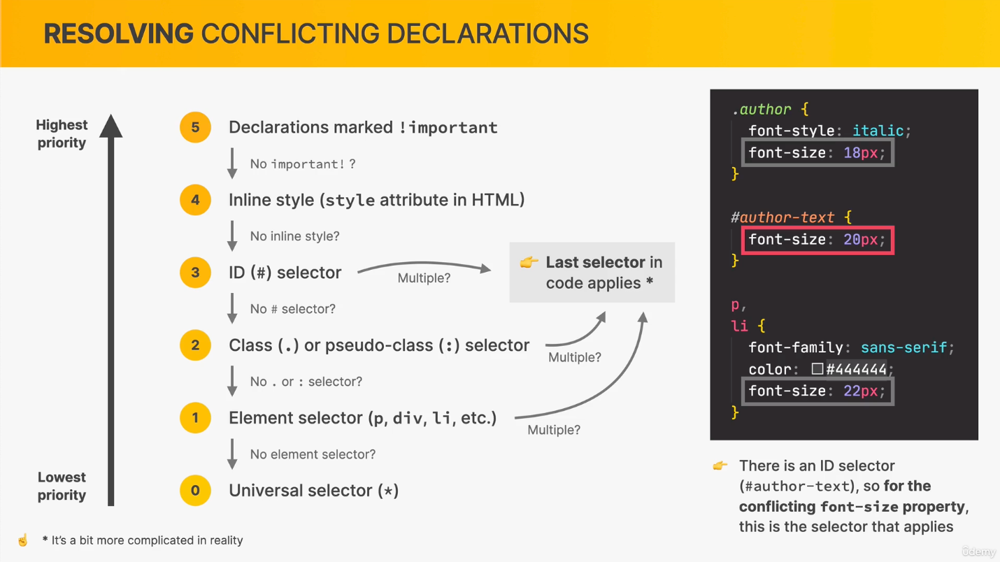

## 继承

border 属性不会被继承。但文本相关的属性都可以继承

```
body {
  color: #444;
  font-family: sans-serif; /* 无衬字 */
  border-top: 10px solid #1098ad;
}
```

## css box model

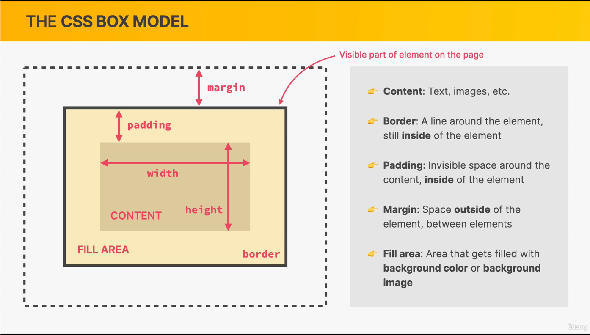
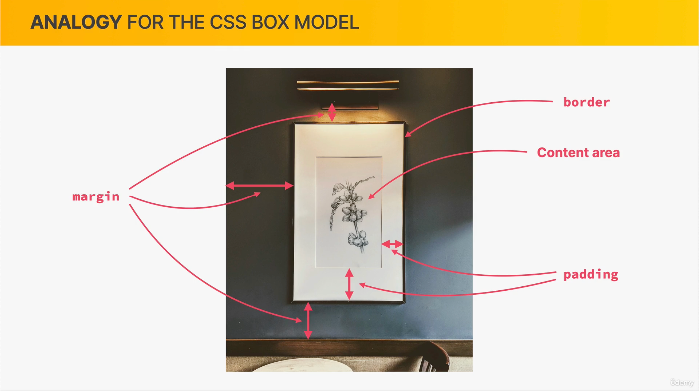
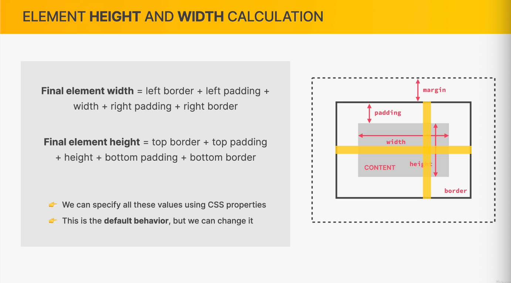

将所有填充置为 0:

```css
* {
  margin: 0;
  padding: 0;
}
```

外边距折叠（margin collapsing）：块级元素的上外边距和下外边距有时会合并（或折叠）为一个外边距，其大小取其中的最大者

## 页面内容居中

让页面自适应性居中：

```css
/* 用<div>包裹住需要居中的内容，假设class=container */
.container {
  width: 700px;
  margin-left: auto;
  margin-right: auto;
}
```

## 不同种类的 box

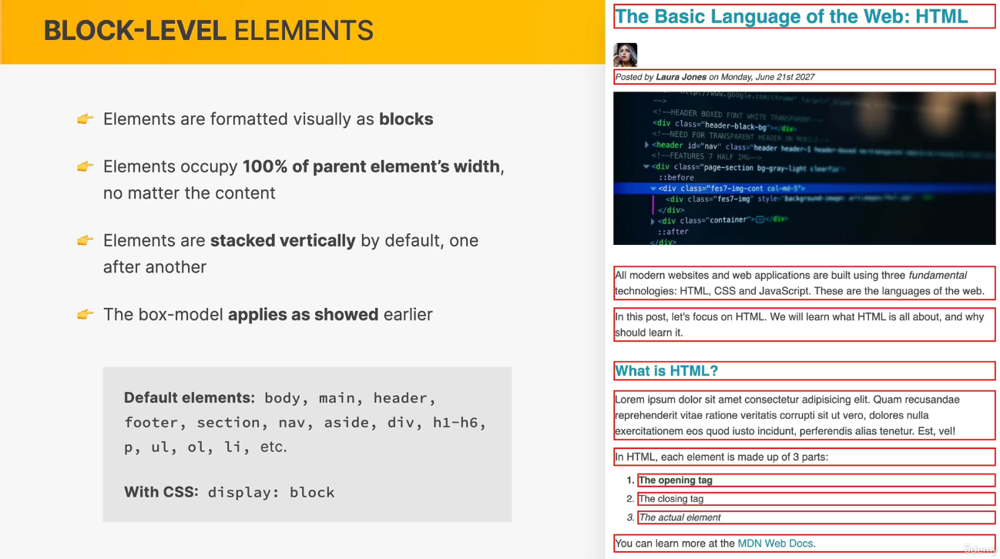

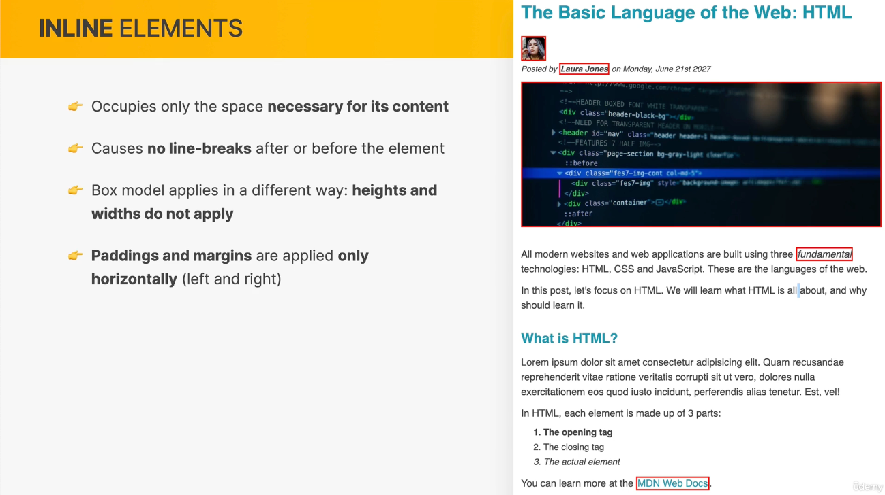

Block 元素：

- 换行：在元素前后会产生换行，独占一行
- 宽度和高度：通常占据父元素父元素的整个宽度（默认值），可以设置 宽高、内外边距
- 排列：垂直方向排列
- 例：`<div>`、`<p>`、`<h1>`

Inline-block 元素：

- 换行：前后不会产生换行，允许与相邻元素水平排列在同一行
- 宽度和高度：可以设置宽高（这是和纯 inline 元素的区别）。
- 排列：水平方向排列，可以根据内容和容器进行换行
- 优点：结合了 block 和 inline 的特性，既能像 block 一样设置样式，又能像 inline 一样并排显示
- 示例：可用于需要同时控制尺寸和水平排列的元素

inline 元素：

- 不会独占一行，和文字一样在一行里自然排布。
- 不能设置宽高（设置了也大多无效，宽高由内容撑开）。
- 只能设置左右的 margin，上下的 margin 无效。p
- 常见例子：`<span>`、`<a>`、`<strong>`、`<em>`。

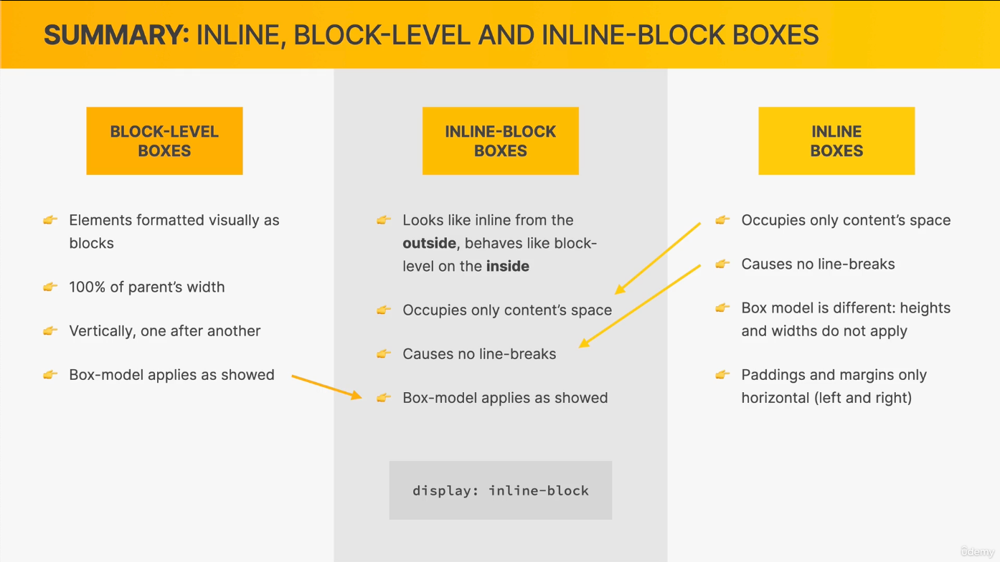

## absolute positioning

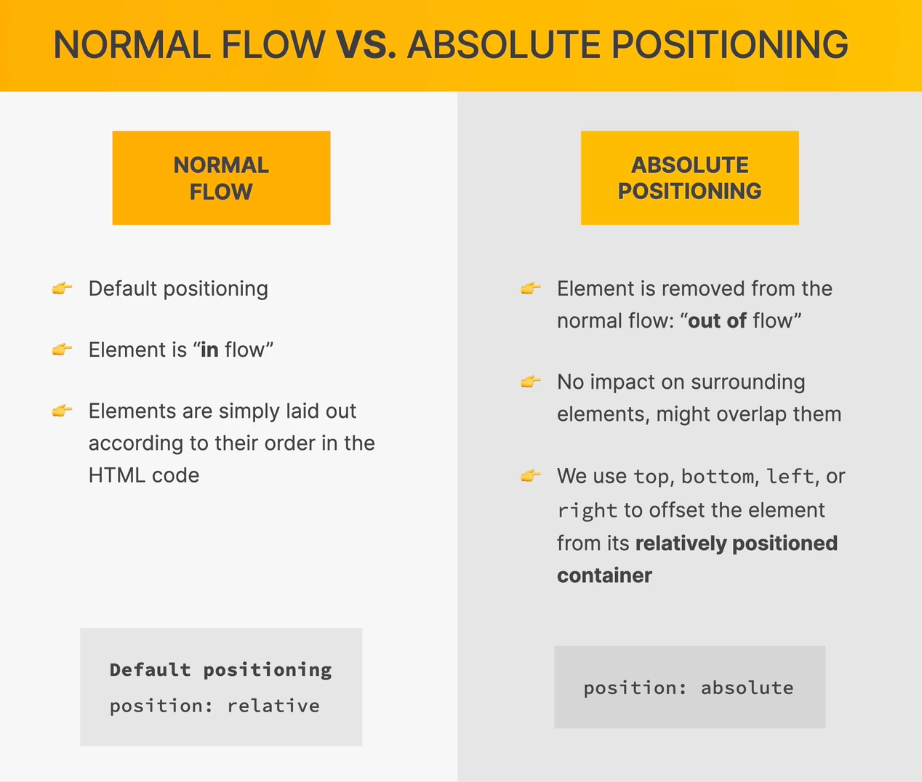

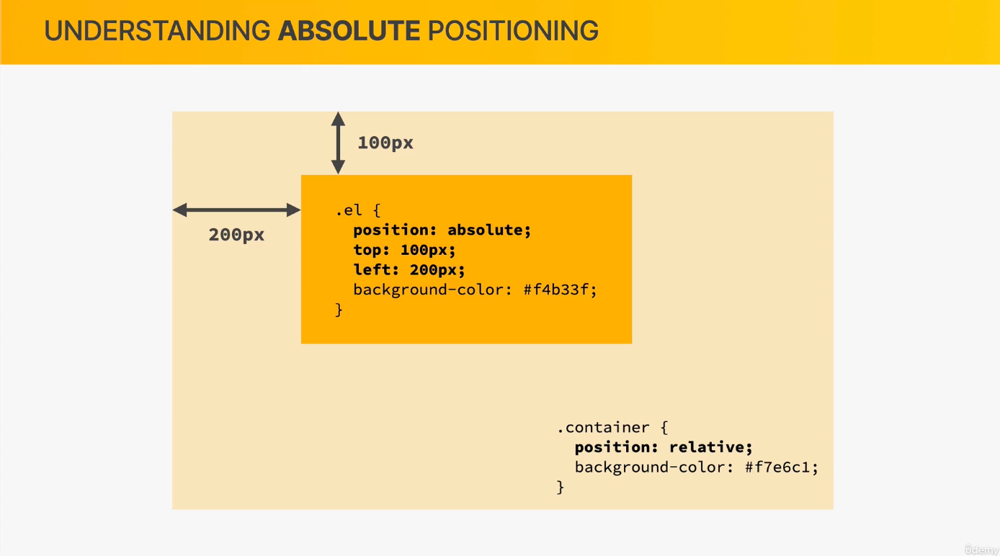

## pseudo elements

跟在两个冒号后面

```css
h1::first-letter {
  font-style: normal;
  margin-right: 5px;
}
```

将 h3 标题下面的 p 段落的第一行变成红色：

```css
h3 + p::first-line {
  color: red;
}
```

在元素旁边添加小物件：before / after

```css
h2 {
  ....;
  position: relative;
}

h2::after {
  content: "TOP";
  background-color: #ffdd00;
  font-size: 15px;
  font-weight: bold;
  display: inline-block;
  padding: 5px 10px;
  position: absolute; /* 一定要在父元素那里添加相对位置! */
  top: -15px;
  right: -20px;
}
```

# CSS Layouts

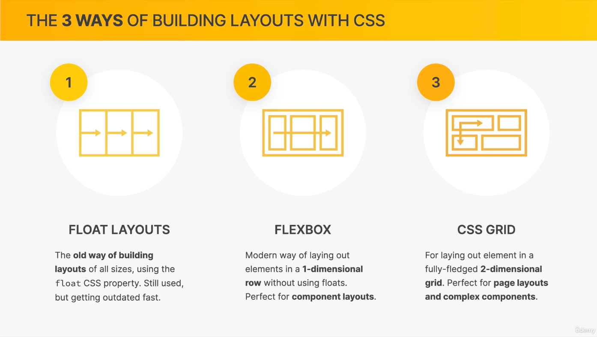

## float

当元素被设置为 float 时，它将 out of flow

如果一个元素的子元素们全部设置为 float，则该元素本身的 height 会变为 0，这是 collapsing element 现象

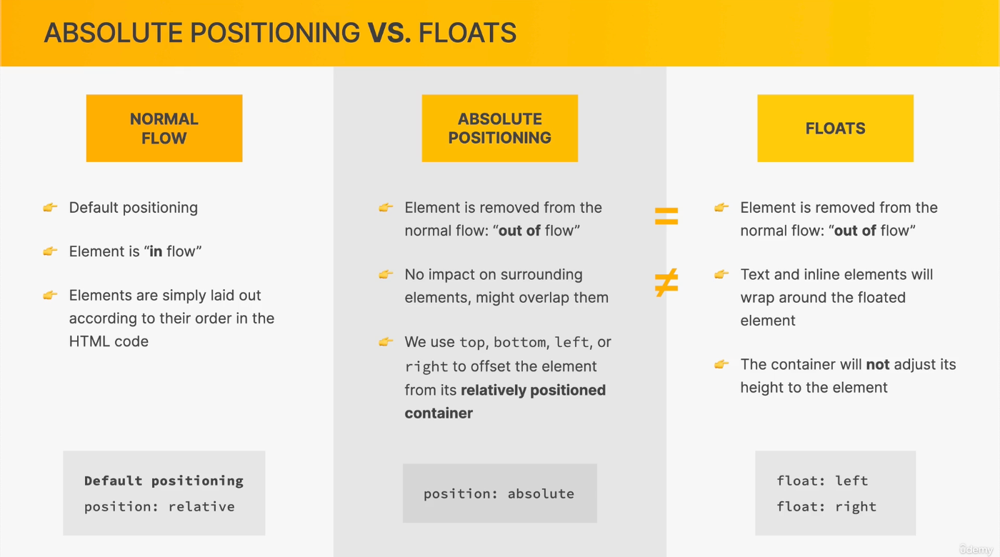

解决方法（not really good）：

- 在父元素中添加一个 div 用来 clear：`<div class="clear"></div>`
- 选中该 div 并 clear both float
- ...但这会引入太多空 div

```html
<header class="main-header">
  <h1>📘 The Code Magazine</h1>

  <nav>
    <!-- <strong>This is the navigation</strong> -->
    <a href="blog.html">Blog</a>
    <a href="#">Challenges</a>
    <a href="#">Flexbox</a>
    <a href="#">CSS Grid</a>
  </nav>

  <div class="clear"></div>
</header>
```

```css
.clear {
  clear: both;
}
```

true solution：clearfix hack

```html
<header class="main-header clearfix"></header>
```

```css
.clearfix::after {
  clear: both;
  content: "";
  display: block;
}
```

## box-sizing: border box

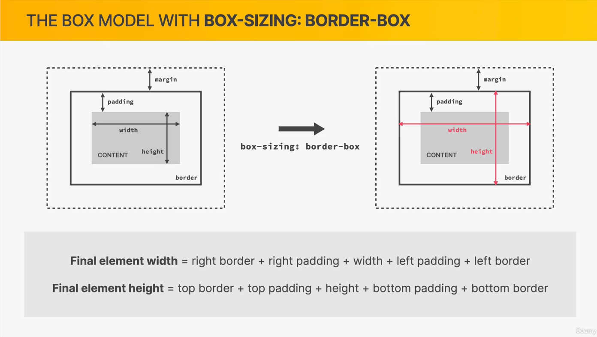

## flex box

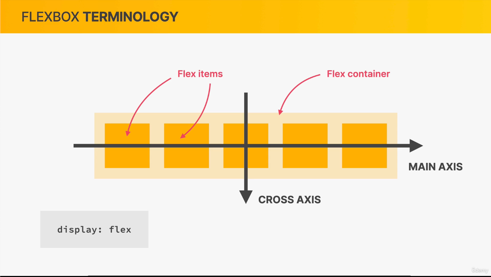

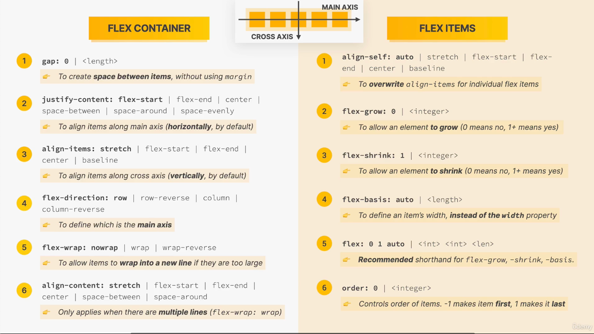

flex: 0 1 auto // flex-grow, flex-shrink, flex-basis

flex-grow （扩张因子）

控制当容器里 有多余空间 时，项目能不能“长大”。

- 0 → 不会长大（保持原始大小）。
- 1 → 会均分剩余空间。
- 2 → 比 1 的项目多分一倍空间。

flex-shrink （收缩因子）

控制当容器里 空间不足 时，项目能不能“缩小”。

- 0 → 不缩，死守住自己的大小。
- 1 → 按比例缩小。
- 2 → 缩得比 1 的更狠。

flex-basis （基准大小）

定义项目在分配多余空间之前的 初始尺寸。

- auto → 看元素内容或宽度属性决定。
- 具体值（比如 200px、30%）→ 优先用这个作为“基础宽度”。

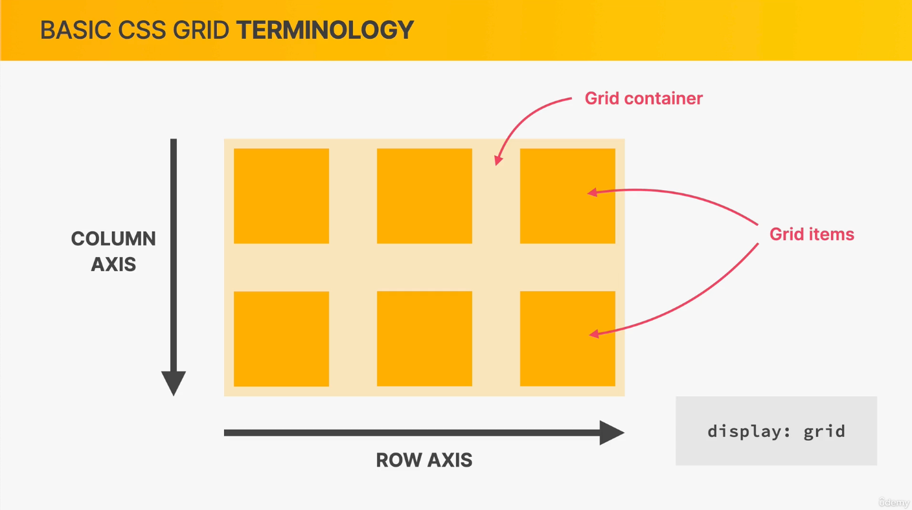
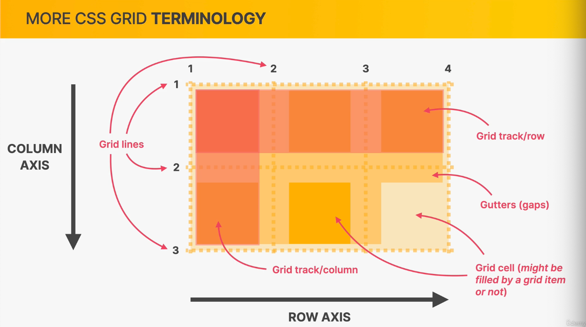
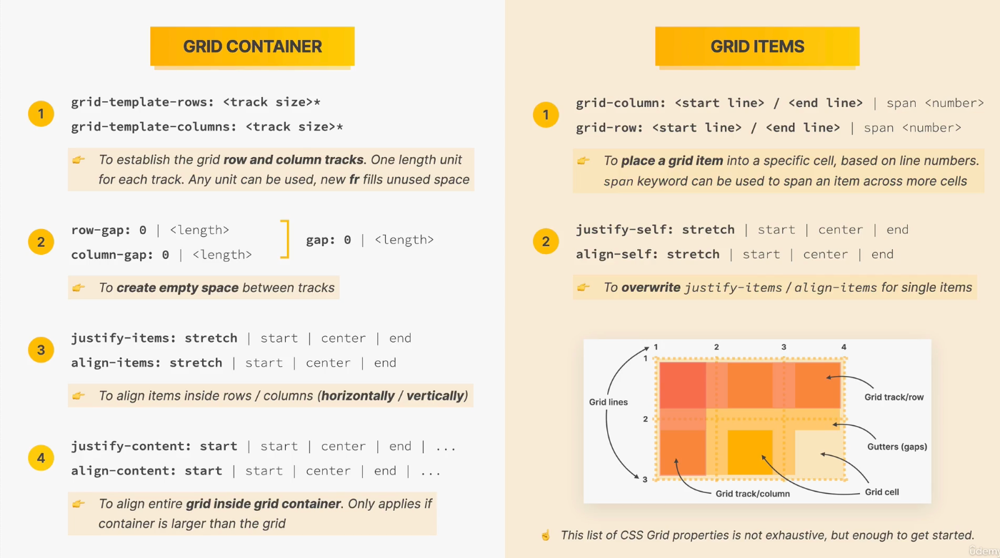

1fr 为该行元素的最大长度

## 做一个小组件

flexbox 竖排列：
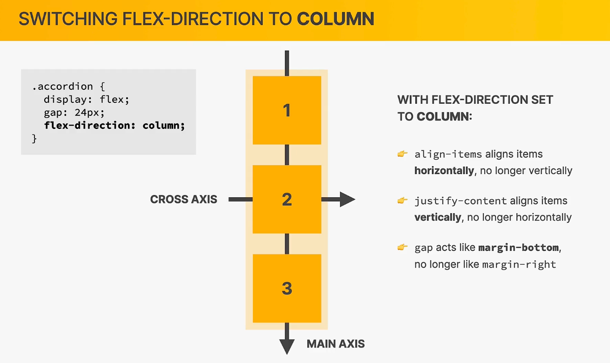

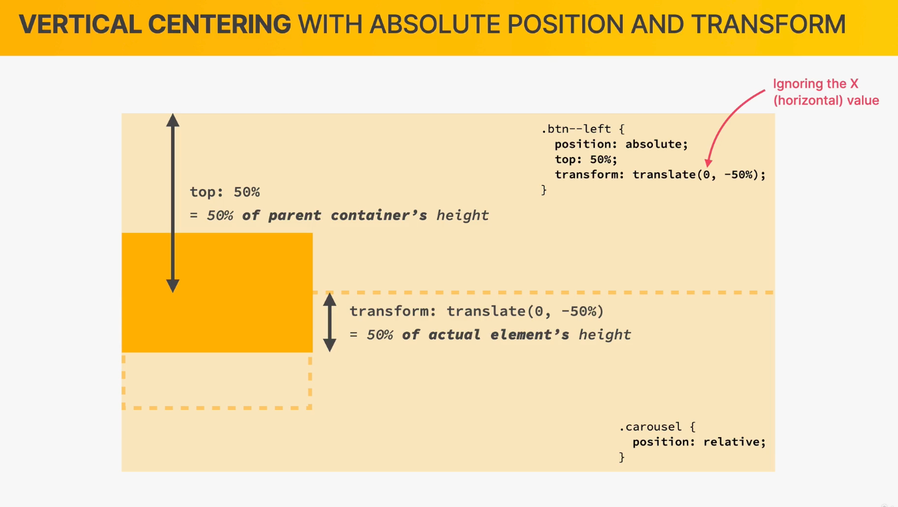

使用绝对定位：

```css
/* in relation to parent element */
left: 0;
top: 50%; // 移动至父元素的一半位置
/* in relation to element itself */
transform: translate(-50%, -50%); // 参照元素自己的长度移动
```

max-width 用来限制元素的 最大宽度。无论内容有多大，或者你给它设置了多宽的 width，它都不会超过 max-width 的值。

1rem = 16px

这几个属性都是 **Flex 布局**里的核心概念。

## 1. `justify-content`

**控制主轴（main axis）方向上的排列**。

- 主轴通常是 **水平**（`flex-direction: row`）。
- 取值常见有：

  - `flex-start` → 全部挤到左边（默认）。
  - `flex-end` → 全部挤到右边。
  - `center` → 居中对齐。
  - `space-between` → 两端对齐，项目间隔平均。
  - `space-around` → 两边也有间隙，但间隙是中间的一半。
  - `space-evenly` → 所有间隙（包含两端）都完全相等。

想象就是“横着排队时怎么站”。

---

## 2. `align-items`

**控制交叉轴（cross axis）方向上的对齐**。

- 交叉轴通常是 **垂直方向**。
- 取值常见有：

  - `flex-start` → 全都贴着交叉轴起点（顶端）。
  - `flex-end` → 全都贴着交叉轴终点（底部）。
  - `center` → 在交叉轴居中。
  - `stretch` → 默认值，元素在交叉轴方向拉伸到容器一样高。
  - `baseline` → 按文字基线对齐。

想象就是“纵向上大家是齐头并进，还是拉伸到一样高”。

---

## 3. `align-content`

**控制多行内容在交叉轴上的对齐**（只有在 `flex-wrap: wrap;` 之后才有用）。

- 用法和 `justify-content` 很像，只不过作用在“多行”之间。

例子：

- `flex-start` → 多行挤到上边。
- `space-between` → 多行上下两端对齐，中间平均分布。

---

## 4. `align-self`

**单个项目在交叉轴上的对齐方式**，会覆盖掉父容器的 `align-items`。

- 取值和 `align-items` 一样。
- 常用在“这个孩子要特立独行”的时候。

---

### 小结：

- **justify-content** → 主轴（横着）怎么分布。
- **align-items** → 单行的交叉轴（竖着）怎么对齐。
- **align-content** → 多行之间的交叉轴（竖着）怎么分布。
- **align-self** → 单个孩子的纵向任性行为。

---

参数顺序

```css
box-shadow: offset-x offset-y blur-radius color;
```

offset-x = 0
→ 阴影在水平方向上的偏移量。
0 表示不往左或右偏移。

offset-y = 1px
→ 阴影在垂直方向上的偏移量。
1px 表示阴影往下偏移 1 像素。

blur-radius = 2px
→ 模糊半径。值越大，阴影越柔和、扩散得更远。
这里是 2px，所以阴影比较轻微。

color = rgba(0, 0, 0, 0.1)
→ 阴影颜色，这里是黑色 (rgb(0,0,0)) ，透明度 0.1，很浅淡。

## 媒体查询（media queries）

根据 设备特性（比如屏幕宽度、高度、分辨率、方向等）来决定是否应用某些样式。
