分为 DOM 和 BOM。

## DOM

DOM 核心思想：把网页内容当作对象来处理

DOM（Document Object Model）是将整个 HTML 文档的每一个标签元素视为一个对象，这个对象下包含了许多的属性和方法。是浏览器提供的一套专门用来操作网页内容的功能，可以开发网页内容特效和实现用户交互

DOM 树

- HTML 文档呈现树状结构
- 描述网页内容（标签之间）的关系

DOM里有三种节点：
- 元素节点：`html`、`p`等元素
- 文本节点：`"hello"`文本信息。总是放在元素节点内部
- 属性节点：`title = "my_article"`，总是放在标签内部

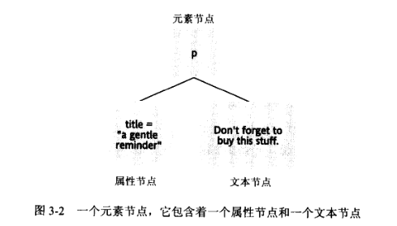

DOM 对象：浏览器根据 html 标签生成的 JS 对象

document 对象：

- 代表整个网页。用来访问和操作网页内容，是所有 DOM 操作的切入点
- 它是 window 对象的属性
- html 是它的子元素

获取 DOM 元素：
- getElementById(id)，返回id对应的一个元素
- getElementsByTagName(tagname)：返回一个对象数组，其中包含所有标签为tagname的元素。`tagname=*`表示选择所有元素节点。

- getAttribute：获取属性的值
- setAttribute：设置属性的值

获取元素节点的文本节点：`childNode[]`

改变文本节点的值：`nodeValue`

例如：`p.childNode[0].nodeValue = text`

innerHTML：

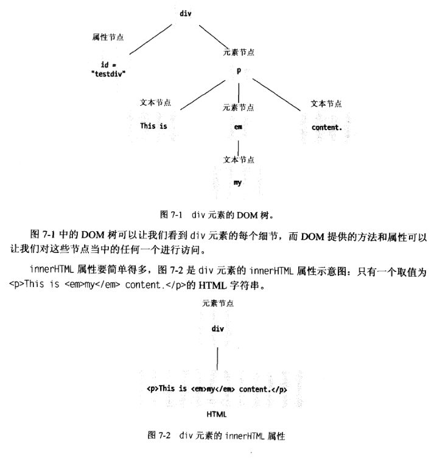


- createElement(nodeName): 创建元素节点
- createTextNode(text)：创建文本节点
- appendChild(child)：在末尾插入节点
- insertBefore(newElement, targetElement)：将newElement插入到targetElement之前


### Selectors API

获取 DOM 元素：通过 css 选择器

- querySelector，选取匹配的第一个元素
- querySelectorAll，选取匹配的多个元素

设置/修改 DOM 元素的内容：

- .innerText 属性只识别文本，不能解析标签
- .innerHTML 属性能识别文本，能够解析标签

className 和 classList：

- className 会直接覆盖所有类。要记得把原来的类名加上
- classList 可以较为灵活地追加和删除类名

使用 className：

```html
<head>
 <style>
    div {
      background-color: pink;
    }

    .nav {
      /* ... */
    }

    .box {
      /* ... */
    }
  </style>
</head>

<body>
  <div class="nav">123</div>
  <script>
    // 1. 获取元素 
    const div = document.querySelector('div')
    // 2. 添加类名  class 是个关键字 我们用 className
    div.className = 'nav box'
  </script>
</body>
```

使用 classList：

```js
// 2.1 追加类 add() 类名不加点，并且是字符串
box.classList.add("active");
// 2.2 删除类  remove() 类名不加点，并且是字符串
box.classList.remove("box");
// 2.3 切换类  toggle()  有还是没有啊， 有就删掉，没有就加上
box.classList.toggle("active");
```

在 HTML 里，class 是一个 属性，它的值是一串“标签类别名”（类名）。
例如：

```js
<div class="box red"></div> // 表示这个 <div> 同时属于 box 和 red 这两个“类”。
```

- 标准属性:标签天生自带的属性比如 class id title 等,可以直接使用点语法操作比如：disabled、checked、selectedl
- 自定义属性：
  - 在 html5 中推出来了专门的 data-自定义属性
  - 在标签上一律以 `data-`开头
  - 在 DOM 对象上一律以 dataset 对象方式获取

```js
<body>
  <div data-id="1" data-spm="不知道">
    1
  </div>
  <div data-id="2">2</div>
  <div data-id="3">3</div>
  <div data-id="4">4</div>
  <div data-id="5">5</div>
  <script>
    const one = document.querySelector('div') console.log(one.dataset.id) // 1
    console.log(one.dataset.spm) // 不知道
  </script>
</body>;

const sk = document.querySelector(".sk");
const header = document.querySelector(".header");
// 1. 页面滚动事件
window.addEventListener("scroll", function () {
  // 当页面滚动到 秒杀模块的时候，就改变 头部的 top值
  // 页面被卷去的头部 >=  秒杀模块的位置 offsetTop
  const n = document.documentElement.scrollTop;
  // if (n >= sk.offsetTop) {
  //     header.style.top = 0
  // } else {
  //     header.style.top = '-80px'
  // }
  header.style.top = n >= sk.offsetTop ? 0 : "-80px";
});
```

修改表单元素属性

- 注意使用 value 而不是 innerHTML 获取

间歇函数：间隔固定时间重复执行一个函数。setInterval

#### 区分：innerHTML、innerText、outerHTML、outerText

  innerHTML：返回元素**内部**的 HTML 字符串，包含所有子元素的**标签**。

  innerText：返回元素**内部**的**纯文本**内容

  outerHTML：返回**包括当前元素自身**在内的 HTML 字符串（即元素本身的标签 + 内部内容）。

  outerText：与 `innerText` 完全相同

  例如： 

```html
    <div id="div1">
      <p id="p1">this is text</p>
    </div>
    <script>
      var div = document.getElementsByTagName("div");
      console.log(div[0].innerHTML); //  <p id="p1">this is text</p>
      console.log(div[0].innerText); //  this is text
      console.log(div[0].outerHTML); // <div id="div1"><p id="p1">this is text</p></div>
      console.log(div[0].outerText); //  this is text
    </script>
```

如果想插入标签：使用innerHTML、outerHTML

如果想展示` <div></div> `这几个字符且不被当作标签解析，使用innerText

outerText不推荐使用，因为各大浏览器实现有差异

### 事件 Event

事件：用户与网页之间的交互行为。JS 通过为事件绑定回调函数来处理事件，事件触发后回调函数便会执行。（回调函数：作为参数的函数，也称其为事件的响应函数）

事件对象：

- 事件绑定的回调函数的第一个参数就是事件对象,包含事件触发时的相关信息
- key：用户按下的键盘的值

this:

- 【谁调用，this 就是谁】是判断 this 指向的粗略规则
- 直接调用函数，其实相当于是 window.函数，所以 this 指代 window

绑定回调函数：

- 标签的事件属性：`<button type="button" onclick="...">按钮</button>`
- 元素对象的事件属性: `btn.onclick = function(){...}`
- `btn.addEventListener`: 添加事件监听

事件流

- 捕获
- 冒泡

解绑事件：removeEventListener

鼠标经过事件：

- mouseover 和 mouseout 会有冒泡效果
- mouseenter 和 mouseleave 没有冒泡效果(推荐)

事件委托

- 给父元素注册事件，当我们触发子元素的时候，会冒泡到父元素身上，从而触发父元素的事件
- 优点：减少注册次数，可以提高程序性能

页面加载事件：

- 加载外部资源，加载完毕时触发的事件

页面滚动事件：

- scrollLeft 和 scrollTop 可以读写元素内容往左、往上滚出去看不到的距离
- 检测页面滚动的头部距离（被卷去的头部）：document.documentElement.scrollTop

元素的尺寸与位置：
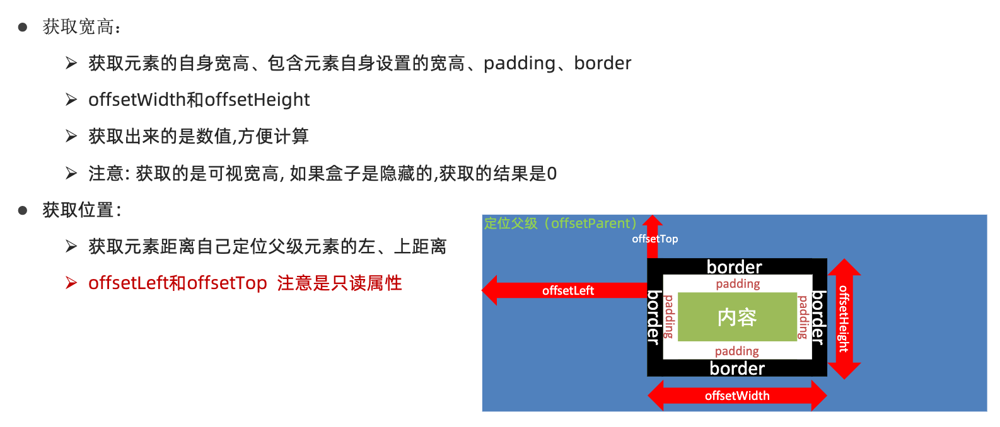

- offsetWidth 和 offsetHeight 是得到元素什么的宽高？:
  - 内容 + padding + border
- offsetTop 和 offsetLeft 得到位置以谁为准？
  - 带有定位的父级
  - 如果都没有则以文档左上角为准

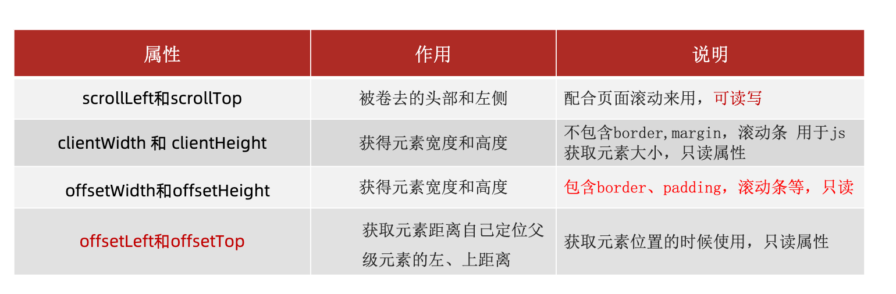

---

微博发布案例

时间戳：

- 1970 年 01 月 01 日 00 时 00 分 00 秒起至现在的毫秒数

获得时间戳的三种方式：

```js
const date = new Date();
console.log(date.getTime());

console.log(+new Date());

console.log(Date.now());
```

实现倒计时：将来时间戳 - 现在时间戳。通过时间戳得到是毫秒，需要转换为秒再计算

- 元素节点：
  - 标签，例如 body、div
  - html 是根结点
- 属性节点
  - 例如 href
- 文本节点
  - 例如标签中的文字

查找节点：

- 查找父节点：`子元素.parentNode`
- 子节点：`父元素.children`。仅获得所有元素节点
- 兄弟节点：`nextElementSibling` `previousElementSibling`

追加节点：`appendChild`

克隆节点：cloneNode 会克隆出一个跟原标签一样的元素，括号内传入布尔值

- 若为 true，则代表克隆时会包含后代节点一起克隆
- 若为 false，则代表克隆时不包含后代节点
- 默认为 false

删除元素必须通过父元素删除：`removeChild`

M 端：移动端

- 触屏事件 touch

浏览器是如何进行界面渲染的？

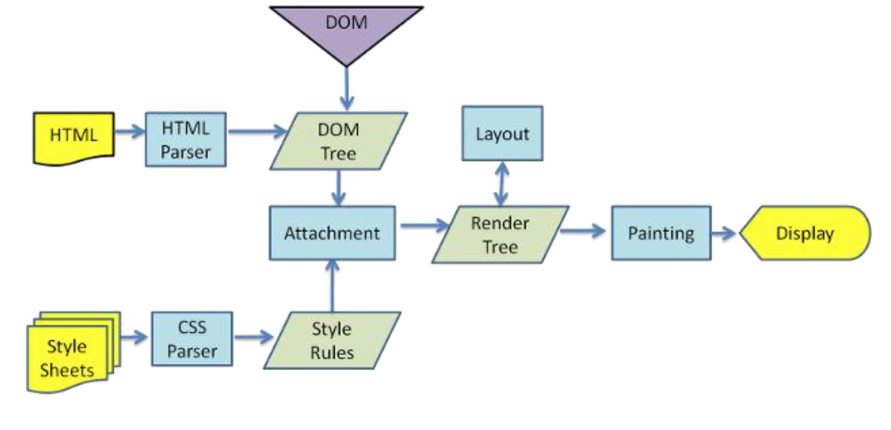

- 解析（Parser）HTML，生成 DOM 树(DOMTree)
- 同时解析（Parser）CSS，生成样式规则(StyleRules)
- 根据 DOM 树和样式规则，生成渲染树(RenderTree)
- 进行布局 Layout(回流/重排):根据生成的渲染树，得到节点的几何信息（位置，大小）
- 进行绘制 Painting(重绘):根据计算和获取的信息进行整个页面的绘制
- Display:展示在页面上
- 回流(重排)：当 RenderTree 中部分或者全部元素的尺寸、结构、布局等发生改变时，浏览器就会重新渲染部分或全部文档的过程称为回流。
- 重绘：由于节点(元素)的样式的改变并不影响它在文档流中的位置和文档布局时(比如：color、background-color、outline 等),称为重绘。
- 重绘不一定引起回流，而回流一定会引起重绘。

---

## BOM

BOM(Browser Object Model)：浏览器对象模型。包括弹出窗口等方法。

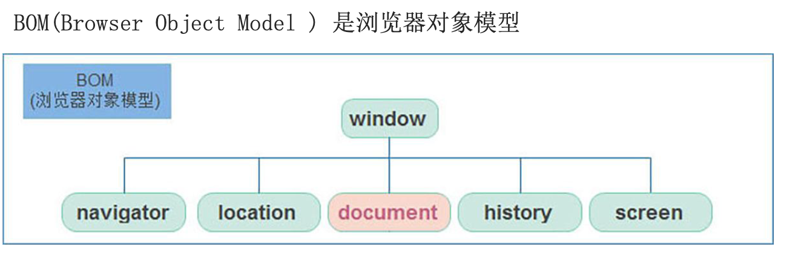

- window 对象是一个全局对象，也可以说是 JavaScript 中的顶级对象
- 像 document、alert()、console.log()这些都是 window 的属性，基本 BOM 的属性和方法都是 window 的。
- 所有通过 var 定义在全局作用域中的变量、函数都会变成 window 对象的属性和方法
- window 对象下的属性和方法调用的时候可以省略 window

延时函数：`setTimeout(回调函数，等待的毫秒数)`

- 延时函数:执行一次
- 间歇函数:每隔一段时间就执行一次,除非手动清除

JavaScript：**单线程**，也就是说，同一个时间只能做一件事。

- 同步任务
  - 同步任务都在主线程上执行，形成一个执行栈。
- 异步任务
  - JS 的异步是通过回调函数实现的。
  - 一般而言，异步任务有以下三种类型:
    - 1、普通事件，如 click、resize 等
    - 2、资源加载，如 load、error 等
    - 3、定时器，包括 setInterval、setTimeout 等异步任务相关添加到任务队列中（任务队列也称为消息队列）

JS 执行机制：事件循环（eventloop）

- 1. 执行【执行栈】中的同步任务
- 2. 异步任务放入任务队列
- 3. 当执行栈中的同步任务执行完毕，系统会按次序读取任务队列中的异步任务，于是被读取的异步任务结束等待状态，进入执行栈，开始执行

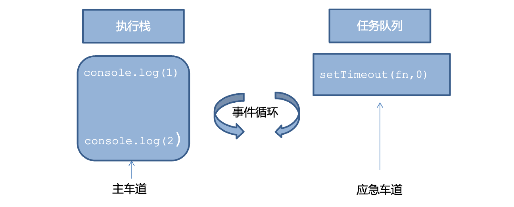

location 对象: 拆分并保存了 URL 地址的各个组成部分

- `href`属性：获取完整的 URL 地址，对其赋值时用于地址的跳转
- `search`属性：获取地址中携带的参数，符号？后面部分
- `hash`属性：获取地址中的啥希值，符号#后面部分
- `reload`方法：用来刷新当前页面，传入参数 true 时表示强制刷新

navigator 对象：记录了浏览器自身的相关信息

histroy 对象：管理历史记录，该对象与浏览器地址栏的操作相对应，如前进、后退、历史记录等

本地存储分类：localStorage

- 可以多窗口（页面）共享（同一浏览器可以共享）
- 以**键值对**的形式存储使用
- 本地存储只能存储字符串数据类型

```js
// 1. 要存储一个名字  'uname'， 'pink老师'
// localStorage.setItem('键'，'值')
localStorage.setItem("uname", "pink老师");
// 2. 获取方式  都加引号
console.log(localStorage.getItem("uname"));
// 3. 删除本地存储  只删除名字
localStorage.removeItem("uname");
// 4. 改  如果原来有这个键，则是改，如果么有这个键是增
localStorage.setItem("uname", "red老师");

// 2. 本地存储只能存储字符串数据类型
localStorage.setItem("age", 18);
console.log(localStorage.getItem("age"));
```

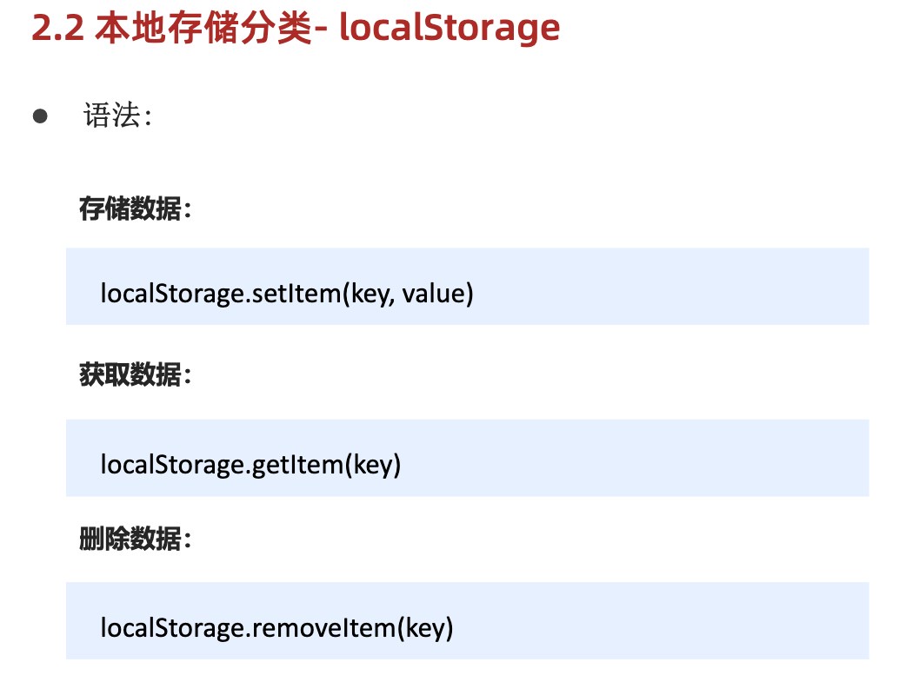

存储复杂数据类型：将复杂数据类型转换成 JSON 字符串

- 取出时，应把取出来的字符串转换为对象

```js
const goods = {
  name: "abc",
  price: 1999,
}; // JSON字符串：{"name":"abc", "price":"1999"}
localStorage.setItem("goods", JSON.stringify(goods));

const obj = JSON.parse(localStorage.getItem("goods"));
```

学生信息表案例

map：遍历数组处理数据，并返回新的数组

```js
const arr = ["red", "blue", "green"];
const newArr = arr.map(function (ele, index) {
  return ele + "颜色";
}); // [red颜色，blue颜色，green颜色]
```

join：将数组拼接成一个字符串

---

复习综合案例

### 正则表达式

用于匹配字符串中字符组合的模式

作用：

- 表单验证
- 过滤敏感词
- 提取字符串
- test 方法用于判断是否有符合规则的字符串，返回的是布尔值找到返回 true，否则 false
- exec 方法用于检索（查找）符合规则的字符串，找到返回数组，否则为 null

#### 元字符

例如 `[a-z]`。

边界符：

- `^`，表示匹配行首的文本
- `$`，表示匹配行尾的文本

量词
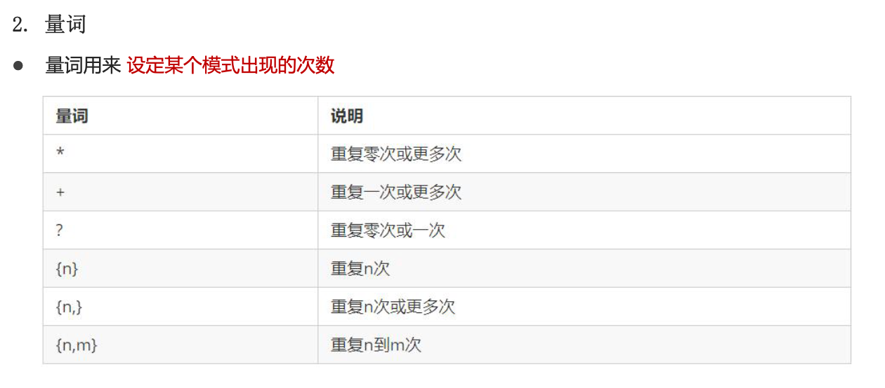

字符类：
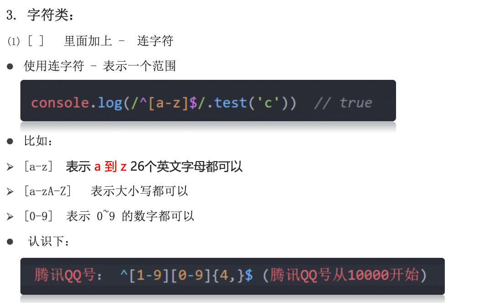
在 `[]`内加上 `^`表示匹配除这些之外的字符

`.`：匹配除换行符之外的任何单个字符

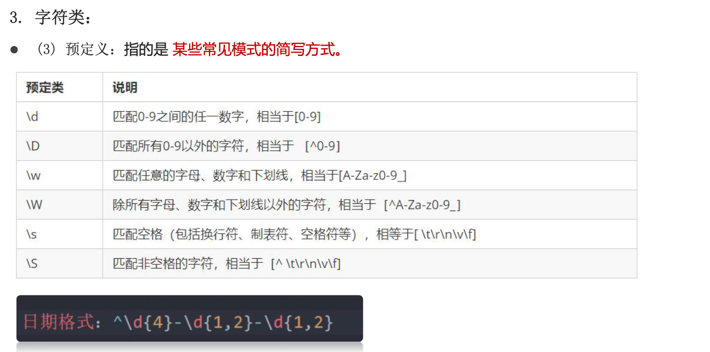

修饰符：

- `i`：正则匹配时字母不区分大小写
- `g`：匹配所有满足正则表达式的结果

替换：`字符串.replace(/正则表达式/, '替换的文本')`
