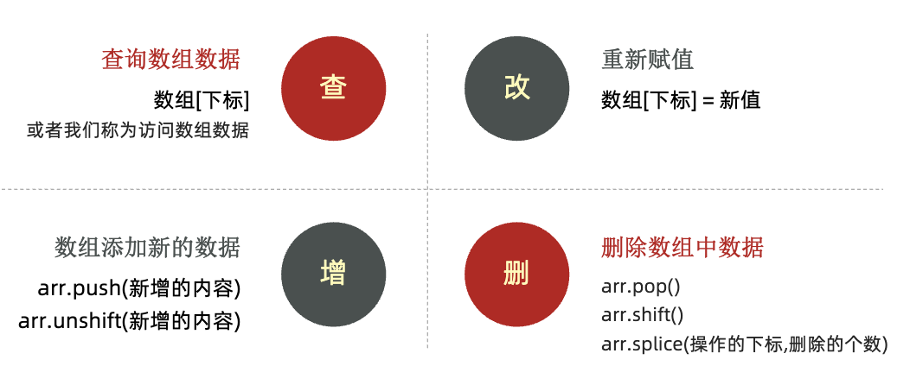
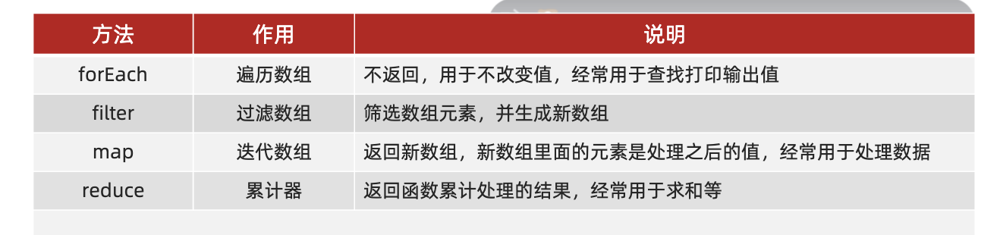
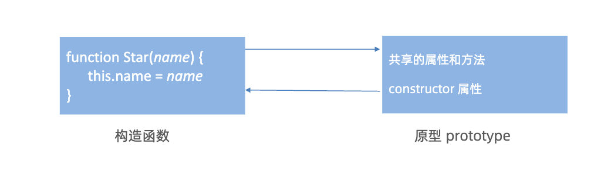
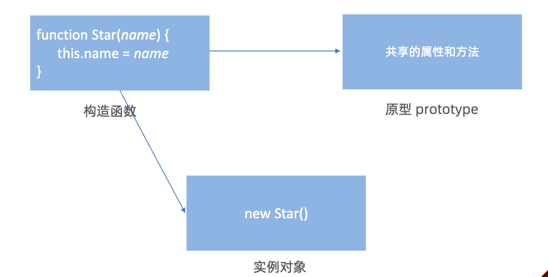
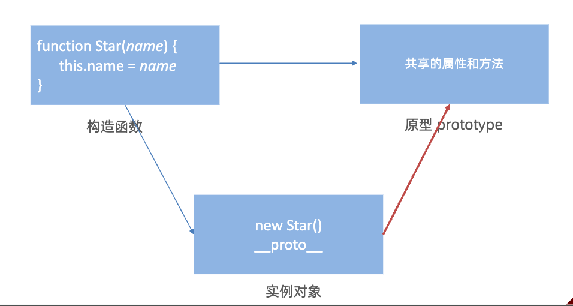
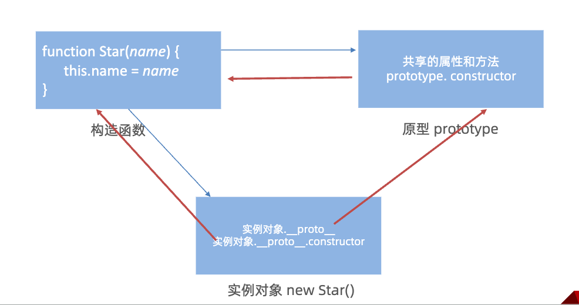
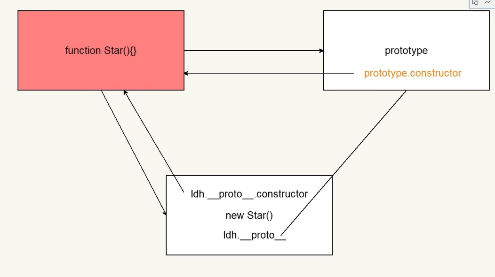
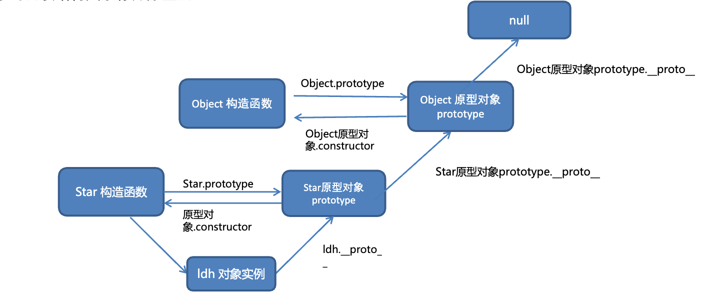
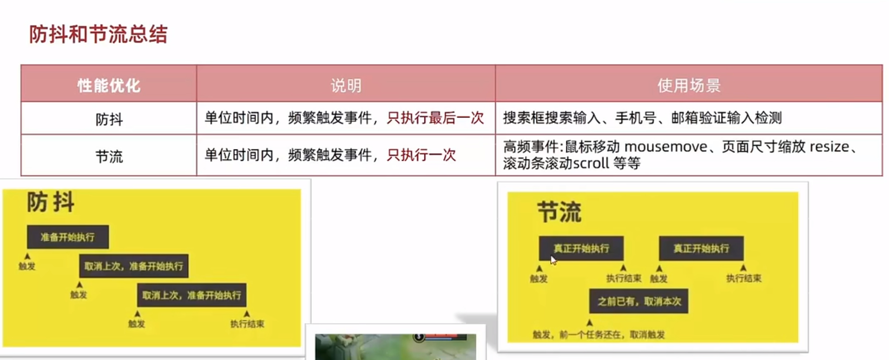

## 变量

js 是弱类型语言，变量可以存放不同类型的值

变量 var：

- 是全局变量
- 可重复定义
- 可以先使用 再声明

let：用于声明变量

- 局部变量
- 不可重复定义
- `==`会进行类型转换， `===`不会进行类型转换

优先使用 const 声明变量，因为变量基本不会被修改。如果真的要修改可以事后改为 let

模版字符串：用来拼接字符串和变量

```js
document.write(`大家好，我叫${name}, 今年${age}岁`);
```

数据类型：

- 基本：number string boolean undefined null
- 引用：object，存储的是地址
- undefined：只声明变量，不赋值的情况下，变量的默认值为 undefined
- null：表示赋值了，但是内容为空

可以通过 typeof 关键字检测数据类型。

隐式转换：

- `+`号两边只要有一个是字符串，都会把另外一个转成字符串

显式转换：

- 转换为数字型
  - Number(数据)
    - 转成数字类型
    - 如果字符串内容里有非数字，转换失败时结果为 NaN（NotaNumber）即不是一个数字
    - NaN 也是 number 类型的数据，代表非数字
  - parseInt(数据)
    - 只保留整数
  - parseFloat(数据)
    - 可以保留小数

`''、0、undefined、null、false、NaN` 转换为布尔值后都是 false,其余则为 true.

比较运算符：

- ==：值是否相等
- ===：全等，值和类型都一致
- NaN 不等于任何值

表达式：因为表达式可被求值，所以它可以写在赋值语句的右侧。

语句：而语句不一定有值，所以比如 alert()for 和 break 等语句就不能被用于赋值

数组



## 函数

```js
function 函数名(参数列表) {
  函数体;
}
```

```js
var arr = [1,2,3,4];
arr.forEach(function(e){
  console.log(e);
})

// 箭头函数
arr.forEach((e) => (
  console.log(e);
))
```

匿名函数：

```js
btn.onclick = function () {
  alert(`匿名函数`);
};
```

立即执行函数:避免全局变量之间的污染

```js
(function () {
  alert(`立即执行`);
})()(
  (function () {
    alert(`立即执行`);
  })()
);
```

Math.random()随机数函数，返回一个 0-1 之间，并且包括 0 不包括 1 的随机小数 `[0,1）`

- 生成 0-10 的随机数: `Math.floor(Math.random() * (10 + 1))`

---

函数也是对象，可以动态添加属性和方法


## 对象

声明：

```js
let 对象名 = {};
let 对象名 = new Object();
```

遍历对象:

```js
let obj = {
  uname: "andy",
  age: 18,
  sex: "male",
};
for (let k in obj) {
  console.log(k);
  console.log(obj[k]);
}
```


---


局部作用域分为

- 函数作用域：函数内部的代码
- 块级作用域：`{}`包围的代码

全局作用域：`<script>`标签内部、js 文件

作用域链：

- 本质上是底层的变量查找机制
- 查找规则：
  - 会优先在当前函数作用域中查找变量
  - 查找不到，则依次逐级查找父级作用域直到全局作用域

JS 的垃圾回收算法：

- 引用计数；定义“内存不再使用”，就是看一个对象是否有指向它的引用，没有引用了就回收对象
  - 存在问题：两个对象相互引用，则二者都不会被释放
- 标记清除；将“不再使用的对象”定义为“无法达到的对象”。从根部（在 JS 中就是全局对象）出发定时扫描内存中的对象，那些无法由根部出发触及到的对象被标记为不再使用，稍后进行回收。

### 闭包

闭包 = 内层函数 + 外层函数的变量

```js
function outer() {
  const a = 1;
  function f() {
    console.log(a);
  }
  f();
}
outer();
```

闭包的用处：封闭数据，提供操作，使得外部也能访问函数内部的变量

```js
function outer() {
  let a = 100;
  return function () {
    console.log(a);
  };
}
const fun = outer();
fun(); // 调用函数
```

实现数据的私有：

```js
function count() {
  let i = 0;
  function fn() {
    i++;
    console.log(`函数被调用了${i}次`);
  }
  return fn;
}
const fun = count();
fun(); // 1
fun(); // 2
```

闭包可能引起内存泄漏：i 虽然是函数内的局部变量，但由于全局变量 fun 可以引用到 i，所以 i 也像全局变量一样，在页面关闭后才被回收。

变量提升：

- 将 var 变量提升到当前作用域的最前面
- 只提升变量声明，不提升赋值
- 然后依次执行代码

```js
function fn() {
  console.log(num);
  var num = 10;
}
fn(); // undefined
```

函数提升：

- 将所有函数声明提升到当前作用域的最前面。即，函数在声明之前即可被调用
- 函数表达式不存在提升的现象

```js
// 1. 会把所有函数声明提升到当前作用域的最前面
// 2. 只提升函数声明，不提升函数调用
fn();
function fn() {
  console.log("函数提升");
}

// 函数表达式不存在提升的现象
fun(); // 报错
var fun = function () {
  console.log("函数表达式");
};
```

### 函数参数

动态参数：

- `arguments`包含了调用函数时传入的所有实参。是伪数组

剩余参数：用于获取多余的实参（...或者全部）。是真数组。

```js
function getSum(...arr) {
  console.log(arr);
}
```

剩余参数完全可以代替动态参数。

区分：展开运算符：将一个数组展开，不修改原数组。用于合并数组

```js
const arr1 = [1, 2, 3];
const arr2 = [3, 4, 5];
const arr = [...arr1, ...arr2];
console.log(arr); // [1,2,3,4,5,6]
```

### 箭头函数

```js
// 初始
const fn = function () {
  console.log(123);
};
// 1. 箭头函数 基本语法
const fn = () => {
  console.log(123);
};
fn();
const fn = (x) => {
  console.log(x);
};
fn(1);
// 2. 只有一个形参的时候，可以省略小括号
const fn = (x) => {
  console.log(x);
};
fn(1);
// // 3. 只有一行代码的时候，我们可以省略大括号
const fn = (x) => console.log(x);
fn(1);
// 4. 只有一行代码的时候，可以省略return
const fn = (x) => x + x;
console.log(fn(1)); // 2
// 5. 箭头函数可以直接返回一个对象
const fn = (uname) => ({ uname: uname });
console.log(fn("刘德华"));
```

箭头函数没有 `arguments` 动态参数，但有剩余参数 `...args`

#### 箭头函数 this

箭头函数不会创建自己的 this,它只会从自己的作用域链的上一层沿用 this。

```js
const obj = {
  value: 10,
  normal: function () {
    console.log(this.value);
  },
  arrow: () => {
    console.log(this.value);
  },
};

obj.normal(); // 10
obj.arrow(); // undefined
```

原因：

- 普通函数： this 指向**调用者** obj
- 箭头函数：不会创建自己的 this，而是从自己的作用域链的上一层沿用 this
- 箭头函数更接近「函数式」
- DOM 事件回调函数不推荐用箭头函数

```js
// 2. 箭头函数的this  是上一层作用域的this指向
const fn = () => {
  console.log(this); // window
};
fn();

const obj = {
  uname: "pink老师",
  // 箭头函数
  sayHi: () => {
    console.log(this); // this 指向 window
  },
  // 普通函数
  sayHiFunc: function () {
    console.log(this); // this 指向 obj
    let i = 10;
    const count = () => {
      console.log(this); // this 指向 obj
    };
    count();
  },
};
obj.sayHi();
obj.sayHiFunc();
```

数组解构赋值:

- 将数组的单元值快速批量赋值给一系列变量的简洁语法 `const [a,b,c] = arr` `[a,b]=[b,a]`
- 变量数量大于数组单元值数量时，多余的变量将被赋值为 undefined。可以设置默认值来避免这种情况。
- 变量少数组单元值多：剩余参数解决
- 通过空格来忽略某些数组单元值

有两哪种情况需要加分号的？

- 立即执行函数
- 数组解构

对象解构：

- 将对象属性和方法快速批量赋值给一系列变量的简洁语法 2.给新的变量名赋值：
- 可以从一个对象中提取变量并同时修改新的变量名

```js
// 对象解构
const obj = {
  uname: "pink老师",
  age: 18,
};
const { uname, age } = obj;

// 旧变量名: 新变量名
const { uname: username, age } = { uname: "pink老师", age: 18 };
```

数组对象解构

```js
const pig = [
  {
    uname: "佩奇",
    age: 6,
  },
];
const [{ uname, age }] = pig;
```

filter 筛选函数：

```js
const arr = [10, 20, 30];
const newArr = arr.filter((item) => item >= 20);
console.log(newArr); // [20, 30]
```

### 构造函数

实例成员&静态成员：

- 实例成员：通过构造函数创建，实例对象中的属性和方法称为实例成员
- 静态成员：构造函数的属性和方法被称为静态成员。
  - 静态成员只能通过**构造函数**来访问
  - 一般将公共特征的属性或方法静态成员设置为静态成员。
  - 静态成员方法中的 this 指向构造函数本身

内置构造函数：

- Object
- Array
- String
- Number

Object 的三个常用静态方法：

- Object.keys()：获取对象中所有属性
- Object.values(): 获取对象中所有属性值
- Object.assign(a，b): 将 b 拷贝给 a
  - 可以用来给对象添加属性

```js
const o = { name: "123", age: 4 };
Object.assign(o, { gender: "male" });
console.log(o); // {name:'123', age: 4, gender: 'male'}
```

### Array



reduce:

- 如果没有初始值，则上一次值（prev） = 数组的第一个元素的值
  - 否则，初始值为 prev
- 每次循环，把返回值作为下一次循环的 prev

```js
// arr.reduce(function(累计值, 当前元素){}, 初始值)
// 无初始值
const arr = [1, 5, 8];
const total = arr.reduce(function (prev, current) {
  return prev + current;
});
console.log(total); // 14
/**
 * prev  当前值  返回值
 * 1      5      6
 * 6      8      14
 */

// 有初始值
const total2 = arr.reduce(function (prev, current) {
  return prev + current;
}, 10);
console.log(total2); // 24
/**
 * prev  当前值  返回值
 * 10     1      11
 * 11     5      16
 * 16     8      24
 */

// 改为箭头函数
const total3 = arr.reduce((prev, current) => prev + current, 10);
console.log(total3); // 24
```

find 查找函数：

- 返回数组中第一个 match 的数组元素。

```js
const arr = [
  {
    name: "小米",
    price: 1999,
  },
  {
    name: "华为",
    price: 3999,
  },
];

const mi = arr.find((item) => item.name === "小米");
```

every()：测试一个数组内的所有元素是否都能通过指定函数的测试。它返回一个布尔值。

JS 实现面向对象思想：构造函数。

- 存在浪费内存的问题

### 原型对象

目标：区分原型对象、构造函数、对象原型以及三者的关系

每个构造函数都有一个 prototype 属性，指向构造函数的 **prototype 原型对象**。

prototype 原型对象: 对象都会有一个属性 **proto** 指向构造函数的 prototype 原型对象。

对象的工作机制：**当访问对象的属性或方法时，先在当前实例对象是查找，然后再去原型对象查找，并且原型对象被所有实例共享。**

原型对象的作用：

- 共享方法
- 可以将一些不变的通用的函数，挂载到 prototype 对象上。对象实例化并不会多次创建这些函数，节约内存

```js
// 自定义 数组扩展方法 求和 和 最值
// 1. 任何一个数组实例对象都可以使用
// 2. 自定义的方法写到  数组.prototype 身上
const arr = [1, 2, 3];
Array.prototype.max = function () {
  return Math.max(...this); // this指向实例对象arr
};
Array.prototype.min = function () {
  return Math.min(...this);
};
Array.prototype.sum = function () {
  return this.reduce((prev, cur) => prev + cur, 0);
};
console.log(arr.sum()); // 6
```

构造函数和原型对象中的 this 都指向**实例化的对象**

```js
let that;
function Star(uname) {
  this.uname = uname;
  console.log(this); // {uname:"刘德华"}
}
// 原型对象里面的函数this指向的还是 实例对象 ldh
Star.prototype.sing = function () {
  that = this;
  console.log("唱歌");
};
// 实例对象 ldh
// 构造函数里面的 this 就是  实例对象  ldh
const ldh = new Star("刘德华");
ldh.sing();
console.log(that === ldh); // true
```

constructer: 每个原型对象都有 constructer 属性，**指向该原型对象的构造函数**

构造函数通过 prototype 指向原型对象，原型对象通过 constructor 指向构造函数：


可以给原型对象赋予对象形式的值，为了防止覆盖构造函数，会在值中添加一个 constructor 指向原来的构造函数。

```js
Star.prototype = {
  constructor: Star, // 重新指回创造这个原型对象的 构造函数
  sing: function () {
    console.log("唱歌");
  },
  dance: function () {
    console.log("跳舞");
  },
};
```



对象原型：实例对象通过 `__proto__`属性指向构造函数的 prototype 原型对象

- 通过 `__proto__`，实例对象可以使用构造函数 prototype 原型对象的属性与方法。
- `__proto__`对象原型也有一个 constructor 属性，指向创建该实例对象的构造函数





只要是对象就有 `__proto__`，原型对象也有～

通过一个具体例子总结这三者的关系：


### 原型继承

原型继承：

```js
// Woman继承Person
Woman.prototype = new Person();
// 指回原来的构造函数
Woman.prototype.constructor = Woman;
```

封装：提取公共部分

```js
const Person = {
  head: 1,
  eyes: 2,
  say: function () {},
};

function Woman() {
  this.baby = function () {};
}
```

```js
function Person() {
  this.eyes = 2;
  this.head = 1;
  this.say: function () {},
}

function Man() {}
// 继承 Person
Man.prototype = new Person()
// 指回原来的构造函数
Man.prototype.constructor = Man
Man.prototype.smoking = function() { } // 专属方法

function Woman(){}
Woman.prototype = new Person();
Woman.prototype.constructor = Woman;
```

### 原型链

原型对象的链状结构关系。


```js
console.log(Object.prototype); // 所有对象的原型（最顶层）） obj.__proto__ === Object.prototype
console.log(Object.prototype.__proto__); // null。
// 这是原型链的 终点。因为 Object.prototype 已经是所有对象的最顶层原型，它自己不再有原型。

function Person() {}
const ldh = new Person();

console.log(ldh.__proto__ === Person.prototype); // true
console.log(Person.prototype.__proto__ === Object.prototype); // true，构造函数Person的原型对象的原型对象 == Object的原型对象
```

查找规则：访问一个对象的属性/方法

- 首先查找这个对象自身有无该属性。
- 无，查找它的原型(`__proto__`)
- 如果还没有，查找原型对象的原型，直到找到 Object 为止（null）
- `__proto__`的意义就在于为对象成员查找机制提供一个方向，或者说一条路线

instanceof：检测构造函数的 prototype 属性是否出现在某个实例对象的原型链上

```js
console.log(ldh instanceof Person); // true
console.log(ldh instanceof Object); // true
console.log(ldh instanceof Array); // false
console.log([1, 2, 3] instanceof Array); // true
console.log(Array instanceof Object); // true
```

浅拷贝：直接拷贝地址

- `Object.assign()`
- `Array.prototype.concat()`

深拷贝：拷贝对象

- 递归
- lodash/cloneDeep
- JSON.stringify()

```js
const o = _.cloneDeep(obj);

const o = JSON.parse(JSON.stringfy(obj));
```

### this 深入

谁调用，普通函数的 this 指向谁。没有明确调用者时，this 指向 window。严格来讲，应该是 undefined。

箭头函数的 this 与外层的 this 一致。（箭头函数不存在 this。向外层作用域中，一层一层查找 this，直到有 this 的定义）

事件回调函数使用箭头函数时，this 为全局的 window。因此 DOM 事件回调函数如果里面需要 DOM 对象的 this，则不推荐使用箭头函数

改变 this：

- `func.call(thisArg, arg1, arg2)`，`thisArg`为 `func`函数运行指定了 this 值
- `func.apply(thisArg, [argsArray])`
- `func.bind(thisArg, arg1, arg2)`。bind() 方法不会调用函数。但是能改变函数内部 this 指向

### 总结：原型、对象、函数

Js 底层思想：万物皆对象

| 层级                 | 关键词            | 说明                           |
| -------------------- | ----------------- | ------------------------------ |
| **底层规则层** | 原型（prototype） | 定义“对象怎么继承”的机制     |
| **中间载体层** | 对象（object）    | 一切数据和功能的载体           |
| **高级形态层** | 函数（function）  | 一种特殊的对象，可以“被调用” |

原型：

对象：是键值对（key-value）的集合。

```js
const obj = {
  name: "Tom",
  age: 18,
};
```

函数：一种可执行的对象。

```js
function fn() {}
// 等价于：
cosnt fn = new Function()
```

| 属性          | 含义                                                           |
| ------------- | -------------------------------------------------------------- |
| `prototype` | “显式原型”：函数被当作构造函数时，它创建的对象会继承这个原型 |
| `__proto__` | “隐式原型”：说明函数自己是 `Function` 的实例               |

```js
function Foo() {}
const f1 = new Foo(); // Foo被当作构造函数

console.log(Foo.prototype); // Foo 的显式原型
console.log(f1.__proto__); // f1 的隐式原型
console.log(Foo.prototype === f1.__proto__); // true
```

## 性能优化

### 防抖

单位时间内，若事件频繁被触发，则只执行最后一次。

可以使用 lodash 库的 debounce 实现防抖。

防抖 debounce：触发事件后在 n 秒内函数只能执行一次。若 n 秒内又触发了事件，则会重新计算函数执行时间

例如：假设输入就可以发送请求，但是不能每次输入都去发送请求，输入比较快发送请求会比较多我们设定一个时间，假如 300ms，当输入第一个字符时候，300ms 后发送请求，但是在 200ms 的时候又输入了一个字符，则需要再等 300ms 后发送请求

手写 debounce：

```js
const box = document.querySelector(".box");
let i = 1;
function mouseMove() {
  box.innerHTML = i++;
}

function debounce(fn, t) {
  let timer;
  return function () {
    // 带括号的函数不用事件触发就会立即执行，所以需要返回一个新函数
    if (timer) clearTimeout(timer); // 如果有定时器，则清除定时器
    // 否则开启定时器，在设定时间内，调用函数
    timer = setTimeout(function () {
      fn();
    }, t);
  };
}

box.addEventListener("mousemove", debounce(mouseMove, 500));
// 当你使用函数名不带括号时，你传递的是函数引用
// 而使用函数名加括号，则传递的是函数返回值
// 这里也用到了闭包的思想
```

### 节流

单位时间内，频繁触发事件，只执行一次

例如，500ms 内，无论点击多少次技能释放按钮，都只释放一次技能

手写 throttle：

```js
// 节流函数 throttle
function throttle(fn, t) {
  let timer = null;
  return function () {
    if (!timer) {
      timer = setTimeout(function () {
        fn();
        timer = null; // （setTimeout）开启的定时器里无法调用clearTimeOut
      }, t);
    }
  };
}
box.addEventListener("mousemove", throttle(mouseMove, 1000));
```



## 框架

jQuery —— 一个过时的库，用于简化原声 js 操作
