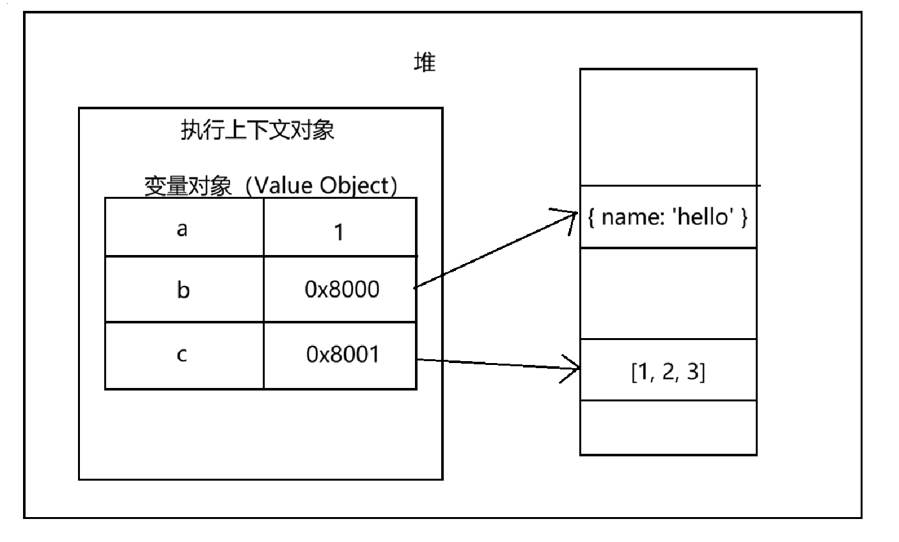
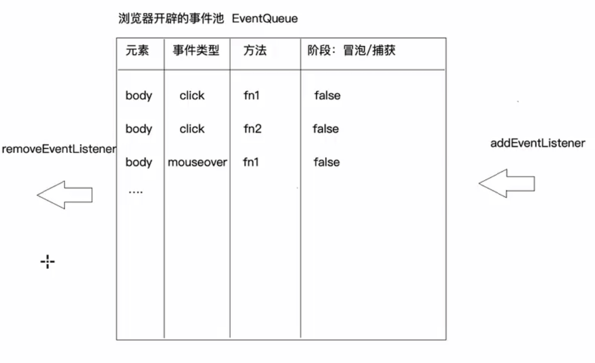
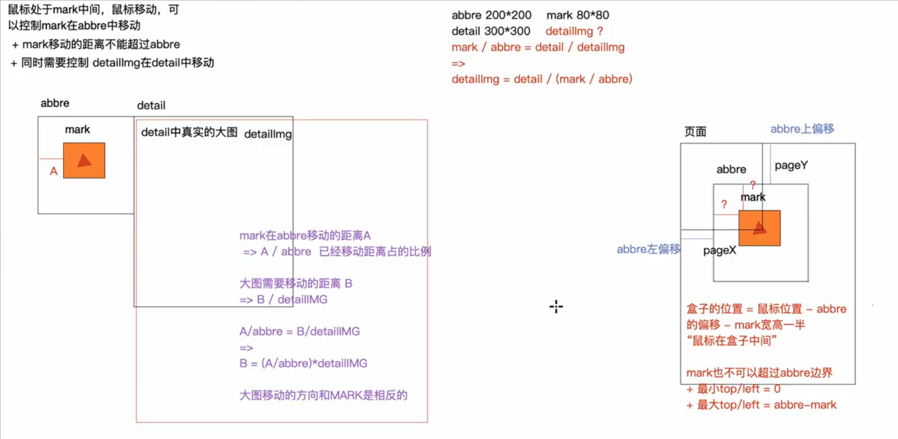

# javascript

栈：代码执行的环境；存储原始值类型值

堆：存储对象类型值

## 执行上下文 Execution Context

- 函数运行时产生**执行上下文**
- **变量对象（Value Object）**：执行上下文创建的对象，用来存储声明的变量
  - 基础数据类型直接放在变量对象中
  - 引用数据类型保存在堆中，变量对象中只存放地址

```js
function task() {
  var a = 1;
  var b = {
    name: "hello",
  };
  var c = [1, 2, 3];
}
```

```js
// 执行上下文
let taskExecutionContext = {
  // 变量对象，存储函数执行要使用到的参数、变量
  VO: {
    arguments: {},
    a: 1,
    b: `0x8000`,
    c: `0x8001`,
  },
};
```



执行上下文分为：

- 全局上下文 EC（G）
- 函数私有上下文 EC
- 块级私有上下文 EC（Block）

全局上下文：

- 只有一个，由浏览器创建。
- 全局上下文的 VO，也被称为 GO（Global Object）全局对象，例如 window 对象
- 全局对象可以直接访问，例如存放在其中的 var 全局变量

函数上下文：每次函数执行，会产生一个执行上下文。函数上下文的 VO 不能被直接访问

**调用栈**管理这些执行上下文。

### 执行上下文的生命周期

一个新的执行上下文的生命周期有两个阶段：创建/编译、执行

- 创建/编译阶段：
  - 创建变量对象
    - 变量对象保存函数参数、函数定义、var 变量声明（var 不赋值）
    - 此时不处理 let 变量
  - 确定作用域链
  - 确定 this 指向
- 执行阶段：
  - 变量赋值
  - 函数赋值
  - 代码执行

### 活动对象

处于执行栈顶端的 VO，会成为活动对象（Activation Object）

活动对象的 this 将会指向 window

### 作用域

作用域就相当于一个个执行上下文。

作用域链在函数创建时就已经确定。

规律是：当变量有多个值时，离谁**近**，就取谁。

```js
function one() {
  var a = 1;
  function two() {
    console.log(a);
  }
  return two;
}

var a = 2;
var outer_two = one();
outer_two(); // 1
```

模拟一下上述代码执行后，执行上下文的变化：

```js
/**
 * 执行上下文有两个阶段：编译、执行
 */

// 编译：寻找var变量声明和函数声明，进行变量提升
var globalExecutionContextVO = {
    a: undefined
    outer_two: undefined
}

var globalExecutionContext = {
    VO = globalExecutionContextVO
}

// 执行
globalExecutionContext.VO.a = 2

// 编译one函数的执行上下文
var oneExecutionContextVO = {
    two: `() => {}`,
    a: undefined
}

var oneExecutionContext = {
    VO = oneExecutionContextVO
}

// 执行one函数的执行上下文
oneExecutionContext.VO.a = 1
globalExecutionContext.VO.outer_two = 'two'

// 编译two函数的执行上下文
var twoExecutionContextVO = { }
var twoExecutionContext = {
    VO = twoExecutionContextVO
    // 作用域链在编译时确定
    scopeChain: [twoExecutionContext, oneExecutionContext, globalExecutionContext]
}
// 执行two函数的执行上下文
// 访问变量a，沿着作用域链查找，首先在oneExecutionContext命中，值为1。
```

### 数据类型

js 数据类型：

- 基本：Number String Boolean Null Undefined (ES6: Symbol BigInt)
- 引用：Object

基本数据类型的赋值：直接拷贝一份对象，不会互相影响

```js
var a = 1;
var b = a;
b = 2;
console.log(a); // 1
```

引用数据类型的赋值：由于拷贝的是地址，会互相影响

```js
var m = { a: 1, b: 2 };
var n = m;
n.a = 10;
console.log(m.a); // 10
```

> tips: 栈中存放局部的、空间确定的数据，其余存储到堆中

基本类型不是对象，为什么可以使用对象的方法？是因为临时对它进行了包装，包装成对象

```js
let a = 1;
console.log(a.toString());
// 实际上被转换成：console.log(new Number(a).toString());
```

### let 变量 = 值 的步骤

- 第一步：创建值
  - 原始值类型：直接存储在栈内存中，按值操作
  - 对象类型值：按照堆内存地址来操作
    - 对象：开辟一个堆内存空间(16进制地址)、依次存储对象的键值对、把空间地址赋值给变量
    - 函数：内存空间中存储三部分信息
      - 作用域 [[scope]]：当前所处上下文
      - 函数体中的代码字符串
      - 当做普通对象存储的静态属性和方法「name & length」
- 第二步：声明变量 declare
- 第三步：变量和值关联在一起（赋值） defined


## 闭包

> MDN 定义：有一个作用域，包含了函数 fn，这个函数 fn 可以调用被这个作用域封闭的变量、函数等内容

即，当前的执行上下文是 A，该执行上下文中创建了函数 B，当函数 B 引用了当前执行上下文 A 的变量，就会产生闭包。

即，内层函数使用了外部变量。

本质是在函数外部保持内部变量的引用，从而阻止垃圾回收。

类似于，函数执行完后一部分后续还要使用的变量没有被销毁，而是被内层函数打包带走

以下是一个闭包和执行上下文的模拟：

```js
function one() {
  var a = 1;
  function two() {
    var b = 2;
    function three() {
      var c = 3;
      return () => {
        var d = 4;
        console.log(a, b, c, d);
      };
    }
    return three();
  }
  return two();
}

var fn = one();
fn();

let globalEC = {
  this: globalThis,
  outer: null,
  VE: { one: () => {}, fn: undefined },
};

let oneEC = {
  outer: globalEC,
  VE: { a: 1, two: () => {} },
};

let twoEC = {
  outer: oneEC,
  VE: { b: 2, three: () => {} },
};

let threeEC = {
  outer: twoEC,
  VE: { c: 3 },
};

let fnEC = {
  outer: globalEC, // 注意，fn在全局声明
  VE: { d: 4 },
  closures: [{ c: 3 }, { b: 2 }, { a: 1 }], // 闭包
};

// 寻找变量的值的过程：先找自己的VE，再找闭包，最后找outer作用域链
function getValue(name, ec) {
  if (name in ec.VE) {
    return ec.VE[name];
  }

  for (let i = ec.closures.length - 1; i >= 0; i--) {
    if (name in ec.closures[i]) {
      return ec.closures[i][name];
    }
  }

  if (ec.outer) {
    return getValue(name, ec.outer);
  }
}

console.log(getValue("a", fnEC));
```

闭包会造成内存泄漏，因为闭包如果是全局声明的一个函数，其内部的 `closures`的变量如同**全局变量**，在函数执行完后也不会被销毁。

可以将闭包置为 null 解决。

## var 和 let 的区别

var 的问题：

- 内层变量可能覆盖外层变量
- `for`中用来计数的 `i`是全局变量
- 变量提升：可以在声明之前使用

let：

- 块级作用域可以嵌套。外层不能读取内层的变量，内层可以定义与外层变量同名的变量而不覆盖
- 函数本身的作用域在其所在的块级作用域之内

### 全局变量

- ES5 声明变量只有两种方式：var 和 function
- ES6 有 let、const、import、class、var、function
- 浏览器环境中全局对象是 window，Node 中是 global
- ES5 中全局对象的属性等价于全局变量
- ES6 中 var、function 声明的全局变量，依然是全局对象的属性。但 let、const、class 声明的全局变量不属于全局对象。

var 和 function 声明函数的区别：

- 编译阶段，先扫描 function，再扫描 var
- function 会在 VO 上声明并直接赋值，var 只声明不赋值，值是 undefined，其赋值在执行阶段执行

## this

this：谁来调用，即，当前执行这个逻辑的主题是谁，亦即，`.`前是谁

如果没有 `.`调用：

- 非严格模式：默认 window 调用
- 严格模式：undefined

## call() 、bind（）、 apply()

目标：让某个对象能够执行一个不属于它的方法。

```js
function func() {
  console.log(this.name);
}

// 一种实现
let obj = { name: "hello" };
obj.func = func;
obj.func(); // hello
delete obj.func;
```

以上就是 call() 、bind（）、 apply() 的原理。

- 将函数加到目标对象上
- 调用函数
- 删除这个函数属性

```js
!(function (prototype) {
  function my_call(context) {
    context.func = this; // 相当于 obj.func = func
    context.func();
    delete context.func;
  }
  prototype.my_call = my_call;
})(Function.prototype);

func.my_call(obj);
```

完整实现：

```js
!(function (prototype) {
  function getDefaultContext(context) {
    // 如果没有传入context，默认为window
    context = context || window;

    // 包装成对象类型，以防传入的是基本数据类型
    context = Object(context);
    return context;
  }

  function my_call(context, ...args) {
    context = getDefaultContext(context);
    let symbol = Symbol("fn");
    context[symbol] = this;
    context[symbol](...args);
    delete context[symbol];
  }
  prototype.my_call = my_call;
})(Function.prototype);

func.my_call(obj);
func.my_call(obj, 10, "beijing");
```

apply 与 call 的实现一模一样，只不过传入参数是数组形式：

```js
function my_apply(context, ...args) {
  context = getDefaultContext(context);
  let symbol = Symbol("fn");
  context[symbol] = this;
  context[symbol](...args);
  delete context[symbol];
}

func.my_apply(obj, [10, "beijing"]);
```

而 bind 会返回一个新的函数：

```js
function my_bind(context, ...outerArgs) {
  return (...args) => {
    this.call(context, ...outerArgs, ...args);
  };
}
let bindedFunc = func.my_bind(obj, 10);
bindedFunc("beijing");
```

## 对象与原型链

prototype， 中文翻译：原型/原型对象，显式原型
`__proto__ `，中文翻译：原型，隐式原型


- 除了基础数据类型之外，一切皆对象。函数是特殊的对象。
- js 里没有类，但有构造函数。
- 构造函数有 `__proto__`和 `prototype`。实例有 `__proto__`，没有 `prototype`
- 构造函数的`__proto__`指向自己的创造者
- `.`也是一个运算符，当调用了一个函数时，先查找对象自己有没有这个属性，如果没有再查找对象的 `__proto__`属性上有没有这个属性。

```cpp
// 为了加快生产对象的速度，就有了函数，函数可以用来批量生产对象
function Person(name, age) {
    this.name = name;
    this.age = age;
}

// 把对象共有的属性放在构造函数的原型上
Person.prototype.eat = () => { console.log("吃饭"); }


/**
 *
 * @param {*} clazz 构造函数
 * @param  {...any} args 参数
 * @returns 对象
 */
function my_new(clazz, ...args) {
    let obj = {};
    // 关联构造函数的原型
    // 也就是给obj添加一个属性（名叫__proto__），指向构造函数的原型，后续可以通过obj.__proto__.eat()调用
    obj.__proto__ = clazz.prototype
    clazz.call(obj, ...args); // 将this指向obj，调用函数Person，给实例的私有属性赋值
    return obj;
}

let abc = my_new(Person, 'abc', 11)

console.log(abc);

abc.__proto__.eat()
// __proto__也叫隐式原型，可以省略
/**
 * `.`也是一个运算符
 * 当调用了一个函数时，先查找对象自己有没有这个属性
 * 如果没有再查找对象的`__proto__`属性上有没有这个属性。
 */
abc.eat()

```

字面量创建对象其实是 `Object()`的语法糖。同样，我们常用的函数声明也是 `Function`的语法糖：

```js
let obj = { name: "123" };
let obj_ = new Object();

function add(a, b) {
  return a + b;
}
let add_ = new Function("a", "b", "return a + b");
```

Object 也是一个函数，是函数的实例：

```js
let Object = new Function();
Object.__proto__ = Function.prototype;
```

### instanceof

原型链：`__proto__`连接成的链条。

原型链的作用：实现属性和方法的共享。

`a instanceof b`：`a`的原型链与 `b`的原型链如果能交汇与一点，则为 True。

- 例如，`p1.__proto__ == Person.prototype`，则 `p1 instanceof Person`为 True
- 例如，`p1.__proto__.__proto__ == Object.prototype `，则 `p1 instanceof Object`为 True

### 继承

封装、继承、多态：

- 封装：把实现某个功能的代码进行封装处理，后期想实现这个功能，直接调用函数执行即可。”低耦合、高内聚“
- 多态：重载（方法名相同，参数不同） or 重写（子类重写父类的方法）
- 继承：**子类继承父类的方法**

#### 1. 原型继承

> 子类的原型为父类的一个实例对象。

```js
// 1. 子类的原型指向父类的实例
Child.prototype = new Parent('abc')  // 目前实例对象 Child 没有 constructor 属性, 会沿着原型链找到 Parent.prototype.constructor，即 Parent 函数
// 2. 添加构造函数
Child.prototype.constructor = Child 
```

这种方式实现的本质是通过将子类的原型指向了父类的实例。因此，Child的实例就可以通过`__proto__`访问到 Parent的实例，这样就可以访问到父类的私有方法，然后再通过`__proto__`访问Parent的prototype获得到父类原型上的方法。于是做到了将父类的私有、公有属性方法都当做子类的公有属性

如果父类的私有属性中有引用类型的属性，那它被子类继承的时候作为公有属性，这样子类1操作这个属性的时候，就会影响到子类2。


特点：

- 并没有将父类的方法copy给子类（后端语言常用），而是建立子类与父类之间的原型链指向
- 父类新增的原型方法或属性，子类都能访问
- 简单易用

缺点：

- 父类实例的私有属性变成了子类实例的公有属性，而我们的目标是父类私有->子类私有，父类公有->子类公有
- 子类实例可以基于原型链，修改父类原型上的方法，导致其他父类实例对象也受影响

#### 2. 构造继承（call/apply继承）

又称【借用构造函数继承】，关键在于：**在子类构造函数内部调用call()调用父类构造函数**

```js
function Child(name){
    Parent.call(this, name)
}
```

只是实现了部分的继承，无法继承父类原型对象上的方法和属性。

优点：

- 父类构造函数中定义的父类实例属性（私有属性）会变成子类实例的私有属性（而不是挂在原型链上），解决了原型继承中的子类实例共享父类私有属性的问题
- 创建的子类实例可以向父类传递参数

缺点：

- 丢失了父类原型上的方法，这一点不如原型继承
- 而且当父类的方法发生改变了时，已经创建好的子类实例并不能更新方法。

#### 3.组合继承（原型链继承+构造继承）

这种方式关键在于:**通过调用父类构造，继承父类的属性并保留传参的优点，然后通过将父类实例作为子类原型，实现函数复用。**

```js
function Child(name) {  
    Parent.call(this, name)
}

Child.prototype = new Parent()
Child.prototype.constructor = Child
```

优点：结合了原型链继承和构造继承的优点
缺点：这种方式调用了两次父类的构造函数，生成了两份实例，相同的属性既存在于实例中也存在于原型中

#### 4. 拷贝继承

```js
function Child(name) {  
    let parent = new Parent(name)
    for(let key in parent){
        Child.prototype[key] = parent[key]
    }
}
```

缺点：

1. 无法获取父类不可枚举的方法，这种方法是用for in 来遍历Parent中的属性，例如多选框的checked属性，这种就是不可枚举的属性
2. 效率很低，内存占用高

#### 5. 寄生继承 Object.create() （原型继承的优化）

`var B = Object.create(A)`以A对象为原型，生成了B对象。B继承了A的所有属性和方法。

但不能继承父类构造函数中的属性方法。

```js
// 1. 创建一个空对象，其 __proto__ 指向 Parent.prototype，将空对象赋值给Child.prototype
Child.prototype = Object.create(Parent.prototype)
// 2. 修复constructor
Child.prototype.constructor = Child
```

解决了原型继承（`Child.prototype = new Parent()`）和构造继承的两个问题：

1. 避免调用两次父类构造函数（一次在创建原型时，一次在子类构造函数内部）
2. 原型链正确：子类实例能访问父类原型上的公有属性，同时父类构造函数中的实例私有属性不再是子类原型的公有属性

名字的由来：

- **宿主**：`Parent.prototype`（父类的原型对象，提供了基础方法）
- **寄生虫**：一个临时创建的空对象（通过 `Object.create` ），它“寄生”在 `Parent.prototype` 之上，能利用宿主的营养（方法），但又可以自己添加额外功能。
- 然后我们将这个“寄生虫”对象赋值给 `Child.prototype`，相当于让子类的原型寄生在父类原型上。

#### 6. 寄生组合继承（寄生继承 + 构造继承）【推荐】

```js
function Child(){
    Parent.call(this)
}
Child.prototype = Object.create(Parent.prototype)
Child.prototype.constructor = Child
```

优点：结合组合继承的所有优点，也解决了他们的痛点，比较完美

#### 7. ES6 class + extends继承

ES6中引入了class关键字（原型的语法糖），class可以通过extends关键字实现继承，还可以通过static关键字定义类的静态方法。

底层实现是**寄生组合继承**。

以下是 ts 中使用继承的一个例子：

```ts
class Father {
  static staticFatherName = "FatherName";
  static staticGetFatherName = function () {
    console.log(Father.staticFatherName);
  };
  constructor(public name) {
    this.name = name;
  }
  getName() {
    console.log(this.name);
  }
}

class Child extends Father {
  static staticChildName = "ChildName";
  static staticGetChildName = function () {
    console.log(Child.staticChildName);
  };
  constructor(public name, public age) {
    super(name);
    this.age = age;
  }
  getAge() {
    console.log(this.age);
  }
}
```

实现继承：

1. 静态继承：让 Child 继承 Father 的 static 属性
2. 让 Child 继承 Father 原型上的属性，即让 `new child()`实例对象的**proto**指向 `Father.prototype`，且不破坏 `constructor`
3. 继承 Father 的私有属性：对 Child 的实例 执行 Father 构造函数

```js
var Father = (function () {
  Father.staticFatherName = "FatherName";
  Father.staticGetFatherName = function () {
    console.log(Father.staticFatherName);
  };
  Father.prototype.getName = function () {
    console.log(this.name);
  };
  function Father(name) {
    this.name = name;
  }
  return Father;
})();
// 【寄生继承】
function _extends(Child, Father) {
  // 1. 静态继承：让Child继承Father的static属性
  Child.__proto__ = Father;
    // 2. 让Child继承Father原型上的属性，即让Child实例对象的__proto__指向Father.prototype
    Child.prototype = Object.create(Father.prototype);
    // 3. 修复constructor
    Child.prototype.constructor = Child;
}

var Child = (function (_super) {
  // _super = father
  // 继承Father的static属性和Father原型上的属性
  _extends(Child, _super);
  function Child(name) {
    // 3. 继承Father的私有属性：对Child的实例 执行Father构造函数【构造继承】
    _super.call(this, name);
    this.age = age;
  }
  Child.staticChildName = "ChildName";
  Child.staticGetChildName = function () {
    console.log(Child.staticChildName);
  };
  Child.prototype.getAge = function () {
    console.log(this.age);
  };
  return Child;
})();
```


## ES6

ES6 新增：变量环境(VariableEnvironment)和词法环境(lexicalEnviroment)、let 和块级作用域

ES5 中，执行上下文存放有 this、VO、scopeChain

而在 ES6，执行上下文存放 this、VE(VariableEnvironment)、LE(lexicalEnviroment)、outer

- VE 存储 var 变量和 function
- LE 存储 let 变量
- outer 取代了 scopeChain，实现作用域链


下面模拟 ES6 中的执行上下文变化：

```js
// 模拟ES6中的执行上下文变化

function fn() {
  var a = 1;
  let b = 2;
  {
    let b = 3;
    var c = 4;
    let d = 5;
    console.log(a, b, c, d);
  }
  {
    let b = 6;
    let d = 7;
    console.log(a, b, c, d);
  }
}
fn();

// 1. 全局下编译
let globalEC = {
  this: globalThis,
  outer: null, // outer: 外部执行上下文环境，相当于ScopeChain
  variableEnvironment: { fn() {} },
  lexicalEnviroment: {},
};
// 2. 编译fn
// 静态作用域
let fnEC = {
  this: globalThis,
  // fnEC.outer等于声明fn变量的执行上下文环境对象中的variableEnvironment
  outer: globalEC.variableEnvironment,
  variableEnvironment: { a: undefined, c: undefined },
  lexicalEnviroment: { b: undefined },
};

// 执行fn
fnEC.variableEnvironment.a = 1;
fnEC.variableEnvironment.b = 2;
// 进入第一个代码块
// 每当函数执行遇到了一个新的代码块，会创建一个新的词法环境对象
fnEC.lexicalEnviroment.push({ b: undefined, d: undefined });
fnEC.lexicalEnviroment[1].b = 3;
fnEC.variableEnvironment.c = 4;
fnEC.lexicalEnviroment[1].d = 5;
// 进入第二个代码块
fnEC.lexicalEnviroment.pop();
fnEC.lexicalEnviroment.push({
  b: undefined,
  d: undefined,
});
fnEC.lexicalEnviroment[1].b = 6;
fnEC.lexicalEnviroment[1].d = 7;

// 通过outer，沿着作用域链，寻找变量的值的过程：
function getValue(name, ec) {
  for (let i = ec.lexicalEnviroment.length - 1; i >= 0; i--) {
    if (name in ec.lexicalEnviroment[i]) {
      return ec.lexicalEnviroment[i][name];
    }
    if (name in ec.variableEnvironment) {
      return ec.variableEnvironment[name];
    }
  }
  if (ec.outer) {
    return getValue(name, ec.outer);
  }
}
```

## 事件和事件绑定

> 事件：事件是浏览器赋予元素的默认行为，也可以理解为元素天生具备的特性。

存在特性: 无论是否为其绑定方法，当相关行为触发时，事件都会被执行

例: 即使不写 `document.body.onclick=function(){}`代码，点击 body 时仍然会触发点击事件行为，只是没有执行任何操作

比喻记忆: 就像被人打了一拳（触发事件），可以选择不反应（未绑定方法）或大喊一声（绑定方法）

> 事件绑定：给元素的默认事件行为绑定方法，使得行为触发时能执行指定方法

事件绑定，应表述为"给 body 的点击事件行为绑定方法"，而非"给 body 绑定点击事件"

分为：

- DOM 0 级事件绑定：
- DOM 2 级事件绑定：

**DOM 0 级事件绑定**：

- 语法：`[元素].on[事件]=[函数]`
  - 绑定：`document.body.onclick = function(){}`
  - 解绑：`document.body.onclick = null`
- 原理：本质是给 DOM 元素对象的**属性**赋值（每个 DOM 元素都是对象类型）
- 特点：
  - 只能给元素的某个事件绑定**一个**方法，多次绑定会覆盖前值
  - 没有的属性就无法绑定事件
  - 执行速度快，使用方便

**DOM 2 级事件绑定**：

- 语法：`[元素].addEventListener([事件],[方法],[捕获/冒泡])`
  - 绑定：`document.body.addEventListener('click', fn1, false)`
  - 移除：`document.body.removeEventListener('click', fn1, false)`
- 原理：
  - 每个 DOM 元素都会基于原型链的查找机制(`__proto__`)，查找到 `EventTarget.prototype`的 `addEventListener`等方法
  - 事件绑定采用事件池机制
- 特点：
  - 绑定时一般不使用匿名函数，否则无法移除
  - 凡是浏览器提供的事件行为，都可以绑定
  - 可以给某个事件类型绑定**多个**不同的方法。事件行为触发时，从事件池中按照绑定的顺序依次取出

DOM0 和 DOM2 区别：

- 支持范围：
  - DOM0 仅支持具有 onxxx 私有属性的事件
  - DOM2 支持所有浏览器提供的事件行为（如可用 window.addEventListener('DOMContentLoaded',func)）
- 方法绑定：
  - DOM0 同一事件只能绑定一个方法
  - DOM2 可绑定多个不同方法（按绑定顺序执行）
- 移除机制：
  - DOM0 通过赋 null 值移除
  - DOM2 必须使用匹配的 removeEventListener 移除
- 匿名函数处理：
  - DOM2 通常不使用匿名函数，以便后续移除
  - DOM0 可使用匿名函数，但移除时仍需引用



### 事件对象

事件对象：存储当前事件操作及触发的相关信息（浏览器本身记录的，记录的是当前这次操作的信息，与在哪个函数中无关）

```js
    <script>
        let body = document.body
        body.onclick = function (ev) {
            console.log(ev); // 打印鼠标事件对象 MouseEvent
        }
        body.addEventListener('click', function (ev) {
            console.log(ev);
        })
    </script>
```

鼠标事件对象

- clientX/clientY
- pageX/pageY
- target/srcElement：获取当前事件源（当前操作的元素）
- path：传播路径
- `ev.preventDefault` / `ev.returnValue = false`：阻止默认行为
- `ev.stopPropagation()` / `ev.cancelBubble = true`：阻止冒泡

### 事件的传播机制

冒泡传播：


DOM0事件绑定的方法，都是在目标阶段/冒泡阶段触发。

DOM2事件绑定可以控制绑定的方法在捕获阶段触发，只需将第三个参数设置为true：`addEventListener('click', functino(){}, true)`。不过没有什么应用场景。

事件委托/事件代理：根据 `srcElement/target`，可以获得事件源，即当前操作对象是谁。可以针对不同事件源，做不同的处理。利用冒泡，将一个父容器A中的所有子元素的某个事件E触发后要执行的操作，委托给A的E事件。

```js
        document.body.onclick = function (ev) {
            let target = ev.target,
                targetClass = target.className;
            if (targetClass == "inner") {
                console.log("inner");
                return;
            }
            if (targetClass == "outer") {
                console.log("outer");
                return;
            }
            if (targetClass == "box") {
                console.log("box");
                return;
            }
        }
```

## 案例：实现放大镜效果




具体代码见`D:\code\js-demos\放大镜`


## 数据类型转换

### 其他数据类型转换为Number

#### Number(val)

隐式转换：出现在数学运算、isNaN检测、==比较等情况中

``````js
10 - "2" == 8 // Number("2")
isNaN("2") // false
``````

规则：

- 字符串转换为数字：`空字符串 --> 0，非法字符 --> NaN`
- null --> 0，undefined --> NaN
- Symbol无法转换为数字
- BigInt会去掉`n`（超过安全数字的，按照科学计数法处理）
- 对象转换为数字的内部机制：
  - 查看对象obj有无`Symbol.toPrimitive()`方法
    - 有：执行`obj[Symbol.toPrimitive]('number')`，返回结果
    - 没有：调用对象的 valueOf 获取原始值（例如，数字对象返回数字值，数组对象返回自身，Date对象返回时间戳）
      - 如果原始值是数字：直接返回
      - 如果原始值不是数字：
        - 调用对象的 toString 把其变为字符串，再用Number方法转换为数字

**Symbol.toPrimitive**： ES6 引入的内置 *Symbol* 属性，用于自定义对象在被**强制类型转换**为原始值时的行为。它的优先级高于 *toString()* 和 *valueOf()*，并且会在所有强制类型转换算法中**优先调用**。该方法接收一个 **hint** 参数，可能的值为 *"number"*、*"string"* 或 *"default"*，分别对应数字转换、字符串转换和默认转换场景。

同理，`String([val])`和`[val].toString()`是不同的

安全数字：`Number.MAX_SAFE_INTEGER === Math.pow(2, 53) - 1`

#### parseInt([val], [radix])

val：字符串

radix：进制，默认是十进制。如果字符串是以`0x`开始，默认是十六进制。有效范围：2~36

转换规则：

- 判断val是否为字符串，不是的话会隐式转为字符串
  - 从字符串左侧第一个字符开始找，把找到的有效数字字符转换为数字（符合radix进制的值），最后转换为十进制
  - 遇到一个非有效数字字符，不论后面是否还有有效数字字符，都不再查找了
  - 如果一个数字都没找到，返回NaN

```js
parseInt('12px') // 12
parseInt(null) // NaN
parseInt('10102px13', 2) // 10
// JS遇到以0开头的数字，会默认先将其按照八进制转为十进制
parseInt(0013, 2) // 0013 -> 11 -> '11' -> 3
```

```js
let arr = [27.2, 0, '0013', '14px', 123];
arr = arr.map(parseInt); // [27, NaN, 1, 1, 27]
/**
arr.map（(item, index) => {
	// parseInt(27.2, 0)
	// parseInt(0, 1)
	// parseInt('0013', 2)
	// ....
	return parseInt(item, index)
}）
**/
```

### 其他数据类型转换为String

规则：

- 拿字符串包起来
- 特殊：Object.prototype.toString

“+”除了数学运算，还可能进行字符串拼接

- 有两边，一边是字符串/对象：进行字符串拼接
- 出现在值的左边，转化为数字 `let num = '10'; console.log(+num) // 10`

```js
let a, b, c = '10'
a++ // 11
b += 1 // '101'
c = c + 1 // '101'
```

### 其他数据类型转换为Boolean

- `0/NaN/空字符串/null/undefined` 五个值是false

- 其余都是true

  

### ==比较的相互转换规则

- `对象 == 字符串`  对象转字符串「Symbol.toPrimitive -> valueOf -> toString」
- `null == undefined  -> true`。null/undefined除了和自己相等、互相相等之外，和其他任何值都不相等
- `对象 == 对象`  比较的是堆内存地址，地址相同则相等
- `NaN !== NaN`
- 除了以上情况，只要两边类型不一致，都是转换为数字，然后再进行比较   

```js
console.log([] == false);  // true。[]变为数字0，false变为0
console.log(![] == false); // true。[]变为true，!取反变为false，再变为0
```


“===”绝对相等，如果两边类型不同，则直接是false，不会转换数据类型「推荐使用」

- `null === undefined -> false`


### 0.1 + 0.2 !== 0.3

浮点数运算的精准度丢失。

JS中的值以二进制存储，最多存储64位

0.1转为二进制：无限循环位，所以存储时舍弃了一些值


解决方法：

- toFixed保留小数位数
- 扩大系数法（乘以一个系数变为整数后相加，再将结果除以系数）

### JS中的装箱和拆箱操作

- 装箱操作：原始值 --> 非标准特殊对象
- 拆箱操作：非标准特殊对象 --> 原始值

```js
let num = 10
console.log(num.toFixed(2)) // 10.00
// 装箱操作：new Number(num)，将原始值变为非标准特殊对象，这样就可以调用toFixed方法

num = new Number(10)
console.log(num + 10) // 20
// 拆箱操作：将非标准特殊对象num变为原始值
```

### 小数取整

```js
// 丢弃小数部分,保留整数部分 
console.log(parseInt(7/2)); // 3

// 向上取整
console.log(Math.ceil(7/2));// 4

// 向下取整
console.log(Math.floor(7/2));// 3

// 四舍五入
console.log(Math.round(7/2));// 4

// 丢弃小数部分,保留整数部分 
console.log(Math.trunc(7/2));// 3

// 返回x的绝对值 
console.log(Math.abs(-6.666));// 6.666
```


### 面试题：a == 1 && a == 2 && b == 3, var a = ?

```js
var a = ? // a的值应该是多少，才能满足下面的条件
if(a == 1 && a == 2 && a == 3){
	console.log('OK')
} // OK
```

思路：

- `==`会转换数据类型。而对象转数字会经历`Symbol.toPrimitive -> valueOf -> toString ...`等步骤
- 可以重写步骤中的方法

```js
// 法一：
var a = {
    i = 0,
    [Symbol.toPrimitive](){
        // this: a
        return ++this.i;
    }
}
// 法二：
var i = 0
Object.defineProperty(window, 'a', {
    get() {
        return ++i;
    }
})
// 法三：
var a = [1, 2, 3]
a.toString = a.shift
```

ES6 计算属性名：通过将表达式放在方括号 `[]` 中，可以在对象创建时动态生成属性名。

### 面试题：['1', '2', '3'].map(parseInt) ( )

等价于：

```js
["1", "2", "3"].map((item, index) => {
  return parseInt(item, index);
});
```

等价于：

```js
parseInt('1', 0)
parseInt('2', 1)
parseInt('3', 2)
```

输出：

```js
 [ 1, NaN, NaN ]
```


## 数据存储

JavaScript 中的数字遵循 **IEEE 754 双精度浮点数** 标准（64 位），存储结构如下：

- **1 位符号位**（0 正，1 负）
- **11 位指数位**
- **52 位尾数位**

因此 **所有数字（包括整数）在内存中本质上都是以浮点数形式存储**。位运算符的操作数会被**先转换为 32 位有符号整数**（范围 -2^31 ～ 2^31-1），执行完位运算后再转回 64 位浮点数。

负数使用 **补码** 表示：取反+1

| 10进制 | 2进制（32位）                           |
| ------ | --------------------------------------- |
| 1      | 0000 0000 0000 0000 0000 0000 0000 0001 |
| -1     | 1111 1111 1111 1111 1111 1111 1111 1111 |

- 普通右移 `>>` 保留符号位（高位补符号位）。
- **无符号右移 `>>>`** 总是将高位**补 0**（不论原数正负），结果是一个 **非负整数**（0 ~ 2^32-1）。
- 移位位数只使用低 5 位，范围 **0~31**

对 `-1` 执行 `>>> 32`：无符号右移 0 位，相当于将全 1 的 32 位整数解释为一个无符号整数 = `2^32 - 1 = 4294967295`。

## 常用数组方法


## 事件循环

> 主线程 --> 微任务 --> 宏任务


主线程：JS引擎线程

WebAPI：异步任务监听队列，监听异步的任务是否可执行

EventQueue：事件/任务队列，所有可执行的异步任务，在这里排队等待执行


### promise中的事件循环

`p.then(onfulfilled, onrejected)`：

1. 情况1：已知p的状态和值，也不会立即执行onfulfilled或onrejected，而是创建异步微任务，进入webApi中，发现状态是成功，再进入eventqueue排队等待执行

```js
let p = new Promise(resolve => {
    resolve(10)
})

p.then(value => {
    console.log('ok', value);
})
console.log(1);
// 1 
// ok 10
```

2. 情况2：如果不知道p的状态和值，先将onfulfilled和onrejected储存起来（放入WebApi监听），当知道实例的状态后，才能执行。resolve/reject会立即修改实例的状态和值，并将onfulfilled或onrejected放入eventqueue微任务队列中排队等待执行

```js
let p = new Promise(resolve => {
    setTimeout(() => {
        resolve(10) // 同步
        console.log(p, 2); // 同步
    }, 1000);
})

p.then(value => {
    console.log('ok', value);
})
console.log(1); // 同步
// 1
// Promise { fulfilled, 10 } 2
// ok 10
```


### async await中的事件循环

遇到await：

- 会立即执行await后的代码，看返回的promise实例的状态
- 将当前上下文，await下面的代码作为异步微任务，进入webapi队列，监听到await后面的promise实例状态为成功后进入EventQueue队列


练习：promise+async


练习：事件绑定+promise


## 模块化

本质：添加属性，获取属性

### commonJS

语法

- 暴露模块：`module.exports = value`或`exports.xxx = value`
- 引入模块：`require(xxx)`,如果是第三方模块，xxx为模块名；如果是自定义模块，xxx为模块文件路径

CommonJS规范规定，每个模块内部，module变量代表当前模块。这个变量是一个对象，它的exports属性（即module.exports）是对外的接口。**加载某个模块，其实是加载该模块的module.exports属性**。

require命令的基本功能是，读入并执行一个JavaScript文件，然后返回该模块的exports对象。如果没有发现指定模块，会报错。

CommonJS规范主要用于服务端编程，加载模块是同步的，这并不适合在浏览器环境，因为同步意味着阻塞加载，浏览器资源是异步加载的，因此有了AMD CMD解决方案。

### ES6模块化

ES6 模块的设计思想是尽量的静态化，使得编译时就能确定模块的依赖关系，以及输入和输出的变量。CommonJS 只能在运行时确定这些东西。CommonJS 模块就是对象，输入时必须查找对象属性。

语法

- `export`命令用于规定模块的对外接口，`import`命令用于输入其他模块提供的功能。


在 ES 模块 (ESM) 中，`export default` 和 `export` 的核心区别在于：**一个模块只能有一个默认导出，但可以有多个具名导出**。

| 特性         | `export default`           | `export`                       |
| :----------- | :------------------------- | :----------------------------- |
| 每个模块数量 | 最多 1 个                  | 任意多个                       |
| 导入语法     | `import X from './module'` | `import { X } from './module'` |
| 导入时命名   | 可以任意命名               | 必须与导出名称一致             |
| 大括号       | 不需要 `{}`                | 需要 `{}`                      |
| 适用场景     | 模块的主要功能             | 工具函数、多个值               |


#### ES6 模块与 CommonJS 模块的差异

它们有两个重大差异：

**① CommonJS 模块输出的是一个值的拷贝，ES6 模块输出的是值的引用**。

**② CommonJS 模块是运行时加载，ES6 模块是编译时输出接口**。

第二个差异是因为 CommonJS 加载的是一个对象（即module.exports属性），该对象只有在脚本运行完才会生成。而 ES6 模块不是对象，它的对外接口只是一种静态定义，在代码静态解析阶段就会生成。

ES6 模块的运行机制与 CommonJS 不一样。**ES6 模块是动态引用，并且不会缓存值，模块里面的变量绑定其所在的模块**。
