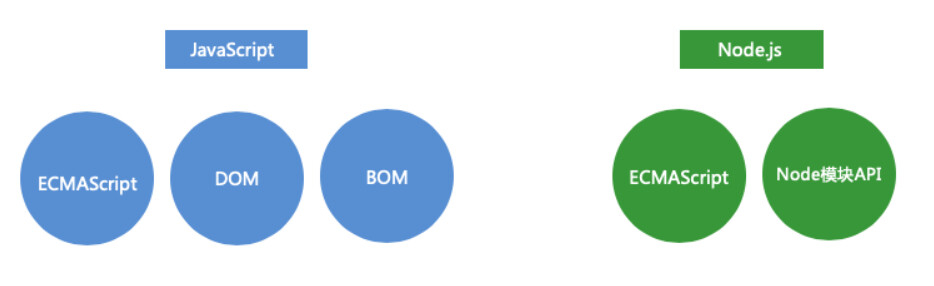
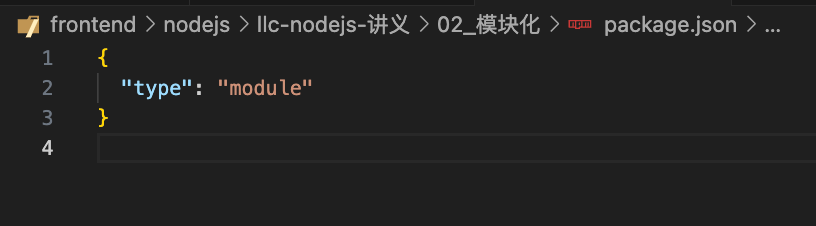

## Node.js 简介

Node.js 是一个构建在 V8 引擎之上的 JavaScript 运行环境。它使得 JS 可以运行在浏览器以外的地方。相对于大部分的服务端语言来说，Node.js 有很大的不同，它采用了单线程，且通过异步的方式来处理并发的问题。

Node.js：

- 运行在服务器端的 js
- 用于编写服务器
- 特点：单线程、异步、非阻塞、统一 API

用 nvm 管理版本：

- 若提示没有 nvm，就先执行 `export NVM_DIR="$HOME/.nvm" [ -s "$NVM_DIR/nvm.sh" ] && \. "$NVM_DIR/nvm.sh"`
- nvm list
- nvm install
- nvm use 17：切换到 node 版本 17

nodejs 与 js 的区别：



## 同步与异步

进程和线程

- 进程（厂房）：程序的运行的环境
- 线程（工人）：线程是实际进行运算的东西

同步

- 通常情况代码都是自上向下一行一行执行的
- 前边的代码不执行后边的代码也不会执行
- 同步的代码执行会出现阻塞的情况
- 一行代码执行慢，会影响到整个程序的执行

解决同步问题：

- java python
  - 多线程：多个线程同时执行多个代码
- node.js
  - 异步：一个线程一边...一边...

异步

- 一段代码的执行不会影响到其他的程序
- 特点：
  - 1.不会阻塞其他代码的执行
  - 2.需要通过回调函数来返回结果
- 异步的问题：
  - 异步的代码无法通过 return 来设置返回值

可以通过回调函数实现异步：

```js
function sum(a, b, cb) {
  // cb:callback，回调
  setTimeout(() => {
    cb(a + b);
  }, 1000); // setTimeout：“1000ms 后再执行这个箭头函数”，并立即返回，不会阻塞主线程。
}

console.log("111111");

const result = sum(123, 10000, (result) => {
  console.log(result);
});

console.log("222222");

// output：
111111;
222222;
10123; // 1000ms 后，setTimeout 的任务被事件循环调度执行：运行 cb(a + b)，也就是调用你传入的回调函数：(result) => {console.log(result)}
```

理解基于回调函数的异步：

- setTimeout 相当于等待一段时间后开水才会烧开（setTimeout 到时间了）。
- 等待烧开时，做一些其他的事情（执行后面的代码）
- 时间到了，把烧开的水倒入水杯（调用回调函数）

基于回调函数的异步带来的问题

- 1. 代码的可读性差
- 2. 可调试性差

例如，回调嵌套：

```js
sum(100, 10000, (result) => {
  sum(result, 100, (result) => {
    sum(result, 100, (result) => {
      console.log(result);
    });
  });
}); // 10300
```

解决问题：

- 需要一个东西，可以代替回调函数来给我们返回结果
- Promise：
  - Promise 是一个可以用来存储数据的对象。Promise 存储数据的方式比较特殊，这种特殊方式使得 Promise 可以用来存储异步调用的数据(即，保存了某个未来才会结束的事件)

## promise

Promise 可以用来存储数据。**只能存储一次**，后面的都忽略

```js
// Promise构造函数的回调函数，它会在创建Promise时调用，调用时会有两个参数传递进去
const promise = new Promise((resolve, reject) => {
  // resolve 和 reject 是两个函数，通过这两个函数可以向Promise中存储数据
  // resolve在执行正常时存储数据，reject在执行错误时存储数据
  setTimeout(() => {
    resolve("abcabc");
  }, 1000);
});

setTimeout(() => {
  console.log(promise);
}, 10); // Promise { <pending> }

setTimeout(() => {
  console.log(promise);
}, 2000); // Promise { 'abcabc' }
```

从 Promise 中读取数据：`then` 方法

- then 用两个回调函数作为参数，回调函数可以获取 Promise 中的数据
- 通过 resolve 存储的数据，会调用第一个函数返回，可以在第一个函数中编写处理数据的代码（执行正常）
- 通过 reject 存储的数据或者出现异常时，会调用第二个函数返回，可以在第二个函数中编写处理异常的代码（出现 error）
- then 是异步的

```js
const promise = new Promise((resolve, reject) => {
  throw new Error("出错了");
});

promise.then(
  (result) => {
    console.log("数据", result); // 执行正常时调用
  },
  (reason) => {
    console.log("error！", reason); // 出现异常时调用
  }
);
// output：error！ Error: 出错了
```

Promise 中维护了两个隐藏属性：

- PromiseResult
  - 用来存储数据
- PromiseState: 记录 Promise 的状态（三种）
  - pending（还在进行中）
  - fulfilled（完成） 通过 resolve 存储数据时
  - rejected（拒绝，出错了） 出错了或通过 reject 存储数据时
  - pending 只能变成 fulfilled 或 rejected，确定后不会再变

流程：

- Promise 创建时，PromiseState 初始值为 pending，
- 当通过 resolve 存储数据时：
  - PromiseState 变为 fulfilled（完成）
  - PromiseResult 变为存储的数据
- 当通过 reject 存储数据或出错时
  - PromiseState 变为 rejected（拒绝，出错了）
  - PromiseResult 变为存储的数据 或 异常对象
- 当我们通过 then 读取数据时，相当于为 Promise 设置了回调函数，
  - 如果 PromiseState 变为 fulfilled，则调用 then 的第一个回调函数来返回数据
  - 如果 PromiseState 变为 rejected，则调用 then 的第二个回调函数来返回数据

catch()：

- 相当于 then(null, reason=>{})，即 Promise 异常时调用
- 一个专门处理 Promise 异常的方法

finally()：

- 无论是正常还是异常，finally 总会执行，但是 finally 的回调函数中不会接收到数据。
- 通常用来编写一些无论成功与否都要执行代码

then、catch、finally 的返回值都是**一个新的 Promise 对象**，这个对象用来存储回调函数的**返回值**（除 finally 外。finally 的返回值不会存储到新的 Promise 中）

```js
function sum(a, b) {
  return new Promise((resolve, reject) => {
    setTimeout(() => {
      resolve(a + b);
    }, 1000);
  });
}
sum(0, 1)
  .then((result) => {
    console.log("一", result);
    return "2";
  })
  .then((result) => {
    console.log("二", result);
    return "3";
  })
  .then((result) => {
    console.log("三", result);
    return "4";
  });
/*
output:
一 1
二 2
三 3
*/

sum(0, 1)
  .then((result) => result + 7)
  .then((result) => result + 8)
  .then((result) => console.log(result));
/**
output:
16
 */
```

Promise 的链式调用：

- 后面读取上一步的执行结果
- 若上一步的执行结果不是当前想要的结果，则跳过当前的方法。
  - 例如，上一步执行结果为异常，则会跳过 then、执行 catch
- 当 Promise 出现异常时，若整个调用链中没有出现 catch，则异常会向外抛出
- catch 内部的异常则由后续代码的 catch 处理，自己不处理。所有 catch 只处理自己前面出现的异常

静态方法

- Promise.resolve() 创建一个立即完成的 Promise
- Promise.reject() 创建一个立即拒绝的 Promise
- Promise.all([...]) 传入多个 Promise 参数，返回多个 Promise 的执行结果组成的数组
  - 其中若有一个 Promise 报错，就返回错误
- Promise.allSettled([...]) 同时返回多个 Promise 的执行结果(无论成功或失败)
- Promise.race([...]) 返回执行最快的 Promise（不考虑对错）
- Promise.any([...]) 与 race 类似，但是它只会返回第一个**成功**的最快完成的的 Promise，如果所有的 Promise 都失败会返回一个错误信息。

```js
Promise.allSettled([
  sum(123, 456),
  sum(5, 6),
  Promise.reject("哈哈"),
  sum(33, 44),
]).then((r) => {
  console.log(r);
});
/*
output：
[
  { status: 'fulfilled', value: 579 },
  { status: 'fulfilled', value: 11 },
  { status: 'rejected', reason: '哈哈' },
  { status: 'fulfilled', value: 77 }
]
*/
```

## 事件循环：调用栈、微任务与宏任务队列

JS 是单线程的，运行基于事件循环机制(event loop)

- 调用栈
  - 后进先出
  - 存储要执行的代码
- 任务队列
  - 先进先出
  - 存储将要执行的代码
  - 调用栈中的代码执行完毕后，才会将队列中的代码按顺序放入栈执行

任务队列分为：

- 宏任务队列 （大部分代码都去宏任务队列中去排队）
- 微任务队列 （Promise 的回调函数（then、catch、finally））
  - queueMicrotask() : 向微任务队列中添加一个任务

Promise 的执行原理

- Promise 在执行，then 就相当于给 Promise 了回调函数
  - 当 Promise 的状态从 pending 变为 fulfilled 时，then 的回调函数会被放入到任务队列中

流程：

- 1. 执行调用栈
- 2. 执行微任务队列
- 3. 执行宏任务队列

```js
setTimeout(() => {
  // 宏任务队列
  console.log(3);
}, 0);

// 微任务队列
Promise.resolve().then(() => {
  console.log(2);
});

console.log(1); // 调用栈
/**
 * output
 * 1
 * 2
 * 3
 */
```

微任务队列，按照顺序入队

```js
Promise.resolve().then(() => {
  // 第一个入队
  Promise.resolve().then(() => {
    // 第三个入队
    console.log(2);
  });
});

queueMicrotask(() => {
  // 第三个入队
  console.log(1);
});
/**
 * 1
 * 2
 */
```

```js
// 阅读下列代码，并说出执行结果：

console.log(1);

setTimeout(() => console.log(2));

Promise.resolve().then(() => console.log(3));

Promise.resolve().then(() => setTimeout(() => console.log(4)));

Promise.resolve().then(() => console.log(5));

setTimeout(() => console.log(6));

console.log(7);

/**
 * 1
 * 7
 * 3
 * 5
 * 2
 * 6
 * 4
 */
```

## 实现 promise

见 my-promise.js

## async 和 await

- 通过 async 可以来创建一个异步函数
  - 异步函数的返回值会自动封装到一个 Promise 中返回

```js
async function fn2() {
  return 123;
}
fn2().then((r) => console.log(r));
```

在 async 声明的异步函数中可以使用 await 关键字来调用异步函数:

- await：用于等待一个 Promise 兑现并获取它兑现之后的值。只能在异步函数或者模块顶层中使用。
- 当我们通过 await 去调用异步函数时，它会阻塞内部代码的运行，直到异步代码执行有结果时，才会将结果返回
- 注意 await 只能用于 async 声明的异步函数中，或 es 模块的顶级作用域中

```js
async function fn3() {
  let result = await sum(1, 2);

  console.log(result); // 3

  result = await sum(result, 3);

  console.log(result); // 6
}
function sum(a, b) {
  return new Promise((resolve) => {
    setTimeout(() => {
      resolve(a + b);
    }, 500);
  });
}
```

- 通过 await 调用异步代码时，需要通过 try-catch 来处理异常

```js
async function fn3() {
  try {
    let result = await sum(123, 456);
    console.log(result);
  } catch (e) {
    console.log("出错了");
  }
}
```

- 如果 async 声明的函数中没有 await，那么代码就会正常依次执行，但返回值还是 Promise

```js
async function fn4() {
  console.log(1);
  console.log(2);
  console.log(3);
}
fn4();
console.log(4);
// 1 2 3 4
```

- 当我们使用 await 调用函数后，当前函数后边的所有代码会在当前函数执行完毕后，被放入到微任务队里中
- await 后边的所有代码，都会放入到微任务队列中执行

```js
async function fn4() {
  console.log(1);
  await console.log(2); // 执行完这步后，后续代码进入微任务队列
  console.log(3);
}
fn4();
console.log(4);
// 1 2 4 3
```

这里的 fn4 相当于：

```js
function fn5() {
  return new Promise((resolve) => {
    console.log(1);
    console.log(2); // 加了await
    resolve();
  }).then((r) => {
    console.log(3);
  });
}
fn5();
```

## 模块化

早期的网页中，是没有一个实质的模块规范的。我们实现模块化的方式，就是最原始的通过 script 标签来引入多个 js 文件。这种方式存在以下问题：

- 1. 无法选择要引入模块的哪些内容
- 2. 在复杂的模块场景下非常容易出错

### CommonJS 规范

在 node 中，默认支持的模块化规范叫做 CommonJS。在 CommonJS 中，一个 js 文件就是一个模块

- 引入模块
  - 使用 require("模块的路径")函数来引入模块
  - 引入自定义模块时：
    - 模块名以./ 或 ../开头，扩展名可以省略（在 CommonJS 中，如果省略的 js 文件的扩展名，node 会自动为文件补全扩展名 `./m1.js` 如果没有 js 它会寻找 `./m1.json`，即查找顺序为 js --> json --> node（特殊））

在定义模块时，模块中的内容默认是不能被外部看到的。但可以通过 exports 来设置要向外部暴露的内容
访问 exports 的方式有两种：

- `exports`
- `module.exports`

可以通过 exports 一个一个的导出值：

```js
exports.a = "孙悟空";
exports.b = { name: "白骨精" };
exports.c = function fn() {
  console.log("哈哈");
};
```

也可以直接通过 module.exports 同时导出多个值：

```js
module.exports = {
  a: "哈哈",
  b: [1, 3, 5, 7],
  c: () => {
    console.log(111);
  },
};
```

当我们在其他模块中引入当前模块时，require 函数返回的就是 exports。可以将希望暴露给外部模块的内容设置为 exports 的属性：

```js
const m1 = require("./m1.js");
```

引入核心模块时

- 直接写核心模块的名字即可
- 也可以在核心模块前添加 node:

```js
const path = require("path");
const path = require("node:path");
```

也可以引入一个文件夹模块。该文件夹中会有 index.js 文件，index.js 文件中会有该文件夹其他文件的引入

#### 原理

所有的 CommonJS 的模块都会被包装到一个函数中

```js
(function (exports, require, module, __filename, __dirname) {
  // 模块代码会被放到这里
});
```

### ES 模块化

默认情况下，node 中的模块化标准是 CommonJS。要想使用 ES 的模块化，可以采用以下两种方案

1. 使用 mjs 作为扩展名
2. 修改 package.json 将模块化规范设置为 ES 模块。当我们设置 "type": "module" 当前项目下所有的 js 文件都默认为 es module



导入模块时，es 模块不能省略扩展名（官方标准）

```js
import { a, b, c } from "./m4.mjs";
```

通过 as 来指定别名

```js
import { a as hello, b, c } from "./m4.mjs";
```

设置默认导出。一个模块中只能设置一个默认导出:

```js
export default function sum(a, b) {
  return a + b;
}
```

导入模块的默认导出。没有中括号。默认导出的内容，可以随意命名：

```js
import sum from "./m4.mjs";
```

通过 ES 模块化，导入的内容都是常量。es 模块都是运行在严格模式下的

ES 模块化，在浏览器中同样支持，但是通常我们不会直接使用。通常都会结合打包工具使用

核心模块：node 中自带的模块，可以在 node 中直接使用

window 是浏览器的宿主对象 node 中是没有的

global 是 node 中的全局对象，作用类似于 window

ES 标准下，全局对象的标准名应该是 `globalThis`

### 核心模块：process

process：

- 表示当前的 node 进程。
- 通过该对象可以获取进程的信息，或者对进程做各种操作

属性和方法：

process.exit()

- 结束当前进程，终止 node

process.nextTick(callback[, …args])

- 将函数插入到 tick 队列中
- tick 队列中的代码，会在下一次事件循环之前执行
  - 会在微任务队列和宏任务队列中任务之前执行

事件循环：

- 调用栈
- tick 队列
- 微任务队列
- 宏任务队列

```js
setTimeout(() => {
  console.log(1); // 宏任务队列
});

queueMicrotask(() => {
  console.log(2);
}); // 微任务队列

process.nextTick(() => {
  console.log(3); // tick队列
});

console.log(4); // 调用栈

/**
 * 4
 * 3
 * 2
 * 1
 */
```

### 核心模块：path

方法：

- `path.resolve([__dirname, "./hello.txt"])`：生成一个绝对路径。
- 如果直接调用 resolve，则返回当前的工作目录

通过 fs 模块读取磁盘中的数据：

```js
(async () => {
  try {
    const buffer = await fs.readFile(path.resolve(__dirname, "./hello.txt")); // readFileSync() 是同步的读取文件的方法，会阻塞后边代码的执行
    console.log(buffer.toString());
  } catch (e) {
    console.log("出错了~~");
  }
})();
```

readFile() ：异步的读取文件的方法

```js
// 回调函数异步
fs.readFile(path.resolve(__dirname, "./hello.txt"), (err, buffer) => {
  if (err) {
    console.log("出错了~");
  } else {
    console.log(buffer.toString());
  }
});
```

```js
// Promise异步
fs.readFile(path.resolve(__dirname, "./hello.txt"))
  .then((buffer) => {
    console.log(buffer.toString());
  })
  .catch((e) => {
    console.log("出错了~");
  });
```

- fs.readFile() 读取文件
- fs.appendFile() 创建新文件，或将数据添加到已有文件中
- fs.mkdir() 创建目录
- fs.rmdir() 删除目录
- fs.rm() 删除文件
- fs.rename() 重命名
- fs.copyFile() 复制文件

## 包管理器 npm

package.json

- package.json 是包的描述文件
- node 中通过该文件对项目进行描述
- 每一个 node 项目必须有 package.json

命令

- npm init 初始化项目，创建 package.json 文件
- npm init -y 初始化项目，创建 package.json 文件（所有值都采用默认值）
- npm install 包名 将指定包下载到当前项目中
  - install 时发生了什么？
    - ① 将包下载当前项目的 node_modules 目录下
    - ② 会在 package.json 的 dependencies 属性中添加一个新属性"lodash": "^4.17.21"
    - ③ 会自动添加 package-lock.json 文件

npm install 自动安装所有依赖

npm install 包名 -g 全局安装 - 全局安装是将包安装到计算机中 - 全局安装的通常都是一些工具

npm uninstall 包名 卸载

## HTTP 协议

自己总结

参考
nodejs/llc-nodejs-讲义/07_http 协议/note.txt

## express

基于 Node.js 平台，快速、开放、极简的 web 开发框架。

```js
// 获取服务器的实例（对象）
const app = express();

// http://localhost:3000
app.listen(3000, () => {
  console.log("server start");
});

app.get("/hello", (req, res) => {
  // 读取用户的请求（req）
  // req 表示的是用户的请求信息
  console.log(req.url);

  // 根据用户的请求返回响应（res）
  // res 表示的服务器发送给客户端的响应信息
  //  可以通过res来向客户端返回数据
  // sendStatus() 向客户端发送响应状态吗
  // status() 用来设置响应状态吗，但是并不发送
  // send() 设置并发送响应体
  res.send("<h1>这是我的第一个服务器</h1>");
});
```

中间件：

- 使用 app.use 来定义一个中间件
  - 中间件作用和路由很像，用法很像
  - 但是路由不区分请求的方式，只看路径
- 和路由的区别
  - 1.会匹配所有请求
  - 2.路径设置父目录

next() 是回调函数的第三个参数，它是一个函数，调用函数后，可以触发后续的中间件。next() 不能在响应处理完毕后调用

```js
app.use((req, res, next) => {
  console.log("111", Date.now());
  next(); // 放行
});
```

```bash
npm i
npx nodemon
```

静态资源目录：服务器中的代码，对于外部来说都是不可见的。如果希望浏览器可以访问，则需要将页面所在的目录设置静态资源目录(下面例子中静态资源目录是/public)

```js
app.use(express.static(path.resolve(__dirname, "public")));
```

```js
// get请求发送参数的第二种方式
// /hello/:id 表示当用户访问 /hello/xxx 时就会触发
// 在路径中以冒号命名的部分我们称为param，在get请求它可以被解析为请求参数
app.get("/hello/:name", (req, res) => {
  // 可以通过req.params属性来获取这些参数
  console.log(req.params);

  res.send("<h1>这是hello路由</h1>");
});
```

可以在所有路由的后边配置错误路由：

```js
app.use((req, res) => {
  // 只要这个中间件一执行，说明上边的地址都没有匹配
  res.status(404);
  res.send("<h1>您访问的地址已被外星人劫持！</h1>");
});
```

### 模版引擎 ejs

html 页面属于静态页面，创建的时候什么样子，用户看到的就是什么样子，不会自动跟随服务器中数据的变化而变化

希望有这么一个东西，他呢长的像是个网页，但是他里边可以嵌入变量，这个东西在 node 中被称为 模板

ejs 是 node 中的一款模板引擎，使用步骤：

- 1.安装 ejs
- 2.配置 express 的模板引擎为 ejs `app.set("view engine", "ejs")`。用 views 文件夹来存储模版
- 3.配置模板路径 `app.set("views", path.resolve(__dirname, "views"))`

res.render() 用来渲染一个模板引擎，并将其返回给浏览器。可以将一个对象作为 render 的第二个参数传递，这样在模板中可以访问到对象中的数据

```js
res.render("students", { name });
```

```html
<!DOCTYPE html>
<html lang="zh">
  <body>
    <!-- 通过它可以将render传递进来的数据直接在网页中显示出来-->
    <%=name %>
  </body>
</html>
```

ejs 常用标签：

- `<%= %>`：在 ejs 中输出内容时，它会自动对字符串中的 HTML 标签进行转义，即 `<h1>123</h1>`会直接原样输出而不是按照 h1 格式放大显示。这个设计主要是为了避免 xss 攻击，避免用户提交 `<script></script>`来执行恶意代码
- `<%-` 输出非转义的数据到模板
- `<%_`： 删除其前面的空格符； `_%>`: 将结束标签后面的空格符删除
- `-%>` 删除紧随其后的换行符
- `<% %>`：'脚本' 标签，用于流程控制，无输出。直接执行 js 代码
- `<%#` 注释标签，不执行、不输出内容

```html
<% for(const stu of stus){ %> <%=stu.name %> <%=stu.age %> <%=stu.gender %> <% }
%>
```

### cookie 和 session

HTTP 协议是一个无状态的协议，服务器无法区分请求是否发送自同一个客户端，所以有了 cookie 和 session 这两种机制

cookie

- cookie 是 HTTP 协议中用来解决无状态问题的技术
- cookie 的本质就是一个头

  - 服务器以响应头的形式将 cookie 发送给客户端，客户端收到以后会将其存储，并在下次向服务器发送请求时将其传回，这样服务器就可以根据 cookie 来识别出客户端了
- 因为存储在客户端，容易被客户端篡改，使用前需要验证合法性
- 不要存储敏感数据，比如用户密码，账户余额
- 使用 httpOnly 在一定程度上提高安全性
- 尽量减少 cookie 的体积，能存储的数据量不能超过 4kb
- 设置正确的 domain 和 path，减少数据传输
- cookie 无法跨域
- 一个浏览器针对一个网站最多存 20 个 Cookie，浏览器一般只允许存放 300 个 Cookie
- 移动端对 cookie 的支持不是很好，而 session 需要基于 cookie 实现，所以移动端常用的是 token

Session 是另一种记录客户状态的机制，不同的是 Cookie 保存在**客户端**浏览器中，而 Session 保存在**服务器**上。

session 认证流程：

- 用户第一次请求服务器的时候，服务器根据用户提交的相关信息，创建对应的 Session
- 请求返回时将此 Session 的唯一标识信息 SessionID 返回给浏览器
- 浏览器接收到服务器返回的 SessionID 信息后，会将此信息存入到 Cookie 中，同时 Cookie 记录此 SessionID 属于哪个域名
- 当用户第二次访问服务器的时候，请求会自动判断此域名下是否存在 Cookie 信息，如果存在自动将 Cookie 信息也发送给服务端，服务端会从 Cookie 中获取 SessionID，再根据 SessionID 查找对应的 Session 信息，如果没有找到说明用户没有登录或者登录失效，如果找到 Session 证明用户已经登录可执行后面操作。

SessionID 是连接 Cookie 和 Session 的一道桥梁
