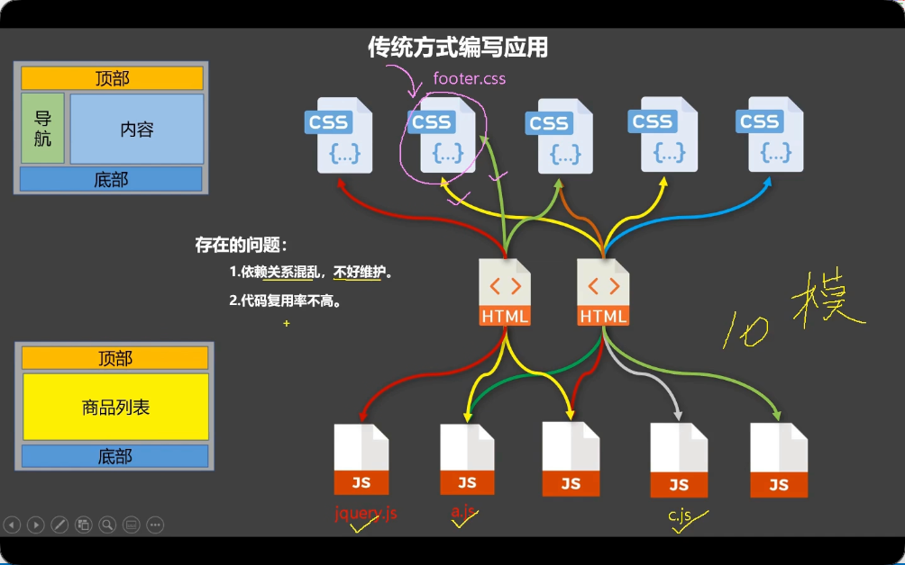
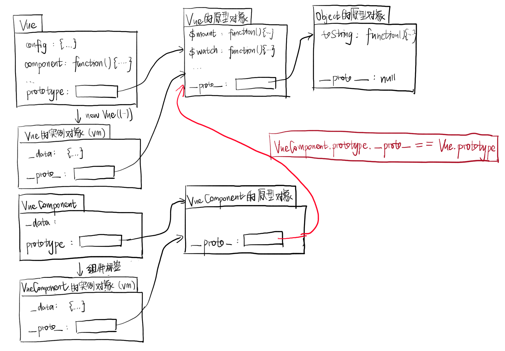
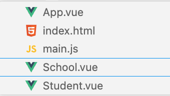
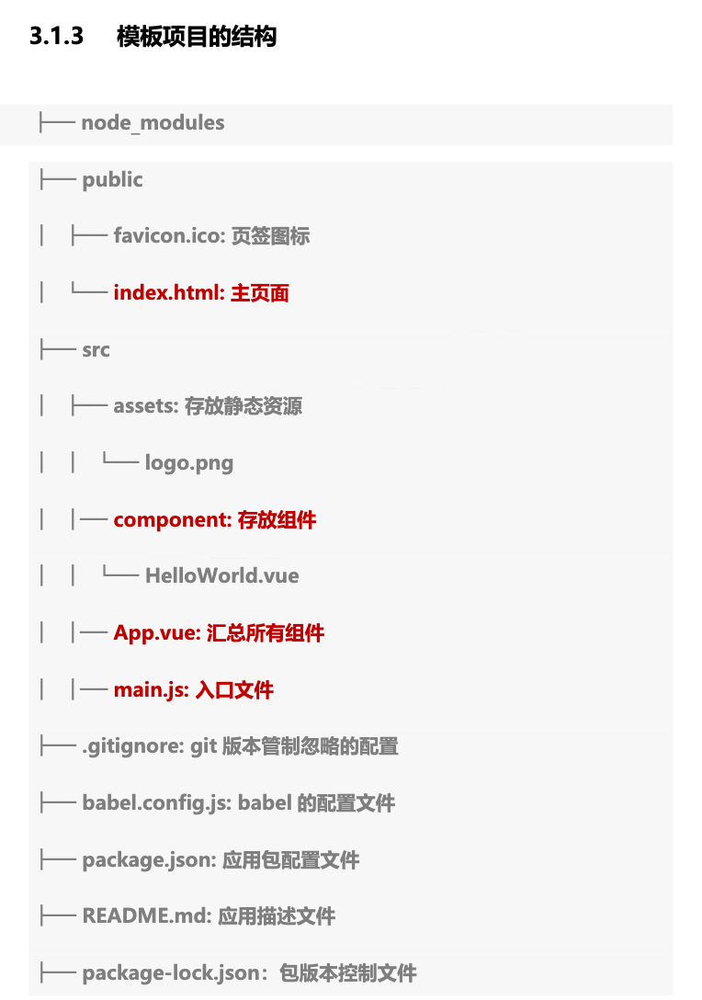
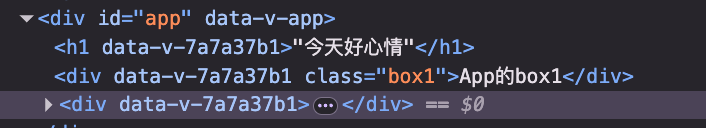
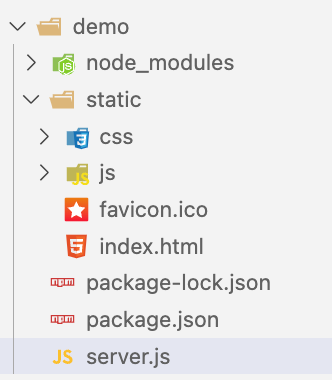

# vue2

初识 Vue：

- 1.想让 Vue 工作，就必须创建一个 Vue 实例，且要传入一个配置对象；
- 2.root 容器里的代码依然符合 html 规范，只不过混入了一些特殊的 Vue 语法；
- 3.root 容器里的代码被称为【Vue 模板】；
- 4.Vue 实例和容器是一一对应的；
- 5.真实开发中只有一个 Vue 实例，并且会配合着组件一起使用；
- 6.{{xxx}}中的 xxx 要写 js 表达式，且 xxx 可以自动读取到 data 中的所有属性；
- 7.一旦 data 中的数据发生改变，那么页面中用到该数据的地方也会自动更新；

```html
<body>
  <!-- 准备好一个容器 -->
  <div id="demo">
    <h1>Hello，{{name.toUpperCase()}}，{{address}}</h1>
  </div>

  <script type="text/javascript">
    Vue.config.productionTip = false; //阻止 vue 在启动时生成生产提示。

    //创建Vue实例
    new Vue({
      el: "#demo", //el用于指定当前Vue实例为哪个容器服务，值通常为css选择器字符串。
      data: {
        //data中用于存储数据，数据供el所指定的容器去使用，值我们暂时先写成一个对象。
        name: "atguigu",
        address: "北京",
      },
    });
  </script>
</body>
```

Vue 模板语法有 2 大类：

- 1.插值语法：
  - 功能：用于解析标签体内容。
  - 写法：{{xxx}}，xxx 是 js 表达式，且可以直接读取到 data 中的所有属性。
- 2.指令语法：
  - 功能：用于解析标签（包括：标签属性、标签体内容、绑定事件.....）。
  - 举例：v-bind:href="xxx" 或 简写为 :href="xxx"，xxx 同样要写 js 表达式，且可以直接读取到 data 中的所有属性。

Vue 中有 2 种数据绑定的方式：

- 1.单向绑定(v-bind)：数据只能从 data 流向页面。
- 2.双向绑定(v-model)：数据不仅能从 data 流向页面，还可以从页面流向 data。
  - 备注：
    - 1.双向绑定一般都应用在表单类元素上（如：input、select 等）。`v-model`只能应用在表单类元素（输入类元素）上
    - 2.v-model:value 可以简写为 v-model，因为 v-model 默认收集的就是 value 值。

data 与 el 的 2 种写法：

- 1.el 有 2 种写法
  - (1).new Vue 时候配置 el 属性。
  - (2).先创建 Vue 实例，随后再通过 vm.$mount('#root')指定 el 的值。
- 2.data 有 2 种写法
  - (1).对象式
  - (2).函数式
  - 如何选择：目前哪种写法都可以，以后学习到组件时，data 必须使用函数式，否则会报错。
- 3.一个重要的原则：
  - 由 Vue 管理的函数，一定不要写箭头函数，一旦写了箭头函数，this 就不再是 Vue 实例了。

data 的两种写法:

```js
new Vue({
  el: "#root",
  //data的第一种写法：对象式
  data:{
    name:'尚硅谷'
  }

  //data的第二种写法：函数式
  data() {
    console.log("@@@", this); //此处的this是Vue实例对象
    return {
      name: "尚硅谷",
    };
  },
});
```

## 数据代理

defineProperty 方法：

```js
Object.defineProperty(person, "age", {
  // value:18,
  // enumerable:true, //控制属性是否可以枚举，默认值是false
  // writable:true, //控制属性是否可以被修改，默认值是false
  // configurable:true //控制属性是否可以被删除，默认值是false

  //当有人读取person的age属性时，get函数(getter)就会被调用，且返回值就是age的值
  get() {
    console.log("有人读取age属性了");
    return number;
  },

  //当有人修改person的age属性时，set函数(setter)就会被调用，且会收到修改的具体值
  set(value) {
    console.log("有人修改了age属性，且值是", value);
    number = value;
  },
});
```

数据代理：通过一个对象代理对另一个对象中属性的操作（读/写）

Vue 中的数据代理：通过 vm 对象来代理 data 对象中属性的操作（读/写）

Vue 中数据代理的好处：更加方便的操作 data 中的数据

基本原理：

- 通过 Object.defineProperty()把 data 对象中所有属性添加到 vm 上。
- 为每一个添加到 vm 上的属性，都指定一个 getter/setter。
- 在 getter/setter 内部去操作（读/写）data 中对应的属性。

```js
const vm = new Vue({
  el: "#root",
  data: {
    name: "尚硅谷",
    address: "宏福科技园",
  },
});
```

## 事件

事件的基本使用：

- 1.使用 v-on:xxx 或 @xxx 绑定事件，其中 xxx 是事件名；
- 2.事件的回调需要配置在 methods 对象中，最终会在 vm 上；
- 3.methods 中配置的函数，不要用箭头函数！否则 this 就不是 vm 了；
- 4.methods 中配置的函数，都是被 Vue 所管理的函数，this 的指向是 vm 或 组件实例对象；
- 5.@click="demo" 和 @click="demo($event)" 效果一致，但后者可以传参；

```js
<button @click="showInfo1">点我提示信息1（不传参）</button>
<button @click="showInfo2($event,66)">点我提示信息2（传参）</button>
<script type="text/javascript">
const vm = new Vue({
  el: "#root",
  data: {
    name: "尚硅谷",
  },
  methods: {
    showInfo1(event) {
      // console.log(event.target.innerText)
      // console.log(this) //此处的this是vm
      alert("同学你好！");
    },
    showInfo2(event, number) {
      console.log(event, number);
      // console.log(event.target.innerText)
      // console.log(this) //此处的this是vm
      alert("同学你好！！");
    },
  },
});
</script>
```

Vue 中的事件修饰符：

- 1.prevent：阻止默认事件（常用）；
- 2.stop：阻止事件冒泡（常用）；
- 3.once：事件只触发一次（常用）；
- 4.capture：使用事件的捕获模式；
- 5.self：只有 event.target 是当前操作的元素时才触发事件；
- 6.passive：事件的默认行为立即执行，无需等待事件回调执行完毕；

## 计算属性

计算属性：

- 1.定义：要用的属性不存在，要通过已有属性计算得来。
- 2.原理：底层借助了 Objcet.defineproperty 方法提供的 getter 和 setter。
- 3.get 函数什么时候执行？
  - (1).初次读取时会执行一次。
  - (2).当依赖的数据发生改变时会被再次调用。
- 4.优势：与 methods 实现相比，内部有**缓存机制（复用）**，效率更高，调试方便。
- 5.备注：
  - 1.计算属性最终会出现在 vm 上，直接读取使用即可。
  - 2.如果计算属性要被修改，那必须写 set 函数去响应修改，且 set 中要引起计算时依赖的数据发生改变。

```js
const vm = new Vue({
  el: "#root",
  data: {
    firstName: "张",
    lastName: "三",
    x: "你好",
  },
  methods: {
    demo() {},
  },
  computed: {
    // 计算属性
    fullName: {
      //get有什么作用？当有人读取fullName时，get就会被调用，且返回值就作为fullName的值
      //get什么时候调用？1.初次读取fullName时。2.所依赖的数据发生变化时。
      get() {
        console.log("get被调用了");
        // console.log(this) //此处的this是vm
        return this.firstName + "-" + this.lastName;
      },
      //set什么时候调用? 当fullName被修改时。
      set(value) {
        console.log("set", value);
        const arr = value.split("-");
        this.firstName = arr[0];
        this.lastName = arr[1];
      },

      //简写
      fullName() {
        console.log("get被调用了");
        return this.firstName + "-" + this.lastName;
      },
    },
  },
});
```

## 监视属性

当被监视的属性变化时, 回调函数自动调用, 进行相关操作

两种写法：

- (1).new Vue 时传入 watch 配置

```js
const vm = new Vue({
  el: "#root",
  data: {
    isHot: true,
  },
  computed: {
    info() {
      return this.isHot ? "炎热" : "凉爽";
    },
  },
  methods: {
    changeWeather() {
      this.isHot = !this.isHot;
    },
  },
  watch: {
    isHot: {
      immediate: true, //初始化即刻调用handler
      //handler在isHot发生改变时被调用
      handler(newValue, oldValue) {
        console.log("isHot被修改了", newValue, oldValue);
      },
    },
  },
});
```

- (2).通过 vm.$watch 监视

```js
vm.$watch("isHot", {
  immediate: true,
  handler(newValue, oldValue) {
    console.log("isHot被修改了", newValue, oldValue);
  },
});

//简写
vm.$watch("isHot", (newValue, oldValue) => {
  console.log("isHot被修改了", newValue, oldValue, this);
});
```

### 深度监视

watch 默认不监测对象内部值当改变。（浅层、一层）

深度监视：.配置 deep:true 可以监测对象内部值改变（深层、多层）。

computed 和 watch 之间的区别：

- 1.computed 能完成的功能，watch 都可以完成。
- 2.watch 能完成的功能，computed 不一定能完成，例如：watch 可以进行异步操作。

两个重要的小原则：

- 1.所被 Vue 管理的函数，最好写成普通函数，这样 this 的指向才是 vm 或 组件实例对象。
- 2.所有不被 Vue 所管理的函数（定时器的回调函数、ajax 的回调函数等、Promise 的回调函数），最好写成箭头函数，这样 this 的指向才是 vm 或 组件实例对象。

### 绑定样式

1. class 样式

写法:class="xxx" xxx 可以是字符串、对象、数组。

- 字符串写法适用于：类名不确定，要动态获取。
- 对象写法适用于：要绑定多个样式，个数不确定，名字也不确定。
- 数组写法适用于：要绑定多个样式，个数确定，名字也确定，但不确定用不用。

2. style 样式

- :style="{fontSize: xxx}"其中 xxx 是动态值。
- :style="[a,b]"其中 a、b 是样式对象。

### 条件渲染

- v-if

  - 适用于：切换频率较低的场景。
  - 特点：不展示的 DOM 元素直接被移除。
  - 注意：v-if 可以和:v-else-if、v-else 一起使用，但要求结构不能被“打断”。
- v-show

  - 写法：v-show="表达式"
  - 适用于：切换频率较高的场景。
  - 特点：不展示的 DOM 元素未被移除，仅仅是使用样式隐藏掉

### 过滤器

过滤器 filter：对要显示的数据进行特定格式化后再显示

- 过滤器也可以接收额外参数、多个过滤器也可以串联
- 过滤器并没有改变原本的数据, 是产生新的对应的数据

## 指令

### vue 内置指令

- v-bind : 单向绑定解析表达式, 可简写为 :xxx
- v-model : 双向数据绑定
- v-for : 遍历数组/对象/字符串
- v-on : 绑定事件监听, 可简写为@
- v-if : 条件渲染（动态控制节点是否存存在）
- v-else : 条件渲染（动态控制节点是否存存在）
- v-show : 条件渲染 (动态控制节点是否展示)

v-text 指令：

- 1.作用：向其所在的节点中渲染文本内容。
- 2.与插值语法的区别：v-text 会替换掉节点中的内容，{{xx}}则不会。

v-html 指令：

- 1.作用：向指定节点中渲染包含 html 结构的内容。
- 2.与插值语法的区别：
  - (1).v-html 会替换掉节点中所有的内容，{{xx}}则不会。
  - (2).v-html 可以识别 html 结构。
- 3.严重注意：v-html 有安全性问题！！！！
  - (1).在网站上动态渲染任意 HTML 是非常危险的，容易导致 XSS 攻击。
  - (2).一定要在可信的内容上使用 v-html，永不要用在用户提交的内容上！

v-cloak 指令（没有值）：

- 1.本质是一个特殊属性，Vue 实例创建完毕并接管容器后，会删掉 v-cloak 属性。
- 2.使用 css 配合 v-cloak 可以解决网速慢时页面展示出{{xxx}}的问题。

v-once 指令：

- 1.v-once 所在节点在初次动态渲染后，就视为静态内容了。
- 2.以后数据的改变不会引起 v-once 所在结构的更新，可以用于优化性能。

v-pre 指令：

- 1.跳过其所在节点的编译过程。
- 2.可利用它跳过：没有使用指令语法、没有使用插值语法的节点，会加快编译。

### 自定义指令

- 注册全局指令

```js
Vue.directive(指令名, 配置对象 / 回调函数);
```

- 注册局部指令

```js
new Vue({
  directives: { 指令名: 配置对象 / 回调函数 },
});
```

配置对象中常用的 3 个回调：

- (1).bind：指令与元素成功绑定时调用。
- (2).inserted：指令所在元素被插入页面时调用。
- (3).update：指令所在模板结构被重新解析时调用。
- 使用指令：`v-my-directive='xxx'`

## 组件化

传统方式的问题：

- 依赖关系混乱，难以维护
- 代码复用率不高



### 对比模块与组件

模块：

- 向外提供特定功能的 js 程序，一般就是一个 js 文件
- 为什么要模块：js 文件很多很复杂
- 作用：复用 js、简化 js 的编写、提高 js 运行效率

组件：

- 用来实现局部功能效果的代码集合
- 为什么要组件：一个界面的功能很复杂
- 作用：复用编码，简化项目编码，提高运行效率

模块化：应用中的 js 都以模块来编写

组件化：应用中的功能都以多组件的方式编写

- 非单文件组件：一个文件中包含有 n 个组件
- 单文件组件：一个文件中只含有 1 个组件

### 非单文件组件

使用组件的三大步骤：

- 定义组件
- 注册组件
- 使用组件（写组件标签）

1. 定义组件

`Vue.extend(options)`，其中 options 和 new Vue(options)时传入的那个 options 几乎一样，但也有点区别：

- 1.el 不要写，为什么？ ——— 最终所有的组件都要经过一个 vm 的管理，由 vm 中的 el 决定服务哪个容器。
- 2.data 必须写成函数，为什么？ ——— 避免组件被复用时，数据存在引用关系。

```js
//第一步：创建school组件
const school = Vue.extend({
  template: `
    <div class="demo">
      <h2>学校名称：{{schoolName}}</h2>
      <h2>学校地址：{{address}}</h2>
      <button @click="showName">点我显示学校名</button>
    </div>
  `,
  // el:'#root',
  // 组件定义时，一定不要写el配置项，因为最终所有的组件都要被一个vm管理，由vm决定服务于哪个容器。
  data() {
    return {
      schoolName: "尚硅谷",
      address: "北京昌平",
    };
  },
  methods: {
    showName() {
      alert(this.schoolName);
    },
  },
});
```

2. 注册组件

```js
<script>
//第二步：全局注册组件
Vue.component("hello", hello);

//创建vm
new Vue({
  el: "#root",
  data: {
    msg: "你好啊！",
  },
  //第二步：注册组件（局部注册）
  components: {
    school,
    student,
  },
})
</script>
```

3. 使用组件

```js
<div id="root">
  <!-- 编写组件标签 -->
  <school></school>
  <hr />
  <student></student>
</div>
```

几个注意点：

- 1.关于组件名:
  - 一个单词组成：
    - 第一种写法(首字母小写)：school
    - 第二种写法(首字母大写)：School
  - 多个单词组成：
    - 第一种写法(kebab-case 命名)：my-school
    - 第二种写法(CamelCase 命名)：MySchool (需要 Vue 脚手架支持)
- 2.关于组件标签:
  - 第一种写法：`<school></school>`
  - 第二种写法：`<school/>`
  - 备注：不用使用脚手架时，`<school/>`会导致后续组件不能渲染。
- 3.一个简写方式：
  - const school = Vue.extend(options) 可简写为：const school = options

#### 组件底层：VueComponent

关于 VueComponent：

- 1.school 组件本质是一个名为 VueComponent 的构造函数，且不是程序员定义的，是 Vue.extend 生成的。
- 2.我们只需要写`<school/>`或`<school></school>`，Vue 解析时会帮我们创建 school 组件的实例对象，即 Vue 帮我们执行的：new VueComponent(options)。
- 3.特别注意：每次调用 Vue.extend，返回的都是一个**全新的** VueComponent！！！！
- 4.关于 this 指向：
  - (1).组件配置中：data 函数、methods 中的函数、watch 中的函数、computed 中的函数 它们的 this 均是【VueComponent 实例对象】。
  - (2).new Vue(options)配置中：data 函数、methods 中的函数、watch 中的函数、computed 中的函数 它们的 this 均是【Vue 实例对象】。
- 5.VueComponent 的实例对象，以后简称 vc（也可称之为：组件实例对象）。Vue 的实例对象，以后简称 vm。

#### 一个重要的内置关系

`VueComponent.prototype.__proto__ === Vue.prototype`：

- vueComponent 的原型对象的原型链指向 Vue 的原型对象
- 作用：让组件实例对象（vc）能继承 Vue 的所有方法和特性



原型对象：

- `prototype`（显式原型属性）：构造函数的原型对象（定义共享方法的地方）
- `__proto__`（隐式原型属性）：实例或原型的原型指针（连接原型链）

| Java 面向对象里的概念 | JavaScript 里的等价物                  |
| --------------------- | -------------------------------------- |
| 类（Class）           | 构造函数（Constructor）                |
| 实例（Instance）      | 用 `new` 创建的对象                  |
| 类的方法              | 定义在构造函数 `.prototype` 上的方法 |
| 继承                  | 通过原型链（`__proto__`）实现        |

```js
<script>
//定义一个构造函数
/* function Demo(){
  this.a = 1
  this.b = 2
}
//创建一个Demo的实例对象
const d = new Demo()

console.log(Demo.prototype) //显式原型属性

console.log(d.__proto__) //隐式原型属性
</script>
```

### 单文件组件



- 每个组件文件内部有：template、script、style 标签
- App.vue 中用 import 引入子组件，在 components 中注册子组件
- `export default`暴露数据与方法

```js
export default {
  name: "School",
  data() {
    return {
      name: "尚硅谷",
      address: "北京昌平",
    };
  },
  methods: {
    showName() {
      alert(this.name);
    },
  },
};
```

注意：vue2 中，模板（`<template>`）必须只有一个根元素。因为 Vue2 的虚拟 DOM 树要求每个组件对应一个唯一的“根节点”

---

# 脚手架



main.js: 该文件是整个项目的入口文件

```js
/* 
main.js
*/
//引入Vue
import Vue from "vue";
//引入App组件，它是所有组件的父组件
import App from "./App.vue";
//关闭vue的生产提示
Vue.config.productionTip = false;

/* 
	关于不同版本的Vue：

		1.vue.js与vue.runtime.xxx.js的区别：
				(1).vue.js是完整版的Vue，包含：核心功能+模板解析器。
				(2).vue.runtime.xxx.js是运行版的Vue，只包含：核心功能；没有模板解析器。

		2.因为vue.runtime.xxx.js没有模板解析器，所以不能使用template配置项，需要使用
			render函数接收到的createElement函数去指定具体内容。
*/

//创建Vue实例对象---vm
new Vue({
  el: "#app",
  //render函数完成了这个功能：将App组件放入容器中
  render: (h) => h(App),
});
```

## mixin 混入

- 功能：可以把多个组件共用的配置提取成一个混入对象
- 使用方式：
  第一步定义混合：
  ```js
  export const mix = {
      data(){....},
      methods:{....}
      ....
  }
  ```

  第二步使用混入：
  全局混入：在 main.js 中 `Vue.mixin(xxx)`
  局部混入：在组件文件中 `mixins:['xxx']	`

如果原本的组件中的 data 属性与 mixin 的属性冲突，优先原本组件

## 插件

1. 功能：用于增强 Vue
2. 本质：包含 install 方法的一个对象，install 的第一个参数是 Vue，第二个以后的参数是插件使用者传递的数据。
3. 定义插件：

   ```js
   // plugins.js
   对象.install = function (Vue, options) {
       // 1. 添加全局过滤器
       Vue.filter(....)
   
       // 2. 添加全局指令
       Vue.directive(....)
   
       // 3. 配置全局混入(合)
       Vue.mixin(....)
   
       // 4. 为Vue原型添加实例方法
       Vue.prototype.$myMethod = function () {...}
       Vue.prototype.$myProperty = xxxx
   }
   ```
4. 使用插件：在 main.js 中 `Vue.use(plugins, ...)`

---

# vue3

## 1. vue 简介

vue 是一个前端的框架，主要负责帮助我们构建用户的界面

MVVM：Model - View - View Model

- 模型 Model：对应 data 中的数据
- 视图 View：模板
- 视图模型 View Model：Vue 实例对象

vue 周边库：

- vue-cli：vue 脚手架
- vue-resource
- axios
- vue-router
- vuex
- element-ui：基于 vue 的 UI 组件库

vue 负责 vm 的工作（视图模型），通过 vue 可以将视图和模型相关联。

- 当模型发生变化时，视图会自动更新
- 也可以通过视图去操作模型

vue 思想：

- 组件化开发
- 声明式的编程

```vue
<div id="app"></div>
<script>
// 组件 -> 组件实例 -> 虚拟DOM -> DOM（在页面中呈现）

// 根组件。实例用组件来生成，组件是实例的模板
const Root = {
  data() {
    return {
      message: "vuee", // 其中的属性会自动添加到组件实例
    };
  },

  // 用 {{属性名}} 来访问属性
  template: "<h1>hello {{message}}</h1>",
};

// 创建app实例, 将实例在页面中挂载
Vue.createApp(Root).mount("#app");
</script>
```

data 中的数据会自动与使用它的视图绑定，数据发生变化，视图会自动更新

如果没有定义 template，那么根元素的 innerHTML 将作为模板使用

## 2. 使用工具构建 vue

### HelloWorld

1. 直接在网页中使用（像 jQuery 一样） `<script src="https://unpkg.com/vue@3/dist/vue.global.js"></script>`
2. 使用 vite `yarn add vite -D`
3. 代码：

```js
// 组件，就是一个普通 js 对象
const App = {};

// 创建应用
const app = createApp(App);

// 挂载到页面
app.mount("#root");
```

4. 自动创建项目

```bash
npm init vue@latest
yarn create vue
```

### 组件化

引入组件：

```js
import MyButton from "./components/MyButton";
```

创建根组件:

```js
export default {
  data() {
    return {
      msg: "我爱Vue！",
    };
  },
};
```

在组件中注册子组件:

```js
components: {
  // MB:MyButton
  // "my-button": MyButton
  MyButton;
}
```

编写 template

```vue
template: `
<h1>{{msg}}</h1>
<MyButton></MyButton>
`
```

### template

template 是用字符串的形式编写模板

- 这些字符串会在项目运行时，在浏览器中被编译为 js 的函数（性能不太好）。
- 在字符串中编写代码，体验很差。

为了解决这个问题，Vue 为我们提供了一种单文件组件（SFC）

- 单文件组件的格式是 vue（vscode 需要安装插件 Vue Language Features (Volar)）
- vue 文件用来编写单文件组件，vue 文件本身并不能被浏览器所识别，所以它必须要被构建工具打包后才可使用。
- 同时 vue 文件在打包时，构建工具会直接将 template 转换为函数，无需在浏览器中再去编译，这样一来性能也会有所提升。

## 3. vue 基础

### 3.1 App.vue 根组件

- `createApp(App)`: 将根组件关联到应用上，会返回一个应用的实例
- `app.mount("#app")`: 将应用挂载到页面中
  - 返回一个根组件的实例，组件的实例通常可以命名为 vm
  - 组件实例是一个 Proxy 对象（代理对象）

### 3.2 组件介绍

- 组件，一个组件可以创建多个组件实例
- 组件就是一个普通的 js 对象

### 3.3 data 函数

- data 是一个函数
- 在 data 中，this 就是当前的组件实例 vm
- 如果使用箭头函数，则无法通过 this 来访问组件实例
- 使用 vue 时，减少使用箭头函数

```javascript
function data() {
  console.log("data", this);

  return {
    msg: "我爱Vue",
  };
}
```

- 直接向组件实例中添加的属性不会被 vue 所代理，不是响应数据，修改后页面不会发生变化
- `vm.$data` 是实际的代理对象，通过 vm 可以直接访问到 `$data` 中的属性
- `vm.$data.msg` 等价于 `vm.msg`
- data 会返回一个对象作为返回值，vue 会对该对象进行代理，从而将其转换为响应式数据，响应式数据可以直接通过组件实例访问

### 3.4 响应式原理-代理

- 问题：如果直接修改对象的属性，那么就是仅仅修改了属性，没有去做其他的事情，这种操作只会影响对象自身，不会导致元素的重新的渲染
- 需求：希望在修改一个属性的同时，可以进行一些其他的操作，比如触发元素重新渲染！
- 方案：要实现这个目的，必须要对对象进行改造，vue3 中使用的是的代理模式来完成对象的改造
- 注意事项：设置代理时不会对原对象产生影响！
- Proxy 不兼容 IE 游览器

### 3.5 Vue 的代理方式

- 在 Vue 中，`data()`返回的对象会被 Vue 所代理。
- 在 Vue 代理后，当通过代理进行读取属性时，返回值之前，它会先做一个**跟踪**的操作。
- 通过代理进行修改属性时，代理会通知之前所有用到该值的位置进行更新，达到一个修改就更新的效果

```javascript
const handler = {
  // get用来指定读取数据时的行为，它的返回值就是最终读取到的值
  get(target, prop, receiver) {
    return target[prop];
  },
  // set会在通过代理修改对象时调用
  set(target, prop, value, receiver) {
    target[prop] = value;
    return true;
  },
};
```

### data

data 返回的对象会被 vue 所代理。

深层响应式对象: Vue 在构建响应式对象时，会同时将对象中的属性（包括数组）也做成响应式属性。data 默认使用深层响应式对象。但性能较差

浅层响应式对象：通过 shallowReactive()来返回的对象，对象中的属性不再是响应式

建议将那些暂时不使用但未来需要的属性，也添加到 data 返回的对象中，值可以设置为 null。

### method

- data：指定实例对象中的响应式属性
- method：指定实例对象中的方法(函数)

```js
export default {
  methods: {
    sum(a, b) {
      return a + b;
    },
  },
};
```

### 计算属性

computed：用来指定计算属性。计算属性与函数很相似，但：

- 计算属性只在其依赖的数据发生变化时才会重新执行，因为它会对数据进行缓存

```js
<script>
data(){
  computed: {
    // 只有getter
    info() {
      return this.stu.age >= 18 ? "成年人" : "未成年人";
    },
    // 有getter和setter
    name: {
      get() {
        return this.name + "name";
      },
      set(value) {
        // set在计算属性被修改时调用
        this.name = value;
        console.log(value)
      },
    },
  },
}
</script>
```

#### 监视

监视属性：watch

- 用来监听某个响应式数据的变化，并在变化时执行回调函数。

适用于：

- props 变化
- ref() 变化
- reactive() 某属性变化
- 计算属性变化

基本用法：

- source：要监听的数据
- callback：数据变化时要执行的回调函数

```js
watch(source, callback)
```

监听ref变量：

```js
const count = ref(0);

watch(count, (newVal, oldVal) => {
  console.log(newVal, oldVal);
});

// 触发 watch
count.value++;

```

监听props：

- Vue 推荐用箭头函数的方式访问 props，而不是直接写 props.selectedKeys。（原因：watch 的第一个参数必须是 reactive/ref 或者一个 getter 函数。 props 本身不是 reactive 对象，它是被代理过的。 直接传 props.selectedKeys 不是响应式引用，会导致失效。）

```js
watch(
  () => props.selectedKeys, // source
  (value) => { // newVal
    selectedKeysRef.value = value; // 把最新的数据同步到组件内部可变状态
  }
);
```

初始化立即执行一次:

```ts
{ immediate: true }
```

深度监听：watch默认是浅层监听。添加deep:true后会监听对象内部变化：

```js
{ deep: true }
```

### 组合式 API

vue2使用选项式 API，data 中 return 的变量的作用域是全局，而vue3的组合式 API 中，变量的作用域为 setup 函数内部

- 在组合式 API 中直接声明的变量，就是一个普通的变量，不是响应式属性，修改这些属性时，不会在视图中产生效果。
- 在 setup()中可以通过 return 来指定哪些内容要暴露给外部，暴露后的内容可以在模板中直接使用
- 可以通过 reactive、ref创建响应式的对象

```vue
<script>
export default {
  setup() {
    const msg = "今天好心情";
    const stu = reactive({
      name: "123",
      age: 20,
      gender: "female",
    });
    let count = 0;
    function change() {
      stu.age = 11;
    }
    return {
      stu,
      msg,
      change,
    };
  },
};
</script>
```

语法糖：在 script 标签上写上 setup，即可使用组合式 API。这样，script 里的变量是全局的

```vue
<script setup>
const msg = "123";
function fn() {
  alert("hi");
}
</script>

<template>
  {{ msg }}
  <button @click="fn">打个招呼</button>
</template>
```

`reactive(obj)`：返回对象的深层响应式代理(proxy 对象)

`ref()`：接收一个任意值，并返回它的响应式代理。

- ref 在生成响应式代理时，它是将值包装为了一个对象 `0 --> {value:0}`。
- 在 `<script>`中访问 ref 对象时，必须通过 `对象.value`来访问其中的值。但在模板 template 中，ref 对象会被自动解包，可以直接访问，但要求必须是顶层对象。

```vue
<script setup>
const obj = ref({
  name: "123",
  age: 18,
});

const obj2 = {
  name: ref("123"),
  age: ref(18),
};
</script>
<template>
  <!-- obj是顶层对象，可自动解包 -->
  {{ msg }}
  {{ obj.name }}
  <!-- name、age不是顶层对象，不自动解包 -->
  {{ obj2.name.value }}
  {{ obj2.age.value }}
</template>
```

或者

```vue
<script setup>
const { name, age } = obj2;
</script>

<template>
  {{ name }}
</template>
```

### 模板语法

分为两种：

- 插值：`{{}}`
- 指令：`v-`

文本插值：只能使用表达式。表达式：有返回值的语句。

- if 语句没有返回值，所以不能写入差值表达式。
- 插值实际上是在修改元素的 textContent，内容中的 html 标签会被转义显示（不渲染）

```js
<template>{{ msg }}</template>
```

在模板中，可以直接访问到组件中声明的变量。vue 也提供了一些全局对象可以访问，例如 `Date、Math、RegExp`

可以通过 app 对象添加全局变量：

```js
app.config.globalProperties.hello = "hello";
```

指令：指令模板中为标签设置的一些特殊属性，可以用来设置标签如何显示内容。

- `v-text`：将表达式的值作为元素的 textContent 插入，作用同 `{{}}`。使用指令时就不需要通过 `{{}}`来指定表达式了
- `v-html`：将表达式的值作为元素的 innerHTML 插入。有 xss 攻击的风险，应该少用

```js
<script setup>
  const html = `<h1>hello!</h1>`;
</script>

<template>
  <div v-html="html"></div>
</template>
```

#### 类与样式绑定

为标签动态地设置属性时，需要使用 v-bind 指令

- 为一个 bool 值设置属性：true 表示有该属性，false 表示没有该属性。注意，`""`为 true

```js
<script setup>
const isDisabled = false

const attrName = "title"
const attrValue = "这是一个title属性"
</script>

<template>
<input type="text" v-bind:disabled="isDisabled"></input>
// 可简写为：
<input type="text" :disabled="isDisabled"></input>

</img> // 也可以动态地设置属性名
</template>
```

可以为 style 标签添加一个 scoped 属性，这样样式将成为局部样式，只对当前组件生效。

```js
<style scoped>
.box1 {
  background-color: #bfa;
}
</style>
```

在组件中使用 scoped 属性时，vue 自动为组件中的所有元素生成一个随机的属性（`data-v-7a7a37b1`），生成后所有的选择器都会在最后添加一个 `[data-v-7a7a37b1]`(.box1 -> .box1[data-v-7a7a37b1])

- 这个随机生成的属性，会添加到当前组件的元素上，也会添加到当前组件引入的其他**单根组件**的**根元素**上，这样设计是为了可以通过父组件来为子组件设置一些样式。



这样就可以使得样式只在当前组件生效，防止名称冲突。

vue2只能使用单根组件。vue3开始支持多根组件

单根组件：

```js
<template>
  <h1>MyBox!!</h1> // 根元素，会继承父组件的h1样式
</template>
```

多根组件：

```js
<template>
  <h1>MyBox!!</h1> // 根元素1
  <div class="box1">我是MyBox中的box1</div> // 根元素2
</template>
```

`deep`：在 `<style scoped>` 中写样式时，Vue 会自动给组件加上一个独立的作用域（防止样式污染）。
这时如果你想改子组件内部的样式，普通选择器是无效的。这时候就要用 deep 来“穿透作用域”。

```js
<style scoped>
.parent :deep(.child) { // 样式穿透子组件
  color: red;
}
</style>
```

#### style module

- css 模块会自动对模块中的类名进行 hash 化来确保类名的唯一性
- 在模板中可以通过 `$style.类名`使用

```js
<style module>
.box1 {
  background-color: aquamarine;
  width: 200px;
  height: 200px;
}
</style>

<div :class="$style.box1">App的box1</div>
```

#### 比较 `v-show`和 `v-if`

- `v-show`：指令，设置一个内容是否显示。
  - 通过 display 来切换元素的显示状态。
  - 切换时不会重新渲染组件。
  - 但初始化时会对所有组件进行初始化（即使组件暂时不显示）
  - 适用于数据少但**切换频繁**的场景
- `v-if`：与 v-show 的效果相同。
  - 通过添加/删除来使得元素显示与否。
  - 切换时会反复地渲染组件。
  - 只初始化需要用到的组件。
  - 适用于数据多但不频繁切换的场景
  - 可以与 `v-else`、`v-else-if`结合使用
  - 可以用在 `template`上

### props

- 通过 props，父组件向子组件传递数据。
- 父组件传递给子组件的 props 在子组件中一般是只读的，不可修改。传递对象可以修改，但就算可以，也最好不要修改（安全！）。
- props 可以使用 defineProps() 来声明。

```vue
<script setup>
const props = defineProps(['msg'])
const emit = defineEmits(['update'])
emit('update', '新数据')
</script>

```

component 是一个动态组件，is 属性决定它的标签

### 网页渲染

浏览器渲染页面的流程：

- 加载页面的 html、css
- html 转换为 DOM，css 转换为 CSSOM
- 将 DOM 和 CSSOM 构建成一棵渲染树
- 对渲染树进行 reflow（回流/重排），即，计算元素的位置
- 对网页进行绘制 repaint（重绘）

渲染树：

- 从根元素开始检查哪些元素可见，以及他们的样式
- 忽略不可见的元素（display:none 会被忽略，而 visibility:none 会占位）

回流/重排：

- 计算渲染树中元素的大小和位置
- 当页面中的元素的大小或位置发生变化时，便会触发页面的重排（回流）。例如：元素字体大小改变
- 如何减少重排：
  - 注意：每次修改这类样式（width、height、margin、font-size ......）都会触发一次重排！所以分次修改多个样式会触发重排多次，而重排是非常耗费系统资源的操作（昂贵），重排次数过多后，会导致网页的显示性能变差，在开发时我们应该尽量的减少重排的次数。
  - 在现代的前端框架中，这些东西都已经被框架优化过了！所以使用 vue、react 这些框架这些框架开发时，几乎不需要考虑这些问题，唯独需要注意的时，**尽量减少在框架中直接操作 DOM**

重绘：绘制页面

- 当页面发生变化时，浏览器就会对页面进行重新的绘制。例如：元素颜色改变

重排发生时，重绘一定发生。

```js
<body>
    <button id="btn">点我一下</button>
    <hr />
    <div id="box1" class="box1"></div>
    <script>
        btn.onclick = () => {
            // 下面会触发3次重排
            box1.style.width = "300px"
            box1.style.height = "400px"
            box1.style.fontSize = "20px"

            // 可以通过修改class来间接的影响样式，来减少重排的次数
            // 下面只会触发1次重排
            box1.classList.add("box3")

            // 下面只会触发1次重排
            box1.style.display = "none"
            box1.style.width = "300px"
            box1.style.height = "400px"
            box1.style.fontSize = "20px"
            div.style.display = "block"
        }
    </script>
</body>
```

总结：在 vue 中，通过减少原生 DOM 操作来减少重排

使用 `v-for`时，可以为元素指定一个唯一的 key，有了 key 以后，元素再比较时就会按照相同的 key 去比较而不是位置顺序。

### 插槽

在父组件中指定子组件中的内容

```js
<template>
  <MyButton>插槽的入口</MyButton>
</template>
```

```js
<template>
  <button>
    <slot></slot> {/* 插槽的出口 */}
  </button>
</template>
```

通过插槽引入的组件，位于父组件的作用域中，只能使用父组件内的变量

具名插槽：给插槽起名

```js
<template>
  <MyButton v-slot:aa>按钮1</MyButton>
  <MyButton v-slot:bb>按钮2</MyButton>
</template>
```

```js
<template>
  <button>
    <slot name:"aa"></slot>
  </button>

  <button>
    <slot name:"bb"></slot>
  </button>
</template>
```

`v-slot`可简写为 `#`

### 事件

为元素绑定事件

- `v-on`：事件名；
- `@`：事件名

绑定事件的两种方式：

- 内联事件处理器：事件触发时，直接执行 js 语句。（我们自己调用）
  - 例如：`func()`
  - 参数由我们自己传递
- 方法事件处理器：事件触发时，vue 会对事件的函数进行调用
  - 例如：`func`
  - vue 传递事件对象作为参数

vue 如何区分两种处理器：

- 检查事件的值是否是合法的 js 标识符或属性访问路径。若是，则是方法事件处理器；否则是内联事件处理器

标识符：就是变量名

```js
<template>
  <button @click="clickHan">方法</button> {/*  参数为 [PointerEvent] */}
  <button @click="clickHan()">内联</button> {/*  参数为 [] */}
</template>
```

阻止冒泡：`.stop()`

#### 事件修饰符

- .stop：停止事件的传播，只能停止冒泡
- .capture：在捕获阶段触发事件
- .prevent：取消默认行为
- .self：只有事件由自身触发时才会有效
- .once：绑定一个一次性的事件
- .passive：主要用于提升滚动事件的性能

#### 透传属性

- 在组件上设置属性，会自动传递给组件的根元素（添加，而不是覆盖），这样一来可以方便我们在父组件中为子组件来设置属性。
- 透传会发生在没有被声明为 props 和 emit 的属性上。
- 自动的透传只适用**单根组件**。
- 在 script 中，可以通过 useAttrs()来获取透传过来的属性。

```js
import { useAttrs } from "vue";
const attrs = useAttrs();
```

在模板中，可以通过 `$attrs` 来访问透传过来的属性，可以手动指定透传过来的属性要添加到哪些元素。

```js
<h3 :="$attrs">abc</h3>
```

可以手动关闭透传。在需要关闭透传的子组件里添加：

```js
<script>
  export default{
    inheritAttrs: false
  }
</script>
```

## 表单

### 单向数据绑定

单向绑定：这里我们将表单项的 value 属性和变量 text 做了绑定，当 value 发生变化时，text 变量会随之变化

```js
<script setup>let text = "";</script>
<template>
  <form @submit.prevent="submitHandler">
    <!-- -->
    <input
      type="text"
      @input="
        (event) => {
          text = event.target.value;
        }
      "
    />
    <button>提交</button>
  </form>
</template>
```

语法：`v-bind:`或简写为 `:`

### 双向数据绑定

将 text 设置为响应式对象，即可实现双向绑定，即 value 与 text 同时变化

```js
let text = ref("");
```

可以直接用 `v-model="text"`实现双向绑定。

```js
const bool = ref("是");

<input type="checkbox" v-model="bool" true-value="是" false-value="否" />;
```

使用 true-value、false-value 可以指定 checkbox 的勾选与否对应的值

`v-model`的修饰符：

- .lazy：失去焦点再收集数据。使用 change 来处理数据
- .trim： 去除首尾空格
- .number：将输入字符串转为有效的数字

### 依赖注入

- 通过依赖注入，可以跨域多层组件向其他的组件传递数据。注意，兄弟组件之间不能传递
- 步骤：
  1. 设置依赖（provide）` provide(name, value)`
  2. 注入数据 （inject）` const value = inject(name, default)`
- 如果有多个 provide，inject 取距离该组件最近的 provide

---

## 项目设计的几个思想

每个组件里的数据最好不要由其他组件来定义修改方法，数据和方法最好放在同一个组件文件里供其他组件调用

传递参数时，注意响应式对象。如果不想传递响应式，就浅拷贝一下，或者直接展开。（纯函数原则）

```js
// 向表单中添加数据的方法
emits("addData", Object.assign({}, newData.value));
emits("addData", { ...newData.value });
```

## 状态管理

vue2使用Vuex，vue3使用pinia

状态 state：应用中的**数据**

视图 view：用于呈现数据，用户通过视图访问数据

交互 actions：用户的操作。状态会根据用户在视图中的操作发生变化

提升状态：将子组件的状态提升至祖先组件

- 当有多个组件需要使用同一个 state 时，可以将 state 提升到这些组件共同的祖先组件中声明，这样以来所有这些组件便都可以通过祖先元素来访问到这个 state
- 使用依赖注入(provide，inject)实现
- 也可以将这些公共 state 单独存储到一个 js 文件中，文件名通常是 store。需要使用时直接 import 即可
- 在团队项目中，可以使用 Pinia 状态管理库 来管理状态

```js
export const countStore = reactive({
  count: 0,
  increment() {
    this.count++;
  },
});
```

### pinia 的使用

```js
// main.js文件
// 使用pinia
const pinia = createPinia();
app.use(pinia);
```

选项式 API 使用 pinia：

```js
// countStore.js

import { defineStore } from "pinia";
import { ref } from "vue";
/*
通过函数来创建store
定义形式：defineStore("store的id", 配置对象)
配置对象：state是一个函数，将需要由pinia维护的数据以对象的形式返回
*/
export const useCountStore = defineStore("count", {
  // 数据
  state: () => ({
    count: 100,
  }),

  // 计算属性
  getters: {
    double: (state) => state.count * 2,
  },

  //方法
  actions: {
    increment() {
      this.count++;
    },
  },
});
```

组合式 API 使用 pinia：

```js
export const useCountStore = defineStore("count", () => {
  const count = ref(50);
  const name = ref("abc");
  const double = computed(() => count.value * 2);
  function increment() {
    count.value++;
  }
  return { count, name, double, increment };
});
```

#### store 的解构

store 实例是响应式对象，可以通过它直接访问其中的数据（也是响应式的），但对 store 的解构会使得数据变成非响应式

```js
stuStore.name; // name是响应式
const { name, age } = stuStore; // name、age是非响应式
```

可以使用 storeToRefs()解构 store 且不丧失响应性。

- state 和 计算属性(getters 等) 中的属性将被解构为 ref 属性，从而保留其响应性
- 但方法(actions)不能被解构

```js
const { name, age } = storeToRefs(stuStore);
```

state 的修改：

- 直接修改
- 通过$patch

```js
stuStore.$patch({
  // 直接替换要修改的属性
  name: "jyx",
  age: 20,
});
```

- 通过$patch 传函数的形式的修改

```js
stuStore.$patch((state) => {
  state.name = "woaini";
  console.log("hhhh");
  state.skills.push("909");
});
```

- 直接替换 state

```js
stuStore.$state = { name: "nihao" };
```

- 重置 state

```js
stuStore.$reset();
```

#### state 订阅

- 当 store 中的 state 发生变化时，做一些响应的操作。
- 使用方式：`store.$subscribe(函数, 配置对象)`
- 使用订阅时不要在回调函数中直接修改 state, 否则可能触发死循环

detached：为 false 时，若订阅的 store 的 `v-show=false`，就不响应；为 true 时，会响应

```js
stuStore.$subscribe(
  () => {
    console.log("state发生变化");
  },
  { detached: true }
);
```

#### action

- $onAction 用来订阅 action 的调用
- 参数：
  - name：调用的 action 的名字
  - store：store 的实例
  - args：action 接收到的参数
  - after()：可以设置一个回调函数，函数会在 action 成功调用后触发
  - onError()：可以设置一个回调函数，函数会在 action 调用失败后触发

## 生命周期

生命周期：

- 又名：生命周期回调函数、生命周期函数、生命周期钩子。
- 是什么：Vue 在关键时刻帮我们调用的一些特殊名称的函数。
- 生命周期函数的名字不可更改，但函数的具体内容是程序员根据需求编写的。
- 生命周期函数中的 this 指向是 vm 或 组件实例对象。

### 生命周期图示：创建、挂载、更新、销毁

- new Vue()：创建一个 Vue 实例
- 初始化 生命周期 & 事件：此时数据代理还未开始
- beforeCreate 生命周期函数：此时无法通过 vm 访问 data、methods 中的数据、方法
- 初始化 数据监测 & 数据代理
- created 生命周期函数：此时可以通过 vm 访问 data、methods 中的数据、方法
- 解析模板，生成虚拟 DOM，页面还不能显示解析好的内容
- beforeMount 生命周期函数：此时页面呈现的是未经 Vue 编译的 DOM 结构。所有对 DOM 的操作，最终都不生效
- 将内存中的虚拟 DOM 转为真实 DOM 插入页面
- mounted 生命周期函数：此时页面中呈现的是经过 Vue 编译的 DOM，至此初始化过程结束。一般在此阶段做一些初始化操作：发送 ajax 请求、启动定时器、绑定自定义事件、订阅消息
- 当数据变化时：
  - beforeUpdate 生命周期函数：此时数据是新的，页面是旧的，页面与数据尚不同步
  - 生成新的虚拟 DOM，与旧虚拟 DOM 进行比较，最终完成页面更新
  - updated 生命周期函数：此时数据是新的，页面也是新的
- 销毁 vm 实例：vm.$destroy()被调用
- beforeDestroy 生命周期函数：此时 vm 中所有 data、methods、指令等，都还处于可用状态，马上要执行销毁过程。一般在此阶段做一些收尾操作：清除定时器、解绑自定 义事件、取消订阅消息
- 移除 watchers、子组件、事件监听器
- destroyed 生命周期函数

常用的生命周期钩子：

- 1.mounted: 发送 ajax 请求、启动定时器、绑定自定义事件、订阅消息等【初始化操作】。
  - Vue 第一次完成模板的解析并把初始的真实 DOM 元素放入页面后（即，挂载完毕），会调用 `mounted`函数
- 2.beforeDestroy: 清除定时器、解绑自定义事件、取消订阅消息等【收尾工作】。

关于销毁 Vue 实例

- 1.销毁后借助 Vue 开发者工具看不到任何信息。
- 2.销毁后自定义事件会失效，但原生 DOM 事件依然有效。
- 3.一般不会在 beforeDestroy 操作数据，因为即便操作数据，也不会再触发更新流程了。

---

## 路由

SPA（single page web application）单页 Web 应用：整个应用只有一个完整的页面，点击页面中的导航链接不会刷新页面，只会做页面的局部更新，数据需要通过 ajax 请求获取

一个路由就是一组映射关系（key-value），key 为路径,value 可能是 function 或 component

创建并暴露一个路由器：

```js
export default new VueRouter({
  routes: [
    {
      path: "/about",
      component: About,
    },
    {
      path: "/home",
      component: Home,
    },
  ],
});
```

Vue 中借助 router-link 标签实现路由的切换：

```js
<router-link to="/about">About</router-link>
```

指定展示位置：

```vue
<router-view></router-view>
```

- 路由组件通常存放在 `pages`文件夹，一般组件通常存放在 `components`文件夹。
- 通过切换，“隐藏”了的路由组件，默认是被销毁掉的，需要的时候再去挂载。
- 每个组件都有自己的 `$route`属性，里面存储着自己的路由信息。
- 整个应用只有一个 router，可以通过组件的 `$router`属性获取到。

### 多级/嵌套路由

1. 配置路由规则，使用 children 配置项：

   ```js
   routes: [
     {
       path: "/about",
       component: About,
     },
     {
       path: "/home",
       component: Home,
       children: [
         //通过children配置子级路由
         {
           path: "news", //此处一定不要写：/news
           component: News,
         },
         {
           path: "message", //此处一定不要写：/message
           component: Message,
         },
       ],
     },
   ];
   ```
2. 跳转（要写完整路径）：

   ```vue
   <router-link to="/home/news">News</router-link>
   ```

命名路由:

- 作用：可以简化路由的跳转。

1. 给路由命名：

```js
{
  path:'/demo',
  component:Demo,
  children:[
    {
      path:'test',
      component:Test,
      children:[
        {
                      name:'hello' //给路由命名
          path:'welcome',
          component:Hello,
        }
      ]
    }
  ]
}
```

2. 简化跳转：

```vue
<!--简化前，需要写完整的路径 -->
<router-link to="/demo/test/welcome">跳转</router-link>

<!--简化后，直接通过名字跳转 -->
<router-link :to="{ name: 'hello' }">跳转</router-link>

<!--简化写法配合传递参数 -->
<router-link
  :to="{
    name: 'hello',
    query: {
      id: 666,
      title: '你好',
    },
  }"
>跳转</router-link>
```

### 路由的 params 参数

1. 配置路由，声明接收 params 参数

   ```js
   {
   	path:'/home',
   	component:Home,
   	children:[
   		{
   			path:'news',
   			component:News
   		},
   		{
   			component:Message,
   			children:[
   				{
   					name:'xiangqing',
   					path:'detail/:id/:title', //使用占位符声明接收params参数
   					component:Detail
   				}
   			]
   		}
   	]
   }
   ```
2. 传递参数

   ```vue
   <!-- 跳转并携带params参数，to的字符串写法 -->
   <router-link :to="/home/message/detail/666/你好">跳转</router-link>
   
   <!-- 跳转并携带params参数，to的对象写法 -->
   <router-link
     :to="{
       name: 'xiangqing',
       params: {
         id: 666,
         title: '你好',
       },
     }"
   >跳转</router-link>
   ```

> 特别注意：路由携带 params 参数时，若使用 to 的对象写法，则不能使用 path 配置项，必须使用 name 配置！

3. 接收参数：

   ```js
   $route.params.id;
   $route.params.title;
   ```

### 路由的 props 配置

作用：让路由组件更方便的收到参数

```js
{
	name:'xiangqing',
	path:'detail/:id',
	component:Detail,

	//第一种写法：props值为对象，该对象中所有的key-value的组合最终都会通过props传给Detail组件
	props:{a:900}

	//第二种写法：props值为布尔值，布尔值为true，则把路由收到的所有params参数通过props传给Detail组件
	props:true

	//第三种写法：props值为函数，该函数返回的对象中每一组key-value都会通过props传给Detail组件
	props(route){
		return {
			id:route.query.id,
			title:route.query.title
		}
	}
}
```

### 浏览器的历史记录

浏览器历史记录的模式默认是 push 模式。

- push 模式：通过栈来记录网页的历史记录。每次点进新网页，就是一次压栈；每次点击后退，就是一次出栈

可以通过向 `<router-link>`添加 replace 属性来将浏览器历史记录的模式改为替换当前（栈顶的）记录

```js
<router-link replace .......>News</router-link>
```

### 编程式路由导航

作用：不借助 `<router-link> `实现路由跳转，让路由跳转更加灵活

- push、replace、forward、back、go

```js
//$router的两个API
this.$router.push({
  name: "xiangqing",
  params: {
    id: xxx,
    title: xxx,
  },
});

this.$router.replace({
  name: "xiangqing",
  params: {
    id: xxx,
    title: xxx,
  },
});
this.$router.forward(); //前进
this.$router.back(); //后退
this.$router.go(); //可前进也可后退
```

### 缓存路由组件

作用：让不展示的路由组件保持挂载，不被销毁。这样用户的输入就能保留。注意 include 里写**组件名**

```vue
<!-- 将News组件设置为不展示时也保持挂载 -->
<keep-alive include="News">  
    <router-view></router-view>
</keep-alive>
```

### 两个新的生命周期钩子

路由组件所独有的两个钩子，用于捕获路由组件的激活状态。

1. `activated`：路由组件被激活时触发。
2. `deactivated`：路由组件失活时触发。

### 路由守卫

作用：对路由进行权限控制

全局守卫、独享守卫、组件内守卫

1. 全局守卫:

- 全局前置守卫：初始化时执行、每次路由切换前执行
- 全局后置守卫：初始化时执行、每次路由切换后执行

  ```js
  //全局前置守卫：初始化时执行、每次路由切换前执行
  router.beforeEach((to, from, next) => {
    console.log("beforeEach", to, from);
    if (to.meta.isAuth) {
      //判断当前路由是否需要进行权限控制
      if (localStorage.getItem("school") === "atguigu") {
        //权限控制的具体规则
        next(); //放行
      } else {
        alert("暂无权限查看");
        // next({name:'guanyu'})
      }
    } else {
      next(); //放行
    }
  });
  
  //全局后置守卫：初始化时执行、每次路由切换后执行
  router.afterEach((to, from) => {
    console.log("afterEach", to, from);
    if (to.meta.title) {
      document.title = to.meta.title; //修改网页的title
    } else {
      document.title = "vue_test";
    }
  });
  ```

2. 独享守卫:在单个路由中配置

   ```js
   beforeEnter(to,from,next){
   	console.log('beforeEnter',to,from)
   	if(to.meta.isAuth){ //判断当前路由是否需要进行权限控制
   		if(localStorage.getItem('school') === 'atguigu'){
   			next()
   		}else{
   			alert('暂无权限查看')
   			// next({name:'guanyu'})
   		}
   	}else{
   		next()
   	}
   }
   ```
3. 组件内守卫：

   ```js
   //进入守卫：通过路由规则，进入该组件时被调用
   beforeRouteEnter (to, from, next) {
   },
   //离开守卫：通过路由规则，离开该组件时被调用
   beforeRouteLeave (to, from, next) {
   }
   ```

### 路由器的两种工作模式

1. 对于一个 url 来说，什么是 hash 值？—— #及其后面的内容就是 hash 值。
2. hash 值不会包含在 HTTP 请求中，即：hash 值不会给服务器。
3. hash 模式：
   1. 地址中永远带着#号，不美观 。
   2. 若以后将地址通过第三方手机 app 分享，若 app 校验严格，则地址会被标记为不合法。
   3. 兼容性较好。
4. history 模式：
   1. 地址干净，美观 。
   2. 兼容性和 hash 模式相比略差。
   3. 应用部署上线时需要后端人员支持，解决刷新页面服务端 404 的问题。

### 项目上线

1. 快速搭建一个 nodejs express 服务器：

- 项目文件夹内执行：`npm init`
- 执行：`npm i express`
- 新建 static 文件夹，存放前端代码 `yarn build`构建的 dist 文件夹下的文件
- 新建 `server.js` 文件：

```js
const express = require("express");

const app = express();

app.use(express.static(__dirname + "/static"));

app.get("/person", (req, res) => {
  res.send({
    name: "tom",
    age: 18,
  });
});

app.listen(5005, (err) => {
  if (!err) {
    console.log("server start");
  }
});
```

2. 执行 `node server` 启动服务器，访问 `http://localhost:5005/`（等同于/index.html）

项目目录如下：


`npm i connect-history-api-fallback `：解决 history 模式下刷新页面服务端 404 的问题。

## Vue UI 组件库：Element UI

通常在后台管理页面中使用。
