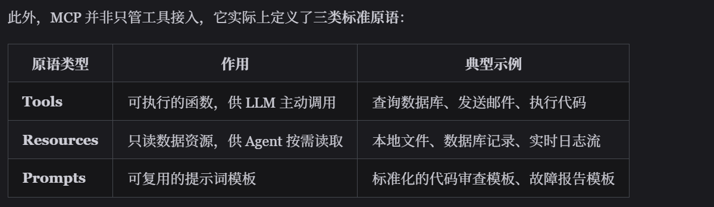

## 了解skills，harness，mcp等名词吗

### skills

Skill告诉ai遇到一个特定的任务，需要用哪些工具、遵循哪些步骤，来完成这个任务。

ai得到用户请求时，不会根据训练数据猜测如何做，而是先去看有没有对应的SKILL，如果有则按照它来完成任务

通过SKILL.md定义：

- skill名称、触发条件
- 环境约束
- 操作步骤、代码
- 输出规范
- 注意事项

意义：总结并复用ai的最佳实践

### Harness

- 自动化测试： 批量给 AI 运行几百个测试用例。
- 性能打分： 用“标准答案”或“另一个更强的 LLM（LLM-as-a-judge）”来给当前 AI 的表现打分。
- 回归测试： 确保新的代码迭代没有让 AI 表现更坏。

### mcp

MCP：协议，给AI接入外部工具和数据源。

- MCP是一个JSON-RPC协议，client（模型）和server（工具）通过消息通信，通过stdio本地传输，或者http远程传输

背景：以前你要让 AI 连接 Google Drive、GitHub 或 Slack，你需要为每个工具写一套不同的集成代码（即 "工具名称" → { 实际执行函数, JSON Schema 描述 }）。这就像每个电器都有不同的插头。

mcp是一个标准，通过 MCP Server，外部系统（如本地文件、数据库、企业 API）可以标准化地向外暴露自身能力，供外界调用；宿主程序（Host）只需连接该 Server，就能自动发现并注册所有工具，解耦了 AI 应用与底层外部代码。



定义一个MCP Server：

- 创建一个MCPServer实例对象server
- 用tool给server注册一个工具
  - 定义名称、描述（ai主要靠这两个判断什么时候调用这个工具）
  - 定义具体业务逻辑
- 启动通信


## Transformer 原理

在它之前，通常用的是RNN（循环神经网络），串行处理文本，速度慢，且容易丢失距离远的文本

Transformer：由编码器和解码器组成

```
输入序列（中文）                输出序列（英文）
"我喜欢苹果"                   "I like apples"
     ↓                               ↑
┌────────────┐              ┌────────────────┐
│            │              │                │
│  Encoder   │─────────────►│    Decoder     │
│  （编码器） │  上下文表示   │   （解码器）    │
│            │              │                │
└────────────┘              └────────────────┘

Encoder：理解输入，提取语义
Decoder：基于语义，逐步生成输出

注：GPT 只用 Decoder；BERT 只用 Encoder；原始翻译模型 Encoder+Decoder 都用
```

transformer可以看成是由多个层堆叠而成的，每个层包含三个核心组件：

- 词向量嵌入、位置编码
- 多头自注意力
- 前馈网络、残差连接

经过这三个组件后，得到每层的输出。

核心机制：

**自注意力**：让每个词去看文本中的所有词，确定相关程度

- 输入：词语的向量表示
- 生成QKV三矩阵：Q：我想查询什么 K：我能提供什么 V：我的实际内容
- 计算注意力
- 输出：权重

**多头注意力**：关注不同维度，从不同角度理解文本

**位置编码**：给每个词加上位置信息

**前馈网络**

### Encoder 和 Decoder 的区别


```
Encoder（每层包含）：
┌─────────────────────────────┐
│ 1. Multi-Head Self-Attention │  每个词看所有输入词
│    （双向，可看全文）          │
├─────────────────────────────┤
│ 2. Feed Forward             │
└─────────────────────────────┘

Decoder（每层包含）：
┌──────────────────────────────────┐
│ 1. Masked Self-Attention         │  只能看已生成的词（防止作弊）
│    （单向，只看左边）              │
├──────────────────────────────────┤
│ 2. Cross-Attention               │  用已生成的词去查询 Encoder 输出
│    Q 来自 Decoder                 │  建立输入输出的对齐关系
│    K、V 来自 Encoder              │
├──────────────────────────────────┤
│ 3. Feed Forward                  │
└──────────────────────────────────┘
```

**Masked Self-Attention** 的作用：

```
生成 "I like apples" 时：

生成 "like" 时：
  可以看到：[I]
  看不到：[like, apples]    ← mask 掉未来的词

如果不 mask：
  模型训练时直接看到答案，等于开卷考试，学不到真正的生成能力
```

------

### 完整数据流

```
输入："我喜欢苹果"

1. Tokenization
   "我喜欢苹果" → [token_1, token_2, token_3]

2. Embedding
   每个 token → 512 维向量

3. + Positional Encoding
   加上位置信息

4. Encoder（×6层）
   每层：Self-Attention → Add&Norm → FFN → Add&Norm
   输出：每个词的上下文感知向量表示

5. Decoder（×6层，生成时逐词输出）
   每层：
   Masked Self-Attention（只看已生成部分）
   → Cross-Attention（结合 Encoder 输出）
   → FFN

6. Linear + Softmax
   → 词表上的概率分布
   → 选概率最高的词

7. 重复步骤5-6，直到生成 <EOS>
```

------

### 

## 有没有开发过AI Agent，有没有封装过skills

 确定agent类型：

- 单次调用型：比如天气查询
- 多步规划型：agent拆解步骤，分布执行。比如调研报告
- 多agent协作
- 人在回路：需要用户确认才能继续执行

设计核心循环：思考上下文、确定下一步做什么、要使用的工具、调用工具得到结果、将结果加入上下文、思考上下文

设计工具：定义好名称、描述，以及具体逻辑

管理上下文长度

设计提示词：给ai设定角色、规则、输出格式等


## ReAct 推理框架

一种 AI Agent 范式。ReAct 让 Agent 拥有了像人类一样走一步看一步、根据证据修正排查方向的能力。这是单纯的链式调用无法做到的。

这是一个基于反馈闭环的交替过程，主要包含以下三个核心步骤（Reasoning -> Acting -> Observation），循环往复直至任务完成或触发终止条件：

- 思考（Reasoning）：LLM 分析当前上下文，生成内部推理过程，决定采取何种行动。
- 行动（Acting）：根据推理结果，与外部环境交互，如调用 API 或搜索网络。
- 观察（Observation）：获取外部环境对行动的反馈结果，作为新输入传递给 LLM，触发新一轮思考。

优势：显著减少幻觉（引入外部真实数据验证）、提升复杂任务的成功率、具备可解释性与可调试性（完整的推理轨迹清晰可见）。

局限性：多轮循环迭代会导致系统整体响应延迟增加，同时其表现高度依赖所集成的外部工具和 Skills 的质量与稳定性。

## AI Agent

传统编程：程序员 ──→ 代码 ──→ 执行结果
Workflow：产品/开发 ──→ 流程图 ──→ 执行结果
Agent：用户描述意图 ──→ AI 决策 ──→ 动态执行

传统编程和 Workflow 都是人在做决策、提前设计好所有逻辑，而 Agent 是 AI 在做决策。

适用场景：步骤不确定、需理解自然语言意图、动态决策

AI智能体？“智能体”是广义定义（强调自主能力），不一定用AI实现。AI Agent是基于人工智能技术的智能体实现形式

运行原理：Agent Loop：循环 【加载 System Prompt → LLM 推理 → 工具调用 → 上下文更新】 这个过程

## LangChain

你想开发一个AI应用。LangChain作为一个框架，它给你了一些封装好的API，例如将用户输入发送给LLM、将LLM连接到数据库、从数据库中提取出信息、根据信息执行操作例如发送邮件、操作过程中还可以调用其他API... 你可以将这些功能组合起来，最终完成一个完整的任务，也就是你的AI应用

官方：LangChain 是一个开源的开发框架，旨在简化利用LLM构建应用程序的过程。它通过将 LLM 与外部数据源、API 和逻辑链条连接，实现创建聊天机器人、问答系统、代理（Agent）等复杂的、具有数据感知和自主性的 AI 应用。LangChain 是连接大模型与具体业务逻辑的“黏合剂”，让开发者能用最少的代码构建强大的 AI 驱动应用。

类比：JDBC（Java Database Connectivity）：用相同的Java代码访问不同的数据库（如MySQL），实现统一的数据库访问机制。开发者只需调用JDBC提供的API，JDBC自己会将请求转为具体的数据库查询语句。

## 怎么使用ai coding，使用的什么

claude code

- 让ai阅读分析整个代码库
- 设计提示词：开发功能或者修复Bug
- ai写文档

使用技巧：

- 用好配置文件claude.md
- 清理冗余代码，减少对 AI 的误导和上下文干扰
- 单 Chat 专注单功能

开发prompt模板：

```
┌─────────────────────────────────────────────┐
│  1. 任务描述                                 │
│     做什么？（一句话清晰描述）                 │
├─────────────────────────────────────────────┤
│  2. 上下文                                   │
│     相关文件：@path/to/files                  │
│     参考模式：@path/to/example                │
│     背景信息：为什么要做这个                    │
├─────────────────────────────────────────────┤
│  3. 约束                                     │
│     不能做什么 / 必须满足什么                   │
│     "不引入新依赖"、"保持向后兼容"              │
├─────────────────────────────────────────────┤
│  4. 验证标准                                  │
│     怎么确认做对了？                           │
│     "运行 npm test"、"截图对比"               │
└─────────────────────────────────────────────┘
```

Bug 修复prompt模板：

```
修复 [问题描述]。

复现步骤：
1. [步骤 1]
2. [步骤 2]
3. [出现错误]

错误信息：
[粘贴完整错误信息或堆栈跟踪]

期望行为：[描述正确行为]

请：
1. 找到根因
2. 写一个能复现问题的失败测试
3. 修复问题
4. 确认测试通过
```

MCP（Model Context Protocol）让 Claude 连接外部数据源

## 人怎么把控ai的使用，怎么判断ai生成的是否正确，同样的错误怎么让ai下一次不会再犯

更好地使用ai：

- 提示词工程，比如在 Prompt 结尾加一句：“请在给出答案前，先逐步分析你的思考过程”。
- RAG，丰富知识库
- 拆分任务

判断 AI 生成的是否正确：

- 让ai自己实际运行这些代码，截取运行时的画面，然后像人类用户一样去评判这些界面是否美观、是否能用。
- ai评审代码
- 人工验证

同样的错误怎么让ai下一次不会再犯：

- 使用“自定义指令/系统提示词”
- 建立规范/规则文件
- 给ai一个“错误案例”
- Harness Engineering：上下文工程、约束、反馈、工作流控制、持续改进

### Harness Engineering 驾驭工程

Harness Engineering（驾驭工程）是围绕 AI 智能体设计和构建约束机制、反馈回路、工作流控制和持续改进循环的系统工程实践。

1. 上下文工程：让 Agent 根据当前任务拉取更多的上下文
2. 约束：自定义 Linter 规则，让agent知道自己的错误并修正
3. 反馈：ai审查ai，循环往复直到通过自动化测试。
4. 让ai对代码进行质量管理，适当时候重构代码
