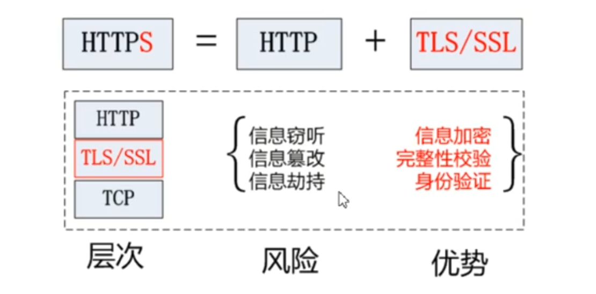
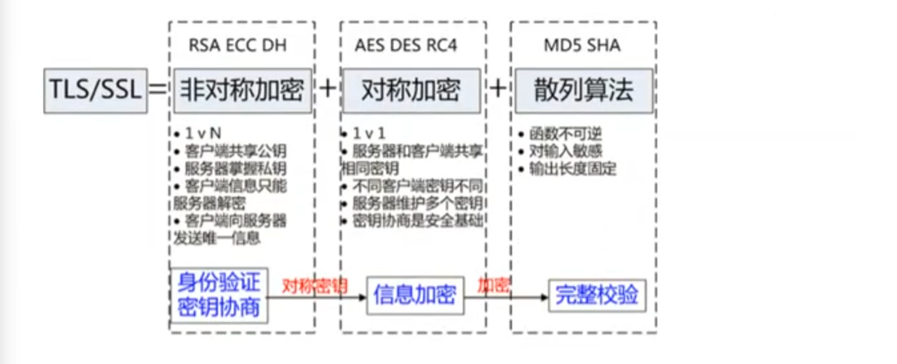

# HTTPS

 

- SSL(secure sockets layer)：安全套接层，是TLS的前身
- TLS(Transport Layer Security)：传输层安全协议
- 两者都是一种安全协议，为互联网通信提供安全及数据完整性保障

HTTPS主要功能基本依赖于TLS/SSL协议。TLS/SSL功能基于三个算法：
- 散列函数：验证信息的完整性
- 非对称加密：身份认证和密钥协商
- 对称加密：用协商好的密钥对数据进行加密

## 介绍HTTPS中出现的加密

### 对称加密

最快速、最简单的一种加密方式，加密和解密是同一个密钥。

### 非对称加密

加密和解密的密钥不一样。用于安全地交换密钥。

公钥加密的数据，只能用对应的私钥解开。私钥加密的数据，只能用对应的公钥解开。速度慢。

**对称密钥**的密钥用**非对称加密**的方式传输。 

### 哈希函数

哈希，又称摘要(digest)、校验值(checkSum)、指纹(finger print)

可以从数据X计算出哈希值Y，但不能从哈希值Y计算出数据X

- 普通哈希：用来做**完整性校验**，例如MD5
- 加密哈希：用于**加密**，例如SHA256(Secure Hash Algorithm)系列

### 数字签名

用私钥去签名，用公钥去验证签名

### 数字证书

由可信的第三方发出的，用来证明所有者身份以及所有者拥有的某个公钥的电子文件。

### Diffie Hellman算法

在双方不泄露密钥的情况下协商出一个密钥。

DH 算法基于数学中的离散对数问题，其安全性依赖于计算上的困难性。协议通过以下步骤实现密钥交换：

- **选择公开参数**：双方选择一个大素数 *p* 和一个基数 *g*（common paint），其中 *g* 是 *p* 的本原根。这些值可以公开。
- **生成私钥**：每方生成一个私有随机数（私钥），如 *a* 和 *b*（secret color），它们是小于 *p* 的正整数。
- **计算公钥**：双方分别计算公钥： A 计算 A = g^a mod p，B 计算 B = g^b mod p
- **交换公钥**：双方通过不安全信道交换公钥 *A* 和 *B*。
- **计算共享密钥**：双方利用对方的公钥和自己的私钥计算共享密钥： A 计算 K = B^a mod p B 计算 K = A^b mod p 
- 由于数学性质，K 的值相同（common secret），即 K = g^(ab) mod p。

安全性：DH 算法的安全性依赖于离散对数问题的计算复杂性，即给定 *g*、*g^a mod p* 和 *p*，很难推导出 *a*。因此，即使攻击者截获了公钥 *A* 和 *B*，也无法轻易计算出共享密钥 *K*。

## HTTPS 的实现原理

HTTPS (Hypertext Transfer Protocol Secure) 是基于 HTTP 的扩展，用于计算机网络的安全通信，已经在互联网得到广泛应用。在 HTTPS 中，原有的 HTTP 协议会得到 TLS (安全传输层协议) 或其前辈 SSL (安全套接层) 的加密。

HTTPS 通过使用两种加密算法，即对称加密、非对称加密来保证数据传输安全

对称加密与非对称加密的区别：

- 对称加密：加密和解密使用**同一个密钥**
  - 优点：算法公开、计算量小、加密**速度快**、加密效率高，适合加密比较大的数据
- 非对称加密：加密和解密使用**不同的密钥**，即公钥和私钥
  - 实现机密信息交换的基本过程是：甲方生成一对密钥并将其中的一把作为公钥对外公开；得到该公钥的乙方使用公钥对机密信息进行加密后再发送给甲方；甲方再用自己保存的私钥对加密后的信息进行解密。
  - 缺点是**速度慢**

HTTPS核心流程：非对称加密发送对称加密的密钥 --> 对称加密传输数据。

- 客户端在拿到服务器的公钥后，生成后续双方用于对称加密的密钥 KEY，然后使用公钥把 KEY 加密后再发送给服务器，服务器使用私钥将其解密，这样双方就有了同一个密钥 KEY
- 双方使用 KEY 进行对称加密传输数据。
- 安全性：在非对称加密传输 KEY 的过程中，即便第三方获取了公钥和加密后的 KEY，在没有私钥的情况下也无法破解 KEY，也就保证了接下来对称加密的数据安全

加入数字证书后（服务器将公钥通过数字证书发送给客户端），完整的HTTPS 原理：

分为两个阶段：证书验证、数据传输（非对称加密、对称加密）

1.客户端请求 HTTPS 网址，然后连接到 server 的 443 端口 (HTTPS 默认端口，类似于 HTTP 的 80 端口)。

2.采用 HTTPS 协议的服务器必须要有数字证书CA (Certification Authority)，证书需要申请，并由专门的数字证书认证机构(CA)通过审核后颁发电子证书 。颁发证书的同时会产生一个私钥和公钥。私钥由服务端自己保存，不可泄漏。公钥则是附带在证书的信息中，可以公开的。证书本身也附带一个证书电子签名，这个签名用来验证证书的完整性和真实性，可以防止证书被篡改。

3.服务器响应客户端请求，将证书传递给客户端，证书包含公钥和其他信息，比如证书颁发机构信息，公司信息和证书有效期等。Chrome 浏览器点击地址栏的锁标志再点击证书就可以看到证书详细信息。

4.客户端解析证书并对其进行验证。如果证书不是可信机构颁布，或者证书中的域名与实际域名不一致，或者证书已经过期，就会向访问者显示一个警告，由其选择是否还要继续通信。如果证书没有问题，客户端就会从服务器证书中取出服务器的公钥 A。然后客户端生成一个随机码 KEY（对称加密的密钥），并使用公钥 A 将其加密。

5.客户端把加密后的 KEY 发送给服务器，作为后面对称加密的密钥。

6.服务器在收到随机码 KEY 之后会使用私钥 B 将其解密。

7.双方使用对称密钥加密传输所有数据：服务器使用密钥对数据进行对称加密并发送给客户端，客户端使用相同的密钥解密数据。
