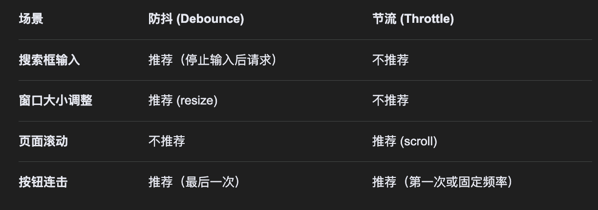
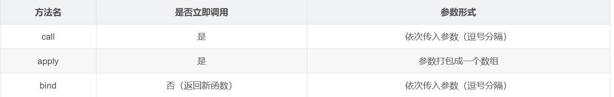

- [ ] 原型链：__proto__、prototype、new 的过程
- [x] 执行上下文、作用域
- [x] this 绑定：四种规则、箭头函数
- [x] 闭包：应用场景（防抖节流、私有变量）及内存泄漏
- [ ] Event Loop：宏任务/微任务、async/await 的执行顺序
- [ ] Promise：手写 Promise 核心、all/race/allSettled 等

## 谈谈对 js 事件循环的理解？

任务分为：

- 同步任务：立即执行的任务，同步任务会进入到主线程中执行
- 异步任务：异步执行的任务，比如 ajax 网络请求、setTimeout，可能出现在任务队列中，直到可以执行了，该任务才会进入主线程执行。

JS 是单线程的，运行基于事件循环机制(event loop)：对于异步事件它会先加入到任务队列中挂起，等主线程空闲时会去执行事件队列中的事件。

- 调用栈（主线程）
  - 后进先出
  - 存储要执行的代码
- 任务队列
  - 先进先出
  - 存储将要执行的代码
  - 调用栈中的代码执行完毕后，才会将队列中的代码按顺序放入栈执行

任务队列分为：

- **宏任务**队列 （大部分代码都去宏任务队列中去排队，例如 整体脚本代码script、setTimeout、I/O、UI 渲染）
- 微任务队列 （Promise 的回调函数（then、catch、finally））
  - queueMicrotask() : 向微任务队列中添加一个任务

在当前宏任务执行过程中产生的微任务会在该宏任务结束后、下一个宏任务开始前立即执行。

宏任务通常不太紧急，微任务通常比较紧急且相关性较强

Promise 的执行原理

- Promise 在执行，then 就相当于给 Promise 了回调函数
  - 当 Promise 的状态从 pending 变为 fulfilled 时，then 的回调函数会被放入到任务队列中

流程：**主线程任务 ——> 微任务 ——> 宏任务**

## js 的数据类型

八种：undefined、null、boolean、string、object、number

ES6 新增两种：symbol、bigint：

- symbol：创建独一无二且不可变的数据类型，作用是防止全局变量冲突
- bigint：存储任意精度格式的整数

可以分为原始数据类型、引用数据类型：

- 原始数据类型：存储在栈中
- 引用数据类型：存储在堆中，在栈中存放指向该数据的指针

## this

### 普通函数的this

普通函数的this 是在函数调用时的创建的**执行上下文**中确定的。四种规则：按优先级高低

- **new 绑定？**--> 指向新对象。
- **call/apply/bind 显式绑定？**--> 指向指定对象。
- **隐式绑定（在对象属性上调用）？**--> 指向该对象。
- **默认绑定？**--> 指向 `window` 或 `undefined`。

this：谁来调用就是谁，亦即`.`前是谁，例如obj.func()，this就是func

如果没有 `.`调用：

- 非严格模式：默认window调用
- 严格模式：undefined

与变量不同， 变量是通过**作用域链**（静态、定义时决定）去找的；而普通函数的 `this` 是通过**调用方式**（动态、运行时决定）去绑定的，所以多次调用函数，this值可能不同。

- 全局作用域中 this 指向全局对象（浏览器为 window，Node.js 为 global）。
- 可以使用call bind apply手动指定this
- 构造函数中 this 指向新创建的实例
- 事件绑定时，this指向绑定的元素
- 事件处理器中 this 指向触发事件的元素。

### 箭头函数的this

箭头函数没有自己的this，于是this行为如同普通变量，顺着作用域链向上查找到**父级作用域的词法环境**的this。

由于词法环境是JS编译时就确定的，所以this在箭头函数定义时就确定了。无论如何调用，其 this 不会改变。

```js
const obj = {
    name: 'haha',
    regular: function() {
        console.log(this.name);
    },
    arrow: () => {
        console.log(this.name);
    }
};

obj.regular(); // 输出 'haha'：调用者是 obj，this 动态绑定到 obj
obj.arrow();   // 输出 undefined (或 window.name)：它没有 this，向上找到全局作用域
```

注意， `obj` 的大括号 `{}` **不会产生词法环境**（只有函数和块级作用域会）。

## 箭头函数与普通函数的区别

箭头函数：

- 是匿名函数，不能作为构造函数，使用 new 会报错。
- 没有 arguments，和this一样，沿着作用域链找外层的
- 没有 prototype
- 不能作为方法
- this 指向不同：
  - 箭头函数没有自己的 this，而是顺着作用域链向上查找到**父级作用域的词法环境**的this。
  - 普通函数的 this 动态指向调用者（默认指向 window，作为对象方法则指向该对象）
- 当使用 `call()`、`bind()` 或 `apply()` 调用箭头函数时，`thisArg` 参数会被忽略
- 箭头函数不能用作 Generator 函数，其内部不能使用 yeild 关键字

## 实现防抖节流

浏览器的 resize、scroll、keypress、mousemove 等事件在触发时，会不断地调用绑定在事件上的回调函数，极大地浪费资源，降低前端性能。为了优化体验，需要对这类事件进行调用次数的限制，对此我们就可以采用 防抖（debounce） 和 节流（throttle） 的方式来减少调用频率

- 防抖：n 秒后再执行此事件。若在 n 秒内被重复触发，则重新计时
- 节流：n 秒内只运行一次，若在 n 秒内被重复触发，只有一次生效

节流: 当水龙头的水一直往下流，这十分的浪费水，所以我们可以把龙头关小一点，让水一滴一滴往下流，每隔一段时间掉下来一滴水。

区别：

- 防抖：动作停止后才会执行，关注动作的结束，例如连续点按钮，只执行最后一次点击。
- 节流：动作期间每隔固定时间执行，关注过程中的频率，例如连续点击按钮，按一定频率执行。

使用场景：



### 实现节流

1. 基于时间戳

```js
// 节流函数（基于时间戳）
function throttle(func, delay) {
  let prev = 0; // 上次执行时间
  return function (...args) {
    let now = Date.now();
    // 如果当前时间与上次执行时间差超过了限制时间
    if (now - prev >= delay) {
      func.apply(this, args);
      prev = now; // 更新上次执行时间
    }
  };
}

// 应用场景：页面滚动，每隔500ms计算一次位置
const handleScroll = throttle(() => {
  console.log("滚动事件处理", Date.now());
}, 500);
```

### 实现防抖

```js
// 防抖函数
function debounce(func, delay) {
  let timer = null; // 用于存储定时器
  return function (...args) {
    // 如果定时器存在，清除旧的，重新计时
    if (timer) clearTimeout(timer);

    timer = setTimeout(() => {
      func.apply(this, args); // 执行函数
    }, delay);
  };
}

// 应用场景：输入框搜索，等待停止输入500ms后请求
const handleInput = debounce(() => {
  console.log("发送请求", Date.now());
}, 500);
```

## 你对 Promise 的理解

多个异步操作依赖时，嵌套层层加深，导致代码可读性差。Promise 是异步编程的一种解决方案，避免了回调地狱。它不是新的语法功能，而是一种新的写法，允许将回调函数的横向展开，改成纵向展开。

Promise 的三种状态：pending、fulfiling、rejected

两个凝固过程：

- pending->fulfiling：resolved 已完成
- pending->rejected：rejected 已拒绝

Promise 的构造函数接受一个executor函数，该函数会立即执行，包含两个参数：resolve、reject

- resolve 在异步操作成功时调用，将结果返回，作为参数传递出去
- reject 在异步操作失败时调用，将错误信息返回，作为参数传递出去

Promise 的特点：

- 如果不设置处理错误的回调函数，promise 内部抛出的错误将不会反映到外部

## 协程

传统的编程语言，早有异步编程的解决方案（其实是多任务的解决方案）。其中有一种叫做"协程"（coroutine），意思是多个线程互相协作，完成异步任务。

协程有点像函数，又有点像线程。它的运行流程大致如下。

```
第一步，协程A开始执行。

第二步，协程A执行到一半，进入暂停，执行权转移到协程B。

第三步，（一段时间后）协程B交还执行权。

第四步，协程A恢复执行。
```

上面流程的协程 A，就是异步任务，因为它分成两段（或多段）执行。

举例来说，读取文件的协程写法如下。

```js
function asnycJob() {
  // ...其他代码
  var f = yield readFile(fileA);
  // ...其他代码
}
```

上面代码的函数 asyncJob 是一个协程，它的奥妙就在其中的 yield 命令。它表示执行到此处，执行权将交给其他协程。也就是说，yield 命令是异步两个阶段的分界线。

协程遇到 yield 命令就暂停，等到执行权返回，再从暂停的地方继续往后执行。它的最大优点，就是代码的写法非常像同步操作，如果去除 yield 命令，简直一模一样。

## 柯里化

> 柯里化：接收一部分参数，返回一个函数接收剩余参数，接收足够参数后，执行原函数

- 在数学和计算机科学中的柯里化函数，一次只能传递一个参数；
- 而 Javascript 实际应用中的柯里化函数，可以传递一个或多个参数。

例子：柯里化函数 `_fn`

- 当接收的参数数量与原函数的形参数量相同时，执行原函数；
- 当接收的参数数量小于原函数的形参数量时，返回一个函数用于接收剩余的参数，直至接收的参数数量与形参数量一致，执行原函数。

```js
//普通函数
function fn(a, b, c, d, e) {
  console.log(a, b, c, d, e);
}
//生成的柯里化函数
let _fn = curry(fn);

_fn(1, 2, 3, 4, 5); // print: 1,2,3,4,5
_fn(1)(2)(3, 4, 5); // print: 1,2,3,4,5
_fn(1, 2)(3, 4)(5); // print: 1,2,3,4,5
_fn(1)(2)(3)(4)(5); // print: 1,2,3,4,5
```

柯里化的用途：通过参数复用，使得代码更简洁、直观

- 正则检验，比如校验电话号码、校验邮箱、校验身份证号、校验密码等。

```js
function checkByRegExp(regExp, string) {
  return regExp.test(string);
}

//进行柯里化
let _check = curry(checkByRegExp);
//生成工具函数，验证电话号码
let checkCellPhone = _check(/^1\d{10}$/);
//生成工具函数，验证邮箱
let checkEmail = _check(/^(\w)+(\.\w+)*@(\w)+((\.\w+)+)$/);

checkCellPhone("18642838455"); // 校验电话号码
checkCellPhone("13109840560"); // 校验电话号码
checkCellPhone("13204061212"); // 校验电话号码

checkEmail("test@163.com"); // 校验邮箱
checkEmail("test@qq.com"); // 校验邮箱
checkEmail("test@gmail.com"); // 校验邮箱
```

### 实现 curry 函数

思路：“递归收集参数”的过程：

- 每次调用都累积参数
- 判断参数是否足够
  - 不够 → 继续返回函数（递归）
  - 足够 → 执行原函数

```
/**
 * 将函数柯里化
 * @param fn    待柯里化的原函数
 * @param len   所需的参数个数，默认为原函数的形参个数
 */
function curry(fn, len = fn.length) {
    return _curry.call(this, fn, len)
}

/**
 * 中转函数
 * @param fn    待柯里化的原函数
 * @param len   所需的参数总数
 * @param args  当前已收集到的参数列表
 */
function _curry(fn, len, ...args) {
    return function (...params) {
        let _args = [...args, ...params]; // 把“历史参数 + 新参数”拼在一起
        if(_args.length >= len){
            // 参数够了，执行原函数
            return fn.apply(this, _args);
        }else{
            return _curry.call(this, fn, len, ..._args)
        }
    }
}
```

### 实现类似lodash的占位符 curry

我们常用的工具库 lodash 也提供了 curry 方法，并且增加了非常好玩的 placeholder 功能，通过占位符的方式来改变传入参数的顺序。

比如说，我们传入一个占位符，本次调用传递的参数略过占位符，
占位符所在的位置由下次调用的参数来填充

思路：

- 对于 lodash 的 curry 函数来说，curry 函数挂载在 lodash 对象上，所以将 lodash 对象当做默认占位符来使用。
- 而我们的自己实现的 curry 函数，本身并没有挂载在任何对象上，所以将 curry 函数当做默认占位符
- 使用占位符，目的是改变参数传递的顺序，所以在 curry 函数实现中，每次需要记录是否使用了占位符，并且记录占位符所代表的参数位置。

```js
/**
 * @param  fn           待柯里化的函数
 * @param  length       需要的参数个数，默认为函数的形参个数
 * @param  holder       占位符，默认当前柯里化函数
 * @return {Function}   柯里化后的函数
 */
function curry(fn, length = fn.length, holder = curry) {
  return _curry.call(this, fn, length, holder, [], []);
}
/**
 * 中转函数
 * @param fn            柯里化的原函数
 * @param length        原函数需要的参数个数
 * @param holder        接收的占位符
 * @param args          已接收的参数列表
 * @param holders       已接收的占位符位置列表
 * @return {Function}   继续柯里化的函数 或 最终结果
 */
function _curry(fn, length, holder, args, holders) {
  return function (..._args) {
    //将参数复制一份，避免多次操作同一函数导致参数混乱
    let params = args.slice();
    //将占位符位置列表复制一份，新增加的占位符增加至此
    let _holders = holders.slice();
    //循环入参，追加参数 或 替换占位符
    _args.forEach((arg, i) => {
      //真实参数 之前存在占位符 将占位符替换为真实参数
      if (arg !== holder && holders.length) {
        let index = holders.shift();
        _holders.splice(_holders.indexOf(index), 1);
        params[index] = arg;
      }
      //真实参数 之前不存在占位符 将参数追加到参数列表中
      else if (arg !== holder && !holders.length) {
        params.push(arg);
      }
      //传入的是占位符,之前不存在占位符 记录占位符的位置
      else if (arg === holder && !holders.length) {
        params.push(arg);
        _holders.push(params.length - 1);
      }
      //传入的是占位符,之前存在占位符 删除原占位符位置
      else if (arg === holder && holders.length) {
        holders.shift();
      }
    });
    // params 中前 length 条记录中不包含占位符，执行函数
    if (
      params.length >= length &&
      params.slice(0, length).every((i) => i !== holder)
    ) {
      return fn.apply(this, params);
    } else {
      return _curry.call(this, fn, length, holder, params, _holders);
    }
  };
}
```

## undefined、null 的区别

undefined、null 都是基本数据类型，都只有唯一的值 undefined、null

- undefined：声明但未定义的变量
- null：表示空对象，通常用于尚未确定值的变量，typeof null 返回 object，所以用 === null 来测试 null

## instanceof 运算符的实现原理及实现

作用：用于检测构造函数的 prototype 是否出现在某个实例对象的原型链上

原理：obj instanceof Constructor 会在 obj 的原型链上查找 Constructor 的 prototype，直到查找到原型链的顶端

手写

```js
// 实现 instanceof
const myInstanceof = (target, origin) => {
  // 右侧必须是构造函数
  if (typeof origin !== "function") {
    throw new TypeError("Right-hand side of 'instanceof' should be a function");
  }
  if (
    //基本数据类型直接返回false
    (typeof target !== "object" && typeof target !== "function") ||
    target === null
  ) {
    return false;
  }
  let proto = Object.getPrototypeOf(target); // 等价于 target.__proto__
  while (proto) {
    if (proto === origin.prototype) return true;
    proto = Object.getPrototypeOf(proto);
  }
  return false;
};
```

## typeof 和 instanceof 区别

- typeof 用于判断原始数据类型（null 除外），返回数据类型（例如 Number、String）
- instanceof 用于判断引用数据类型(对象)，返回 boolean

为什么 typeof null 为 object：这是 js 的一个历史遗留问题，用 32 位二进制数存储值，前 3 位表示类型，000 为对象，而 null 为全 0，所以判断为 object

## 为什么 0.1+0.2 ! == 0.3，如何让其相等

浮点数运算精度问题，计算机中，数据需要转换为二进制再运算，浮点数自身小数位数的限制而截断的二进制再转化为十进制，会比 0.3 稍大

solution：

- 先转换为整数再运算，结果再转换为小数
- 用 toFixed 保留结果的小数点

## 判断数组的方式

- 1. `Object.prototype.toString().call(obj).slice(8,-1)==='Array'`： Object.prototype.toString() 返回 "[object Type]"，这里的 Type 是对象的类型。
- 2. `obj instanceof Array` 或者 `obj.__proto__ === Array.prototype`：原型链
- 3. ES6 的 `Array.isArray(obj)`

## 什么是类数组对象？如何转换为数组

类数组对象就是伪数组，不能调用数组的方法。arguments、通过 document.getElement 获取到的内容都是伪数组。伪数组具有 length 属性

转换方法：

- Array.from(arrayLike)：不会改原对象
- [...arrayLike]：使用扩展运算符。不会改原对象
- Array.prototype.slice.call(arrayLike)：调用 arrayLike 的 slice 方法，由于 arrayLike 类型是对象，没有 slice 方法，JS 内部机制会把 arrayLike 转换为 Array
- Array.prototype.splice.call(arrayLike,0)：splice(0)会从索引 0 开始删除所有元素，返回被删除的元素数组，同时修改原对象的内容（即删除它的元素）。splice 会根据 arrayLike 的 length 去访问元素，把这些值复制到一个数组中返回
- Array.prototype.concat.apply([], arrayLike)

## 数组的原生方法

1. **修改原数组**

这些方法会改变原有的数组对象。

- push() ：在数组末尾添加元素，返回新长度。
- pop() ：删除数组最后一个元素，返回该元素。
- unshift() ：在数组开头添加元素，返回新长度。
- shift()：删除数组第一个元素，返回该元素。
- splice(start, deleteCount, items…) ：从指定位置删除/替换/插入元素，用于增删改操作。
- sort() ：对数组元素进行排序。
- reverse() ：颠倒数组中元素的顺序。
- fill() ：用固定值填充数组。
- `copyWithin(target, start, end)`：在数组内部复制一段覆盖另一段。

`[1,2,3,4].copyWithin(1, 2); // [1,3,4,4]`

2. **不改变原数组**

这些方法会返回一个新数组或数值，原数组保持不变。

- concat()：合并两个或多个数组。
- slice(start, end)：截取start, end片段（不包含end）返回数组的浅拷贝切片。
- join(separator)：用分隔符合并成字符串
- indexOf()/ lastIndexOf()：查找元素索引。
- includes()：判断数组是否包含特定值。
- toString()：返回数组的字符串表示(逗号分隔)。
- flat/flatMap：拍平数组

```js
console.log([1, 2, 3, 4, 5].slice(1, -1)); // [ 2, 3, 4 ] 表示截取索引1到-1，不包含-1 (-1表示最后一个)
```

3. **数组遍历与迭代方法（除了forEach外，全部不改变原数组）**

- forEach(cb)：对每个元素执行一次cb操作，修改原数组，无返回值。
- map(cb)：返回一个新数组，其结果是该数组中的每个元素调用一次cb函数。
- filter(cb)：返回一个新数组，包含通过测试的所有元素。
- reduce(cb)：归并数组为单个值，从左到右。
- find(cb)：查找满足条件的第一个元素或索引。
- some(cb)：至少有一个元素通过测试→ `true`。
- every(cb)：所有元素通过测试→ `true`。

4. **静态方法**

- Array.isArray()：判断一个值是否为数组。
- Array.from(iterable)：将类数组/可迭代对象转为真正数组。
- Array.of(...values)：将一组值转换为数组。

注意点：

- `map` vs `forEach` ：`map` 有返回值（新数组），`forEach` 无返回值。
- `splice` vs `slice` ：`splice` 修改原数组，`slice` 不修改。
- `sort` 默认按字符串排序 ，数字排序需提供比较函数：

```js
[1, 30, 4].sort((a, b) => a - b); // [1,4,30]
```

- `reverse` 会改变原数组。

## substring 和 substr 的区别

- `substring(startIdx, endIdx)`：返回从 startIdx 到 endIdx 的子字符串
- `substr(startIdx, length)`：返回从 startIdx，长度为 length 的子字符串

## object.assign 和扩展运算符都是浅拷贝

- object.assign(tarObj, srcObj1, ...)：将所有源对象合并到目标对象中，返回修改后的目标对象。如果目标对象与源对象具有相同的键（属性名），则目标对象中的属性将被源对象中的属性覆盖，后面的源对象的属性将类似地覆盖前面的源对象的同名属性。会调用 ES6 的 setter
- [...]扩展运算符：数组或对象中的每一个值都会被拷贝到一个新的数组或对象中。它不复制继承的属性或类的属性，但是它会复制 ES6 的 symbols 属性。

## new

new 创建一个对象，将该对象绑定到构造函数的 this 上

执行过程：

- 基于构造函数的原型，创建新的对象（将新对象的原型指向构造函数原型对象）
- 通过 apply 执行构造函数（将构造函数的 this 指向新对象）
- 返回：
  - 如果构造函数没有返回值，直接返回新对象
  - 如果构造函数有返回值，并且是一个对象，则返回构造函数的返回值

手写

```js
function myNew(Func, ...args) {
  if (typeof Func !== "function") {
    throw new TypeError("First argument must be a function");
  }
  // 基于构造函数的原型，创建新的对象
  const obj = Object.create(Func.prototype);
  // 将构建函数的this指向新对象
  let result = Func.apply(obj, args);
  // 根据返回值判断
  return result !== null && result instanceof Object ? result : obj;
}
```

## for...in 和 for...of

- for...in：遍历对象的整个原型链，遍历获取的是对象的键名（key），主要用于遍历对象
- for...of：只遍历当前对象，遍历获取的是对象的键值（value），主要用于遍历数组、类数组对象、字符串、Set、Map
- 例如遍历数组，for...in 会返回数组中所有所有可枚举的属性（包括原型链上可枚举的属性），for...of 只返回数组的下标对应的属性值

可枚举属性：对于通过直接复制或属性初始化器创建的属性，默认为 true；Object.defineProperty 定义的属性，默认为 false。迭代方法(例如 for...in)只访问可枚举的属性

for...in 是如何遍历原型链的：

- 先枚举对象自身的可枚举属性
- 顺着原型链，枚举原型的可枚举属性

在 Object.prototype 上挂自定义属性，会污染所有 for...in 遍历。

如何避免遍历原型链？

- 用 hasOwnProperty() 过滤掉原型属性

for...of 可以遍历的数据内部都有一个遍历器 iterator 接口，普通对象内部没有，但可以通过给对象添加一个 Symbol.iterator 属性来指向一个迭代器

## forEach 和 map 方法有什么区别

都用于遍历数组，对数组的每个元素执行一次给定的函数

- forEach：直接改变原数组，无返回值
- map：不改变原数组，创建一个新数组用来存放原数组通过函数处理后的值，并返回

## 什么是尾调用，使用尾调用有什么好处

尾调用：在函数的最后一步调用函数。

作用：节省内存：在一个函数里调用另外一个函数会保留当前执行的上下文，但如果在函数尾部调用，就不会保留执行上下文，从而节省内存。

ES6 的尾调用只能在严格模式下开启

## 你用过哪些设计模式

- 单例模式：保证类只有一个实例，并提供一个访问它的全局访问点
- 工厂模式：用来创建对象，根据不同的参数返回不同的对象实例
- 策略模式：定义一系列的算法，把它们一个个封装起来，并且使它们可以相互替换
- 装饰器模式：在不改变对象原型的基础上，对其进行包装扩展
- 观察者模式：定义了对象间一种一对多关系，当目标对象状态发生改变时，所有依赖它对对象都会得到通知
- 发布-订阅模式：
  - 发布者（消息的发送者）将发布的信息（事件）分为不同的类别，订阅者可以订阅其需要的信息（事件）；这样，当某个事件触发时，所有订阅该事件的对象将得到通知以及相关信息
  - 例如：DOM 操作中的 addEventListener、Vue 中的事件总线的概念、Node.js 中的 EventEmitter 以及内置库


## 如何实现深浅拷贝

浅拷贝：直接拷贝地址

深拷贝：拷贝对象

实现深拷贝：

- `_.cloneDeep()`
- `jQuery.extend()`
- JSON.stringify()：将 js 对象用 JSON.stringify 序列化，再通过 JSON.parse 反序列
  - `const obj = JSON.parse(JSON.stringify(src));`
  - 会忽略对象中的函数、undefined、symbol ，
  - 如果有正则表达式、Error 对象等，会得到空对象
- 循环递归

```js
function myDeepClone(src) {
  if (src === null || typeof src !== "object") return src;
  const obj = {};
  for (let prop in src) {
    if (src.hasOwnProperty(prop)) {
      if (typeof src == "object") obj[prop] = myDeepClone(src[prop]);
      else obj[prop] = src[prop];
    }
  }
  return obj;
}
```

- hasOwnProperty() ：返回一个布尔值，表示对象自有属性（而不是继承来的属性）中是否具有指定的属性。

实现浅拷贝：

```js
// 浅拷贝
function myShallowClone(src) {
  const obj = {};
  for (let prop in src) {
    if (src.hasOwnProperty(prop)) {
      obj[prop] = src[prop];
    }
  }
  return obj;
}
```

存在浅拷贝的情况：

- Objec.assign() 拷贝对象
- Array 的 slice、concat 方法
- 使用 [...] 扩展运算符实现的复制

## 解释原型

- prototype：构造函数的 prototype 指向它的原型对象，原型对象包含了该构造函数所有实例共享的属性和方法
- **proto**：实例函数通过 proto 指向创建它的构造函数的 prototype（即原型对象），用于构造原型链
- constructor：原型对象的 constructor 指向它的构造函数

## 解释原型链

每个实例对象的**proto**指向它的构造函数的原型对象，这个原型对象也有**proto**指向它的原型对象，直到最顶层 null，这样就形成了一条原型链。

作用：访问一个对象的属性或方法时，如果当前对象没有，就沿着原型链逐级向上寻找，直到原型链的顶层原型 Object.prototype，如果这里没有就只指向 null

## 实现继承的传统方式

三种传统方式：原型链继承、借用构造函数继承、组合继承

1. 原型链继承：将子类的原型对象设置为父类

```js
function Parent() {
  this.name = "parent";
}
Parent.prototype.say = function () {};

function Child() {}
Child.prototype = new Parent();
```

问题：

- 所有子类实例共享父类实例的引用属性（比如数组、对象）；
- 传参困难。

2. 借用构造函数继承

```js
function Parent(name) {
  this.name = name;
}
function Child(name, age) {
  Parent.call(this, name);
  this.age = age;
}
```

- 方法都在构造函数里，每个实例都重新创建一份；
- 无法复用父类原型上的方法。

3. 组合继承

```js
function Parent() {
  this.name = "parent";
}
Parent.prototype.say = function () {};

function Child(name, age) {
  Parent.call(this, name);
  this.age = age;
}
Child.prototype = new Parent();
Child.prototype.constructor = Child;
```

问题：

- 调用了两次父类构造函数，一次给实例，一次给原型
- 子类原型上有一份无用的 name 属性。

解决方案：寄生组合继承

## 实现寄生组合继承

Object.create() 静态方法：以一个现有对象作为原型，创建一个新对象。

- 子类执行父类构造函数：在子类的构造函数中，使用 call 创建父类型原型的一个副本
- 使用 Object.create()，将子类的原型指向父类（即，通过将新创建的中间对象赋给子类的原型，来继承父类原型。Object.create 只建立原型链关系，不会执行 Parent 构造函数，所以不会初始化属性。）
- 将子类的 constructor 重新指向子类自己的构造函数

```js
function Parent(name) {
  this.name = name;
}
Parent.prototype.sayName = function () {};

function Child(name, age) {
  // 执行父类构造函数
  Parent.call(this, name);
  this.age = age;
}

// 将子类的原型 指向父类
Child.prototype = Object.create(Parent.prototype);
// 此时的构造函数为父类的 需要指回自己
Child.prototype.constructor = Child;

Child.prototype.sayAge = function () {
  console.log(this.age);
};
var child1 = new Child("Tom", 18);
child1.sayName(); // 'Tom'
child1.sayAge(); // 18
```

优势：高效

- 只调用一次 Parent 构造函数
- 避免了在 Child.prototype 上面创建不必要的、多余的属性
- 子类能访问父类原型上的方法
- 原型链正确
- 是 ES6 class 继承的底层原理之一

## 理解闭包

是什么：一个函数引用了外层函数作用域的变量，那么这个函数和它引用的外部变量就构成了闭包。在DevTools 中可以看到 `[[Scopes]]` 下的 `Closure` 对象。

准确来说，闭包是函数和它的词法环境组合。当外层函数执行完毕，其执行上下文会从栈中弹出并销毁。但如果其内部函数被外部引用（比如说return出去并被接收），由于内部函数在创建时通过隐藏属性 `[[Environment]]`（v8中表现为[[scopes]]） 持有了对外层词法环境的引用，导致这部分环境（及其中被引用的变量）没有被垃圾回收，从而实现了变量在堆内存中的持久化存储。

为什么要用闭包：

- 闭包中引用的外部变量，表现得就像闭包函数的**私有属性**。外部不能直接修改变量，但可以通过闭包函数去修改。
- 闭包可以**延长变量的生命周期**。原本外层函数作用域的变量会在函数执行完后销毁，但由于内部函数引用了它，使得变量不会被销毁。虽然这也可能造成内存泄漏（解决方法：手动将闭包函数置为 `null`。）。
  - 准确来说，外层作用域的词法环境会随着执行上下文的销毁而销毁，但由于内部函数引用了词法环境中的一些变量，导致这部分变量不会被回收，继续存储在堆内存的closures对象中。
- 在**防抖节流、函数柯里化**中都有闭包的运用。

创建闭包的最常见方式是在一个函数内创建另一个函数并return出去，且函数访问了当前函数的局部变量


## 理解执行上下文、词法环境、变量环境

js是解释型语言，分为解释+执行两个阶段。

js代码在执行上下文中运行。执行上下文是运行js代码的环境。分为全局执行上下文、函数执行上下文、Eval 函数执行上下文。

js引擎执行js代码时，执行上下文会经历三个阶段：

创建阶段：

- **确定this的值**（全局执行上下文，this的值是全局对象window；函数执行上下文，如果函数被引用对象调用，则this是这个对象，否则是全局对象或undefined）
- 创建**词法环境**（收集let、const、function声明，不赋值）、**变量环境**（收集var声明，赋值为undefined，也称作变量提升）

执行阶段：

- 变量赋值、代码运行

销毁阶段：

- 执行上下文出栈并被回收。

js引擎第一次遇到我们写的脚本时，它会创建一个**全局的执行上下文**（包括词法环境、变量环境、this）并且压入当前**调用栈**。每当引擎遇到一个函数调用，它会为该函数创建一个**新的函数执行上下文**（包括词法环境、变量环境、this）并压入栈的顶部。引擎会执行位于栈顶的执行上下文，执行完毕后从栈中弹出，然后继续执行栈顶的上下文。

注意，函数的执行上下文**是在函数**被调用的时候创建的，而不是在函数声明的时候；词法环境则是在函数声明时创建的。（为什么？因为执行上下文需要知道函数的参数，声明时还不知道）

### 词法环境、变量环境

词法环境由**环境记录器**和**外部环境的引用（outer reference）**组成。环境记录器存储变量、函数，而外部环境的引用指向父级词法环境，后续变量查找时有用（通过outer指针逐级向上查找）。

环境记录器由两种类型，

- 对象环境记录器（在全局执行上下文中）：存储出现在全局执行上下文中的变量、函数
- 声明式环境记录器（在函数执行上下文中）：存储函数的参数、变量、函数

```js
GlobalExectionContext = {        // 全局执行上下文
    LexicalEnvironment: {        // 词法环境
        EnvironmentRecord: {     // 环境记录器：存储变量和函数声明的实际位置
            Type: "Object",      
            // 在这里绑定标识符  
        }
        outer: <null>           // 对外部环境的引用：可以访问其父级词法环境
    }
}

FunctionExectionContext = {     // 函数执行上下文
    LexicalEnvironment: {
        EnvironmentRecord: {
            Type: "Declarative",
            // 在这里绑定标识符
        }
        outer: <Global or outer function environment reference>
    }
}
```

变量环境和词法环境几乎相同，只不过它用来存储var变量。

### 词法环境是一个对象，存储在堆中

如果所有变量都存在词法环境里，也就是堆中，JS 的性能岂不是比 C 这种直接操作栈内存的语言慢得多？V8通过逃逸分析来解决这个问题。

V8引擎通过分析对象的作用域，决定其是否被外部访问，以进行优化：

- **不逃逸：** 对象仅在当前函数内部使用。V8可能将对象属性拆解，直接分配在栈上或寄存器中（标量替换），无需垃圾回收，速度极快。
- **逃逸：** 对象被返回、赋值给外部变量或方法内的方法引用（闭包）。此时对象必须在堆（Heap）上分配。


## let/const/var

变量提升：表现为可以在声明之前访问 `var` 定义的变量（虽然是 `undefined`）

暂时性死区：表现为在声明之前访问 `let` 和 `const` 的变量会得到一个引用错误。

原因：JS扫描代码，创建词法环境和变量环境的时候，let/const、var的声明虽然都被收集，但只有var会被赋值为undefined，而let/const都是未赋值状态，如果访问会报错。


## 对作用域、作用域链的理解

**作用域（词法作用域）**：作用域是变量和函数的可访问性规则集合，可以比作一个独立的区域，确定了变量或函数的可访问范围。作用域最大的用处就是隔离变量。内层作用域可以访问外层作用域，而反之不行。分为全局、函数、块级作用域。

作用域在js执行代码前的扫描阶段（词法分析阶段）就已经确定了，之后不会再变。**词法环境**是 ECMA 规范中用于实现作用域的一种机制。而执行上下文是动态的，每调用一次函数，就会产生新的执行上下文。

**作用域链**：变量在指定的作用域中没有找到，会通过outer，依次向外层作用域进行查找，直到全局作用域。这个查找的过程被称为作用域链。词法环境中的**外部环境引用(outer reference)**便是作用域链的具体实现。

---

全局作用域：可以全局访问

- 最外层函数和最外层定义的变量拥有全局作用域
- window 上的对象属性方法拥有全局作用域
- 为定义直接复制的变量自动申明拥有全局作用域
- 过多的全局作用域变量会导致变量全局污染，命名冲突

函数作用域：只能在函数中访问使用

- 在函数中定义的变量，都只能在内部使用，外部无法访问
- 内层作用域可以访问外层，外层不能访问内存作用域

ES6 中的块级作用域：只在代码块中访问使用

- 使用 ES6 中新增的 let、const 变量，具备块级作用域，块级作用域可以在函数中创建（由{}包裹的代码都是块级作用域）
- let、const 申明的变量不会变量提升，const 也不能重复申明
- 块级作用域主要用来解决由变量提升导致的变量覆盖问题

注意， 定义对象的大括号 `{}` **不会产生词法环境**。

## bind()

bind用于将函数内的this指向目标对象：

```js
f.bind(obj); // 等价于obj.f()
```

bind() 的第一个参数赋给新函数的 this，其余参数将作为新函数的参数，供调用时使用。

bind使用场景：解决this指向不符合预期的问题。例如，write方法的this指向的是 document对象，赋值给 altwrite，altwrite没有通过调用就直接执行，this的指向global或window对象。

```js
// 将document的write方法赋给altwrite
let altwrite = document.write;

altwrite("hello"); // Uncaught TypeError: Illegal invocation
```

`bind()` 将altwrite 中的this指向 document对象，然后传入参数执行：

```js
// 将document的write方法赋值
let altwrite = document.write;

altwrite.bind(document)("hello"); // 等价于：altwrite.call(document, "hello")
```

实现bind：

```js
// 不可传参的bind
Function.prototype.my_bind = function (context) {
  var self = this;
  return function () {
    self.apply(context, arguments);
  };
};
```

```js
// 使用例
function a() {
  console.log(this.name);
}
var b = { name: "apple" };
a.bind(b); // apple
a.my_bind(b); // apple
```

```js
// 可传参的bind
Function.prototype.my_bind = function () {
  var self = this; // 原函数
  var context = Array.prototype.shift.call(argument); // 要绑定的this上下文
  var args = Array.prototype.concat.call(argument); // 剩余参数
  return function () {
    self.apply(
      context,
      Array.prototype.concat.call(args, Array.prototype.slice.call(arguments)),
    );
  };
};
```

```js
// 使用例
function func(a, b, c) {
  console.log(this.name + a + b + c);
}
var b = { name: "apple" };
a.my_bind(b, 1, 2)(3); // apple123
```

## call()

call用于执行函数，可改变this的指向、传入参数。

```js
// thisArg：func运行时this指向的对象
func.call(thisArg, arg1, arg2, ...)
```

如果this为undefined或null，在非严格模式下，call函数会将this指向全局对象（window或global）。

实现call：

- 将传入的fn作为thisArg的私有方法，使fn可以在this指向thisArg的情况下执行
- 通过arguments截取连续传入的不定量的参数
- 执行fn，获得执行结果
- 删除临时挂在thisArg的fn方法
- 返回执行结果

```js
Function.prototype.my_call = function (context = window) {
  let _context = context; // 第一个参数不传默认为全局对象window
  _context.fn = this; // 将foo作为thisArg的私有方法, this改变
  const args = [...arguments].slice(1); // 截取下标从1开始的参数 {'param1', 'param2'}
  const result = _context.fn(...args); // 调用方法，并传递参数
  delete _context.fn;
  return result;
};
```

使用例：

```js
let target = {
  value: "apple",
};
function foo(param1, param2) {
  console.log(param1);
  console.log(param2);
  console.log(this.value);
}
foo.my_call(target, "1", "2"); // 1 2 apple
```

## apply()

apply与call基本一致，除了apply的参数为数组形式。

````js
// thisArg：func运行时this指向的对象
func.apply(thisArg, [argsArray])
``

实现apply：

```js
Function.prototype.my_apply = function(context = window, arr){
  let _context = context // 第一个参数不传默认为全局对象window
  _context.fn = this // 将foo作为thisArg的私有方法, this改变
  const result = arr.length ? _context.fn(...args) : _context.fn()// 调用方法，并传递参数
  delete _context.fn
  return result
}
````

## call() 、bind（）、 apply() 的联系与区别

```js
/**
 @params: targetThis  (可选) fn的this的目标指向，默认指向window
 @params: param (可选) 传入fn的参数
*/
fn.bind(targetThis, param1, param2, param3..)
fn.call(targetThis, param1, param2, param3 ...)
fn.apply(targetThis, [param1, param2, param3 ...])
```

相同点：都可以改变 this 指向，显式指定函数的执行上下文。

区别：



- 参数：call、bind 传入对象，apply 传入一个数组
  - call适用参数数量固定的场景，apply适用参数数量不确定的场景
- call、apply 改变 this 指向后会立即执行函数，bind 在改变 this 后返回一个新函数，不会立即执行函数，需要手动调用。

连续多个 bind，最后 this 指向是什么：在 JavaScript 中，连续多次调用 bind 方法，最终函数的 this 上下文是由第一次调用 bind 方法的参数决定的

## call和apply的区别是什么？哪个性能更高

call性能更高。因为`apply` 需要处理数组。

两者都可以改变this后执行函数，区别是：

- call参数是依次传入
- apply参数以数组形式传入

```js
Function.prototype.call = function (obj, ...args) {
  const context = obj;
  const fn = Symbol();
  context[fn] = this;
  const result = context[fn](...args);
  delete context[fn];
  return result;
};
```

## Object.create与 `new` 的区别

| 对比项   | `Object.create(proto)` | `new Constructor()`              |
| -------- | ---------------------- | -------------------------------- |
| 原型设置 | 直接指定原型对象       | 原型来自 `Constructor.prototype` |
| 构造函数 | 不调用构造函数         | 调用 `Constructor` 函数          |
| 适用场景 | 继承                   | 创建实例                         |

## Object.create()、new Object()和{}创建对象的区别

创建对象的三种方法：

1. 字面量创建 ：var obj1 = {};
2. new操作符创建：new Object();
3. Object.create()创建：Object.create(null);

---

字面量创建对象：简单快速地编写一个逗号分隔的键值对对象。无法继承其他对象的属性和方法。

`new`创建对象：

- 创建一个空对象{}；
- 为新对象添加属性 `__proto__`，指向构造函数的原型对象 ；
- 对空对象调用构造函数
- 如果构造函数中没有返回新对象，那么直接返回这个新对象；否则，返回构造函数返回的对象

`Object.create(proto, propertiesObject)`创建对象 ：

- 创建一个新对象，设置其 `[[Prototype]]` 为指定对象 `proto`（或 `null`），并返回。
- 可选：定义自身属性(propertiesObject)

---

1. 创建空对象的区别

如果要创建一个**纯净**的空对象，推荐使用Object.create(null)，它创建的对象不会有原型，也不会有Object 原型对象的任何属性（例如toString，hasOwnProperty等）

```
想避免执行构造函数，就用 Object.create。
```

2. 创建含有属性的对象的区别

Object.create()创建的对象只是原型指向原型对象，并不会获得私有属性，但可以沿着原型链访问原型对象的属性方法；

而new出来的对象有自有属性（构造函数创建的），也能通过原型链访问原型对象的属性和方法。

---


## 获取对象的键


```
for in 自身以及原型链上的可枚举属性，通常需要配合使用 obj.hasOwnProperty(key) 来过滤掉原型链上的属性
Object.keys(obj) 自身所有可枚举属性
Object.getOwnPropertyNames() 自身所有属性（包括不可枚举属性，但不包括 Symbol 属性）
Object.getOwnPropertySymbols()  自身所有 Symbol 属性
Reflect.ownKeys(obj) 所有自身属性，包括可枚举、不可枚举以及 Symbol 属性
```

# ES6


## 谈谈你对 ES6 的理解

ES 是 js 的规范，js 是一门遵循了 ES 语言规范而设计的语言，ES6 是目前许多主流框架的基础。

新增了一些语法和 API：

- 新增变量 let 和 const
- 新增箭头函数
- 解构赋值，用于快速复制数组和对象
- 模版字符串
- 操作对象的新 API：Proxy、Reflect
- 模块化
- 面向对象
- 异步编程的一种解决方案：Promise

## ES6的块级作用域(let、const\)

作用域是一个变量或函数的可访问范围，作用域控制着变量或函数的可见性和生命周期。

局部作用域分为

- 函数作用域：函数内部的代码
- 块级作用域：`{}`包围的代码

全局作用域：`<script>`标签内部、js 文件

作用域链：

- 会优先在当前函数作用域中查找变量
- 查找不到，则依次逐级查找父级作用域直到全局作用域

在 ES6 之前，作用域只有 2 种：全局作用域和函数作用域。

JavaScript 的变量提升：

- 将 var 变量提升到当前作用域的最前面
- 只提升变量声明，不提升赋值
- 然后依次执行代码

ES6 引入了 `let` 和 `const` 关键字，JavaScript 也有了块级作用域。简单来讲，如果⼀种语⾔⽀持块级作⽤域，那么其代码块内部定义的变量在代码块外部是访问不到的，并且等该代码块中的代码执⾏完成之后，代码块中定义的变量会被销毁。

ES6的块级作用域解决了变量提升的问题：

* `let` 或者 `const` 声明的变量只在 `let` 或 `const` 命令所在的代码块内有效。
* 不存在变量提升：不同于 `var`，在 `let` 或 `const` 之前访问不到它们定义的变量，会报错（Uncaught ReferenceError: bar is not defined）。
* 块级作用域也可以在函数中创建（由{}包裹的代码都是块级作用域）

## 比较promise方法all、allsettled、race、any

`promise.all(promises: Iterable<Promise>)`：传入多个 Promise 参数，返回多个 Promise 的执行结果组成的数组

- 其中若有一个 Promise 报错，就返回错误

`Promise.allSettled(promises: Iterable<Promise>)`：同时返回多个 Promise 的执行结果(无论成功或失败)

`Promise.race(promises: Iterable<Promise>)`：返回执行最快的 Promise（不考虑对错）

`Promise.any([promises: Iterable<Promise>])` 与 race 类似，但是它只会返回第一个**成功**的最快完成的的 Promise，如果所有的 Promise 都失败会返回一个错误信息。

## async/await对比promise的优势


- promise的出现解决了传统callback函数导致的回调地狱问题，但是他的语法导致它纵向发展形成了一个回调链，遇到复杂的业务场景显然是不美观的； 
- Async/await 是 promise 之上的语法糖，基于Promise实现。它提供了一种更简洁的异步代码编写方法，使其更易于读取和编写。使用 Async/Await，您可以编写类似于同步代码的异步代码。
- 在 async/await 中， async声明异步函数。await 等待promise解析，然后再继续执行函数。关键字 await 只能在 async 函数中使用。

## ESM、CommonJS

两者都是模块化规范。

### CommonJS

node 中，默认支持的模块化规范叫做 CommonJS。

- 导入模块：使用require函数。文件扩展名可以省略，会自动补全
- 导出模块：module.exports

```js
const path = require("path");
```

```js
module.exports = {
  a: "哈哈",
  b: [1, 3, 5, 7],
  c: () => {
    console.log(111);
  },
};
```

原理：所有的 CommonJS 的模块都会被包装到一个函数中

```js
(function (exports, require, module, __filename, __dirname) {
  // 模块代码会被放到这里
});
```

### ESM

默认情况下，node 中的模块化标准是 CommonJS。要想使用 ES 模块化(ESM)，可以采用以下两种方案

1. 使用 mjs 作为扩展名
2. 修改 package.json 将模块化规范设置为 ES 模块：设置 `"type": "module"`，则当前项目下所有的 js 文件都默认为 es module 规范

ESM规范：

- 导入模块：使用 `import {...} from "...`。文件扩展名不能省略
  - 导入模块的默认导出时，没有中括号
- 导出模块：`export`
  - 设置默认导出：`export default`

通过 ES 模块化，导入的内容都是常量。es 模块都是运行在严格模式下的

## let、const、var 的区别


```js
var name = "NJU";

function sayHello() {
    console.log(name);
    var name = "Gemini";
}

sayHello(); // undefined
```

从执行上下文来解释上面的代码：

1. 开始执行js代码

- 创建全局上下文：`name` 被初始化为 `undefined`（变量提升）。
- 执行代码：`name` 被赋值为 `"NJU"`。

2. 调用 `sayHello()`：

- 创建函数上下文： 引擎扫一遍内部，发现有 `var name`，于是将函数内部的 `name` 初始化为 `undefined`（这是为什么输出是 `undefined` 而不是 `"NJU"`，因为它遮蔽了外层作用域）。
- 执行函数代码： `console.log(name)` 打印出 `undefined`，然后执行赋值 `name = "Gemini"`。

---


- 块级作用域： 块作用域由 { }包裹，let 和 const 具有块级作用域，var 不存在块级作用域。块级作用域解决了 ES5 中的两个问题：
  - 内层变量可能覆盖外层变量
  - 用来计数的循环变量泄露为全局变量
- 变量提升： var 存在变量提升，let 和 const 不存在变量提升，即在变量只能在声明之后使用，否在会报错。
- 给全局添加属性： 浏览器的全局对象是 window，Node 的全局对象是 global。var 声明的变量为全局变量，并且会被添加为全局对象的属性，但是 let 和 const 不会。
- 重复声明： var 声明变量时，可以重复声明变量，后声明的同名变量会覆盖之前声明的遍历。const 和 let 不允许重复声明变量。
- 初始值设置： 在变量声明时，var 和 let 可以不用设置初始值。而 const 声明变量必须设置初始值。
- 暂时性死区：在使用 let、const 命令声明变量之前，该变量都是不可用的。使用 var 声明的变量不存在暂时性死区

## Set、Map 的区别

Set 是没有重复元素的集合，类似数组，可以按照添加顺序来遍历。

Map 是键值对的集合，可以按照数据插入时的顺序遍历所有的元素。

## Object 和 Map 的比较

- 键的类型：Object 的键为字符串或 symbol，Map 的键可以是任意类型
- 必须手动计算 Object 的大小，但是可以很容易地获取 Map 的大小（size）
- 键值对的顺序：Map 中的键值对是按照插入的顺序存储的，而对象中的键值对则没有顺序
- Map 的遍历遵循元素的插入顺序。而 Object 需要手动遍历
- Object 有原型，所以映射中有一些缺省的键。

使用场景：

- 如果键在运行时才能知道，或者所有的键类型相同，所有的值类型相同，那就使用 Map。
- 如果需要将原始值存储为键，则使用 Map，因为 Object 将每个键视为字符串，不管它是一个数字值、布尔值还是任何其他原始值。
- 如果存在需要对个别元素进行操作的逻辑，使用 Object。

## weakMap 和 Map 的比较

- weakMap 的键只能是对象类型
- 键值关系的存储：
  - map 使用常规的引用来管理键和值之间的关系，因此即使键不再使用，map 仍然会保留该键的内存。
  - weakMap 使用弱引用来管理键和值之间的关系，因此如果键不再有其他引用，垃圾回收机制可以自动回收键值对。## promise 的常用方法

## ES7


## 可选链 `?.`

