## 如果开发者的页面打开正常，客户端的是白屏，怎么定位错误

客户界面白屏是 H5 项目中常见的问题，可能由多种原因引起。以下是一些排查白屏问题的常见方法：

1. 检查网络请求：首先检查页面的网络请求情况，确保所需的 HTML、CSS、JavaScript 文件能够正确加载。可以通过浏览器的开发者工具中的 Network 标签页来查看页面的网络请求情况，确认文件是否成功加载。
2. 查看控制台错误：打开浏览器的开发者工具，查看控制台中是否有任何报错信息。可能会有 JavaScript 错误、资源加载失败等信息，这些都可以帮助定位问题。
3. 检查 JavaScript 错误：在控制台中查看 JavaScript 错误信息，排查可能导致页面无法正常渲染的 JavaScript 错误。通常情况下，JavaScript 错误可能会导致页面停止渲染并出现白屏。
4. 检查页面结构：检查 HTML 结构、CSS 样式是否正确，以及是否存在不符合规范的语法或结构。特别注意可能对页面布局和渲染产生影响的部分。
5. 清除缓存：有时候浏览器缓存可能导致页面无法正确加载，尝试清除浏览器缓存后重新加载页面进行测试。
6. 检查兼容性：某些浏览器或设备可能不支持某些 CSS 和 JavaScript 特性，导致页面无法正常显示。确保代码在各种主流浏览器和设备上都能正常运行。
7. 监控性能：使用性能监控工具，了解页面加载和渲染的性能数据，可能会发现某些资源加载过慢或消耗过多的问题。
8. 逐步注释代码：如果以上方法无法定位问题，可以尝试逐步注释掉部分代码，逐步缩小范围确定问题所在。

DOM 节点（如 #app、#root）是否被挂载并展示内容。通过 PerformanceObserver 获取 FCP 时间

跟踪资源加载 **时间** 和 **大小**，识别阻塞下载的资源；

可能原因：

- 资源加载问题

  - 主 JS 文件加载 404，页面无法执行渲染逻辑；

  - 样式文件加载失败，导致 DOM 元素透明或不显示；

  - 字体文件加载失败，文字不渲染或闪烁；

  - 图片未设置宽高，未加载成功导致布局崩塌；

- 代码逻辑错误

  - 框架初始化失败（Vue、React 未挂载成功）；
  - 第三方 SDK 报错（如埋点、广告、支付等）阻断主线程；
  - 死循环或严重性能问题导致主线程卡死；
  - 异步逻辑处理不当（如 Promise 未 catch）；

- DOM 未挂载或被不可见元素覆盖，是一种非常“隐蔽”的白屏形式 —— 页面结构存在，但用户无法看到。

  - v-if / conditional rendering 控制未命中，页面根组件未渲染；
  - loading 层 z-index 设置过高，遮住主内容区域；
  - modal、toast 等组件误操作遮盖整个屏幕；
  - DOM 高度为 0、opacity: 0 或 visibility: hidden；

- **弱网/断网导致资源卡顿**
  用户处于 2G/3G 网络、海外网络、网络丢包严重时，页面资源请求超时，长时间 pending。

- **CDN 缓存未刷新**
  前端部署后未清除旧缓存，导致用户加载了旧的 HTML 文件，而引用的 JS/CSS 已被更新或清理，出现资源 404、页面不渲染。

- **DNS 污染或 TLS 握手失败**
  DNS 被劫持、污染或解析失败，或 HTTPS 握手过程异常，导致资源加载卡死，白屏时间过长。

- **内容安全策略（CSP）拦截**
  页面设置了严格的 CSP 策略，导致某些第三方脚本、字体、iframe、图片等被拦截，页面逻辑中断。

- **浏览器设置或扩展限制**
  用户浏览器禁止 JavaScript 执行或安装了拦截插件（如广告屏蔽、隐私保护插件）导致主逻辑无法运行。

- **HTTP 缓存过期未更新**
  HTML 返回了缓存的旧版本，但资源文件已清理，导致加载失败。

## 线上页面越用越卡，最后崩溃，怎么排查内存泄漏

未清理的定时器 / 计时器、事件监听器、闭包函数引用了外部的 DOM 元素或大量数据、全局变量未释放、iframe没有及时销毁

DevTools → Memory → 点击 “Take snapshot”（拍内存快照），查看堆内存中的对象和内存占用情况。

DevTools → **Performance面板**：记录页面性能，观察内存使用是否持续增长。

使用生命周期钩子函数（如 `componentWillUnmount`、`beforeDestroy` 等）进行资源的清理。

## HTML页面生命周期

核心：DOM树构建完毕、加载部分script和CSS -> `DOMContentLoaded` -> 加载CSS、iframe、img、script...全部资源加载完毕 -> `onload` -> 用户刷新/切换/退出页面 -> `beforeUnload` -> 用户即将离开页面 -> `unload`

当浏览器解析 HTML 文档，并在文档中遇到 `<script>` 标签时，就会在继续构建 DOM树 之前运行它。这是一种防范措施，因为脚本可能想要修改 DOM，甚至对其执行 document.write 操作，所以 DOMContentLoaded 必须等待脚本执行结束。

`DOMContentLoaded`默认不等待 CSS。但如果脚本前面有 CSS，脚本会等 CSS。所以间接导致 `DOMContentLoaded`等待这部分CSS加载

不阻塞 `DOMContentLoaded`的script（在DOMContentLoaded之后加载的script）：

- async 脚本
- 使用 document.createElement('script') 动态生成并添加到网页的脚本

`DOMContentLoaded`使用场景：如果页面有一个带有登录名和密码的表单，并且浏览器记住了这些值，那么在 DOMContentLoaded 上，浏览器会尝试自动填充它们。因此，如果 DOMContentLoaded 被需要加载很长时间的脚本延迟触发，那么自动填充也会等待。你可能在某些网站上看到过 —— 登录名/密码字段不会立即自动填充，而是会延迟填充。这实际上是 DOMContentLoaded 事件之前的延迟。优化：使用defer或async、按需加载（import、代码分类）

每个生命周期钩子内可以做的事情：

- `DOMContentLoaded`：操作DOM节点
- `onload`：外部资源加载完毕，可以获取图片大小
- `beforeUnload`：用户正在离开，我们可以检查用户是否保存了更改，并询问他是否真的要离开。
- `unload`：用户几乎已经离开了，可以进行一些善后操作，例如发送统计数据。

此外，`readyState`可以提供页面的加载状态：

- `loading`：文档正在被加载
- `interactive`：文档被全部读取，DOM树构建完毕。-> DOMContentLoaded
- `complete`：所有资源（例如图片等）加载完成。-> onload

> tips: `<iframe>` (Inline Frame) 是 HTML 中的一个标签，用于在一个网页中嵌入另一个独立的 HTML 文档，即在一个页面上打开一个“小窗口”来查看其他内容。它广泛用于嵌套第三方内容，如广告、视频播放器、社交媒体帖子等。

但是，这些生命周期钩子在手机上可能不会触发，页面就直接关闭了。因为手机系统可以直接在后台杀死一个进程。此时可以考虑使用page lifecycle api

### Page Lifecycle API

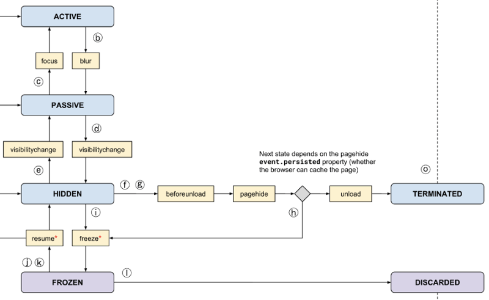

## 浏览器输入 URL 处理的过程

1. 从浏览器接收url到开启网络请求线程（这一部分可以展开浏览器的机制以及进程与线程之间的关系）
2. 开启网络线程到发出一个完整的http请求（这一部分涉及到dns查询，tcp/ip请求，五层因特网协议栈等知识）
3. 从服务器接收到请求到对应后台接收到请求（这一部分可能涉及到负载均衡，安全拦截以及后台内部的 处理等等）
4. 后台和前台的http交互（这一部分包括http头部、响应码、报文结构、cookie等知识，可以提下静态资源的cookie优化，以及编码解码，如gzip压缩等）
5. 单独拎出来的缓存问题，http的缓存（这部分包括http缓存头部，etag，catch-control等）
6. 浏览器接收到http数据包后的解析流程（解析html-词法分析然后解析成dom树、解析css生成css规则树、合并成render树，然后layout、painting渲染、复合图层的合成、GPU绘制、外链资源的处理、loaded和domcontentloaded等）
7. CSS的可视化格式模型（元素的渲染规则，如包含块，控制框，BFC，IFC等概念）
8. JS引擎解析过程（JS的解释阶段，预处理阶段，执行阶段生成执行上下文，VO，作用域链、回收机制等等）
9. 其它（可以拓展不同的知识模块，如跨域，web安全，hybrid模式等等内容）

### 详细过程

浏览器是多进程的,有主进程/渲染进程/GPU进程/插件进程等, 打开新标签页后, 对应的开启一个渲染进程(也成为内核进程), 这个进程包括多个线程, 例如GUI/JS引擎/事件触发/定时器/网络请求线程.

输入URL后,首先解析URL, 得到例如http协议/域名, 浏览器需要将域名转化为ip, 通过DNS查询(浏览器缓存->本机缓存（host文件）-> 路由器缓存 ->本地DNS服务器   -> 根域名服务器  -> 顶级域名服务器  -> 权威域名服务器，逐层向上递归查询)得到ip, 然后开启一个新的网络请求线程（或者复用已有的tcp连接，看是否有keep-alive且未过期）, 发送http请求(属于应用层), 通过三次握手建立tcp连接(属于传输层), 再到网络层(IP,ARP)的ip寻址, 数据链路层封装成帧, 最后物理层传输。

后端一般会做负载均衡, 请求由反向代理服务器接收到, 并根据调度算法分配给集群中的服务器执行, 然后将响应发送给浏览器. 浏览器收到响应, 我们最先关注的一般是http报文中的状态行, 比如200ok, 304缓存未修改, 301/302重定向, 如果是重定向, 浏览器会重新解析新的url并发送新的http请求.

在这个浏览器发请求/服务器回响应的过程中会通过【缓存机制】来减轻服务器的压力。浏览器发请求前先检查缓存，如果缓存没有过期(Cache-control:max-age>0或者Expire没有过期)，不用再向服务器发请求，直接使用缓存中的页面，这是【强缓存命中情况】；如果缓存过期，则检查是否有服务器之前给的Etag或者Last-Modified，如果没有，就直接向服务器发送请求，这是【强缓存未命中+协商缓存未启用情况】；如果二者有一，就向服务器发送请求，在header中携带If-None-Match，值为Etag，或者携带If-Modified-Since，值为Last-Modified；如果二者皆有，优先使用Etag。服务器收到请求，检查当前Etag是否等于If-None-Match（或者当前Last-Modified是否小于等于If-Modified-Since），如果成立，说明缓存没有过期，回复304状态码；否则，缓存过期，回复200和最新页面数据。浏览器收到响应，检查状态码，如果是304缓存未修改，则再去缓存中取出页面复用；如果是200，就将响应中的数据存入缓存并使用，然后存储新的Etag（或者Last-Modified）供下次使用，这是【强缓存未命中+协商缓存启用情况】

浏览器拿到数据，开始解析并绘制页面。

首先解析HTML，构建**DOM树**。具体的转换过程：Bytes -> character（字符）-> token（分词）-> nodes（对象/节点）-> 关系（DOM（Document Object Model）树）

然后解析CSS，生成**CSS规则树**。具体的转换过程：Bytes → characters → tokens → nodes → CSSOM（CSS Object Model）

合并DOM树和CSSOM树，得到渲染树（render树）。渲染树和DOM树大部分是相对应的，一些不可见的DOM元素不会出现再渲染树中。这时会根据可视化模型决定一个 DOM 节点产生多少个“盒”。

接下来是**渲染**。根据渲染树，进行**布局**，主要定位坐标和大小，是否换行，各种position overflow z-index属性，这些计算主要是根据可视化模型规定的包含块（Containing box）、盒子模型（content、padding、border 和 margin）、FC格式化上下文（BFC、IFC）、定位方案（普通流、浮动、绝对定位）来进行布局；进行**绘制**，将图像分层绘制出来，主要依据是可视化模型中的 分层模型 决定了元素的 层叠上下文（利用 z-index、opacity、transform 等属性，计算出哪些元素在上，哪些在下）。

在渲染过程中，如果js动态修改了DOM或CSS，会导致回流（Layout/Reflow）或重绘（Repaint）。回流说明元素位置、大小、结构、内容变化，需要重新计算样式和渲染树。重绘说明元素只是外观改变，只需用新样式绘制这个元素。

回流的成本开销要高于重绘，而且一个节点的回流往往回导致子节点以及同级节点的回流， 所以优化方案中一般都包括，尽量避免回流。回流一定伴随着重绘，但重绘可以单独出现。

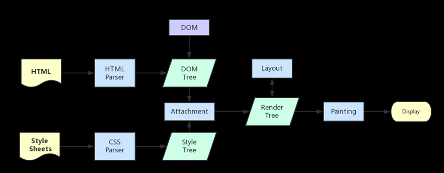

引起回流的情况：

- 页面初始化渲染
- DOM结构变化，例如删除、添加节点
- 渲染树变化，例如减少padding、改变字体大小
- 窗口resize
- 获取某些属性，例如offset、scroll、client、width、height、调用了getComputedStyle

减少回流的方法：

- 避免多次更改样式，最好一次性更改，例如添加class
- 避免多次循环操作DOM，将多个DOM操作预先应用在一个新创建的div上，再将它插入到DOM中
- 避免多次读取会引起回流的属性
- 将复杂的元素绝对定位或固定定位，使得它脱离文档流，否则回流代价会很高

解析HTML的过程中，可能需要下载一些资源，比如CSS、JS（遇到script标签）、多媒体（遇到img标签）。

- 下载CSS是异步的，不会阻塞DOM构建，可以在DOMContentLoaded事件后完成。但会阻塞渲染
- 下载JS一般会阻塞HTML解析和渲染，在DOMContentLoaded事件之前完成。
  - 但如果有defer或者async属性，可以异步下载JS。async是下载完后就执行，多个脚本执行顺序不定，可能在DOMContentLoaded事件前后，但一定在onload前完成；defer是下载完后，等到HTML解析完后再执行，通常在DOMContentLoaded事件前完成
  - 执行JS一定会阻塞HTML解析和渲染
- 下载图片是异步的，不会阻塞HTML解析

> Tips：DOMContentLoaded 事件触发时，仅当DOM加载完成；load 事件触发时，页面上所有样式表，脚本，图片等资源都已经加载完成

### 具体：JS如何解析并执行的

JS是解释性语言，无需提前编译，而是由解释器实时运行

核心：【代码】 ————词法分析————> 【词元（token）】————语法分析————> 【语法树】————翻译器————> 【字节码】 ————字节码解释器————> 【机器码】

为了提高运行速度，现代浏览器一般采用即时编译（JIT编译器-Just In Time compiler），即字节码只在运行时编译，用到哪一行就编译哪一行，并且把编译结果缓存（inline cache）

有的浏览器会省略字节码的翻译步骤，直接将语法树转为机器码（如chrome的v8）

在将代码交给解释器之前，会先进行一些预处理操作。

- 分号补全
- 变量提升：var、function

执行JS：首先创建全局执行上下文，并压入执行栈，每当扫描到其他作用域（例如函数），就创建新的执行上下文并压入栈，每次执行栈顶的上下文。执行上下文会保存变量对象（声明的变量、函数、参数）、作用域链（用于查找变量）、this。

JS无需手动回收内存，而是由垃圾处理器自动回收。常见策略：标记清除、引用计数

标记清除：首先当变量进入环境时（声明）会被标记，然后去掉环境中的变量或者被引用的变量身上的标记，最后去除掉依然还有标记的变量

引用计数：被引用+1，取消引用-1，为0时回收。

GC时会阻塞主进程，所以需要尽量减少每次GC阻塞的时间：分代回收，将变量分为新生代和老生代，每次多回收新生代，少回收老生代

## 浏览器/js的垃圾回收机制

垃圾回收：JavaScript 代码运行时，需要分配内存空间来储存变量和值。当变量不再参与运行时，就需要系统收回被占用的内存空间。 如果不及时清理，会造成系统卡顿、内存溢出，这就是垃圾回收。

常用算法：标记清楚、标记整理、引用计数

**标记清除算法**：主要分为标记、清除两个阶段：

- 标记：将所有的变量打上标记 0，然后从根节点(window 对象、DOM 树等)开始遍历，把存活的变量标记为 1
- 清除：清除标记为 0 的对象，释放内存。清除后将 1 的变量改为 0，等待下一轮回收。

标记清除算法的缺点：对⼀块内存多次执⾏标记清除算法后，会产⽣⼤量不连续的内存碎⽚。⽽碎⽚过多会导致⼤对象⽆法分配到⾜够的连续内存，于是⼜引⼊了另外⼀种算法——**标记整理算法**：

- 标记整理的标记过程仍然与标记清除算法⾥的是⼀样的，先标记可回收对象。
- 但清除步骤不是直接对可回收对象进⾏清理，⽽是让所有存活的对象都向内存的⼀端移动，然后直接清理掉这⼀端之外的内存。

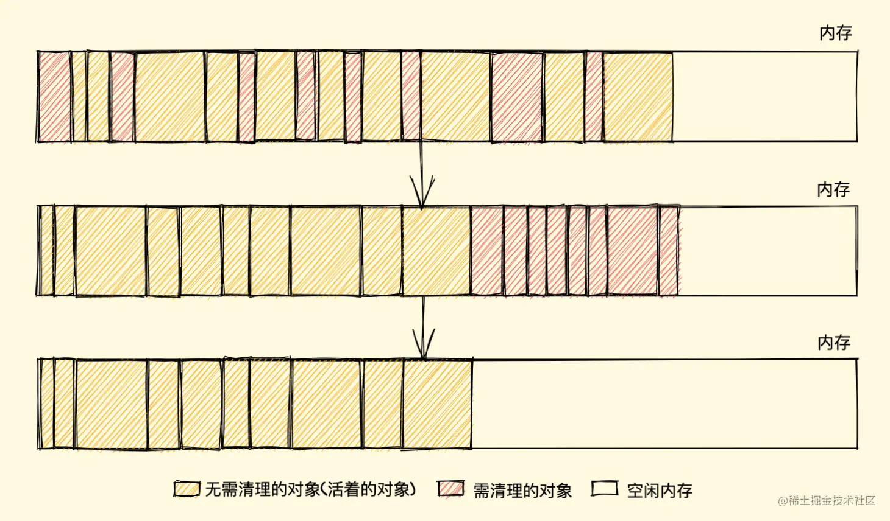

引用计数算法：（不常用）

- 一个对象被引用一次，引用数就+1，反之就-1。当引用为 0，就会触发垃圾回收。
- 这种算法会产生一个问题：**循环引用**
  - 即对象 A 和对象 B互相引用，引用数永远不会为 0，无法回收。

### V8对GC的优化——分代式垃圾回收机制

在 V8 中，会把堆分为新生代和老生代两个区域：

- 新生代中存放的是生存时间短的对象，内存占用比较小（`1～8M`）
- 老生代中存放生存时间久的对象，内存占用较大
- Minor GC(新生代垃圾回收器)：负责新生代垃圾的回收。
- Major GC(老生代垃圾回收器)：负责老生代垃圾的回收。

#### 新生代垃圾回收

大多数的对象最开始都会被分配在新生代，该存储空间相对较小，分为两个空间：from 空间（使用区）和 to 空间（空闲区）。

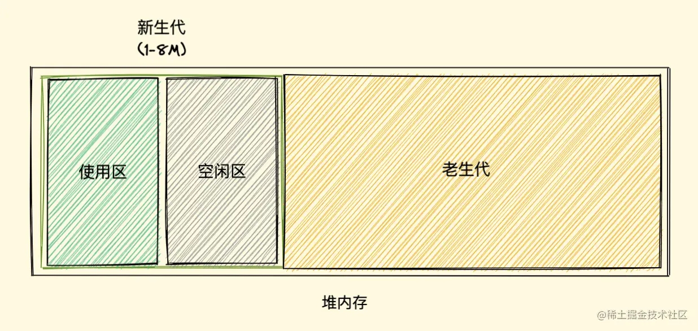

- 新加入的对象会存放到使用区，当使用区快被写满时，就需要执行一次垃圾清理操作
- 对使用区中的垃圾数据进行标记，标记完成后将存活的数据复制到空闲区中，把原来的空闲区变成使用区，使用区变为空闲区
- 当一个对象经过多次复制后依然存活，它将会被认为是生命周期较长的对象，随后会被移动到老生代中，采用老生代的垃圾回收策略进行管理
- 另外还有一种情况，如果复制一个对象到空闲区时，空闲区空间占用超过了 25%，那么这个对象会被直接晋升到老生代空间中，设置为 25% 的比例的原因是，当完成 `Scavenge` 回收后，空闲区将翻转成使用区，继续进行对象内存的分配，若占比过大，将会影响后续内存分配

#### 老生代垃圾回收

⽼⽣代存储一些占用空间大、存活时间长的数据，采用**标记整理算法**进行垃圾回收。

#### 垃圾回收策略

由于GC运行在主线程上，会导致应用逻辑停顿，所以要尽量减少停顿时间。

四种：并行回收、增量标记、惰性清理、并发回收

##### 并行回收

并行回收：开启多个辅助线程

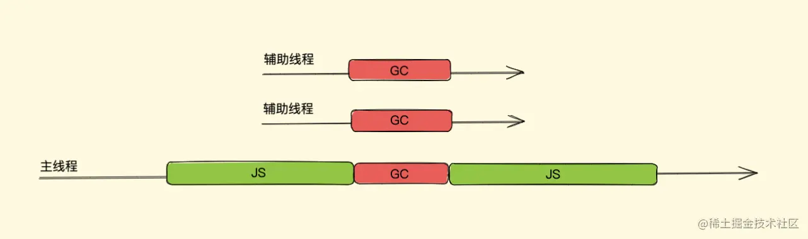

##### 增量标记

增量标记：将任务分为多个小任务，交替执行

- 存在问题：每一小次 `GC` 标记执行完之后，如何暂停下来去执行任务程序，而后又怎么恢复呢？执行任务程序时内存中标记好的对象引用关系被修改了又怎么办呢？
- 解决方法：三色标记法、写屏障

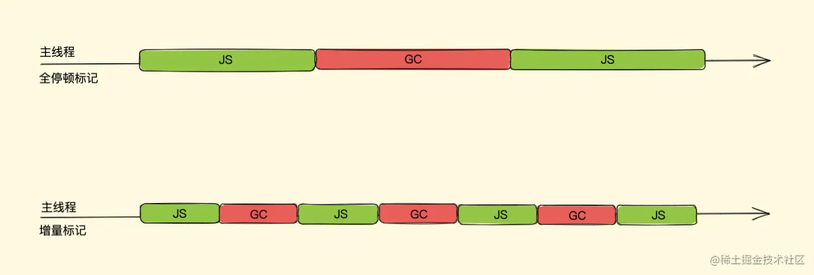

三色标记法即使用每个对象的两个标记位和一个标记工作表来实现标记，两个标记位编码三种颜色：白、灰、黑

- 白色指的是未被标记的对象
- 灰色指自身被标记，成员变量（该对象的引用对象）未被标记
- 黑色指自身和成员变量皆被标记

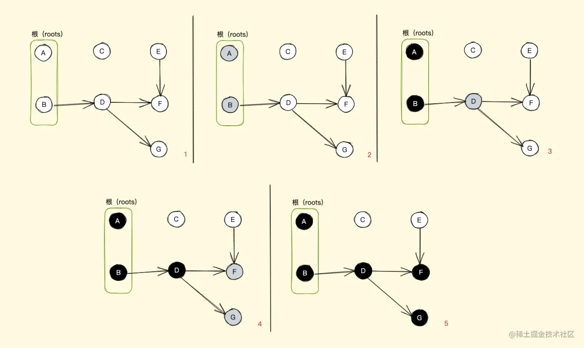

如上图所示，我们用最简单的表达方式来解释这一过程，最初所有的对象都是白色，意味着回收器没有标记它们，从一组根对象开始，先将这组根对象标记为灰色并推入到标记工作表中，当回收器从标记工作表中弹出对象并访问它的引用对象时，将其自身由灰色转变成黑色，并将自身的下一个引用对象转为灰色

就这样一直往下走，直到没有可标记灰色的对象时，也就是无可达（无引用到）的对象了，那么剩下的所有白色对象都是无法到达的，即等待回收（如上图中的 `C、E` 将要等待回收）

采用三色标记法后我们在恢复执行时就好办多了，可以直接通过当前内存中有没有灰色节点来判断整个标记是否完成，如没有灰色节点，直接进入清理阶段，如还有灰色标记，恢复时直接从灰色的节点开始继续执行就可以

三色标记法的 mark 操作可以渐进执行的而不需每次都扫描整个内存空间，可以很好的配合增量回收进行暂停恢复的一些操作，从而减少 `全停顿` 的时间

`写屏障 (Write-barrier)` 机制：一旦有黑色对象引用白色对象，该机制会强制将引用的白色对象改为灰色，从而保证下一次增量 `GC` 标记阶段可以正确标记，这个机制也被称作 `强三色不变性`

##### 惰性清理

增量标记完成后，惰性清理就开始了。当增量标记完成后，假如当前的可用内存足以让我们执行代码，其实我们是没必要立即清理内存的，可以将清理过程稍微延迟一下，让 `JavaScript` 脚本代码先执行，也无需一次性清理完所有非活动对象内存，可以按需逐一进行清理直到所有的非活动对象内存都清理完毕，后面再接着执行增量标记

增量标记和惰性清理的优缺点：

- 优点：减少主线程的停顿时间，让用户与浏览器交互的过程变得更加流畅。
- 缺点：总停顿会略微增加，降低应用程序的吞吐量

##### 并发回收

另外开启一个线程。需要锁来保护数据

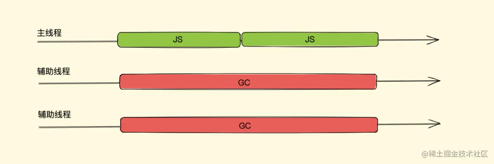

##### 老生代垃圾回收器的策略

- 老生代主要使用**并发标记**，主线程在开始执行 `JavaScript` 时，辅助线程也同时执行标记操作
- 标记完成之后，再执行**并行回收**操作
- 同时，清理的任务会采用**增量**的方式分批在各个 `JavaScript` 任务之间执行

## 哪些情况会导致内存泄漏

- 意外的全局变量：由于使用未声明的变量，而意外的创建了一个全局变量，而使这个变量一直留在内存中无法被回收。
- 被遗忘的计时器或回调函数：设置了 setInterval 定时器，而忘记取消它，如果循环函数有对外部变量的引用的话，那么这个变量会被一直留在内存中，而无法被回收。
- 脱离 DOM 的引用：获取一个 DOM 元素的引用，而后面这个元素被删除，由于一直保留了对这个元素的引用，所以它也无法被回收。
- 闭包：不合理的使用闭包，从而导致某些变量一直被留在内存当中。

## 进程和线程

- 进程（厂房）：程序的运行的环境
- 线程（工人）：线程是实际进行运算的东西

进程（Process）

进程是计算机中正在运行的程序的实例，一个进程就是一个程序运行实例。它拥有独立的内存空间、代码和数据，并且由操作系统负责调度和管理。每个进程在执行时都会分配独立的内存空间，不同进程之间的内存是隔离的，一个进程的错误不会直接影响其他进程。 进程之间通过进程间通信（IPC）机制来交换数据和进行通信，常见的 IPC 方式包括管道、消息队列、共享内存等。进程的切换开销较大，因为需要保存和恢复进程的完整状态，涉及到内存保护和虚拟内存的切换。

线程（Thread）

线程是进程的子任务，一个进程可以包含多个线程。它们共享相同的代码和数据，但拥有独立的执行栈和寄存器集合。多个线程可以在同一进程内并发执行，共享进程的资源，如内存空间、打开的文件等。线程间的通信和数据交换比进程间的通信更加方便，因为它们共享相同的地址空间。线程的切换开销较小，因为线程共享进程的地址空间，切换时不需要切换内存页表，速度较快。

区别

- 进程和线程都可以实现并发执行，但进程是独立的执行实体，而线程是依赖于进程的。
- 进程之间资源相互隔离，线程共享所属进程的资源。
- 创建和销毁线程的开销较小，而创建和销毁进程的开销较大。
- 多线程程序的编程复杂度通常比单线程程序高，但多线程可以更好地利用多核处理器来提高程序的执行效率。

## 浏览器有哪些进程

- 主进程：负责处理用户输入、渲染页面等主要任务。
- 渲染进程：渲染进程负责解析 HTML、CSS 和 JavaScript，并将网页渲染成可视化内容。
- GPU 进程：负责处理浏览器中的 GPU 加速任务。
- 网络线程：网络进程负责处理浏览器中的网络请求和响应，包括下载网页和资源等。
- 插件进程：负责浏览器插件运行。

## http缓存机制

缓存是一种保存资源副本并在下次请求时直接使用该副本的技术，当 web 缓存发现请求的资源已经被存储，它会拦截请求，返回该资源的拷贝，而不会去源服务器重新下载。

HTTP缓存主要分强缓存和协商缓存（对比缓存）

- **强缓存**（200 from cache）：如果本地缓存未过期，浏览器直接读本地缓存，不会与服务器交互，状态码为 200。HTTP 相关头部 Cache-Control，Exipres（HTTP1.0）
- **协商缓存**（304）：每次请求需要让服务器判断一下资源是否更新过，从而决定浏览器是否使用缓存，如果是，则返回304；如果否，返回200，浏览器重新向服务器请求完整响应并缓存。HTTP 相关头部 ` Etag/If-None-Match` (优先级高)或者 `Last-Modified/If-Modified-Since`。

下图是同时开启了强缓存和协商缓存的http请求响应过程：响应头为 `cache-control: max-age=xxxx`（强缓存） + `Etag:'xxx'` 或者 `Last-Modified:xxx`（协商缓存）

大致流程：

```
1. 检查强缓存（Cache-Control / Expires）
   ├─ 命中 → 直接使用缓存（不请求服务器）
   └─ 未命中 → 进入第2步

2. 发起请求，携带协商缓存标识（If-Modified-Since / If-None-Match）

3. 服务器判断资源是否更新
   ├─ 未更新 → 返回 304 Not Modified（使用本地缓存）
   └─ 已更新 → 返回 200 和新资源
```

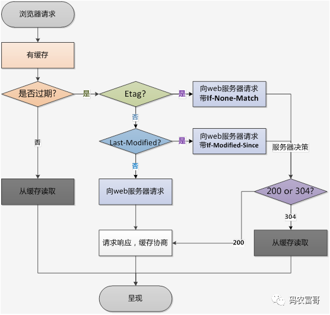

根据不同的场景，可以开启不同的缓存。

只使用协商缓存：可以使用 `Cache-Control: no-cache`，关闭强缓存而只使用协商缓存，即缓存过期时间为0（`Cache-Control: max-age=0`），**每次使用缓存前都必须向服务器验证** 。

只使用强缓存：如果缓存在有效期内，就永远不会发请求更新页面；当缓存过期后，发请求更新页面（全量下载）。

## 强制缓存和协商缓存的区别

区别：

- 优先级：强缓存 > 协商缓存
- 协商缓存不论命中与否都会发送一次请求
- 强缓存返回 200，协商缓存命中返回 304
- Ctrl+F5 会强制刷新会跳过所有缓存，而 F5 刷新跳过强缓存，但是会检查协商缓存。

### 强缓存

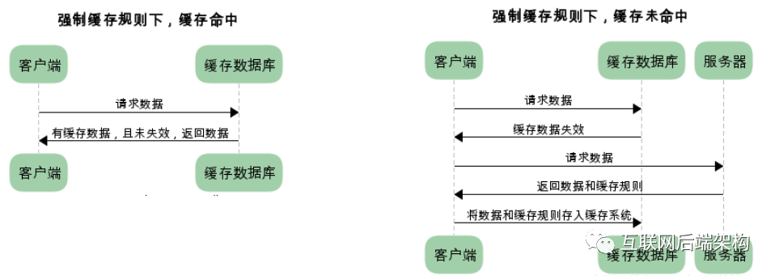

- 如果缓存资源有效，浏览器会从本地读取缓存资源并返回 200，不必再向服务器发起请求。
- 如果缓存资源失效，向服务器发起请求，获得返回的资源，同时存入缓存

强缓存策略可以通过两种方式来设置，分别是 http 头信息中的 Expires 属性和 Cache-Control 属性。

Expires 指定资源的过期时间。在过期时间以内，该资源可以被缓存使用，不需要向浏览器发送请求。这个时间依赖于服务器时间，可能会存在服务器时间和客户端时间不一致的问题。

Cache-Control 属性：

- private： 仅浏览器可以缓存
- public：浏览器和代理服务器都可以缓存
- max-age=xxx 过期时间，单位为秒
- no-cache 不进行强缓存，但会有协商缓存
- no-store 不强缓存，也不协商缓存

当两种方式一起使用时，Cache-Control 的优先级要高于 Expires。

### 协商缓存(对比缓存)

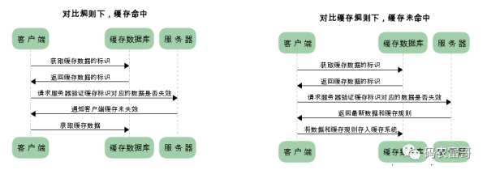

如果设置强缓存且缓存命中未过期，无需发起请求，直接使用缓存内容。如果没有命中强缓存，且设置了协商缓存，将会使用协商缓存。

命中协商缓存的条件：

- Cache-Control: no-cache，不进行强缓存
- 超过max-age，缓存过期

协商缓存机制：

- 浏览器*第一*次请求数据时，服务器会将缓存标识与数据一起返回给浏览器，浏览器将二者存储至缓存中。
- 当浏览器再次请求数据时，浏览器将备份的缓存标识发送给服务器，服务器根据缓存标识进行判断，判断成功后，返回304状态码，通知客户端比较成功，可以使用缓存数据。

对于协商缓存来说，响应 header 中会有两个字段来标明规则：Etag 属性和 Last-Modified 属性。ETag 优先级高于 Last-Modified。

1. Etag / If-None-Match

服务器响应请求时，通过在header中包含Etag（指纹，文件变了Etag就会变化）告诉浏览器当前资源在服务器的*唯一*标识（生成规则由服务器决定），浏览器再次请求时，就会带上一个头If-None-Match，这个值就是服务器上一次给的Etag的值，服务器比对一下资源当前的Etag是否跟If-None-Match一致，不一致则说明资源修改过了，浏览器不能再使用缓存，否则浏览器可以继续使用缓存，并返回304状态码。

2. Last-Modified / If-Modified-Since

服务器响应请求时，会告诉浏览器当前资源的*最后*修改时间：Last-Modified，浏览器之后再请求的时候，会带上一个头：If-Modified-Since，这个值就是服务器上一次给的 Last-Modified 的时间，服务器会比对资源当前*最后*的修改时间，如果大于If-Modified-Since，则说明资源修改过了，浏览器不能再使用缓存，否则浏览器可以继续使用缓存，并返回304状态码。

这种方式有个缺点，Last-Modified 标记的时间只能精确到 1 秒，如果文件在 1 秒内修改，但是 Last-Modified 却没有改变，这样会造成缓存命中的不准确。而文件变了Etag就会变化，比较准确，所以服务器优先检查Etag。

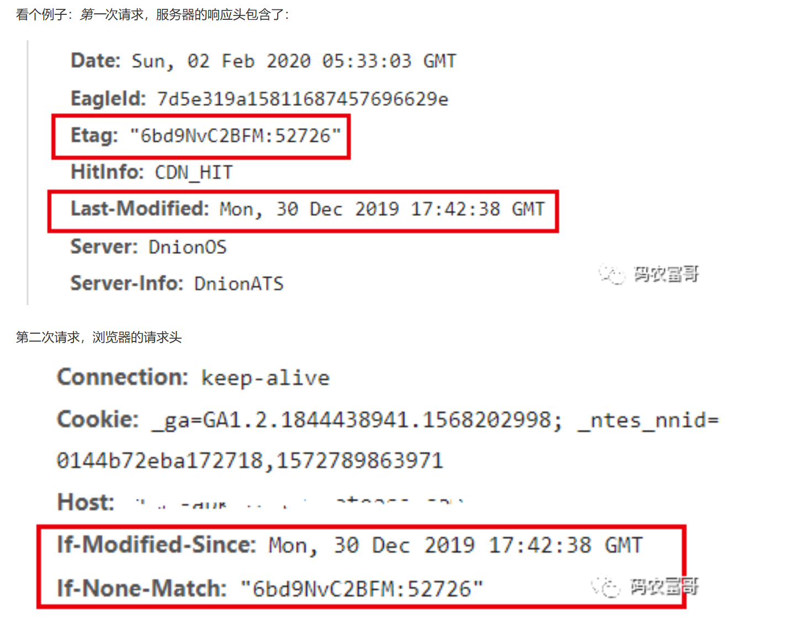

## 为什么需要浏览器缓存？

使用浏览器缓存，有以下优点：

- 减少了服务器的负担，提高了网站的性能
- 加快了客户端网页的加载速度
- 减少了多余网络数据传输

## 浏览器的渲染过程

- 加载页面的 html、css
- html 转换为 DOM 树，css 转换为 CSSOM 规则树
- 将 DOM 和 CSSOM 合并构建成一棵渲染树
- 对渲染树进行 reflow（回流/重排），即，计算元素的位置
- 对网页进行绘制 repaint（重绘）：根据计算好的位置将内容渲染到屏幕上

## 浏览器渲染优化

- 优化 javaScript，JavaScript 会阻塞 HTML 的解析，改变 JavaScrip 加载方式。
  - 将 JavaScript 放到 body 最后面
  - 尽量使用异步加载 JS 资源，这样不会阻塞 DOM 解析，如 defer、async
- 优化 CSS 加载，
  - CSS 样式少，使用内嵌样式
  - 导入外部样式使用 link，而不是@import，因为它会阻塞渲染。
- 减少回流重绘
  - 避免频繁操作样式
  - 避免频繁操作 DOM
  - 复杂动画使用定位脱离文当流
  - 使用 transform 替代动画

## 浏览器有哪些缓存？cookie、localStorage、sessionStorage的区别是什么？

**cookie**适合存储需要在多个页面和服务器之间共享的数据，**localStorage**适合长期存储不频繁修改的数据，而**sessionStorage**适合存储一次会话所需的临时数据。

Cookie：

- 大小只有 4kb
- 跨域不能共享
- 不安全，易被劫持
- 只存在请求头中

SessionStorage：

- 体积相对较大，存储在内存中
- 页面关闭，数据就会消失
- 较 cookie 安全

LocalStorage

- 体积最大，存储在硬盘中
- 生命周期长，只能手动删除
- 安全性高

共同点：都是保存在浏览器端

区别

- 1）cookie数据始终在同源的http请求中携带（即使不需要），即cookie在浏览器和服务器间来回传递；存储大小限制也不同，cookie数据不能超过4k，同时因为每次http请求都会携带cookie，所以cookie只适合保存很小的数据，如会话标识。
  - 而sessionStorage和localStorage不会自动把数据发给服务器，仅在本地保存
  - sessionStorage和localStorage 虽然也有存储大小的限制，但比cookie大得多，可以达到5M或更大。
- 2） 数据有效期不同:
  - sessionStorage：仅在当前浏览器窗口关闭前有效，自然也就不可能持久保持；
  - localStorage：始终有效，窗口或浏览器关闭也一直保存，因此用作持久数据；
  - cookie只在设置的cookie过期时间之前一直有效，即使窗口或浏览器关闭。
- 3）作用域不同:
  - sessionStorage不在不同的浏览器窗口中共享，即使是同一个页面；
  - localStorage 在所有同源窗口中都是共享的；
  - cookie也是在所有同源窗口中都是共享的。

### session和cookie有什么区别 ？

session是存储服务器端，cookie是存储在客户端，所以session的安全性比cookie高。

获取session里的信息是通过存放在会话cookie里的session id获取的。而session是存放在服务器的内存中里，所以session里的数据不断增加会造成服务器的负担，所以会把很重要的信息存储在session中，而把一些次要东西存储在客户端的cookie里。

session的信息是通过sessionid获取的，而sessionid是存放在会话cookie当中的，当浏览器关闭的时候会话cookie消失，所以sessionid也就消失了，但是session的信息还存在服务器端

### 怎么给localStorage设置值，和获取值 ？

设置值：`localStorage.setItem(键，值)`
获取值：`localStorage.getItem(键)`

## CDN 及其原理

CDN(content delivery netword)内容分发网络，依靠部署在各地的**边缘服务器**，通过中心平台的**负载均衡、内容分发、调度**等功能模块，使用户就近获取所需内容，降低网络拥塞，提高用户访问响应速度和命中率。CDN的关键技术主要有**内容存储和分发技术**。

CDN通常用于加速媒体等静态文件。

CDN实现加速：将CDN节点分布在各地，当用户发送请求到达服务器时，服务器会根据用户的区域信息，为用户分配**最近**的CDN服务器。

CDN服务器可以在用户请求后缓存文件，也可以主动抓取主服务器内容。

**CDN优点**

- 远程加速：远程访问用户根据**DNS**负载均衡技术智能自动选择Cache服务器，选择最快的Cache服务器，加快远程访问的速度。
- 缓解源服务器压力：CDN可以实现远程镜像Cache服务器，远程用户访问时可以直接从Cache上读取数据，这样不仅可以减少服务器本身流量的消耗，对带宽不会有很多的压力。
- 带宽优化：自动生成服务器的远程Mirror（镜像）cache服务器，远程用户访问时从cache服务器上读取数据，减少远程访问的带宽、分担网络流量、减轻原站点WEB服务器负载等功能。
- 镜像服务：消除了不同运营商之间互联的瓶颈造成的影响，实现了跨运营商的[网络加速](https://cloud.tencent.com/product/ecdn?from_column=20065&from=20065)，保证不同网络中的用户都能得到良好的访问质量。镜像功能可以解决不同运营商之间无法互通的问题
- 本地Cache加速：提高了企业站点（尤其含有大量图片和静态页面站点）的访问速度，并大大提高以上性质站点的稳定性。
- 集群抗攻击：广泛分布的CDN节点加上节点之间的智能冗余机制，可以有效地预防黑客入侵以及降低各种D.D.o.S攻击对网站的影响，同时保证较好的服务质量 。
- 安全性：由于不同的访客访问的是不同的**缓存服务器**中的内容，所以隐藏了源服务器的真实IP，使源服务器不容易收到攻击。

### CDN实现原理

未使用CDN：

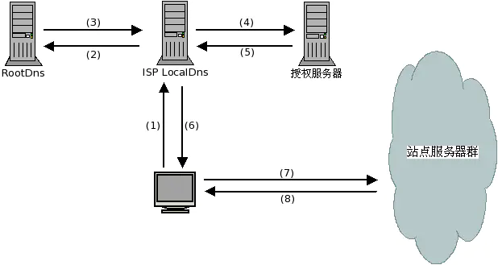

1.用户输入访问的域名,操作系统向 Local DNS 查询域名的ip地址.
2.Local DNS 向 ROOT DNS 查询域名的授权服务器(这里假设LocalDns缓存过期)
3.ROOT DNS将域名授权dns记录回应给 Local DNS
4.Local DNS 得到域名的授权dns记录后,继续向域名授权dns查询域名的ip地址5.域名授权dns 查询域名记录后，回应给 Local DNS
6.Local DNS 将得到的域名ip地址，回应给 用户端7.用户得到域名ip地址后，访问站点服务器8.站点服务器应答请求，将内容返回给客户端.

使用CDN：

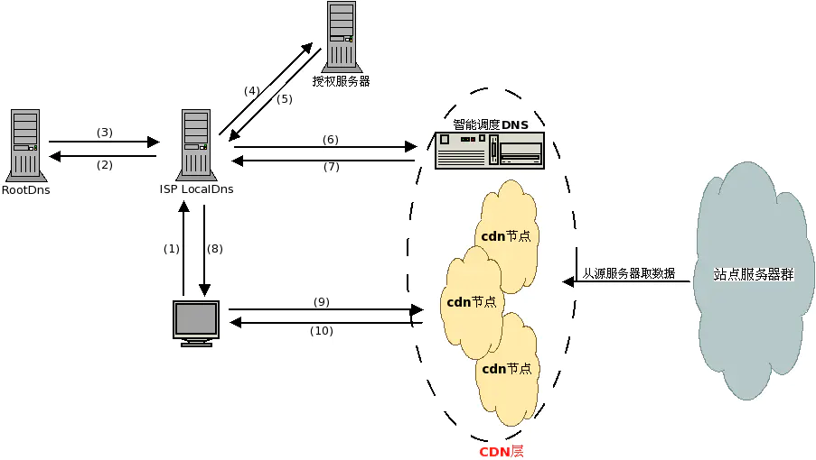

1.用户输入访问的域名,操作系统向 LocalDns 查询域名的ip地址.
2.LocalDns向 ROOT DNS 查询域名的授权服务器(这里假设LocalDns缓存过期)
3.ROOT DNS将域名授权dns记录回应给 LocalDns
4.LocalDns得到域名的授权dns记录后,继续向域名授权dns查询域名的ip地址5.域名授权dns 查询域名记录后(一般是CNAME)，回应给 LocalDns
6.LocalDns 得到域名记录后,向智能调度DNS查询域名的ip地址7.智能调度DNS 根据一定的算法和策略(比如静态拓扑，容量等),将最适合的CDN节点ip地址回应给 LocalDns
8.LocalDns 将得到的域名ip地址，回应给 用户端9.用户得到域名ip地址后，访问站点服务器
10.CDN节点服务器应答请求，将内容返回给客户端.(缓存服务器一方面在本地进行保存，以备以后使用，二方面把获取的数据返回给客户端，完成数据服务过程)

名词解释

**DNS**

DNS即Domain Name System，是域名解析服务的意思。它在互联网的作用是：把域名转换成为网络可以识别的ip地址。人们习惯记忆域名，但机器间互相只认IP地址，域名与IP地址之间是一一对应的，它们之间的转换工作称为域名解析，域名解析需要由专门的域名解析服务器来完成，整个过程是自动进行的。比如：上网时输入的[www.baidu.com](https://cloud.tencent.com/developer/article/www.baidu.com?from_column=20421&from=20421)会自动转换成为220.181.112.143。 常见的DNS解析服务商有：阿里云解析，万网解析，DNSPod，新网解析，Route53（AWS），Dyn，Cloudflare等。

**CNAME记录（CNAME record）**

CNAME即别名( Canonical Name )；可以用来把一个域名解析到另一个域名，当 DNS 系统在查询 CNAME 左面的名称的时候，都会转向 CNAME 右面的名称再进行查询，一直追踪到最后的 PTR 或 A 名称，成功查询后才会做出回应，否则失败。 例如，你有一台服务器上存放了很多资料，你使用docs.example.com去访问这些资源，但又希望通过documents.example.com也能访问到这些资源，那么你就可以在您的DNS解析服务商添加一条CNAME记录，将documents.example.com指向docs.example.com，添加该条CNAME记录后，所有访问documents.example.com的请求都会被转到docs.example.com，获得相同的内容。

**CNAME域名**

接入CDN时，在CDN提供商控制台添加完加速域名后，您会得到一个CDN给您分配的CNAME域名， 您需要在您的DNS解析服务商添加CNAME记录，将自己的加速域名指向这个CNAME域名，这样该域名所有的请求才会都将转向CDN的节点，达到加速效果。

**回源host**

回源host：回源host决定回源请求访问到源站上的具体某个站点。

```javascript
例子1：源站是域名源站为www.a.com,回源host为www.b.com,那么实际回源是请求到www.a.com解析到的IP,对应的主机上的站点www.b.com

例子2：源站是IP源站为1.1.1.1, 回源host为www.b.com,那么实际回源的是1.1.1.1对应的主机上的站点www.b.com
```

**协议回源**

指回源时使用的协议和客户端访问资源时的协议保持一致，即如果客户端使用 HTTPS 方式请求资源，当CDN节点上未缓存该资源时，节点会使用相同的 HTTPS 方式回源获取资源；同理如果客户端使用 HTTP 协议的请求，CDN节点回源时也使用HTTP协议。

## http 各版本的改进都是什么？HTTP 1.0 1.1 2.0 3.0

HTTP协议到目前为止，所有的版本可以分为HTTP 0.9、1.0、1.1、2.0、和3.0，其中普遍应用的是HTTP 1.1版本，正在推进是HTTP 2.0版本，以及未来的HTTP 3.0版本。

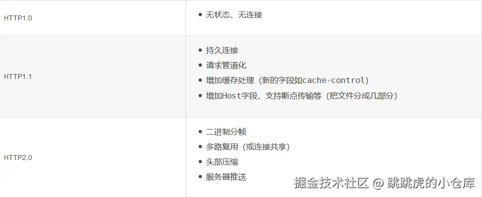

### HTTP1.0

**HTTP1.0规定浏览器和服务器保持短连接，浏览器每次请求都需要与服务器建立一个TCP连接。HTTP1.0还规定下一个请求必须在前一个请求响应到达之后才能发送**，如果前一个请求的响应一直不到达，那么下一个请求就不发送，后面的请求就都阻塞了，所以HTTP1.0存在请求的队头阻塞。HTTP1.0还不支持断点续传，每次都会传送全部的页面和数据， 在只需要部分数据的情况下就会浪费多余带宽。

### HTTP1.1

HTTP 1.1解决了1.0版本存在的问题，它可以保持长连接，避免每次请求都要重复建立TCP连接，提高了网络的利用率。HTTP 1.1 可以使用管道传输，支持多个请求同时发送，但服务器还是按照顺序先回应前面的请求，再回应后面的请求，如果前面的回应特别慢，后面就会有许多请求排队等着处理。所以，HTTP 1.1 还是存在响应的队头阻塞问题。另外，HTTP 1.1已经可以断点续传。

### HTTP2.0

HTTP 2.0是HTTP协议的第一个主要修订版，它与前面的版本用于传递数据的方法有很大的差异。

HTTP2.0会压缩头部，如果同时有多个请求其头部一样或相似，那么协议会消除重复部分。

HTTP 2.0 将请求和响应消息编码为二进制，而不再使用之前的纯文本消息，增加了数据传输的效率。

HTTP 2.0可以在一个TCP连接中并发多个请求或回应，而不用按照顺序一一对应，从而彻底解决了HTTP层面队头阻塞的问题，大幅度提高了连接的利用率。

HTTP 2.0还在一定程度上改善了传统的请求应答工作模式，服务端不再是被动地响应，而是可以主动向客户端发送消息、推送额外的资源。

### HTTP3.0

HTTP 2.0虽然通过多个请求复用一个TCP连接解决了HTTP的队头阻塞 ，但是一旦发生丢包，就会阻塞住所有的HTTP请求，这就属于TCP层队头阻塞。为了解决这个问题，HTTP 3.0直接放弃使用TCP，将传输层协议改成UDP，但是因为UDP是不可靠传输，所以这就需要QUIC实现可靠机制。

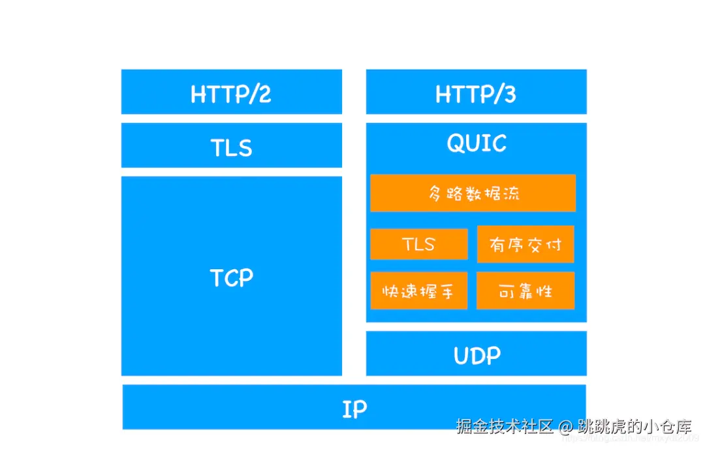

QUIC全称 “快速 UDP 互联网连接”，是由Google提出的使用UDP进行多路并发传输的协议。

QUIC 有自己的一套机制可以保证传输的可靠性的。当某一对请求响应发生丢包时，只会阻塞当前的请求响应，其他请求响应不会受到影响，因此完全不存在队头阻塞问题。

## 什么是跨域？为什么会出现跨域？如何解决跨域问题？

跨域：浏览器请求另一个url时，域名、端口、协议任意一个与当前url不同

跨域问题的出现，主要有两个原因：

- **同源策略**：同源指的是两个页面的域名、端口、协议都相同。它是浏览器最核心也最基本的安全功能，如果缺少了同源策略，浏览器很容易受到XSS、CSFR等攻击。
- 前后端分离开发：前端界面与后端API服务运行在不同的端口或域名下，导致AJAX请求跨域。

解决跨域问题的常见策略：

1. CORS：跨域资源共享
2. JSONP：利用 `<script>`标签不存在跨域限制
3. nginx 代理跨域，实质和CORS一样，通过配置文件设置请求响应头 `Access-Control-Allow-Origin...`等字段。

#### CORS

服务器开启跨域资源共享：在响应header添加 `Access-Control-Allow-Origin:`表示允许哪些客户端访问服务器

具体操作：

- 客户端请求：
  - 如果请求方法是GET、POST、HEAD，浏览器在请求头中添加Origin字段，说明本次请求来自哪个源（协议、域名、端口）。
  - 如果请求方法是PUT、DELETE，需要在正式通信前，添加一次HTTP查询请求（OPTIONS方法），称为"预检"请求（preflight），除了Origin字段外，还需在请求头中添加以下字段：
    - 1）`Access-Control-Request-Method`：必选，用来列出浏览器的CORS请求会用到哪些HTTP方法，上例是PUT。
    - 2）`Access-Control-Request-Headers`：可选，该字段是一个逗号分隔的字符串，指定浏览器CORS请求会额外发送的头信息字段。

- 服务器响应：服务器在header中添加 `Access-Control-Allow-Origin: <Origin字段的值 或者 *>`，表示许可本次请求。
  - 如果请求头中有 `Access-Control-Request-Method`、`Access-Control-Request-Headers`等字段，响应头也需包含这些字段，表示是否同意


## 网络攻击有哪些？如何防御

- 注入攻击
  - XSS 跨站脚本攻击
  - SQL注入
- CSRF（跨站请求伪造）
- DDOS 分布式拒绝服务
- 中间人攻击

### 注入攻击

在输入框中加入攻击代码，来获取信息、执行操作等

#### XSS（Cross-Site Scripting） 跨站脚本攻击

攻击者在网站上注入恶意脚本（例如JavaScript），获取 cookie、session token，或者其他敏感的网站信息，或者让恶意脚本重写 HTML 内容。

预防措施：不要信任用户输入

- 输入过滤：对所有用户输入进行过滤，不允许 `<script>、<iframe>`等潜在危险的 HTML 标签被输入。
- 输出编码：在将用户输入的数据输出到页面时，进行 HTML 编码，将<、>等字符转换成 HTML 实体。
- 使用 HTTP-only Cookies：设置 HTTP-only 标志，使得 Cookie 不能通过客户端脚本访问。
- 内容安全策略（CSP）：通过 CSP 这一安全层，控制资源加载和数据流出，来减少 XSS 攻击的机会。例如，设置页面可以加载任意来源的图片资源，页面上的 `<form>` 提交请求，只能发送到开发者指定的服务器地址
- 使用安全的框架和库：现代 Web 框架和库通常提供了自动的 XSS 防护。
- 避免直接内联 JavaScript：尽量避免在 HTML 中直接内联 JavaScript 代码，使用外部 JavaScript 文件可以更容易地管理权限和内容。

#### SQL注入

在 SQL 语句中注入恶意代码，以获取敏感数据或者篡改数据。例如 `OR 1=1`

预防措施：

- 入参强校验：服务后端对所有接收到的请求参数进行参数强校验，严格限时入参的长度、格式、是否是否包含非法字符。
- 参数化查询：使用参数化查询和预编译语句而不是字符串连接来提高应用程序的安全性。
- 限制数据库和表访问：开发者尽可能为数据库用户分配最小的用户权限。

### CSRF（跨站请求伪造）

CSRF(cross site request forgery) 攻击：服务器无法区分正常请求和攻击请求，因为攻击者发送请求时携带了用户点击恶意链接所包含的 token 信息

CSRF 攻击的本质是利用 cookie 会在同源请求中携带发送给服务器的特点，以此来冒充用户。

避免方式：

- 添加验证码验证
- 使用 token 验证
- 限制 cookie 不能作为被第三方使用
- 进行同源检测

### DDOS（distributed denial of service） 分布式拒绝服务

攻击者发送大量请求，使得服务器瘫痪（资源耗尽），无法响应正常用户的请求

例如：

- 应用层的DDoS攻击：发送大量http请求、发送大量DNS查询
- 传输层：利用TCP握手发送大量SYN或者ACK

防御：

- **过滤**：通过行为分析、指纹（Cookie）等区分正常和异常请求，用防火墙拦截
- **扩容**：扩容几倍或几十倍的带宽，抵消大流量的请求
- **限流**：限制服务器在某个时间段接收的请求数量
- **负载均衡**：在每个节点服务器配置多个IP地址（负载均衡），如一个节点受攻击无法提供服务，系统会自动切换到另一个节点，并将攻击者的数据包全部返回发送点，使攻击源成为瘫痪状态
- **CDN 内容分发网络**：
  - CDN 指的是网站的静态内容分发到多个服务器，用户就近访问，提高速度
  - 网站内容存放在源服务器，CDN 上面是内容的缓存。用户只允许访问 CDN，如果内容不在 CDN 上，CDN 再向源服务器发出请求。

### 中间人攻击

攻击者插入在通信双方之间，在不被察觉的情况下窃听、篡改或伪造数据。通信双方误以为在直接通信，实际数据经过了攻击者。

1. 客户端询问服务器的公钥。
2. 查询请求被中间人拦截，伪造了服务器的公钥，换成中间人的公钥，同时中间人也持有对应的私钥。
3. 之后客户端的一切通信，在中间人那里都会被中间人的私钥给解开内容，因为中间人通过替换的中间人公钥以及对应的中间人私钥解开了交互密码。

预防措施：证书验证

证书的原理相当于对网站下发的公钥做一次哈希校验，然后与本机预先存储的证书信息做验证，如果一致，说明对方的公钥是可信的。

这里，仍然有一个问题：本机预先存储——这个怎么来？这个时候，就需要“证书颁发机构”了。

证书颁发机构，本质上是一个收钱的机构，然后颁发一个可信的证书给网站，同时，操作系统厂商（Windows、Linux、MacOS）信任“证书颁发机构”颁发的证书，在浏览器或者操作系统里默认集成了这些机构的根证书，这样就保证了证书是可信可靠的。每个证书都是有有效期的，如果有网站恶意使用了证书，那么“证书颁发机构”就会吊销对应的证书，之后浏览器再访问这些网站的时候，如果网站证书校验不通过，那么浏览器地址栏里的小锁头就不见了，取而代之的是一个浏览警告
