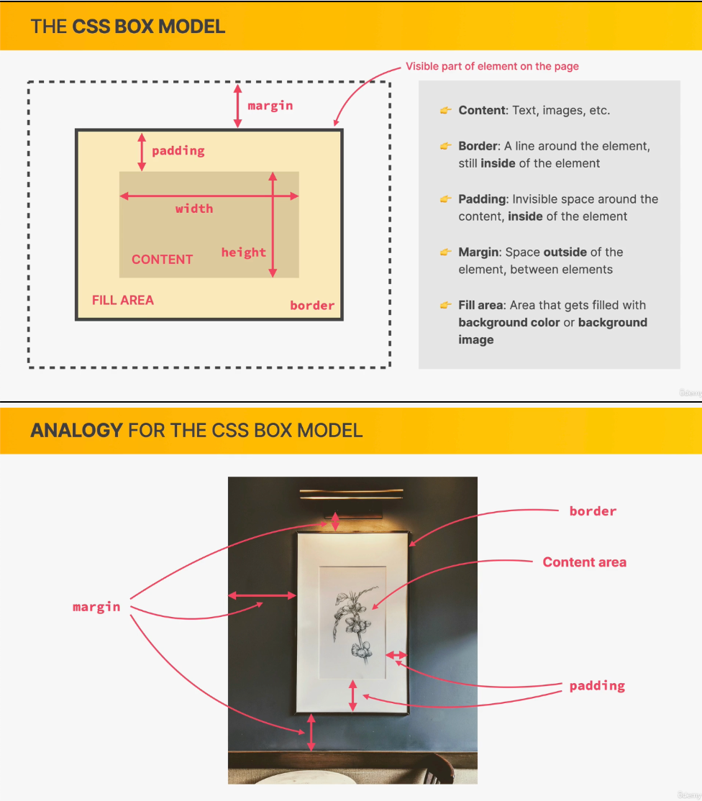
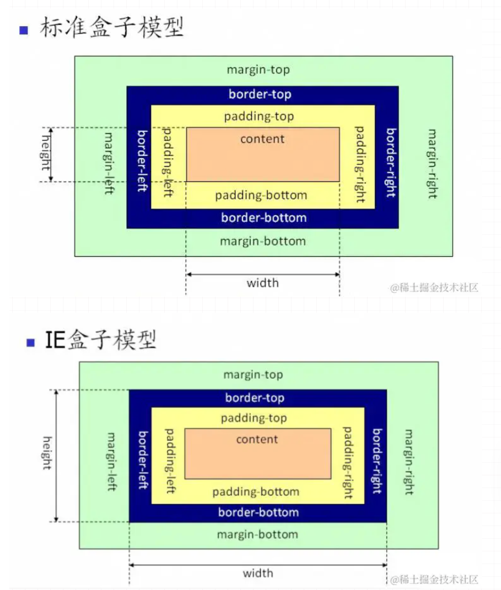

# HTML

## src 和 href 的区别

相同点：用于加载外部资源

区别：

- src：直接加载资源。当浏览器解析到该元素时，会阻塞其他资源的加载和处理，直到该资源加载完成。 它会将资源内容嵌入到当前标签所在的位置，将其指向的资源下载应用到文档内，如 js 脚本等。常用在 img、script、iframe 等标签。
- href：指向外部资源所在的位置，和当前元素位置建立链接，当浏览器解析到 href 时，会识别该文档为 css 文件，将其下载的时候不会阻塞其他资源的加载解析。常用在 a、link 标签。

## HTML5 新增特性

- 语义化标签，例如 header、footer、nav、main、section 等
- 表单(input)类型新增了一些元素和属性，例如 email、number、时间控件、color 颜色拾取器、placeholder、autofocus 自动获取焦点
- 音视频标签，video、audio，提供 control 属性用于添加播放、暂停和音量控件
- canvas 画布 元素：可以使用 js 在其中绘制图像
- Web Worker：可以通过加载一个脚本文件，进而创建一个独立工作的线程，在主线程之外运行
- websocket 通信：为 web 应用程序客户端和服务端之间提供了一种全双工通信机制
- WebStorage 本地存储 ：数据存储没有时间限制的 localStorage、关闭窗口会删除数据的 sessionStorage

HTML 语义化标签：

- 页面的内容结构化，可以使开发者更方便清晰地构建页面的布局，有利于代码可读性
- 方便浏览器爬虫更好的识别内容。

## Canvas 和 SVG 的区别

canvas 画布，是通过 javascript 来绘制 2d 图，是逐像素进行渲染。
SVG 矢量图，是基于 XML 描述的 2D 图形语言，每个元素都是可用的，可以为其添加事件。

## DOCTYPE(⽂档类型) 的作⽤

DOCTYPE 是 HTML5 中一种标准通用标记语言的文档类型声明，是用来告诉浏览器的解析器，该用什么方式去加载识别文档。

## iframe 有那些优点和缺点？

iframe 通常用来加载外部链接，不会影响网页内容的加载。

优点

- 可以将网页原封不动的加载进来
- 增加代码的可用性
- 用来加载显示较慢的内容，如广告、视频等

缺点

- 加载的内容无法被浏览器引擎识别，对 SEO 不友好
- 会阻塞 onload 事件加载
- 会产生很多页面，不利于管理

## script 标签中 defer 和 async 的区别

相同点：都是表示异步加载外部 JS 脚本，不会阻碍页面的加载解析。

区别：

- 执行顺序：有多个 async 标签不能保证先后加载顺序，而多个 defer 标签可以按先后顺序加载。
- 是否立即执行：async 加载完脚本后会立即执行，defer 是要等文档解析完成后才执行。

## 行内元素、块级元素、空（void）

- 行内： a、b、span、input、img、select、 strong
- 块：p、div、h1、ul、ol、li、dl、dt、dd
- 空：`<hr>`、`<br>`、``、`<input>`、`<link>`、`<meta>`

## 怎样添加、移除、移动、复制、创建和查找节点

- 添加节点 document.appendChild(dom)
- 移除节点 document.removeChild(dom)
- 移动节点 document.appendChild(targetDom)
- 复制节点 dom.cloneNode(true)，参数 true 表示是否复制子节点
- 创建节点 document.createElement(dom)
- 查找节点:
  - `document.getElementById("elementId")`
  - `document.getElementsByClassName("className")`
  - `document.getElementsByTagName("tagName")`
  - `document.querySelector("selector")`
  - `document.querySelectorAll("selector")`

## 伪类和伪元素的区别是什么？

- **伪类** ：以冒号(:)开头，用于选择处于特定**状态**的元素。例如 `:hover`, `:focus`, `:nth-child()`
- **伪元素** ：以双冒号(::)开头，表现得像是在文档中插入新的虚构的元素（浏览器自动创建）。例如 `::before`, `::after`, `::first-letter`

伪类使得你可以将处于特定状态的元素作为目标，就像你已向 DOM 添加了该状态的类一样。伪元素的作用就像是你已向 DOM 添加了全新的元素，并允许你为其设置样式。`::before` 和 `::after` 伪元素让你可以使用 CSS 将内容插入文档。

利用伪类实现鼠标悬停时变为红色：

```css
a:hover {
  color: red;
}
```

利用伪元素实现选取段落的第一字母并加大字号：

```css
p::first-letter {
  font-size: 20px;
}
```

利用伪元素插入一个图标：

```js
.box::after {
  content: " ➥";
}
```

# CSS

## CSS3 新增特性

- 新增 CSS 选择器、伪类
- 特效：text-shadow、box-shadow
- 线性渐变: gradient
- 旋转过渡：transform、transtion
- 动画: animation
- 圆角: border-radius

## 盒模型

对一个文档进行布局时，浏览器的渲染引擎会根据 CSS 基础盒模型，将所有元素表示为一个个矩形的盒子

盒模型由四个部分组成的，分别是 margin、border、padding 和 content。

- content：实际内容，文本、图像
- padding：内边距，透明，受盒子的 background 属性影响
- border：边框，可以设置粗细、样式、颜色
- margin：外边距，不能放元素

用挂在墙上的画来比喻，content 是画纸本身，padding 是画与画框之间的空白距离，border 是画框自身的宽度，margin 是画与墙上其他东西的距离



标准盒模型和 IE 盒模型的区别在于 width 和 height 对应的范围不同:

- 标准盒模型的 width、height 只包含 content
- IE 盒模型的的 width、height 除了 content 本身，还包含了 border、padding



box-sizing 属性定义了元素的盒模型：

- content-box 表示标准盒模型（默认值）
- border-box 表示 IE 盒模型，即 width、height 包含 border、padding
- inherit 表示继承父元素的 box-sizing 属性

## 选择器优先级

选择器有：后面的数字代表权重

- id 选择器 `#box` 100
- 类选择器 `.classname` 10
- 属性选择器 `div[class="foo"]` 10
- 伪类选择器 `div::last-child` 10
- 标签选择器 `div` 1
- 伪元素选择器 `div:after` 1
- 兄弟选择器 `div+span` 0
- 子选择器 `ul>li` 0
- 后代选择器 `div span` 0
- 通配符选择器 \* 0
- 群组选择器 `div p` 选择 div、p 的所有元素

CSS3 新增：

- 层次选择器 `p~ul`，选择前面有 p 元素的每个 ul 元素
- 更多伪类选择器
- 更多属性选择器

优先级：!important > 内联样式 > id > 类选择器/属性选择器/伪类选择器 > 标签选择器/伪元素选择器 > 关系选择器/通配符选择器

同级多个选最后一个生效。

## 计算优先级

到具体的计算层⾯，优先级是由 A 、B、C、D 的值来决定的，其中它们的值计算规则如下：

- 如果存在内联样式，那么 A = 1, 否则 A = 0
- B 的值等于 ID 选择器出现的次数
- C 的值等于 类选择器 和 属性选择器 和 伪类 出现的总次数
- D 的值等于 标签选择器 和 伪元素 出现的总次数

比较规则：

- 从左往右依次进行比较 ，较大者优先级更高
- 如果相等，则继续往右移动一位进行比较
- 如果 4 位全部相等，则后面的会覆盖前面的

## CSS 可继承属性和不可继承属性

可继承

- 字体系列属性：font-weight、font-size
- 文本系列属性：color、line-height
- 元素可见性：visibility
- 表格布局属性
- 列表属性
- 引用
- 光标属性：cursor

不可继承

- display
- margin、padding、border、width、height
- background
- overflow
- width、height
- position

## display 的属性和作用

- block
- inline
- inline-block
- table
- flex
- none
- inherit

## 隐藏元素的方式

- display：none：元素在文档中不存在，不会占据位置。
- visibility： hidden：元素在文档中的位置还保留，仍然占据空间。
- opacity：0：将透明度设置为 0。
- z-index：负值：直接将元素放置在最下层，利用其他元素来遮盖。
- position：absolute：将元素定位到可视区域以外。

## 单行、多行文本溢出

单行

```css
overflow: hidden; // 溢出隐藏
text-overflow: ellipsis; // 溢出用省略号显示
whtie-space: nowrap; //规定段落中的文本不进行换行
```

多行

```css
overflow:hidden
text-overflow: ellipsis;     // 溢出用省略号显示
display:-webkit-box;         // 作为弹性伸缩盒子模型显示。
-webkit-box-orient:vertical; // 设置伸缩盒子的子元素排列方式：从上到下垂直排列
-webkit-line-clamp:3;        // 显示的行数
```

## 有了使用过 Sass、Less 吗？他们的区别是什么？

相同点：

- 都是 CSS 预处理器，是 CSS 上的一种抽象层
- 可以编译成 CSS，增加了 CSS 代码的复用性
- 层级，mixin， 变量，循环， 函数等对编写以及开发 UI 组件都极为方便。

区别：

- 编译环境不一样：
  - Sass 是在服务端处理的，以前是 Ruby，现在是 Dart-Sass 或 Node-Sass
  - 而 Less 是需要引入 less.js 来处理 Less 代码输出 CSS 到浏览器，也可以在开发服务器将 Less 语法编译成 css 文件，
  - 输出 CSS 文件到生产包目录
- 变量符不一样，Less 是@，而 Scss 是$。
- Sass 支持条件语句，可以使用 if{}else{},for{}循环等等。而 Less 不支持

## link 和 @import 的区别

- link 是 HTML 提供的标签，不仅可以加载 CSS 文件，还可以定义 RSS、rel 连接属性等
- @import 是 CSS 提供等语法规则，只有导入样式表带作用。
- link 标签引入的 CSS 被同时加载，而 @import 引入的 CSS 将在页面加载完毕后被加载
- @import 是 CSS2.1 才有的语法，存在兼容性，而 link 作为 HTML 标签不存在兼容性问题

## 常见的 CSS 单位

- 绝对长度单位：cm、mm、in、px、pt、pc
- 相对长度单位：大小和元素的其他属性无关。em、ex、ch、rem、vw、vh、vmin、vmax、%
- px 像素

  - CSS 像素
  - 物理像素

- 百分比 %：作用于父元素，当浏览器的宽度或者高度发生变化时，当前元素依据比例发生变化
- em、rem：相对长度单位

  - em：相对于父元素
  - rem：相对于根元素

- vw、vh：与视图窗口有关的单位，代表视图窗口的宽高

## em/px/rem/vh/vw/% 区别

px：绝对单位，页面按精确像素展示

em：相对单位，相对于当前对象内文本的字体尺寸（font-size）。如当前对行内文本的字体尺寸未被人为设置，则相对于浏览器的默认字体尺寸，整个页面内 em 不是一个固定的值

rem：相对单位，相对根节点 html 字体的大小来计算

vh、vw：主要用于页面视口大小布局

- vw ，就是根据窗口的宽度，分成 100 等份，100vw 就表示满宽，50vw 就表示一半宽。（vw 始终是针对窗口的宽）
- 同理，vh 则为窗口的高度

%：相对于父元素

- 对于普通定位元素就是我们理解的父元素
- 对于 position: absolute 的元素是相对于已定位的父元素
- 对于 position: fixed 的元素是相对于 ViewPort（可视窗口）

## BFC、IFC 是什么

- BFC：块级布局（垂直）
- IFC：文本布局（水平）

BFC（Block Formatting Context），即块级格式化上下文，它是页面中的一块渲染区域，并且有一套属于自己的渲染规则：

- 同一个 BFC 内的两个相邻的盒子的 margin 会发生重叠，与方向无关
- BFC 就是页面上的一个隔离的独立容器，容器里面的子元素不会影响到外面的元素，反之亦然

BFC 目的是形成一个相对于外界完全独立的空间，让内部的子元素不会影响到外部的元素

触发 BFC 的条件包含不限于：

- 根元素，即 HTML 元素
- 浮动元素：float 值为 left、right
- overflow 值不为 visible，为 auto、scroll、hidden
- display 的值为 inline-block、inltable-cell、table-caption、table、inline-table、flex、inline-flex、grid、inline-grid
- position 的值为 absolute 或 fixed

应用场景：

- 防止 margin 重叠（塌陷）：
  - 对于相邻的两个元素，在其中一个元素外面包裹一层容器，并触发这个容器生成一个 BFC，这样两个 p 就不属于同一个 BFC，则不会出现 margin 重叠
- 清除内部浮动，解决父元素高度塌陷问题：
  - 在子元素设置浮动后，父元素会发生高度的塌陷，也就是父元素的高度为 0 解决这个问题，只需要将父元素变成一个 BFC（比如 overflow: hidden），父容器就能自动包住浮动元素。
- 实现自适应多栏布局：
  - 左边宽高固定，右边宽度自适应。防止下方元素飞到上方内容

IFC(inline formatting context)，即行内格式化上下文，用于排列 inline-level 元素。

在 IFC 中：

- 元素在 水平方向排列
- 形成 一行一行的 line box
- 内容超出时自动 换行
- 行高由 line-height 决定

触发 IFC 的条件：

- 块级容器内部包含行内元素

```html
<div>
  <span>text</span>
  <a>link</a>
  
</div>
```

## 浮动塌陷问题解决方法是什么？

浮动塌陷：子元素设置为 float 后，父元素高度变为 0。

产生原因：

- 设置为 float 后，子元素脱离标准流，不再占用实际空间，导致父元素计算高度时忽略了这个子元素，且父元素本身没有设置高度

解决方法：清除浮动

- 伪元素清除法：在父元素内部末尾插入一个隐藏块级元素。（推荐使用）

```css
.parent::after {
  content: "";
  display: block;
  clear: both;
  visibility: hidden;
  height: 0;
}
.parent {
  *zoom: 1; /* 兼容IE6/7 */
}
```

- 为父元素设置 `overflow: hidden`，触发 BFC，使得父元素在计算高度时也会包含 float 的子元素
- 为父元素设置 `overflow: auto`，同上一条，但内部宽高超过父级 div 时，会出现滚动条。
- 给父元素一个高度 height
- 父元素内部末尾插入一个空的 div 并设置 clear: both，清除浮动

## 实现两栏布局

- float
- flex
- position: absolute

1. float

- 将左边元素宽度设置为 200px，并且设置向左浮动(float left)
- 将右边元素的 margin-left 设置为 大于等于左边元素的宽度 200px，宽度设置为 auto（默认为 auto，占据 父元素 中剩余的所有可用空间）
- 为父级元素添加 BFC，防止下方元素飞到上方内容

```css
.box {
  height: 100px
  overflow: hidden; 添加BFC
}
.left {
  float: left
  width: 200px
}
.right{
  margin-left: 200px
  width: auto;
}
```

2. flex

- 父元素设置为 display flex
- 将左边元素设置为固定宽度
- 将右边的元素设置为 flex:1

```css
.box {
  display: flex;
}
.left {
  width: 100px;
}
.right {
  flex: 1; // 占据 .box 容器中剩余的所有可用空间。
}
```

3. 绝对定位

- 父元素设置为相对定位
- 左边元素设置为 absolute 定位，设置固定宽度
- 右边元素的 margin-left 的值设置为左边元素的宽度

```css
.box {
  position: relative;
  height: 100px;
}
.left {
  position: absolute;
  width: 200px;
  height: 100px;
}
.right {
  margin-left: 200px;
}
```

## 实现三栏布局

- 基于 float：两边使用 float，中间使用 margin
- 基于绝对定位、：两边使用 absolute，中间使用 margin
- 双层标签：两边使用 float 和负 margin
- display: table 实现
- flex 实现
- grid 网格布局

### 两边使用 float，中间使用 margin

- 左右两边固定宽度，中间宽度自适应。
- 利用中间元素的 margin 值控制两边的间距
- 宽度小于左右宽度之和时，右侧部分会被挤下去

缺陷：

- 主体内容是最后加载的。
- 右边在主体内容之前，如果是响应式设计，不能简单的换行展示

```css
.wrap {
    overflow: hidden; <!-- 生成BFC，计算高度时考虑浮动的元素 -->
    padding: 20px;
    height: 200px;
}
.left {
    width: 200px;
    height: 200px;
    float: left;
}
.right {
    width: 120px;
    height: 200px;
    float: right;
}
.middle {
    margin-left: 220px;
    height: 200px;
    margin-right: 140px;
}
```

### 两边使用 absolute，中间使用 margin

- 左右两边使用绝对定位，固定在两侧。
- 中间占满一行，但通过 margin 和左右两边留出 10px 的间隔

```css
.container {
  position: relative;
}

.left,
.right,
.main {
  height: 200px;
}

.left {
  position: absolute;
  top: 0;
  left: 0;
  width: 100px;
}

.right {
  position: absolute;
  top: 0;
  right: 0;
  width: 100px;
}

.main {
  margin: 0 110px;
}
```

### 两边使用 float 和负 margin

- 中间使用了双层标签，外层是浮动的，以便左中右能在同一行展示
- 左边使用负 margin-left:-100%：
  - .main-wrapper 占满整行（100%）
  - .left 本来应该排在 .main-wrapper 右边
  - 左边往左挪整个 main 的宽度，所以回到了最左边的位置
- 右边使用负 margin-left:-100px：
  - 相当于自身宽度，所以向上偏移到最右侧

```html
<style>
  .left,
  .right,
  .main {
    height: 200px;
  }

  .main-wrapper {
    float: left;
    width: 100%;
  }

  .main {
    margin: 0 110px;
  }

  .left,
  .right {
    float: left;
    width: 100px;
    margin-left: -100%;
  }

  .right {
    margin-left: -100px; /* 同自身宽度 */
  }
</style>

<div class="main-wrapper">
  <div class="main">中间自适应</div>
</div>
<div class="left">左边固定宽度</div>
<div class="right">右边固定宽度</div>
```

### display: table 实现

`<table>` 标签用于展示行列数据，不适合用于布局。但是可以使用 `display: table` 来实现布局的效果

- 层通过 `display: table` 设置为表格，设置 `table-layout: fixed` 表示列宽自身宽度决定，而不是自动计算。
- 内层的左中右通过 `display: table-cell` 设置为表格单元。
- 左右设置固定宽度，中间设置 width: 100% 填充剩下的宽度

```css
<style>
  .container {
    display: table;
    table-layout: fixed;
    width: 100%;
  }

  .left,
  .right,
  .main {
    display: table-cell;
  }

  .left,
  .right {
    width: 100px;
  }

  .main {
    width: 100%;
  }
</style>

<div class="container">
  <div class="left">左边固定宽度</div>
  <div class="main">中间自适应</div>
  <div class="right">右边固定宽度</div>
</div>
```

### flex 实现

利用 flex 弹性布局，可以简单实现中间自适应。

实现过程：

- 仅需将容器设置为 display:flex;，
- 盒内元素两端对其，将中间元素设置为 100%宽度，或者设为 flex:1，即可填充空白
- 盒内元素的高度撑开容器的高度

优点：

- 结构简单直观
- 可以结合 flex 的其他功能实现更多效果，例如使用 order 属性调整显示顺序，让主体内容优先加载，但展示在中间

```css
<style type="text/css">
    .wrap {
        display: flex;
        justify-content: space-between;
    }

    .left,
    .right,
    .middle {
        height: 100px;
    }

    .left {
        width: 200px;
        background: coral;
    }

    .right {
        width: 120px;
        background: lightblue;
    }

    .middle {
        background: #555;
        width: 100%;
        margin: 0 20px;
    }
</style>
<div class="wrap">
    <div class="left">左侧</div>
    <div class="middle">中间</div>
    <div class="right">右侧</div>
</div>
```

### grid 网格布局

- 将外部容器设置为 `display: grid`，并设置 `grid-template-columns`

```css
<style>
    .wrap {
        display: grid;
        width: 100%;
        grid-template-columns: 300px auto 300px;
    }

    .left,
    .right,
    .middle {
        height: 100px;
    }
</style>

<div class="wrap">
    <div class="left">左侧</div>
    <div class="middle">中间</div>
    <div class="right">右侧</div>
</div>
```

## 实现元素的水平垂直居中

根据元素标签的性质，可以分为：

- 内联元素居中布局：

  - 内联元素（如 `<span>, <a>, , <em>, <strong> `等）的特点是它们会排在一行，宽度由内容决定，并且不能设置 width 和 height。
  - 内联元素的居中布局，通常是通过设置它们的父级块级元素来实现的。

- 块级元素居中布局：

  - 块级元素（如 `<div>, <p>, <h1>, <ul>, <li>` 等）的特点是它们独占一行，默认宽度为父元素的 100%，并且可以设置 width 和 height。
  - 块级元素的居中布局，通常是通过设置左右外边距（margin）来实现

共有 6 种方法：

- 利用定位+margin:auto
- 利用定位+margin:负值
- 利用定位+transform
- table 布局
- flex 布局
- grid 布局

### 利用定位 + margin:auto

- 父元素设置为相对定位，子元素设置为绝对定位
- 子元素的四个定位属性设为 0，并设置 margin: auto

```html
<style>
  .father {
    position: relative;
  }
  .son {
    position: absolute;
    top: 0;
    left: 0;
    right: 0;
    bottom: 0;
    margin: auto;
  }
</style>
<div class="father">
  <div class="son"></div>
</div>
```

### 利用定位 + margin:负值

- 将子元素（.son）的左上角移动到父元素（.father）的中心点
- 利用负外边距(margin)将子元素自身 向左和向上 平移 子元素宽度和高度的一半
- 缺陷：
  - 必须知道子元素的精确尺寸（width 和 height）

```html
<style>
  .father {
    position: relative;
    width: 200px;
    height: 200px;
  }
  .son {
    position: absolute;
    top: 50%;
    left: 50%;
    margin-left: -50px;
    margin-top: -50px;
    width: 100px;
    height: 100px;
  }
</style>
```

### 利用定位 + transform

- 与负 margin 方法类似，只是将负 margin 替换为 translate(-50%, -50%)（将元素位移自身宽度和高度的-50%）

```html
<style>
  .father {
    position: relative;
    width: 200px;
    height: 200px;
    background: skyblue;
  }
  .son {
    position: absolute;
    top: 50%;
    left: 50%;
    transform: translate(-50%, -50%);
    width: 100px;
    height: 100px;
    background: red;
  }
</style>
```

### table 布局

- 设置父元素为 `display:table-cell`，子元素设置 `display: inline-block`
- 利用 vertical 和 text-align 让所有的行内块级元素水平垂直居中

```html
<style>
  .father {
    display: table-cell;
    width: 200px;
    height: 200px;
    vertical-align: middle;
    text-align: center;
  }
  .son {
    display: inline-block;
    width: 100px;
    height: 100px;
  }
</style>
```

### flex 布局

flex 布局的关键属性作用：

- display: flex：表示该容器内部的元素将按照 flex 进行布局
- align-items: center：表示这些元素将相对于本容器**水平居中**
- justify-content: center：表示这些元素将相对于本容器**垂直居中**

```html
<style>
  .father {
    display: flex;
    justify-content: center;
    align-items: center;
  }
  .son {
  }
</style>
```

### grid 布局

同 flex 布局。

```html
<style>
  .father {
    display: grid;
    align-items: center;
    justify-content: center;
  }
  .son {
  }
</style>
```

## 理解 flex 布局

flex 布局是 CSS3 新增的一种布局方式，能够根据不同屏幕尺寸的变化来自适应大小。

常用的属性：

- flex-direction 属性决定主轴的方向（即项目的排列方向）。
- flex-wrap 属性定义，如果一条轴线排不下，如何换行。
- flex-flow 属性是 flex-direction 属性和 flex-wrap 属性的简写形式，默认值为 row nowrap。
- justify-content 属性定义了项目在主轴上的对齐方式。
- align-items 属性定义项目在交叉轴上如何对齐。
- align-content 属性定义了多根轴线的对齐方式。如果项目只有一根轴线，该属性不起作用。

`flex: 1`是 `flex-grow、flex-shrink、flex-basis`的缩写，默认值是 `0 1 auto`。

`flex：1`也可写成 `flex： 1 1 auto`。

- flex-grow 定义项目发大比例，默认为 0，即存在剩余空间，也不放大。
- flex-shrink 定义项目收缩比例，默认为 1，即空间不足，也会进行缩小。
- flex-basis 定义项目给上面两个属性分配多余空间之前, 计算项目是否有多余空间, 默认值为 auto, 即项目本身的大小。

## 什么是 margin 重叠，如何解决

两个块级元素分别设置上下 margin 时可能会导致边距合并为一个边距，合并到边距取最大的那个值。需要注意的是，浮动的元素和绝对定位这种脱离文档流的元素的外边距不会折叠。重叠只会出现在垂直方向。

计算规则：

- 都是正数，取最大的。20px 40px ---> 40px
- 一正一负，取正值和负值的代数和。20px -50px ---> -30px
- 都是负数，取两个中绝对值大的那个。-30px -10px ---> -30px

解决方案：对于重叠的情况，主要有两种：兄弟之间重叠（margin 合并） 和 父子之间重叠（margin 塌陷）

兄弟之间重叠

- 底部元素变为行内盒子：display: inline-block
- 底部元素设置浮动：float
- 底部元素的 position 的值为 absolute/fixed

父子之间重叠

- 父元素加入：overflow: hidden
- 父元素添加透明边框：border:1px solid transparent
- 子元素变为行内盒子：display: inline-block
- 子元素加入浮动属性或定位

## position 常用属性 默认值是什么

- static 默认值，没有定位，元素正常在文档流中显示
- relative 相对定位，相对于原来的位置进行定位
- absolute 绝对定位，相对于 static 定位意外以外的一个父元素进行定位。
- fixed 绝对定位，相对于浏览器窗口
- sticky 粘性定位，基于用户滚动位置

## 实现一个三角形

通过设置不同方向边框来实现

```css
div {
  width: 0;
  height: 0;
  border-top: 50px solid red;
  border-right: 50px solid transparent;
  border-left: 50px solid transparent;
}
```

## 画一条 0.5px 的线

使用 transform: scale()的方式，该方法用来定义元素的 2D 缩放转换：

```css
transform: scale(0.5, 0.5);
```

## 如何解决 1px

1px 问题指的是：在一些 Retina 屏幕 的机型上，移动端页面的 1px 会变得很粗，呈现出不止 1px 的效果。原因很简单——CSS 中的 1px 并不能和移动设备上的 1px 划等号。

- 直接写 0.5px
- 利用伪元素，先放大再缩小
- 使用 viewport 缩放来解决
- 采用 meta viewport 的方式，这样就能缩放到原来的 0.5 倍，如果是 1px 那么就会变成 0.5px。viewport 只针对于移动端，只在移动端上才能看到效果。
