# linux

## 如果线上系统出现问题，你如何用 Linux 排查？

```zsh
tail -f log.log
grep ERROR log.log
```

## 进程

查看进程：

```
ps -ef
top
```

杀死所有进程名中包含‘abc’的进程：

```
kill -9 -f abc
```

`-9`：发送 `SIGKILL` 信号，强制杀死进程（如果进程卡死，这个最有效）。

`-f`：搜索整个命令行（不仅仅是进程名），这样可以匹配到带路径或带参数的进程。

## 基本命令

1. ls：列出该目录下的文件（list）
2. pwd：显示当前目录的绝对路径（Print Working Directory）
3. cd：切换目录（Change Directory）
4. cp：复制（Copy）
5. rcp：用于复制远程文件或目录。
6. scp：基于 ssh 登陆，进行安全的远程文件拷贝
7. mv：移动（Move）
8. rm：删除给定的文件（Remove）
9. mkdir：创建一个新目录（Make Directory）
10. rmdir：删除文件夹（Remove Directory）
11. cat：查看文件内容（concatenate and print files）
12. wc：计算字数（word count）
13. xargs：构建并执行命令行参数。

xargs 可以将管道或标准输入（stdin）数据转换成命令行参数，也能够从文件的输出中读取数据。由于很多命令不支持|管道来传递参数，而日常工作中有有这个必要，所以就有了 xargs 命令

14. top：实时显示进程信息

提供了一个动态的、交互式的实时视图，显示系统的整体性能信息以及正在运行的进程的相关信息。

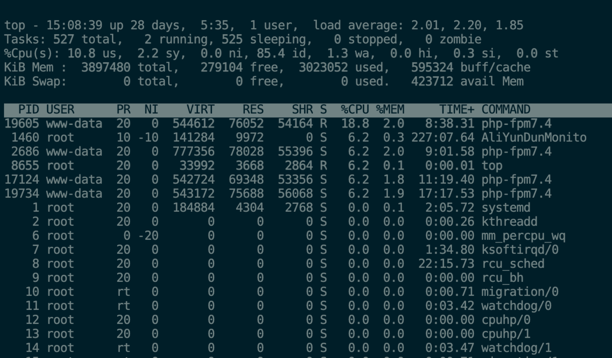

15. sed：利用脚本来处理文本文件
16. touch：修改文件时间戳

修改文件或者目录的时间属性，包括存取时间和更改时间。若文件不存在，系统会建立一个新的文件。

17. ps：显示当前进程的状态

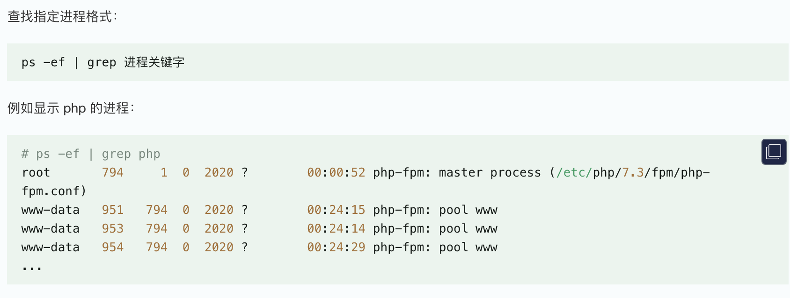

18. netstat：网络状态查看
19. free：显示内存的使用情况
20. ln：为某一个文件在另外一个位置建立一个同步的链接。

当我们需要在不同的目录，用到相同的文件时，我们不需要在每一个需要的目录下都放一个必须相同的文件，我们只要在某个固定的目录，放上该文件，然后在 其它的目录下用 ln 命令链接（link）它就可以，不必重复的占用磁盘空间。链接分为软和硬：

软链接：

- 1.软链接，以路径的形式存在。类似于 Windows 操作系统中的快捷方式（产生一个特殊的档案，该档案的内容是指向另一个档案的位置）
- 2.软链接可以 跨文件系统 ，硬链接不可以
- 3.软链接可以对一个不存在的文件名进行链接
- 4.软链接可以对目录进行链接

硬链接：

- 1.硬链接，以文件副本的形式存在。但不占用实际空间。
- 2.不允许给目录创建硬链接
- 3.硬链接只有在同一个文件系统中才能创建
- 4.一个档案可以有多个名称

21. su：切换用户身份
22. chmod：更改用户对文件的权限的命令

`chmod +rwx file` 给 file 的所有用户增加读写执行权限

23. jobs：查看和管理当前 shell 会话中后台任务的内置命令
24. vim

用户刚刚启动 vi/vim，便进入了命令模式。

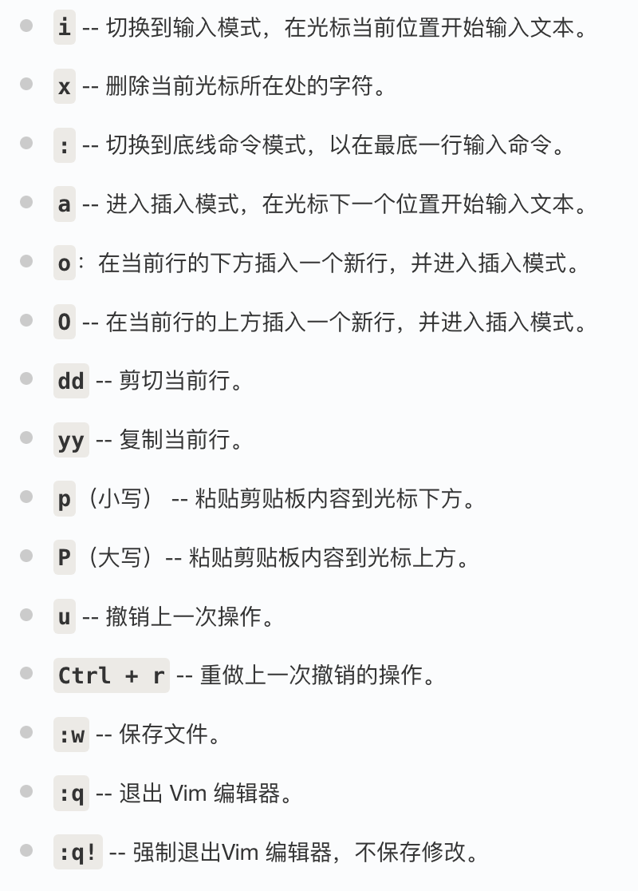

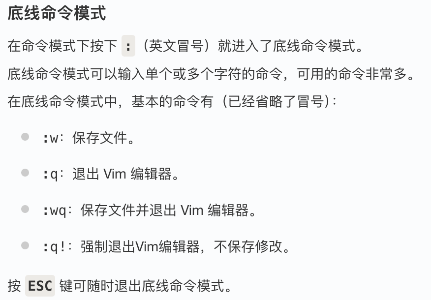

25. rename：批量重命名文件
26. history：查看历史命令
27. grep：文本搜索

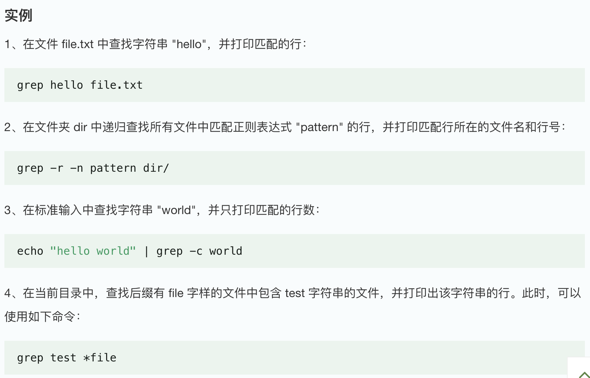

28. awk：文本处理与分析

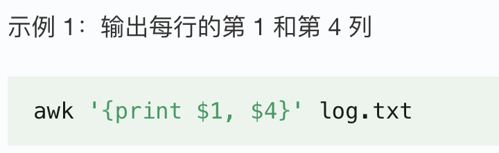

29. find：在指定目录下查找文件和目录

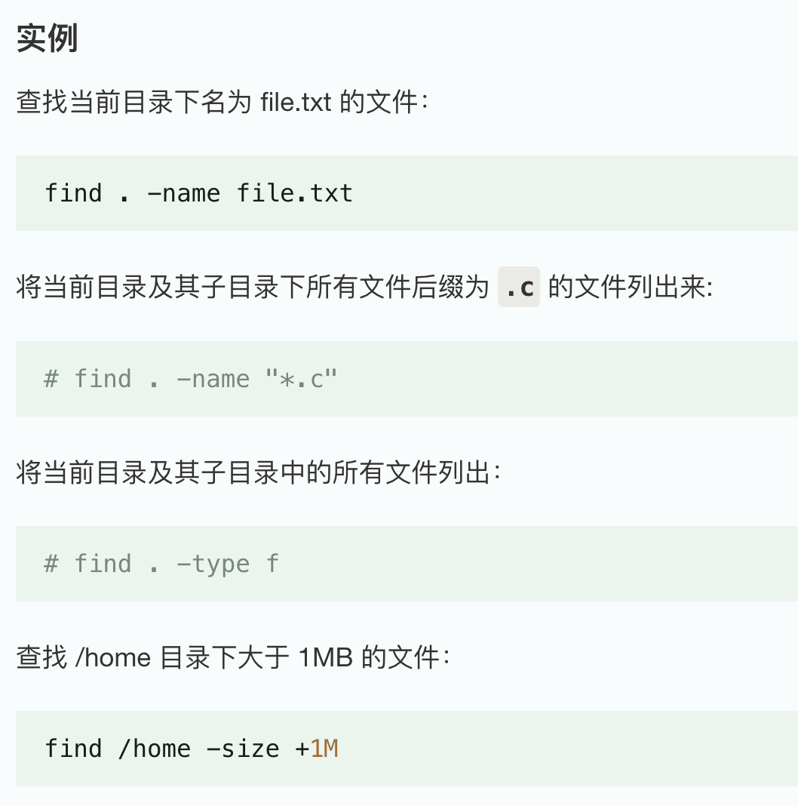

## 查看端口占用

查看服务器 8000 端口的占用情况：

```
lsof -i:8000
```

显示 tcp，udp 的端口和进程等相关情况：

```
netstat -tunlp | grep 8000
```

杀死进程：`kill -9 PID`

## 查看进程信息

列出与 本次登录系统 有关的进程信息

```
      ps
```

列出在内存中运行的全部进程信息

```
      ps  -aux
```

动态显示内存中的进程信息

```
      top
```

## 统计某个文件夹下.java 文件个数和代码总行数

以 src 文件夹 为例

```
find /src -type f -name "*.java" | wc -l // 统计 .java 文件个数
```

- find 递归查找
- -type f 只匹配文件
- -name "\*.java" 匹配 Java 文件
- wc -l 统计行数（也就是文件个数）

```
find /src -type f -name "*.java" -print0 | xargs -0 wc -l // 统计所有 .java 文件总行数
```

思路：

- find → 输出文件路径
- xargs → 把路径变成命令行参数
- wc → 根据参数自己打开文件读取内容

要点：

- find 查找所有 java 文件，用 NULL 字符（\0）作为分隔符输出文件名。（避免文件名包含空格、换行符、特殊字符会导致解析错误的情况）
- 使用管道把前一个命令的标准输出作为下一个命令的标准输入，数据流进入 xargs。
- xargs -0 表示使用 NULL 字符作为分隔符。
- 使用 wc 统计，-l 表示统计行数。

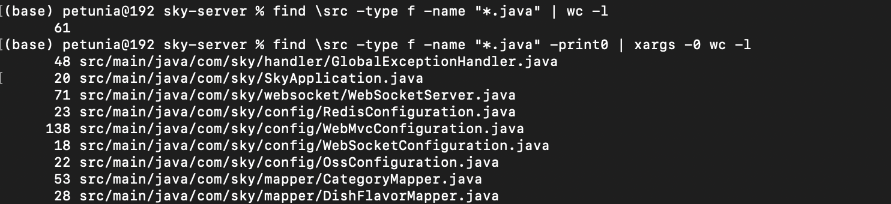

## 筛选出含指定字符串的文件，显示文件路径和含指定字符串行的内容

```
grep -r "test" ./src
```

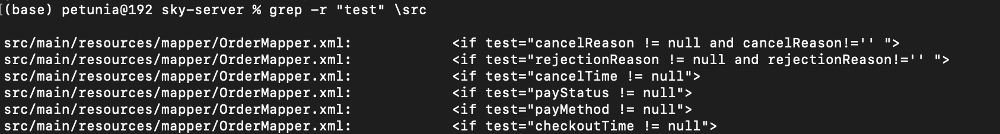

只查找 .java 文件，并加上行号：

```
grep -rn --include="*.java" "test"  ./src
```

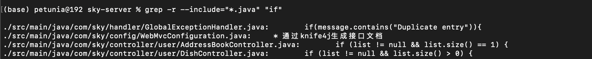

## 统计单个文件内包含某字符串的总行数

```
cat access.log | grep "01/May/2024:08"|wc -l
```

## 统计文件中出现次数最多的前 10 个单词

```
cat file | sort | uniq -c | sort -k1,1nr | head -10
```

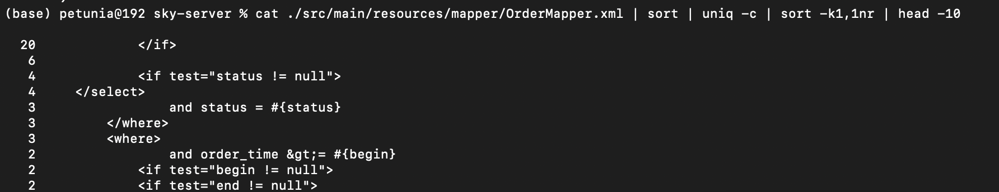

## linux 使用 rm 删除一个硬盘内的东西删除完了，发现还是有大量硬盘占有是怎么回事

真正释放磁盘空间的条件是：文件的 硬链接数为 0 且没有进程仍在占用

Linux 文件删除过程：

- 目录项删除
- inode 链接数减 1
- 如果链接数为 0 且没有进程打开，才释放数据块

如果文件已经被删除，虽然文件名没了，目录里看不到，但文件仍被进程打开，inode 仍然存在，数据块不会释放

这种情况出现的可能原因是，rm 没有真正删除文件，而只是：

- 删除了符号链接文件
- 删除了几个硬链接中的其中一个

例如：日志文件

- rm 删除日志文件后，文件目录项被删除，但进程仍持有文件描述符，内核不会释放数据块，空间仍被占用
- 进程关闭文件，或进程退出后，空间才会真正释放

可以使用 df 和 du 来查看空间占用情况：

- df -h：统计文件系统已分配的数据块，包括被进程占用但已删除的文件。
- du -sh：统计当前目录结构中的文件大小总和，不包括已删除但仍被占用的文件。
- 可能出现 df 很大，du 很小的情况

解决方法：

- 重启或 kill 进程，让进程释放文件描述符
