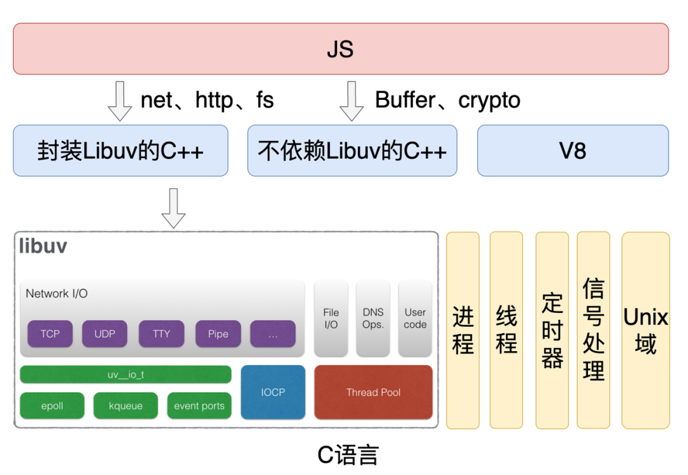

- 了解Node.js基本使用，可进行简单服务搭建、接口联调与开发调试

## 什么是node




node是一个运行时环境，用于运行js，提供了实现网络请求、文件读写等用于构建后端的API。

js代码不仅能在浏览器上运行，现在也能在node上运行。浏览器（这里用chrome做代表）和node都基于v8执行js代码。

浏览器和node提供一些了API。常用的有，浏览器 → 提供 Web API（DOM、BOM、Fetch）；Node.js → 提供 Node 核心 API（fs、http、path...）

node基于 V8 JavaScript 引擎。v8用 C++ 编写，是 JavaScript 虚拟机的一种，用于编译和执行js，处理对象的内存分配，进行垃圾回收。

可以用 Express.js 或 Koa.js 这类基于 Node.js 的 Web 应用框架，来快速、规范地构建**后端服务器**

## node的运行机制

1. V8解析js代码
2. 解析后的代码调用node api
3. libuv负责执行node api，将任务分配给不同的线程，形成一个eventloop，以异步的方式将任务执行结果返回给v8
4. v8将结果返回给用户

## Node.js 事件循环和浏览器有什么区别


浏览器环境下，microtask的任务队列是每个macrotask执行完之后执行。Node.js类似，一旦执行一个阶段里的一个宏任务(setTimeout,setInterval和setImmediate)就立刻执行微任务队列


## 如何搭建一个简单服务（Express）

```
mkdir my-express-app
cd my-express-app
npm init -y
npm install express
npm install -g express-generator
express myFirstExpressDemo
```

```
node app.js
```

```js
// 1. 引入 express 模块
const express = require("express");

// 2. 创建 express 实例
const app = express();

// 3. 定义端口号
const PORT = 3000;

// 4. 定义基础路由
// 当用户访问根目录时，返回 'Hello World!'
app.get("/", (req, res) => {
  console.log(req);

  res.send("<h1>你好！这是你的第一个 Express 服务。</h1>");
});

// 5. 监听端口
app.listen(PORT, () => {
  console.log(`服务器已启动，访问地址：http://localhost:${PORT}`);
});
```

## 负载均衡

- DNS：将域名解析到多个公网ip上，实现流量转发
- CDN：将静态资源缓存到全球节点，实现就近访问
- ngnix：将请求转发到多台node服务器上
- nodejs:
  - node内置的cluster模块：主进程监听端口，分发给worker
  - PM2：封装了cluster，增加了进程管理、监控、日志等功能

nginx的负载均衡算法：

```
轮询（Round Robin）    → 默认，请求均匀分配
权重（Weight）        → 按权重比例分配，适合机器配置不同
IP Hash             → 同一 IP 固定打到同一服务器，适合有状态服务
最少连接（least_conn）→ 优先分配给当前连接数最少的服务器，适合长连接
```


## 中间件机制是什么

*中间件是位于服务器接收到客户端请求与发送响应之间的函数*。在[Express](https://zhida.zhihu.com/search?content_id=263669830&content_type=Article&match_order=1&q=Express&zhida_source=entity)中，中间件是一种处理HTTP请求和响应的函数。它在请求到达路由处理器之前执行，可以执行任何操作，如修改请求和响应对象、结束响应过程、调用栈中的下一个中间件函数等。

通过use来注册中间件，中间件按注册顺序执行。

```
// 全局中间件
app.use((req, res, next) => {
  console.log('A request has been made!');
  next();
});

// 路由中间件
app.use('/api', (req, res, next) => {
  console.log('Request made to /api');
  next();
});
```

主要用途

- **日志记录：** 记录请求时间和类型。
- **身份验证：** 验证用户Token（如Auth中间件）。
- **数据解析：** 解析前端传来的JSON或form-data数据。
- **错误处理：** 集中捕获和处理整个流程中的异常。
- **静态文件服务：** 提供静态图片、CSS、JS文件

## 如何处理跨域

配置代理：将前端请求转发到后端接口

使用CORS中间件

手动设置响应头：`Access-Control-Allow-Origin`、`Access-Control-Allow-Headers`。。。


## 是否写过接口 如何做参数校验

结合第三方校验库来执行高效的校验

参数校验通常包含以下几个步骤：

1. **定义规则 (Define Schema)：** 明确必填项、类型（string, number, array）、格式（email, URL, RegExp）和范围（min, max, enum）。
2. **执行校验 (Execute Validation)：** 在请求进入 Controller 控制器逻辑前进行校验。
3. **处理错误 (Handle Error)：** 如果校验失败，终止请求并返回明确的错误信息 (例如 `400 Bad Request`)。 


## 如何做日志、错误处理

定义错误处理中间件 `(err, req, res, next) => { ... }`，集中处理所有路由中的错误

*使用winston日志库实现多级日志记录*
