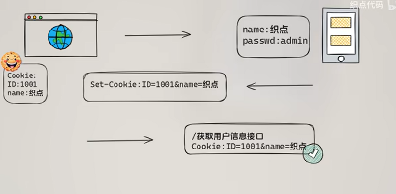
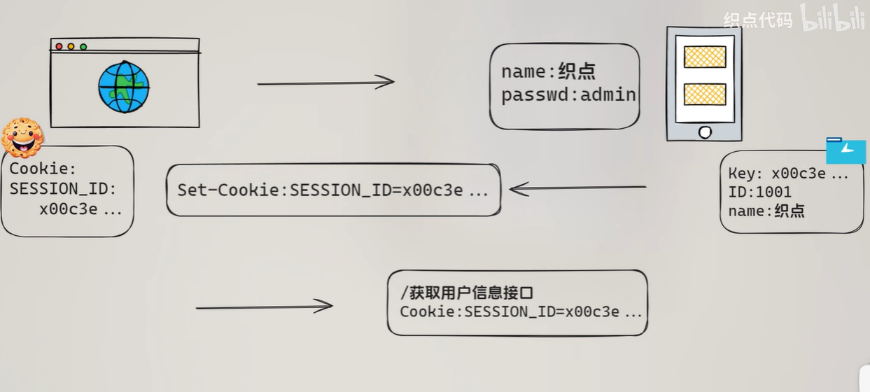
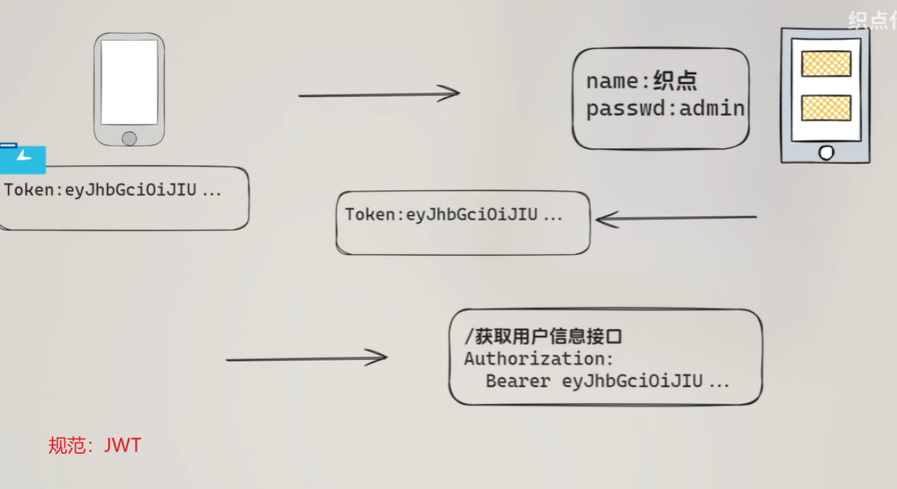

## Session 、Cookie 和 Token 三者的关系和区别

解决问题：HTTP 是无状态协议，所以客户端每次发出请求时，下一次请求无法得知上一次请求所包含的状态数据

Session、Cookie 和 Token 是用于在无状态 HTTP 协议下管理用户登录状态和认证的常见技术。Cookie 是客户端浏览器存储的小型文本文件；Session 是服务器端保存的会话记录（通过 Cookie 携带 ID）；Token 是服务器生成并由客户端保存的加密身份令牌，具备高扩展性和抗 CSRF 能力，适用于前后端分离项目。

### cookie

- 服务器向客户端发送 cookie，通常使用 HTTP 协议规定的 set-cookie 头操作。cookie 的格式为 name = value 格式。
- **客户端**浏览器将 cookie **保存**。
- 每次请求，浏览器都会将 cookie 发向服务器。
- 考虑安全，cookie不直接存放登录信息，可以存放一些不敏感的个性化设置信息

### Session 会话

- 客户端浏览器第一次访问服务器，服务器会创建一个 session，同时为该 session 生成一个唯一的会话 key，也就是 sessionid。然后将 sessionid 及对应的 session 分别作为 key 和 value **保存到服务器**缓存中。
- 服务器回复响应时，会将 sessionid 发送过去。
- 浏览器下次在访问时，会**发送sessionid（**放在cookie里），然后服务器根据 sessionid 找到对应的 session 进行匹配。

由于 cookie 可以被人为的禁止，必须有其他机制以便在 cookie 被禁止时仍然能够把 session id 传递回服务器。

两种方式：

- 第一种：URL 重写（常用），就是把 session id 直接附加在 URL 路径的后面。
- 第二种：表单隐藏字段（现已很少使用）。就是服务器会自动修改表单，添加一个隐藏字段，以便在表单提交时能够把 session id 传递回服务器。

### Token

用户已经登录了系统，服务器给他发送一个令牌（token），里面包含了用户的 user id等数据，用户将token存储到cookie或者storage中，下一次用户再次请求的时候，把这个 token 通过 Http header 带过来

- token 得想个办法，让别人伪造不了。那就做一个数据签名吧，比如服务器用 HMAC-SHA256 算法，加上一个只有服务器才知道的密钥，对数据做一个签名，把这个签名和数据一起作为一个 token（常用规范：JWT）发送给客户端。由于密钥别人不知道，就无法伪造 token 了。

这个 token 服务器不保存，当用户将 token 发给服务器的时候，服务器再用同样的算法和同样的密钥，对数据在计算一次签名，和 token 中的签名做个比较。如果相同，服务器就知道用户登录过了，并且可以直接获取到用户的 user id；如果不相同，数据部分肯定被别人改过了。

这样一来，服务器就不用保存 session id 了，只需生成 token、验证 token，用服务器的 CPU 计算时间换取了服务器的 session 存储空间。

基于 Token 身份验证的过程：

- 用户通过用户名和密码发送请求。
- 验证通过，服务器生成并返回一个 token 给客户端。
- 客户端存储 token，并且每次手动添加到请求中。
- 服务器验证 token 并返回数据。
- 每一个验证都需要手动添加 token，从而保证 Http 的请求无状态。

### cookie 和 session 的区别

1、cookie 数据存放在客户的浏览器上，session 数据放在服务器上。

2、cookie 不安全，所以不能存放登录信息。考虑到安全应当使用 session。

3、session 会在一定时间内保存在服务器上。当访问增多，会比较占用你服务器的性能
考虑到减轻服务器性能方面，应当使用 COOKIE。

4、单个 cookie 保存的数据不能超过 4K，很多浏览器都限制一个站点最多保存 20 个 cookie。

5、所以建议：
将登陆信息等重要信息存放为 SESSION
其他信息如果需要保留，可以放在 COOKIE 中

### token 和 session 的区别

- session 和 token 并不矛盾，都是为了身份的验证。
- 作为身份认证 token 安全性比 session 好，因为每个请求都有签名还能防止监听以及重放攻击
- 其次，session 在服务器端会保存一份，可能保存到缓存、文件或数据库；而 token 存储在客户端中
- token 能更好的保护信息，因为 token 的数据如果被篡改，那么解析他的签名会与 token 中的不一致。
- session 是空间换时间，而 token 是时间换空间。两者的选择要看具体情况而定。

Session 是一种 HTTP 存储机制，目的是为无状态的 HTTP 提供的持久机制。所谓 Session 认证只是简单的把 User 信息存储到 Session 里，因为 SID 的不可预测性，暂且认为是安全的。这是一种认证手段。

Session 只提供一种简单的认证，即有此 SID，即认为有此 User 的全部权利。是需要严格保密的，这个数据应该只保存在站方，不应该共享给其它网站或者第三方 App。所以简单来说，如果你的用户数据可能需要和第三方共享，或者允许第三方调用 API 接口，用 Token。如果永远只是自己的网站，自己的 App，用什么就无所谓了。

token 就是令牌，比如你授权（登录）一个程序时，他就是个依据，判断你是否已经授权该软件；cookie 就是写在客户端的一个 txt 文件，里面包括你登录信息之类的，这样你下次在登录某个网站，就会自动调用 cookie 自动登录用户名；session 和 cookie 差不多，只是 session 是写在服务器端的文件，也需要在客户端写入 cookie 文件，但是文件里是你的浏览器编号.Session 的状态是存储在服务器端，客户端只有 session id；而 Token 的状态是存储在客户端。

### cookie和token的区别

存储位置与携带方式

- **Cookie**：由服务器生成，浏览器会自动保存，并且在后续请求**自动**附带在请求头中（`Cookie` 字段）。
- **Token**：由服务器生成，但需要前端**手动**存储（如放在 `localStorage`、`sessionStorage` 或 `Cookie` 中），并在每次请求时**手动**添加到请求头（如 `Authorization: Bearer <token>`）。

移动端没有 Cookie ，需要使用 Token。
