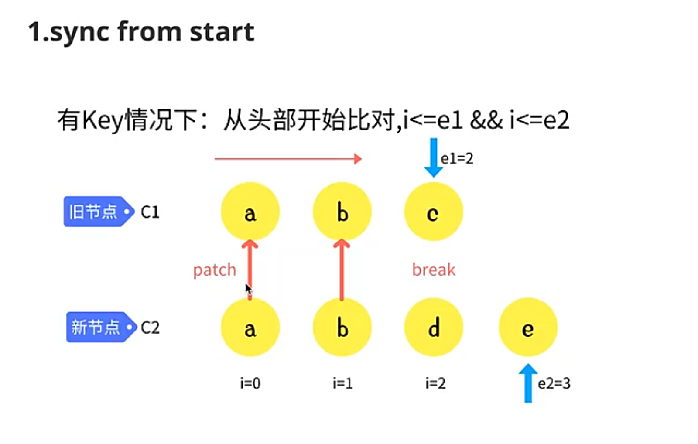
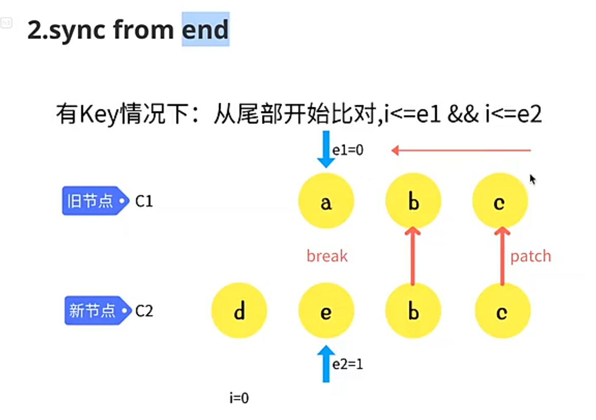
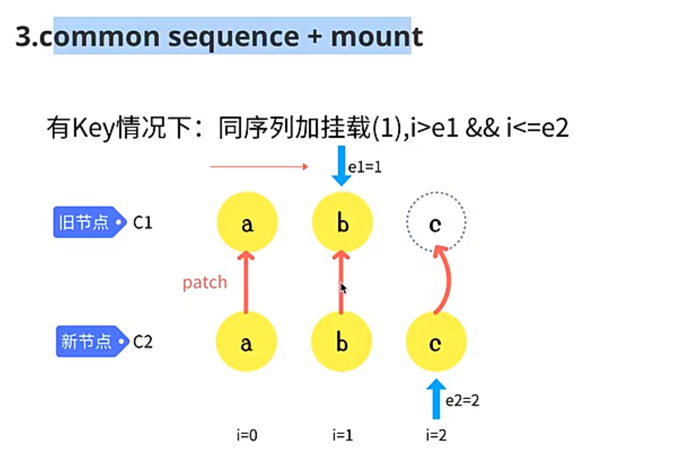
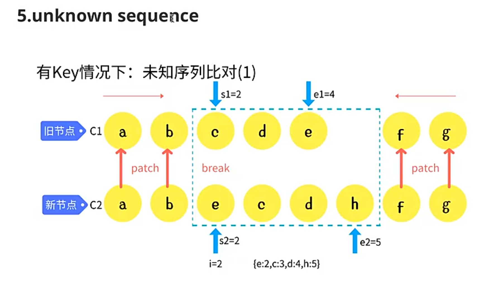
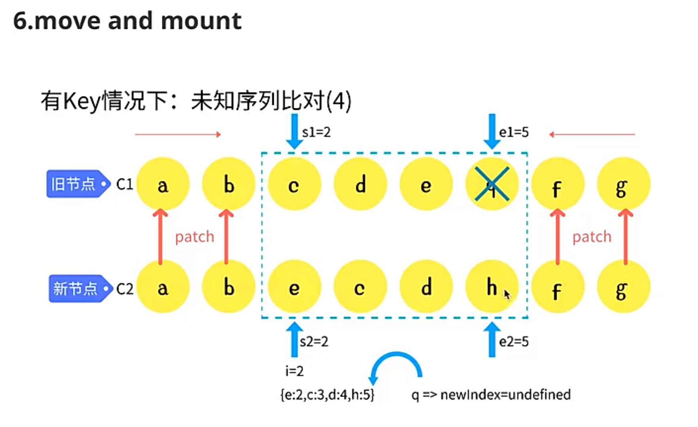

# vue diff

## vue2 diff算法解析

### vue为什么需要虚拟DOM

> 虚拟DOM可以优化性能、提供跨平台兼容性、简化开发流程

- 虚拟DOM减少了直接操作实际DOM的次数
- 虚拟DOM是一个抽象层，将实际DOM抽象成一个跨平台的表示形式，使得vue可以在不同的平台上运行
- vue通过比较新旧虚拟DOM树的差异（diff算法），找出需要更新的部分进行更新

### vue中key的作用

> 对节点进行标识（相同），用于优化节点更新。key在同一层的兄弟节点中必须是唯一的

- 判断节点能否复用：**标签**和 `key`相同

### vue2中diff算法的实现原理

> 递归、双指针、优化

- 同层级节点的比较（标签、key、属性）
- 递归比较子节点（双指针）

比对的核心是从 `patch`函数开始的：

- 初次渲染：`patch(真实容器，虚拟节点)`
  - 根据虚拟节点**创建真实节点**（ `createElm`）插入到容器中
  - 根据虚拟节点创建真实属性 `updateProperties`
- diff算法：`patch(老虚拟节点，新虚拟节点)`
  - patchVnode比较两个节点的差异并更新
    - isSameVnode比较两个节点是否是相同节点：标签 和 key相同
      - 不同：直接删除，创建新节点并替换
      - 相同：复用
        - 如果是文本，更新 `textContent`
        - 如果是元素，更新属性(`updateProperties`) + 子节点(`updateChildren`)

优化：`updateChildren` 比较子节点

- 通过dom常见操作，优化diff算法（双端比对 + 双指针）
  - 在开头新增了元素
  - 在结尾新增了元素
  - 末尾子元素去了开头
  - 开头子元素去了末尾
  - ...

代码见vue2-diff文件夹

### vue2中diff算法的缺陷

- vue2-diff算法如果发现节点可以复用，可能会移动节点
  - 但在某些情况，直接插入节点比移动节点效率更高
- vue2-diff算法是递归比对
  - 如果只比较动态节点，效率会更高

## vue3 diff算法解析

- 全量diff
- 动态diff

### 全量diff

优化：与vue2类似

- 刚开始默认从头开始比对，若相同复用节点
- 如果头部节点不同，就从尾开始比对，若相同复用节点
- 如果新的多则插入，新的少则删除
- 不满足上述情况的，属于未知序列，乱序比对

1. sync from start

从头开始比对，若相同复用节点



2. sync from end

如果头部节点不同，就从尾开始比对，若相同复用节点



3. 同序列挂载

在头部/尾部追加新元素



4. 同序列卸载

在头部/尾部删除元素

5. 未知序列



6. move and mount

- 求最长相同子序列（目的是标识哪些索引不用移动）
- 为需要比对的序列做一个数组，初始化为0
- 对相同的节点做patch，并在数组中对应的位置记录老节点的索引
- 如下图，`[0, 0, 0, 0]` 变为 `[4, 2, 3, 0]`
- 值为0，说明是新增节点，直接插入
- 将新的节点倒叙插入，跳过相同的索引，其他的移动



### 模板编译优化

#### block节点

全量diff仍然需要递归。通过模板编译优化，可以实现动态diff，减少递归

用户写的模板，通过vue编译后，会给动态节点添加标识 `PatchFlags`（例如 `TEXT`、`STYLE`、`CLASS`等Flag）

block可以收集动态的节点（忽略层级），更新的时候只更新这些动态节点（收集到数组中，靶向更新）

#### block tree

如果只有一个block，且代码中有不稳定结构，忽略层级会出现问题，例如下面的代码，之前动态元素中只有span，但变为else后新增了一个元素p，没有被跟踪：

```js
<div>
    <div v-if="flag">
        <span>{{a}}</span>
    </div>
    <div v-else="flag">
        <p><span>{{a}}</span></p>
    </div>
</div>
```

解决方案：给每个if、else都开启一个block。

- 父节点会收集动态节点和子block，更新时因key值不同会进行删除重新创建。
- 根节点默认是block节点
- 稳定结构会作为动态节点，不稳定结构会创造block(例如 `v-if`、`v-else`、`v-for`)

#### 静态提升


所谓的 “静态提升”，就是将一些静态的节点或属性提升到渲染函数之外 。如下面的代码所示：

```html
<div>
  <p>static text</p>
  <p>{{ title }}</p>
</div>
```

```js
// 把静态节点提升到渲染函数之外
const hoist1 = createVNode('p', null, 'text')

function render() {
  return (openBlock(), createBlock('div', null, [
    hoist1, // 静态节点引用
    createVNode('p', null, ctx.title, 1 /* TEXT */)
  ]))
}
```


#### 预字符串化

静态提升的节点都是静态的。可以将提升的节点字符串化。当连续静态节点超过20个时，会触发预字符串化。

#### 缓存函数

开启函数缓存后，函数会被缓存，优化性能
