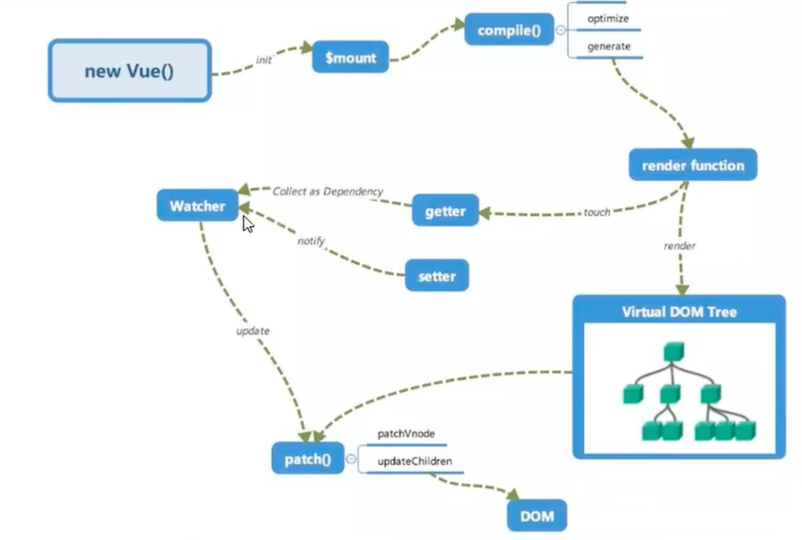
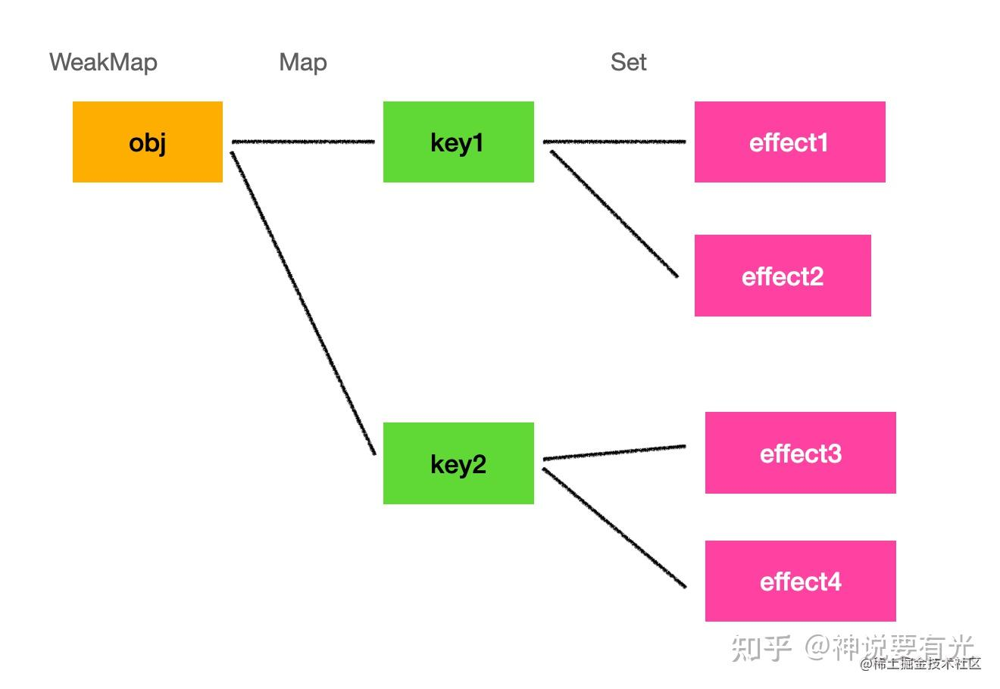
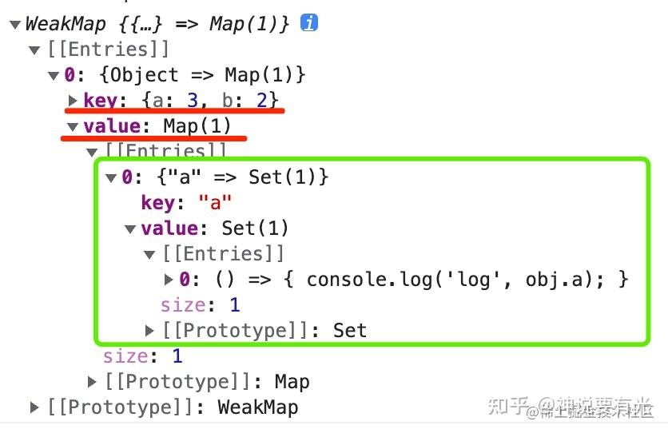
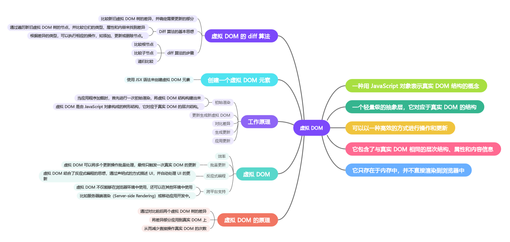
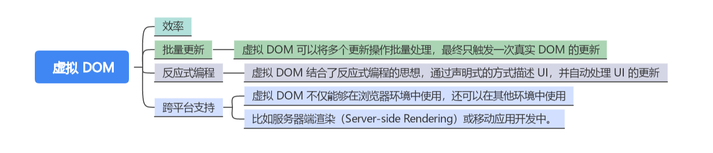

## vue2/3区别

| Vue2           | Vue3            |
| -------------- | --------------- |
| options api    | composition api |
| 逻辑分散       | 逻辑聚合        |
| mixin 冲突     | hooks 组合      |
| defineProperty | Proxy           |
| TS 支持差      | TS 更友好       |


## vue2/3 响应式数据

> 响应式数据：发现数据变化了，做一系列联动的处理

> 就像一个社会热点事件，当它有消息更新的时候，各方媒体都会跟进做相关报道。这里社会热点事件就是被观察的目标。那在前端框架里，这个被观察的目标是什么呢？很明显，是状态。状态一般是多个，会通过对象（例如data）的方式来组织。所以，我们观察状态对象的每个 属性（key） 的变化，联动做一系列处理就可以了。

- vue2：defineProperty，属性级别的响应式，需要遍历对象的所有属性并添加响应式。如果有嵌套对象，那么需要递归。无法感知新增/删除属性，需要使用$set/delete额外定义
- vue3：proxy，对象级别的响应式，无需提前知道有哪些属性。会在访问到的时候才进行代理


vue2：递归data对象中的属性（数据/状态），用defineProperty定义成响应式的（添加getter和setter）。对数组没有使用defineProperty，因为数组可能很长，用户可能不会通过索引修改数据。

缺点：

- 无法监听整个对象，只能递归对每个属性单独监听。
- 无法监听对象的属性的新增，删除。
- 无法监听通过索引修改数组。

```
num = 18
let person = {
    name: "abc",
}
Object.defineProperty(person, 'age', {
    value: 25,
    enumerable: true,  // 可枚举
    writable: true, // 可修改
    configurable:true, // 可删除
    // 读取person的age属性时，get被调用，返回值就是age的值
    get(){
        return num
    },
    // 修改person的age属性时，set被调用
    set(value){
        num = value
    }
})
```


如果不是在data中定义的，后面想要添加响应式数据，可以使用`$set`来添加

vue3：proxy，对整个对象进行拦截，不需要递归遍历每个属性。使用reactive去定义一个对象的时候，就是使用proxy对整个对象进行拦截代理的。支持监听通过索引修改数组。

注意，data 是用户提供的原始对象，target 是 Proxy 内部引用，指向 data，target === data，key是被访问或修改的属性名

```js
function reactive(data) {
  return new Proxy(data, {
    get(target, key) {
      return target[key];
    },
    set(target, key, newVal) {
      target[key] = newVal;
    },
  });
}
```

而 ref定义的数据（无论是基本类型还是引用对象），是将数据放到一个对象（也就是`RefImpl`）的value属性上，然后通过对象的get和set方法拦截value属性

```js
// ref将传入的数据包装成一个对象
function ref(value) {
  return new RefImpl(value);
}

class RefImpl {
  constructor(value) {
    this._value = value;
  }

  get value() {
    return this._value;
  }

  set value(newValue) {
    this._value = newValue;
  }
}
```

### 为什么对于数组，vue2监测不到下标修改，而vue3可以

开销大：vue2选择不去监听数组下标，首先是因为性价比不高，其次数组下标是动态变化的，而且length属性无法用defineproperty监听。vue2只会拦截修改数组的7种方法（push、pop、shift、unshift、splice、sort、reverse）

数组本质也是对象：vue3 Proxy会监听数组，动态对下标、length进行监听。

### vue3响应式原理

思想：观察者模式（代理/劫持+依赖收集+通知更新）

通过 Proxy 拦截对象的读写操作：

- 读取（get）时收集依赖：把当前正在执行的副作用（比如组件的渲染函数、watch、computed）记录到 dep 中。
- 修改（set）时触发依赖：通知所有收集到的副作用重新执行。

当响应式数据变化触发重新执行组件的渲染函数时，渲染函数会生成一棵 新的虚拟 DOM 树，然后 Vue 会对比新旧虚拟 DOM 树（diff 算法），找出最小变化，最后更新真实 DOM。

具体实现的话，核心是这样一个数据结构：



最外层是 WeakMap，键是要监测的对象，值为响应式的 Map。（为什么用weakmap：这样当对象销毁时，Map 也会销毁，防止内存泄漏）

Map 里保存了一系列键值对，键是key（属性/状态），值是 key 的依赖集合(即，依赖于key的逻辑，也就是在key变化时需要执行的逻辑，记作effect)，用 Set 存储。

我们通过 Proxy 来完成自动的依赖收集：

- 【收集】：get 被调用时，添加 effect 到对应 key 的 deps 的集合里。
- 【通知更新】：set 被调用时，触发所有的 effect 函数执行。



简易实现reactive：

```js
// 最外层的WeakMap，键是要监测的对象，值为响应式的 Map
const reactiveMap = new WeakMap();

// 用全局变量，告诉track当前激活的副作用函数是谁，便于收集
let activeEffect = null;

// 注册一个副作用函数fn，并且立即执行它
function effect(fn) {
  activeEffect = fn;
  fn();
}

// 收集依赖
function track(target, key) {
  let depsMap = reactiveMap.get(target);
  if (!depsMap) {
    reactiveMap.set(target, (depsMap = new Map()));
  }
  let deps = depsMap.get(key);
  if (!deps) {
    depsMap.set(key, (deps = new Set()));
  }
  // 添加依赖
  deps.add(activeEffect);
}

// 触发更新
function trigger(target, key) {
  let depsMap = reactiveMap.get(target);
  if (!depsMap) return;
  let effects = depsMap.get(key);
  effects && effects.forEach((effect) => effect());
}

function reactive(data) {
  return new Proxy(data, {
    get(target, key) {
      // 收集依赖
      track(target, key);
      return target[key];
    },
    set(target, key, newVal) {
      target[key] = newVal;
      // 触发更新
      trigger(target, key);
    },
  });
}
```

## ref和reactive区别

template中，ref和reactive会自动解包；script中，ref需要.value，reactive不用

解构都会丢失响应式


ref 函数的参数，我们可以传递原始数据类型的值，也可以传递引用类型的值

不管给 ref 函数传递原始数据类型的值还是引用数据类型的值，返回的都是由 RefImpl 类构造出来的对象，但不同的是对象里面的 value：

- 如果 ref 函数参数传递的是原始数据类型的值，那么RefImpl的 value 是一个原始值
- 如果 ref 函数参数传递的是引用数据类型的值，那么RefImpl的 value 是一个 Proxy 对象（因为底层使用了reactive来处理该对象）


## setup函数是做什么，参数有哪些

setup是组合式API的入口点，替代了vue2的data、method等配置，setup函数会在beforecreated之前运行，初始化状态、复用逻辑、定义组件行为，并返回一个对象

setup接收两个参数：props和context：

- props：父组件传递进来的属性
  - 注意，解构props需要使用toRefs保持响应性    const { title } = toRefs(props)
- context：
  - attrs：未在props中声明的父组件属性，是响应式的
  - emits：用于触发自定义事件
  - slots：接收父组件传递下来的插槽


## 为什么 Vue3 更快

- 响应式系统升级：proxy是惰性的，当属性被访问到时才进行监听，而vue2需要递归遍历对象的所有属性，并用object.defineProperty监听
- 虚拟DOM的diff算法优化：加入patchFLAG机制，标记动态节点，并只更新动态节点
- 静态提升：vue编译器会识别静态节点，并提取到render函数外。当连续静态节点超过一定数量时，会触发预字符串化。
- 缓存函数、事件监听
- 更小的打包体积、更好地支持treeshaking

## Composition API 相比 Options API 的优势和代价

区别：
- 状态管理
  - Options API：data选项
  - Composition API：ref、reactive + setup
- 计算属性
  - Options API：通过 computed 选项定义
  - Composition API：通过 computed 函数定义
- 方法
  - Options API：通过 methods 选项定义
  - Composition API：直接在 setup 函数中定义


在 Options API 中，代码组织相对固定，逻辑分散在不同的选项块中，这在组件变得复杂时，可能会导致代码难以维护和复用。

在 Composition API 中，可以将隶属同一模块的逻辑放在在 setup 函数中的一块，代码更易于组织和复用。或者，将逻辑提取到一个独立的组合函数中，便于在多个组件中复用

Composition API的优势
- 代码简洁
- 更好的ts类型推断
- 代码组织的“高内聚”

Composition API的缺点：
- ref vs reactive的选择、.value丢失、直接解构 props 或 reactive 会导致响应式失效
- 如果开发者没有良好的抽象意识，很容易写出“面条代码”（ setup 中堆积了上百行不相关的代码，逻辑混在一起，难以查找某个功能块）

### Composition API最佳实践

## vue如何监听数组变化

vue2：重写数组的原生方法（会修改原数组的方法），原型链+函数劫持。不能监测到数组长度更改或者通过索引更改

## vue如何进行依赖收集

## 讲讲 Vuex 的使用方法

Vuex：Vue的状态管理模式+库

用于解决多个组件共享状态的问题。将组件的共享状态抽取出来，以一个全局单例模式管理

安装：`npm install vuex@next --save`

store类似一个容器，存放状态state

- 响应式存储
- 不能直接改变store中的状态，而要通过commit mutation，使得状态变化可以被跟踪
- 使用getter对state进行计算得到结果， 使用 mutation（同步操作）、action（mutation、异步操作） 改变 state
- 可以将 store 分割成模块（module）。每个模块拥有自己的 state、mutation、action、getter、嵌套子模块
- 每个应用仅包含一个 store 实例。

```js
const store = createStore({
  state() {
    // 状态
    return {
      count: 0,
    };
  },
  mutations: {
    // 操作
    increment(state) {
      state.count++;
    },
  },
});

app.use(store); // 将 store 实例作为插件安装

store.commit("increment");
console.log(store.state.count); // 1
```

模块：

```js
const moduleA = {
  state: () => ({ ... }),
  mutations: { ... },
  actions: { ... },
  getters: { ... }
}

const moduleB = {
  state: () => ({ ... }),
  mutations: { ... },
  actions: { ... }
}

const store = createStore({
  modules: {
    a: moduleA,
    b: moduleB
  }
})

store.state.a // -> moduleA 的状态
store.state.b // -> moduleB 的状态
```

在 Vue 组件中， 可以通过 `this.$store` 访问store实例：

```js
const Counter = {
  template: `<div>{{ count }}</div>`,
  computed: {
    count() {
      return this.$store.state.count;
    },
  },
};
```

getter：对 state 进行一些计算并返回结果。使用 `store.getter`访问getter。

- 属性getter：作为 Vue 的响应式系统的一部分缓存其中
- 方法getter：每次都会去进行调用，而不会缓存结果。

```js
const store = createStore({
  state: {
    todos: [
      { id: 1, text: '...', done: true },
      { id: 2, text: '...', done: false }
    ]
  },
  getters: {
    doneTodos (state) { // 通过属性访问。作为 Vue 的响应式系统的一部分缓存其中
      return state.todos.filter(todo => todo.done)
    }
    getTodoById: (state) => (id) => { // 通过方法访问。每次都会去进行调用，而不会缓存结果。
      return state.todos.find(todo => todo.id === id)
    }
  }
})

store.getters.doneTodos // -> [{ id: 1, text: '...', done: true }]
store.getters.getTodoById(2) // -> { id: 2, text: '...', done: false }
```

Action 类似于 mutation，不同在于：

- Action 提交的是 mutation，而不是直接变更状态。
- mutation 必须同步执行，而 Action 可以包含异步操作。
- Action 通过 store.dispatch 方法触发

```js
const store = createStore({
  state: {
    count: 0,
  },
  mutations: {
    increment(state) {
      state.count++;
    },
  },
  actions: {
    incrementAsync({ commit }) {
      setTimeout(() => {
        commit("increment");
      }, 1000);
    },
  },
});
```

## mvvm 和 mvc 区别是什么

MVC：Model-View-Controller，数据-视图-控制器，通常是全栈开发，视图的变化后，由控制器来操作数据，然后手动渲染到视图。

MVVM：Model - View - View Model

- 模型 Model：应用的数据及业务逻辑。对应 data 中的数据
- 视图 View：应用的展示效果，各类UI组件。对应 模板
- 视图模型 View Model：框架封装的核心，它负责将数据与视图关联起来。对应 Vue 实例对象

View Model的主要功能：

- 数据变化后更新视图
- 视图变化后更新数据

View Model由两个主要部分组成

- 监听器（Observer）：对所有数据的属性进行监听
- 解析器（Compiler）：对每个元素节点的指令进行扫描跟解析,根据指令模板替换数据,以及绑定相应的更新函数

## 讲讲 Vue 双向绑定原理

单向绑定：所有数据只有一份，一旦数据变化，就去更新页面(只有data-->DOM，没有DOM-->data)。

双向绑定(v-model)：`View`的改变能实时让 `Model`发生变化，而 `Model`的变化也能实时更新 `View`。使用场景：表单的input输入框

什么情况下用户可以更新View呢？如：`填写表单`。当用户填写表单时，View的状态就被更新了，如果此时MVVM框架可以自动更新Model的状态，那就相当于把Model和View做了双向绑定。

双向数据绑定可以理解为是在单向绑定的基础上给可输入元素（input、textarea等）添加了change(input)事件，来动态修改model和 view。

```html
<input v-model="xxx" />

<!-- 上面的代码等价于 -->
<input :value="xxx" @input="xxx = $event.target.value" />
<!-- 双向绑定 = 单向绑定 + UI事件监听 -->
```

### 实现双向绑定

数据劫持：

- 是 vue 中用来 实现数据绑定 的一种 技术
- 基本思想: 通过 defineProperty()来监视 data 中所有属性(任意层次)数据的变化, 一旦变化就去更新界面。
  - 即，给data中的属性添加set(监视变化)，get方法

基于**数据劫持**的实现思路：

- 利用Proxy或Object.defineProperty生成的Observer针对对象/对象的属性进行"劫持",在属性发生变化后通知订阅者
- 解析器Compile解析模板中的Directive(指令)，收集指令所依赖的方法和数据,等待数据变化然后进行渲染
- Watcher属于Observer和Compile之间的桥梁,它将接收到的Observer产生的数据变化,并根据Compile提供的指令进行视图渲染,使得数据变化促使视图变化

流程

- 模板编译(Compile)
- 数据劫持(Observer)
- 发布的订阅(Dep)
- 观察者(Watcher)

## Vue 组件间通信方式有哪些

组件中的数据共有三种形式：data、props、computed。

vue 中通信方式大概可以分为：父子通信，兄弟通信，跨级通信。

父子组件通信可以用：

- props
- $emit / v-on(@)
- $attrs / listeners
- $emit / ref
- .sync （双向绑定）
- v-model（双向绑定）
- $children / parent

兄弟组件通信可以用：

- EventBus
- Vuex(状态管理器，集中式存储管理所有组件的状态)
- $parent

跨层级组件通信可以用：

- provide/inject
- EventBus
- Vuex
- $attrs / listeners
- $root
- 路由传参
- localStorage / sessionStorage

## computed 和 watch 区别是什么

computed：计算属性，要用的属性不存在，要通过已有属性计算得来。

watch：监视属性，当被监视的属性变化时, 回调函数自动调用, 进行相关操作

computed 和 watch 之间的区别：

- 1.computed 能完成的功能，watch 都可以完成。
- 2.watch 能完成的功能，computed 不一定能完成，例如：watch 可以进行异步操作。

## v-for 和 v-if 同时使用有问题吗（有）

- v-for : 遍历数组/对象/字符串
- v-if : 条件渲染（动态控制节点是否存存在）

在vue2和vue3的官方文档里都写到不推荐 v-if 和 v-for 同时使用，如下代码所示：

<li v-for="todo in todos" v-if="!todo.isComplete">
  {{ todo.text }}
</li>

在vue3中，是因为当它们同时存在于一个节点上时，**v-if 比 v-for 的优先级更高**。这意味着 v-if 的条件将无法访问到 v-for 作用域内定义的变量别名。 v-if里是无法访问到todo的，这将会报错。

不过在vue2中，v-for 比 v-if 的优先级更高，也就是说在v-if中可以访问到v-for作用域内定义的变量别名 ，因此不会跟vue3一样报错，但并不推荐这么做，原因如下：

- 性能问题：将 v-for 和 v-if 放在同一个元素上会导致性能下降。Vue 必须为每一个在 v-for 中的项目都检查 v-if 的条件，这会增加不必要的计算量。特别是当 todos 数组很大时，这种性能问题会更加明显。详见文章末尾的附录。
- 逻辑可读性：从逻辑和可读性的角度来看，将过滤逻辑（v-if）和渲染逻辑（v-for）混合在一起可能会导致代码难以理解和维护。最好是先过滤数据，然后再进行渲染。

推荐写法：

- 1. 先过滤数据，再使用v-for
- 2. 利用 `<template>`元素，将 v-if 放在 v-for 的子元素中

```js
    <template v-for="todo in todos" :key="todo.id">
      <li v-if="!todo.isComplete">
        {{ todo.text}}
      </li>
    </template>
```

## 讲讲前端路由原理。比较一下 history 和 hash 这两种路由

SPA（single page web application）单页 Web 应用：整个应用只有一个完整的页面，**点击页面中的导航链接不会刷新页面（不会发送请求）**，只会做页面的局部更新，数据需要通过 ajax 请求获取

一个路由就是一组映射关系（key-value），key 为路径,value 可能是 function 或 component

路由的两种方式：history 和 hash

- hash 模式：window.hashchange事件
  1. 地址中永远带着#号，不美观 。
  2. 兼容性较好。
  3. 刷新后，hash 值不会包含在 HTTP 请求中
- history 模式：history.pushState和history.replaceState API
  1. 地址干净，美观 。
  2. 兼容性和 hash 模式相比略差。
  3. 用户访问 `/about` 后刷新，浏览器会向服务器请求 `https://myapp.com/about` → 很可能 404。需要后端额外配置，例如将路由指向首页

### Hash模式

把前端路由的路径用#拼接在真实url后面,当#后的地址变化时,浏览器不会重新发起请求,而是触发onhashchange事件

特点：

- hash的变化会触发网页的跳转,及浏览器的后退和前进
- hash可以改变url,但不会触发页面的重新请求(hash的变化记录在window.history),所有的页面跳转都是在客户端进行的,并不算一次新的http请求;
- hash只能修改#后的部分,即只能跳转到与当前url同源的url

实现原理：基于 ` windows.location.hash`实现，通过监听 `hashchange` 事件来实现路由导航。

### History模式

使用正常的 URL 路径，例如：`http://example.com/about`。

允许开发者直接更改前端路由，也就是更改 url 地址而无需向后端发送 http 请求。

history特点：

- 新的url可以是与当前url同源的任意url,也可以是与当前url同样的url,但会导致把重复的这次操作记录到栈中
- 通过 history.state ，添加任意类型的数据到记录中。
- 通过 pushState 、 replaceState 来实现无刷新跳转的功能

存在问题：

- 使用history刷新页面时,浏览器会重新发起请求,此时如果nginx没有匹配到url,就会出现404；而hash模式虽然看着是改变了url,但不会包括在http请求中,页面路径还是之前的,nginx不会拦截
- 因此，在使用 history 模式时，需要通过服务端来允许地址可访问，如果没有设置，就很容易导致出现 404 的局面。

实现原理 ：基于 HTML5 的 `history.pushState` 和 `history.replaceState` 实现，通过 `popstate` 事件监听路由变化。

在实际项目中，历史路由（History Mode）通常更常用，主要原因如下：

1. **用户体验** ：历史路由的 URL 更加美观，用户体验更好。
2. **SEO优化** ：历史路由的 URL 结构有利于搜索引擎索引，能够提升网站的 SEO 效果。
3. **现代浏览器支持** ：随着现代浏览器的普及，HTML5 的 `history` API 已经得到了广泛的支持，历史路由的兼容性问题逐渐减少

## 讲讲 Vue 的虚拟 DOM，原理，好处是什么？相对于手动操作 DOM，性能更好吗

> Virtual Dom(vdom，虚拟DOM)：用于描述真实dom节点的JavaScript对象。

- 虚拟dom本质上是js对象,是对真实dom的抽象,在状态变化时,记录新树和旧树的差异,最后把差异更新到真实dom中
- 轻量级的抽象层，对应于真实DOM的结构，包含了与真实DOM相同的层次结构、属性和内容信息
- 操作、更新高效（diff算法）：虚拟dom将dom的对比放在了js层,通过对比不同之处来选择新的渲染节点,从而提高渲染效率
- 只存在于内存中，并不直接渲染到浏览器中

优缺点:

- 虚拟dom能保证下限,通过diff算法找出最小差异,然后批量patch,这样虽比不上手动优化,但相较于粗暴的dom操作性能要好很多,保证了性能
- 无需手动操作
- 跨平台: 虚拟DOM本质上是JavaScript对象,而DOM与平台强相关,相比之下虚拟DOM可以进行更方便地跨平台操作,例如服务器渲染、移动端开发等等
- 无法进行极致优化,在一些要求极高的应用中虚拟dom无法极致优化,需要手动操作

为什么使用虚拟dom：

- 频繁的DOM操作开销大（例如大量页面元素的重绘和回流），处于性能优化的考虑我们应该减少重绘和回流的操作。而对虚拟节点的DOM操作，并不会触发重绘和回流，把处理后的虚拟节点映射到真是DOM上，只需要进行一次重绘和回流，提高了性能。



虚拟 DOM 的更新：通过对比前后两个虚拟 DOM 树的差异，然后将差异部分应用到真实 DOM 上，从而减少直接操作真实 DOM 的次数。

与真实 DOM 相比，虚拟 DOM 具有以下区别：

- 效率：虚拟 DOM 可以减少对真实 DOM 的直接操作次数，通过一次虚拟 DOM 的比较和更新，来代替多次的直接 DOM 操作。由于虚拟 DOM 可以批量处理更新，它通常能提供更好的性能表现。
- 批量更新：虚拟 DOM 可以将多个更新操作批量处理，最终只触发一次真实 DOM 的更新。相比之下，直接操作真实 DOM 往往需要立即进行更新，这可能导致多次无谓的重排和重绘。
- 反应式编程：虚拟 DOM 结合了反应式编程的思想，通过声明式的方式描述 UI，并自动处理 UI 的更新。React 和其他虚拟 DOM 库提供了基于组件的开发模式，使得构建复杂交互界面更加简单、高效。
- 跨平台支持：虚拟 DOM 不仅能够在浏览器环境中使用，还可以在其他环境中使用，比如服务器端渲染（Server-side Rendering）或移动应用开发中。



**虚拟 DOM 并不意味着一定比直接操作真实 DOM 更快，对于简单的应用场景来说，直接操作真实 DOM 的性能可能更好。但是在处理大规模更新、频繁变化的复杂 UI 时，虚拟 DOM 技术能够提供更好的性能和开发体验**

### 虚拟 DOM 的工作原理

可以概括为以下几个步骤：

- 初始渲染：当应用程序加载时，首先进行一次初始渲染，将虚拟 DOM 结构构建出来。虚拟 DOM 是由 JavaScript 对象构成的树形结构，它对应于真实 DOM 的层次结构。
- 更新生成新虚拟 DOM：当应用程序的状态发生变化时（比如用户交互），需要更新 UI。这时会生成一个新的虚拟 DOM 树，新的虚拟 DOM 表示了更新后的 UI 状态。
- 对比差异：将新的虚拟 DOM 树与之前的虚拟 DOM 树进行对比，找出两者之间的差异（即哪些节点需要被更新、添加或删除）。这个对比过程的算法被称为"Diffing"。
- 生成更新：根据对比得出的差异，生成一个表示更新操作的"补丁"（Patch）对象。该补丁对象包含了需要修改真实 DOM 的具体操作，比如添加节点、删除节点、更新属性等。
- 应用更新：将补丁对象应用到真实 DOM 上，即将所有的变更操作一次性地应用到真实 DOM 上，从而实现 UI 的更新。这个过程通常使用最小化 DOM 操作的方式进行，以提高性能。

## 说说 Vue 的 keep-alive(组件缓存) 使用及原理

keep-alive：vue的一个内置组件。作用是缓存组件，让其不被销毁。可以使被包含的组件保留状态，或避免重新渲染。

提供了include(缓存),exclude(不缓存)两个属性，可以选择性保存组件。

因为keep-alive会将组件保存在内存中，并不会销毁以及重新创建，所以不会重新调用组件的created等方法，需要用activated与deactivated这两个生命钩子来得知当前组件是否处于活动状态。

### 实现 keep-alive 组件

created、destroyed钩子：

- created：创建一个cache，用来做缓存容器，保存vnode节点
- destroyed：在组件被销毁时，清除cache里的组件实例

render钩子：首先通过getFirstComponentChild获取第一个子组件，获取该组件的name（存在组件名则直接使用组件名，否则会使用tag）。接下来会将这个name通过include与exclude属性进行匹配，匹配不成功（说明不需要进行缓存）则不进行任何操作直接返回vnode，vnode是一个VNode类型的对象

```js
render () {
    /* 得到slot插槽中的第一个组件 */
    const vnode: VNode = getFirstComponentChild(this.$slots.default)

    const componentOptions: ?VNodeComponentOptions = vnode && vnode.componentOptions
    if (componentOptions) {
        // check pattern
        /* 获取组件名称，优先获取组件的name字段，否则是组件的tag */
        const name: ?string = getComponentName(componentOptions)
        /* name不在inlcude中或者在exlude中则直接返回vnode（没有取缓存） */
        if (name && (
        (this.include && !matches(this.include, name)) ||
        (this.exclude && matches(this.exclude, name))
        )) {
            return vnode
        }
        const key: ?string = vnode.key == null
        // same constructor may get registered as different local components
        // so cid alone is not enough (#3269)
        ? componentOptions.Ctor.cid + (componentOptions.tag ? `::${componentOptions.tag}` : '')
        : vnode.key
        /* 如果已经做过缓存了则直接从缓存中获取组件实例给vnode，还未缓存过则进行缓存 */
        if (this.cache[key]) {
            vnode.componentInstance = this.cache[key].componentInstance
        } else {
            this.cache[key] = vnode
        }
        /* keepAlive标记位 */
        vnode.data.keepAlive = true
    }
    return vnode
}
```

## vue3生命周期

## vue2生命周期

vue实例从创建到销毁的过程。

主要有创建、挂载、更新、销毁阶段。

单一组件钩子执行顺序：

1. beforeCreate：数据尚未初始化
2. created：数据初始化完毕，可访问属性和方法，通常在这里发送AJAX请求获取数据
3. beforeMount：模板编译完成，但还没有挂载到页面
4. mounted：挂载完成，可以访问到真实DOM
5. beforeUpdate：响应式数据更新时被调用，此时数据已经更新，但DOM还是旧的。尽量不要在这里修改数据
6. updated：数据和DOM都更新完毕
7. activated：缓存的组件被激活时触发。
8. deactivated：组件被停用（缓存）时触发。
9. beforeDestroy：销毁实例时调用，此时实例没有被销毁，可以清楚定时器、解绑全局事件监听等
10. destroyed：实例销毁完成
11. errorCaptured

activated, deactivated 是组件keep-alive时独有的钩子。如果组件被包裹在 <keep-alive> 中，它在切换时不会被销毁，而是会被缓存。


## Vue 父子组件生命周期触发顺序是怎样的

顺序：父组件先创建，然后子组件创建；子组件先挂载，然后父组件挂载。

```
父beforeCreate -> 父create -> 子beforeCreate-> 子created -> 子mounted -> 父mounted
```

加载渲染过程：

```
父beforeCreate->父created->父beforeMount->子beforeCreate->子created->子beforeMount->子mounted->父mounted
```

更新过程：

```
父beforeUpdate->子beforeUpdate->子updated->父updated
```

销毁过程：

```
父beforeDestroy->子beforeDestroy->子destroyed->父destroyed
```

常用钩子简易版：

```
父create->子created->子mounted->父mounted
```

- beforeCreate执行时：data和el均未初始化，值为undefined
- created执行时：Vue 实例观察的数据对象data已经配置好，已经可以得到data的值，但Vue 实例使用的根 DOM 元素el还未初始化
- beforeMount执行时：data和el均已经初始化，但此时el并没有渲染进数据，el的值为“虚拟”的元素节点
- mounted执行时：此时el已经渲染完成并挂载到实例上
- beforeUpdate和updated触发时，el中的数据都已经渲染完成，但只有updated钩子被调用时候，组件dom才被更新。
- 在created钩子中可以对data数据进行操作，这个时候可以进行数据请求将返回的数据赋给data
- 在mounted钩子对挂载的dom进行操作，此时，DOM已经被渲染到页面上。
- 虽然updated函数会在数据变化时被触发，但却不能准确的判断是那个属性值被改变，所以在实际情况中用computed或watch函数来监听属性的变化，并做一些其他的操作。
- 所有的生命周期钩子自动绑定 this 上下文到实例中，所以不能使用箭头函数来定义一个生命周期方法 (例如 created: () => this.fetchTodos()),会导致this指向父级。
- 在使用vue-router时有时需要使用来缓存组件状态，这个时候created钩子就不会被重复调用了，如果我们的子组件需要在每次加载或切换状态的时候进行某些操作，可以使用activated钩子触发。
- 父子组件的钩子并不会等待请求返回，请求是异步的，VUE设计也不能因为请求没有响应而不执行后面的钩子。所以，我们必须通过v-if来控制子组件钩子的执行时机

## Vue.nextTick 的实现

使用 `Vue.nextTick()`是为了可以获取更新后的DOM 。
触发时机：在同一事件循环中的数据变化后，DOM完成更新，立即执行 `Vue.nextTick()`的回调。

> 同一事件循环中的代码执行完毕 -> DOM 更新 -> nextTick callback触发


概念回顾：事件循环

在 Event Loop 的视角下，整段初始执行的同步代码（Script）本身被视为第一个宏任务。**主线程**自上而下执行代码，遇到异步任务，就放到**任务监听队列**（实际上是浏览器的 Web APIs 或 Node.js 的线程池）中去监听；任务监听队列中的任务可以执行了，就将回调放入**任务队列**（异步微任务、异步宏任务）中排队等待进入主线程，当同步代码执行完毕，主线程空闲时，先清空执行微任务队列，执行过程中如果产生了新的微任务，继续执行，直到微任务为空。然后检查是否需要更新 UI（渲染）。再从宏任务队列中取出一个执行，然后回头看微任务队列有没有新任务，有则清空执行。这样不断循环。

- 顺序：主线程（调用栈） --> **微任务** --> 渲染 --> 宏任务
- 同步走完清微任务，渲染之后取宏任务。每执行完一个宏任务就清空一次微任务。
- 微任务队列：`Promise.then/catch/finally`、`mutation observer`、`queneMicrotask`等
- 宏任务队列：`setTimeout`、`setInterval`、`xhr`、`I/O`、`UI rendering`等


背景：当我们修改了状态(数据)，需要立即对更新的 DOM 进行一些操作，但是此时，我们是获取不到更新后的 DOM 的，因为Vue在修改数据后，不会立刻修改真实DOM，而是等**同一事件循环**中的所有数据变化完成之后，再统一进行修改DOM。

解决方案：使用 `nextTick`方法。让vue在刚才那些 DOM 更新完成后，立刻执行这个回调函数。这个回调会优先放入异步微任务队列（使用Promise.then或MutationObserver），如果环境不支持，就放入异步宏任务队列（setImmediate或setTimeout）


`tick`：主线程的一次执行过程是一个 `tick`。执行完宏任务或微任务后，都会进入到下一个 `tick`。**浏览器在两个 `tick`之间进行UI渲染**。

### nextTick在下次DOM更新后执行

核心：数据变更 → vue内部调用 nextTick ("DOM更新"回调入队) → 用户调用 nextTick ("DOM操作"回调入队) → 清空微任务 ["更新DOM"，"操作DOM"] → 渲染 → 下一个宏任务

具体流程如下：

数据修改 --> 触发setter --> dep.notify()通知vue的侦听器Dep，将对应的watcher推入queueWatcher队列（这里vue做了去重优化，如果队列当中已经有相同的 `Watcher` 则不添加） --> `nextTick(flushSchedulerQueue)`，将flushSchedulerQueue回调放入微任务队列 --> --> 同步代码执行完毕，开始执行微任务，`flushSchedulerQueue`回调被执行，取出队列中的所有watcher并执行，触发虚拟DOM的patch流程，更新真实DOM -> 执行用户注册的nextTick的回调，获取到最新真实DOM

本质是两次nextTick，vue中数据修改引发DOM更新使用了nextTick注册更新DOM回调，用户使用nextTick将修改DOM的回调排在了更新DOM回调的后面。

加入浏览器的渲染，整体流程如下：

- 主线程（Tick 1）：`vm.message='1', nextTick(()=>log(vm.$el.textContext))`
- 清空微任务：执行 Vue 因数据变化而注册的 nextTick 回调，更新 DOM。然后执行用户注册的nextTick回调，打印最新DOM内容
- 渲染：JS 停止，浏览器更新页面
- 主线程（Tick 2）：浏览器处理下一个宏任务（比如另一个定时器）。

### 手写nextTick

原理：用数组收集用户传入的回调，然后用then放入微任务队列

只用 一个微任务 就能清空所有回调。

- 能力检测：检查可以使用的延迟调用方式，记为 `timerFunc`
  - 优先级：Promise --> MutationObserver --> setImmediate --> setTimeout。
  - nextTick 优先使用Promise和MutationObserver，因为他俩属于微任务，会在执行栈空闲的时候立即执行，响应速度比setTimeout更快，因为无需等渲染。而setImmediate和setTimeout属于宏任务，执行开始之前要等渲染，即task->渲染->task。
- 假设Promise可以使用，`nextTick`通过 `Promise.then()`将回调函数添加入微任务队列。
- 设置状态锁 `pending`，通过 `pending`来判断当前队列当中是否已经存在一个 `nextTick`的任务，避免多次执行 `nextTick`的任务

**核心流程**：

- 把传入的回调函数 `cb`压入 `callbacks`数组
- 执行 `timerFunc`函数，延迟调用 `flushCallbacks` 函数
- 遍历执行 `callbacks` 数组中的所有函数

```js
// 存放回调函数的数组
const callbacks = [];

// 判断当前事件循环当中是否存在nextTick
let pending = false;

// 在事件循环当中执行回调函数
function flushCallbacks() {
  // 本轮事件循环当中的nextTick已经执行完成，将pedding的状态变成false
  pending = false;

  // 拷贝回调函数的数组
  const copies = callbacks.slice(0);

  // 将存放回调函数的数组清空
  callbacks.length = 0;

  // 执行回调函数
  for (let i = 0; i < copies.length; i++) {
    copies[i]();
  }
}

// 微任务
let microTimerFunc;
// 宏任务
let macroTimerFunc;
// 判断当前是否使用宏任务
let useMacroTask = false;

// 进行环境验证
//如果当前环境支持setImmediate，则使用setImmediate将回调函数添加到宏任务队列
if (typeof setImmediate !== "undefined" && isNative(setImmediate)) {
  macroTimerFunc = () => {
    setImmediate(flushCallbacks);
  };
}
// 如果当前环境支持MessageChannel，则使用MessageChannel将回调函数添加到宏任务队列
else if (
  typeof MessageChannel !== "undefined" &&
  (isNative(MessageChannel) ||
    MessageChannel.toString() === "[object MessageChannelConstructor]")
) {
  const channel = new MessageChannel();
  const port = channel.port2;
  channel.port1.onmessage = flushCallbacks;
  macroTimerFunc = () => {
    port.postMessage(1);
  };
} else {
  macroTimerFunc = () => {
    setTimeout(flushCallbacks, 0);
  };
}

// 判断当前环境是否支持Promise
if (typeof Promise !== "undefined" && isNative(Promise)) {
  //创建一个Promise对象
  const p = Promise.resolve();

  // 将flushCallbacks添加到微任务
  microTimerFunc = () => {
    p.then(flushCallbacks);
  };
} else {
  //当前环境不支持Promise，则直接添加到宏任务当中
  microTimerFunc = macroTimerFunc;
}

export function withMacroTask(fn) {
  return (
    fn._withTask ||
    (fn.withTask = function () {
      useMacroTask = true;
      const res = fn.apply(null, arguments);
      useMacroTask = false;
      return res;
    })
  );
}

/**
 *
 * @param {*} cb 下一次Dom更新后执行的回调函数
 * @param {*} ctx 回调函数的上下文对象
 */
export function nextTick(cb, ctx) {
  let _resolve;
  //将回调函数缓存到callbacks当中
  callbacks.push(() => {
    //判断当前是否有回调函数
    if (cb) {
      // 将当前回调函数的this指向ctx上下文对象并执行
      cb.call(ctx);
    } else if (_resolve) {
      // 将Promise返回出去
      return _resolve(ctx);
    }
  });

  //判断当前事件循环当中是否存在nextTick
  if (!pending) {
    //将当前状态更改为true，表示事件队列当中已经有nextTick了
    pending = true;
    if (useMacroTask) {
      macroTimerFunc();
    } else {
      microTimerFunc();
    }
  }

  //如果回调函数不存在，并且环境支持Promise，则nextTick会返回一个Promise
  if (!cb && typeof Promise !== "undefined") {
    //返回一个成功状态的回调函数
    return new Promise((resolve) => {
      _resolve = resolve;
    });
  }
}
```

## 讲讲 Vue diff 算法

背景：`vue`节点的更新方式是对 `vdom`进行比较。当更新前的容器中的内容是一组子节点时，且更新后的内容仍是一组节点。如果不采用 `diff`算法，那么最简单的操作就是将之前的 `dom`全部卸载，再将当前的新节点全部挂载。但是直接操作dom对象是非常耗费性能的。

diff算法：找出两组vdom节点之间的差异，并尽可能的复用dom节点，降低更新操作的性能消耗。
