# 计算机网络

**HTTP vs HTTPS**

- HTTP 明文
- HTTPS TLS 加密

**端口**

HTTP 80

HTTPS 443

**状态码**

200 成功

301/302 重定向

403 无权限

404 未找到

500 服务器错误

304 = 缓存未修改

## DNS 解析

DNS(Domain Name System，域名系统)：用于转换 IP 地址与主机名，工作原理是管理名称和数字之间的映射关系

**层次型**的 Internet 域名体系结构：从语法上讲，每一个域名都是有标号序列组成，而各标号之间用点（小数点）隔开。以www.huawei.com域名为例，从右到左依次是：

- com：顶级域名。代表商业组织。
- huawei：二级域名，归属于某个公司自己的域名。
- www：三级域名，表明某个公司提供的是什么服务，www 代表普通网页。

### DNS 域名系统 (主机名 -> IP)

DNS 协议属于应用层

域名系统(domain name system,DNS)：进行主机名到 IP 地址转换

- 一个由分层的 DNS 服务器实现的分布式数据库
- 一个使得主机能够查询分布式数据库的应用层协议

DNS 思路：

- 分层的、基于域的命名机制
- 若干分布式的数据库完成名字到 IP 地址的转换
- 运行在 UDP 之上端口号为 53 的应用服务
- 核心的 Internet 功能，但以应用层协议实现
  - 在网络边缘处理复杂性

##### 分布式数据库

根 DNS 服务器：是 13 个不同根服务器的副本，超过 1000 台，提供 TLD 服务器的 IP 地址

顶级域 DNS 服务器(top-level domain, TLD)：负责顶级域名（如 com, org, net, edu 和 gov）和所有国家级的顶级域名（如 cn, uk, fr, ca, jp），提供权威 DNS 服务器的 IP 地址

权威 DNS 服务器：组织机构的 DNS 服务器，提供组织机构服务器（如 Web 服务器和 mail 服务器）可访问的主机和 IP 之间的映射。

- 负责一个具体域名的信息（如 example.com）
- 存储实际的 IP 地址

层次域名空间：

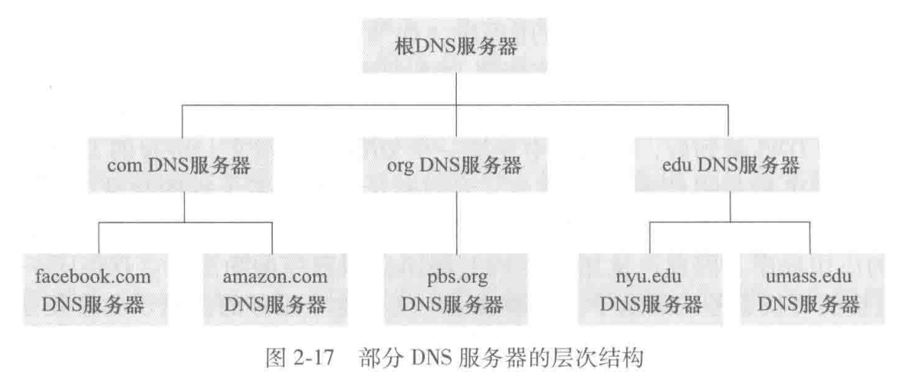

本地名字服务器：

- 并不严格属于层次结构
- 每个 ISP（居民区的 ISP、公司、大学）都有一个本地 DNS 服务器
  - 也称为“默认名字服务器”
- 当一个主机发起一个 DNS 查询时，查询被送到其本地 DNS 服务器
  - 本地 DNS 服务器负责代表客户端发起 DNS 查询，向上层一层层追问

DNS 大致工作过程：

- 应用调用 解析器(resolver)
- 解析器作为客户 向 Name Server 发出查询报文（封装在 UDP 段中）
- Name Server 返回响应报文(name/ip)

### DNS 域名解析

名字解析过程

- 目标名字在 Local Name Server 中

  - 情况 1：查询的名字在该区域内部
  - 情况 2：缓存(cashing)

- 当与本地名字服务器不能解析名字时，联系根名字服务器顺着 根服务器 -> TLD 服务器 -> 权威 DNS 服务器，返回主机 www.example.com 的 IP 地址
- 递归服务器返回结果，缓存并发回客户端
- 迭代查询：上一级服务器只返回下一跳的地址，由下一级继续查询
- 递归查询：

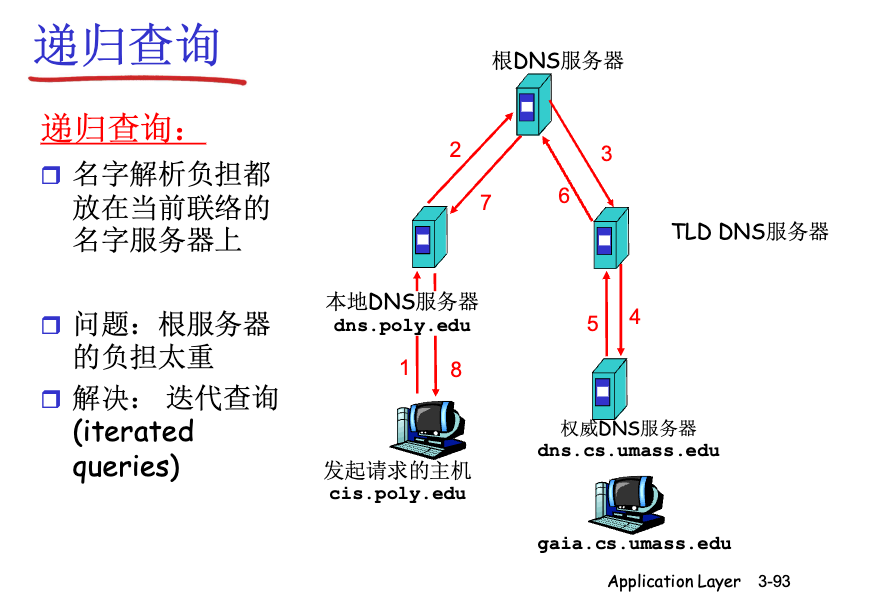

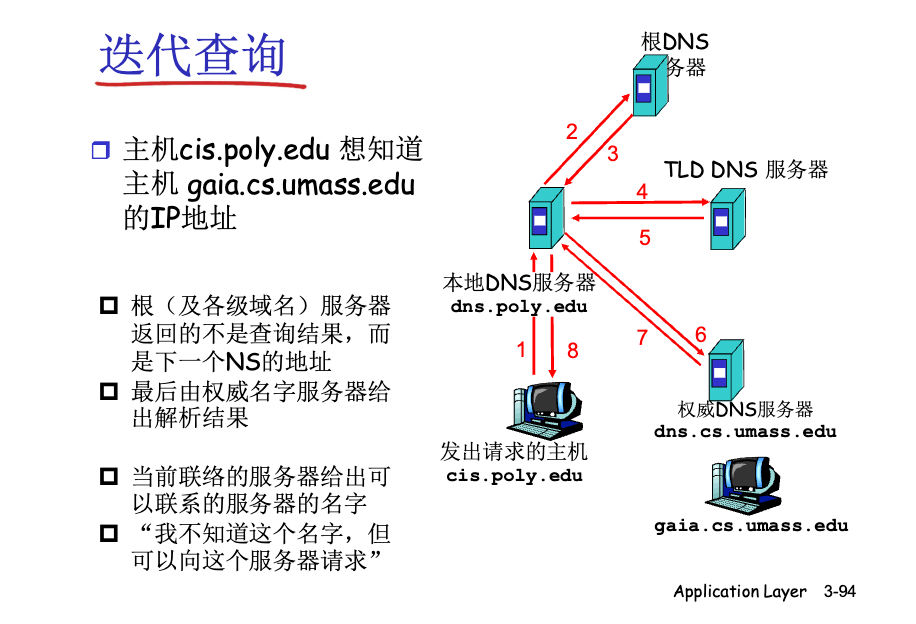

### DNS 负载均衡技术

实现原理：

- 在 DNS 服务器中为**同一个主机名配置多个 IP 地址**
- 在应答 DNS 查询时，DNS 服务器对每个查询将以 DNS 文件中主机记录的 IP 地址按顺序返回不同的解析结果，将客户端的访问引导到不同的机器上去，使得不同的客户端访问不同的服务器，从而达到负载均衡的目的

## 网络请求

方法字段：GET、POST、HEAD、PUT、DELETE

GET：

- 请求一个对象，在 URL 字段中带有请求对象的标识

POST：创建一个资源或提交数据进行处理

- 用于向指定的资源提交数据。（创建、部分更新）
- POST 方法的请求**不具备幂等性**，即多次发送相同的 POST 请求可能会导致不同的结果
- 网页通常包括表单输入
- 包含在实体主体(entity body)中的输入被提交到服务器
- 用途：表单提交、添加评论、用户注册

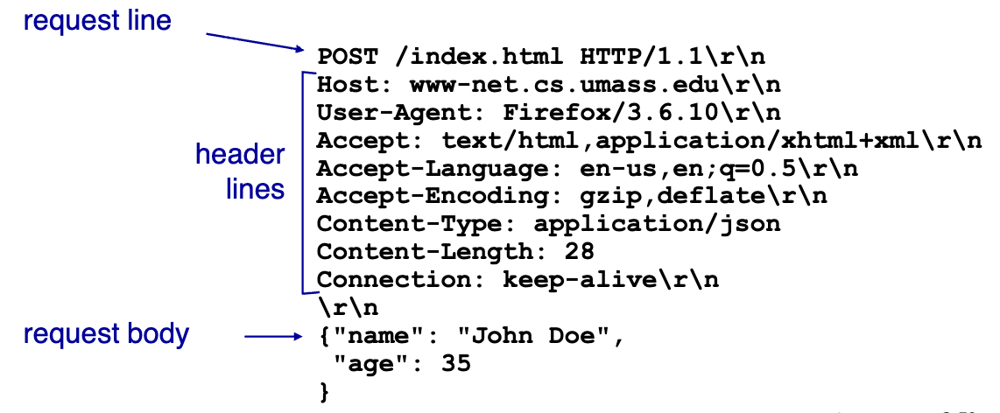

PUT：创建或更新一个资源

- 用于向指定的资源更新数据。（创建、覆盖更新）
- PUT 方法的请求具备幂等性，即相同的 PUT 请求不管执行多少次，结果都是一样的
- 用户上传对象到指定的 Web 服务器上指定的路径
- 用途：上传文件、更新已有对象

比较 PUT、POST：

- POST：请求的 URL 标识的是“处理请求体内容的资源”
- PUT：请求的 URL 标识的是“请求体中包含的资源本身”
- PUT 是幂等的，即多次执行效果相同，POST 不是，即多次执行可能产生不同效果
- 语义：
  - POST：服务器指定资源的 URI
  - PUT：客户端指定资源的 URI
- 资源位置：
  - 资源位置固定
  - 资源位置可能由服务器生成

类比说明：

- POST 是把资料交到窗口，窗口决定怎么处理。
- PUT 是你直接往档案柜的某一层放一个文档，告诉柜子“这是这个位置的内容”。

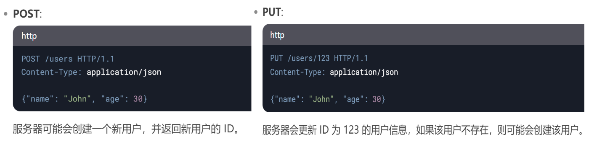

HEAD：

- 服务器只会返回请求的资源的头部，而不返回实际内容
- 用于开发者进行故障跟踪：资源是否存在、获取资源的元数据、减少数据传输量

比较 GET、HEAD：

- GET：在回复的实体主体中包含请求的资源以及头部
- HEAD：返回头部，但不返回资源

DELETE：

- 用于请求服务器删除指定的资源

通过输入上传：

- POST：网页通常包含表单输入。输入以实体形式上传至服务器
- URL：使用 GET 方法。输入以请求行的 URL 字段形式上传

### GET 和 POST 请求的区别

GET 和 POST，两者是 HTTP 协议中发送请求的方法

GET 方法请求一个指定资源的表示形式，使用 GET 的请求应该只被用于获取数据

POST 方法用于将实体提交到指定的资源，通常导致在服务器上的状态变化或副作用

本质上都是 TCP 链接，并无差别

但是由于 HTTP 的规定和浏览器/服务器的限制，导致他们在应用过程中会体现出一些区别：

- POST 比 GET 安全，因为数据在地址栏上不可见
- 对于 GET 方式的请求，浏览器会把 http header 和 data 一并发送出去，服务器响应 200（返回数据）；对于 POST，浏览器先发送 header，服务器响应 100 continue，浏览器再发送 data，服务器响应 200 ok。并不是所有浏览器都会在 POST 中发送两次包，Firefox 就只发送一次
- 通常情况，当携带参数的时候，GET 请求是放在 url 中，POST 则放在 Request body 中
- GET 在浏览器回退时是无害的，而 POST 会再次提交请求。
- GET 请求会被浏览器主动 cache，而 POST 不会，除非手动设置。
- Get 请求幂等， POS 的请求非幂等
- Get 请求的数据大小受 URL 长度限制， post 请求携带数据大小理论上无限制

## 网络分层模型

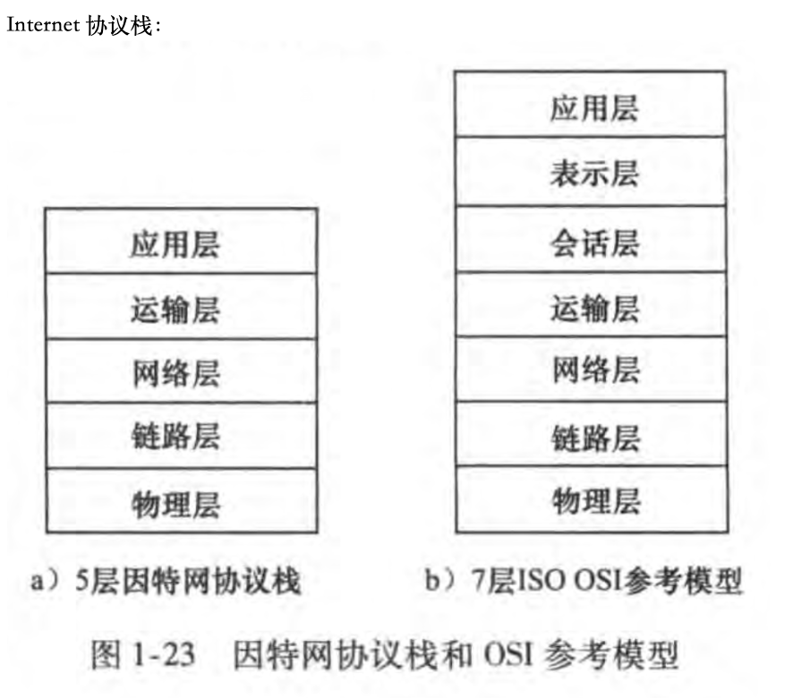

- 应用层：支撑网络应用。（报文 message）
- 传输层(transport)：在应用程序端点之间传送应用层报文 (报文段 segment)
- 网络层：将数据报从一台主机移动到另一台主机 （数据报 datagram）
- 链路层(link)：网络层之间的传输。因特网的网络层通过源和目的地之间的一系列路由器路由数据报。为了将分组从一个点(主机或路由器)移动到路径上的下一个节点，网络层必须依靠该链路层的服务。（帧 frame）
- 物理层：物理介质

OSI：在应用层和传输层之间，新增表示层和会话层

OSI：应用层负责在应用间数据交换，表示层将信息转换为比特流，会话层用于建立会话与传输数据

两种不同模型的层次之间的对应关系

协议：

缺点：

- 层与层之间可能实现了重复的功能，例如差错恢复
- 信息隐藏影响性能
- 某层的功能可能需要仅在其他某层才出现的信息，违背了层次分离

优点：

- 重复使用
- 隐藏底层细节
- 各层级的创新可以并行进行
- 不同的社群追求不同的创新

## 常用网络协议

应用层：HTTP/FTP

传输层：TCP/UDP

网络层：IP/ICMP

数据链路层：ARP

## Session 、Cookie 和 Token 三者的关系和区别

解决问题：HTTP 是无状态协议，所以客户端每次发出请求时，下一次请求无法得知上一次请求所包含的状态数据

Session、Cookie 和 Token 是用于在无状态 HTTP 协议下管理用户登录状态和认证的常见技术。Cookie 是客户端浏览器存储的小型文本文件；Session 是服务器端保存的会话记录（通过 Cookie 携带 ID）；Token 是服务器生成并由客户端保存的加密身份令牌，具备高扩展性和抗 CSRF 能力，适用于前后端分离项目。

### cookie

- 服务器向客户端发送 cookie，通常使用 HTTP 协议规定的 set-cookie 头操作。
- 规范规定 cookie 的格式为 name = value 格式，且必须包含这部分。
- 客户端浏览器将 cookie 保存。
- 每次请求，浏览器都会将 cookie 发向服务器。

### Session

session 的中文翻译是“会话”，当用户打开某个 web 应用时，便与 web 服务器产生一次 session。服务器使用 session 把用户的信息临时保存在了服务器上，用户离开网站后 session 会被销毁。

客户端浏览器第一次访问服务器，服务器会创建一个 session，同时为该 session 生成一个唯一的会话 key，也就是 sessionid。然后将 sessionid 及对应的 session 分别作为 key 和 value 保存到缓存中，也可以持久化到数据库或者 redis 中。服务器回复响应时，会将 sessionid 发送过去。浏览器下次在访问时，会一并发送 cookie（包含 sessionid），然后服务器根据 sessionid 找到对应的 session 进行匹配。

由于 cookie 可以被人为的禁止，必须有其他机制以便在 cookie 被禁止时仍然能够把 session id 传递回服务器。

两种方式：

- 第一种：URL 重写（常用），就是把 session id 直接附加在 URL 路径的后面。
- 第二种：表单隐藏字段（现已很少使用）。就是服务器会自动修改表单，添加一个隐藏字段，以便在表单提交时能够把 session id 传递回服务器。

### Token

小兰同学已经登录了系统，服务器给他发送一个令牌（token），里面包含了小兰的 user id，下一次小兰再次通过 Http 请求访问服务器的时候，把这个 token 通过 Http header 带过来

token 得想个办法，让别人伪造不了。那就做一个数据签名吧，比如服务器用 HMAC-SHA256 算法，加上一个只有服务器才知道的密钥，对数据做一个签名，把这个签名和数据一起作为一个 token，由于密钥别人不知道，就无法伪造 token 了。

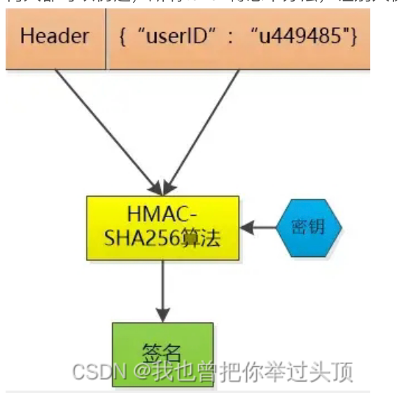

这个 token 服务器不保存，当小兰将 token 发给服务器的时候，服务器再用同样的 HMAC-SHA256 算法和同样的密钥，对数据在计算一次签名，和 token 中的签名做个比较。如果相同，服务器就知道小兰登录过了，并且可以直接获取到小兰的 user id；如果不相同，数据部分肯定被别人改过了，那么服务器就只能回应：对不起，没有认证。

这样一来，服务器就不用保存 session id 了，只需生成 token，然后验证 token，用服务器的 CPU 计算时间换取了服务器的 session 存储空间，解除了 session 这个负担。如果用户访问量增加，那么直接加服务器就行了。

基于 Token 身份验证的过程：

- 用户通过用户名和密码发送请求。
- 程序验证。
- 程序返回一个前面的 token 发送给客户端。
- 客户端存储 token，并且每次用于发送请求。
- 服务器验证 token 并返回数据。
- 每一个验证都需要 token，token 在 HTTP 的头部发送从而保证 Http 的请求无状态。

### cookie 和 session 的区别

1、cookie 数据存放在客户的浏览器上，session 数据放在服务器上。

2、cookie 不是很安全，别人可以分析存放在本地的 COOKIE 并进行 COOKIE 欺骗。考虑到安全应当使用 session。

3、session 会在一定时间内保存在服务器上。当访问增多，会比较占用你服务器的性能
考虑到减轻服务器性能方面，应当使用 COOKIE。

4、单个 cookie 保存的数据不能超过 4K，很多浏览器都限制一个站点最多保存 20 个 cookie。

5、所以个人建议：
将登陆信息等重要信息存放为 SESSION
其他信息如果需要保留，可以放在 COOKIE 中

### token 和 session 的区别

- session 和 token 并不矛盾，都是为了身份的验证。
- 作为身份认证 token 安全性比 session 好，因为每个请求都有签名还能防止监听以及重放攻击
- 其次，session 在服务器端会保存一份，可能保存到缓存、文件或数据库；而 token 存储在客户端中
- token 能更好的保护信息，因为 token 的数据如果被篡改，那么解析他的签名会与 token 中的不一致。
- token 与 session 的问题是一种时间与空间的博弈问题，session 是空间换时间，而 token 是时间换空间。两者的选择要看具体情况而定。

Session 是一种 HTTP 存储机制，目的是为无状态的 HTTP 提供的持久机制。所谓 Session 认证只是简单的把 User 信息存储到 Session 里，因为 SID 的不可预测性，暂且认为是安全的。这是一种认证手段。

Session 只提供一种简单的认证，即有此 SID，即认为有此 User 的全部权利。是需要严格保密的，这个数据应该只保存在站方，不应该共享给其它网站或者第三方 App。所以简单来说，如果你的用户数据可能需要和第三方共享，或者允许第三方调用 API 接口，用 Token。如果永远只是自己的网站，自己的 App，用什么就无所谓了。

token 就是令牌，比如你授权（登录）一个程序时，他就是个依据，判断你是否已经授权该软件；cookie 就是写在客户端的一个 txt 文件，里面包括你登录信息之类的，这样你下次在登录某个网站，就会自动调用 cookie 自动登录用户名；session 和 cookie 差不多，只是 session 是写在服务器端的文件，也需要在客户端写入 cookie 文件，但是文件里是你的浏览器编号.Session 的状态是存储在服务器端，客户端只有 session id；而 Token 的状态是存储在客户端。

## TCP/UDP 协议区别

TCP：

- 面向连接：TCP 需要三次握手建立连接，四次挥手断开
- 可靠、按序的字节流：TCP 提供可靠交付，通过确认、重传、排序等机制保证数据不丢失、不重复、按序到达
- 拥塞控制
- 传输速度较慢
- 用于：文件传输（FTP）、邮件（SMTP）、网页浏览（HTTP/HTTPS）

UDP：

- 无连接
- 不可靠，无序（尽力而为，可能丢失、乱序）
- 传输速度较快
- 用于：流媒体多媒体应用、DNS、SNMP(简单网络管理协议)、HTTP/3

## TCP 保证可靠传输的手段(tcp 拥塞控制的 4 种方法)

TCP 拥塞控制的核心在于通过调整拥塞窗口（Congestion Window, cwnd）大小来控制发送速率。4 种主要算法为：慢启动（Slow Start）、拥塞避免（Congestion Avoidance）、快重传（Fast Retransmit）和快恢复（Fast Recovery）。它们协作以防网络过载。

拥塞窗口 cwnd 的维护原则：只要网络没有出现拥塞，拥塞窗口就再增大一些；但只要网络出现拥塞，拥塞窗口就减少一些。

判断出现拥塞的依据：没有按时收到应当到达的报文（即发生超时重传）。

**慢启动**：初识时，cwnd 值较小，后续每收到一个 ACK，cwnd 翻倍

当 cwnd 到达一个阈值(slow start threshold, ssthresh，慢开始门限)后，停止慢启动，进入拥塞避免阶段

**拥塞避免**的窗口增长基本算法：加性增，乘性减。

- 收到 ACK 时，cwnd 加 1
- 丢包时， 慢开始门限变为发生拥塞时 cwnd 的一半，CWND 变为 1，重新开始慢启动阶段

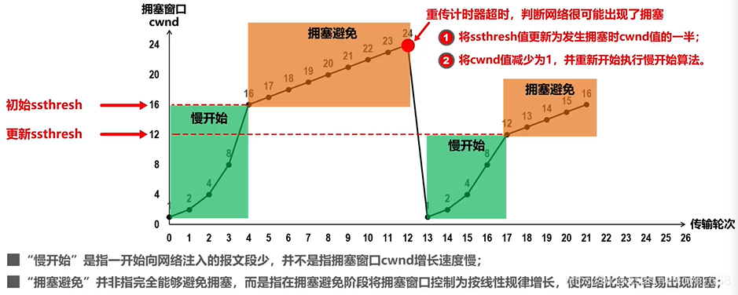

有时，个别报文段会在网络中丢失，但实际上未发生网络拥塞。这将导致发送方超时重传，并误认为网络发生了拥塞；发送方把拥塞窗口 cwnd 又设置为最小值 1，并错误地启动慢开始算法，因而降低了传输效率。为了改进 TCP 的性能，又增加了快重传和快恢复算法。

**快重传**：让发送方在丢包时尽快重传，以免触发超时重传计时器导致进入慢启动。

- 接收方需要立即发送确认
- 即使收到了失序的报文段，也要立即发出对已收到的报文段的重复确认
- 发送方一旦收到 3 个连续的重复确认，就将相应的报文段立即重传，而不是等该报文段的超时重传计时器超时再重传，并进入快恢复阶段

**快恢复**：慢开始门限和 cwnd 更新为当前窗口的一半，并恢复到拥塞避免阶段

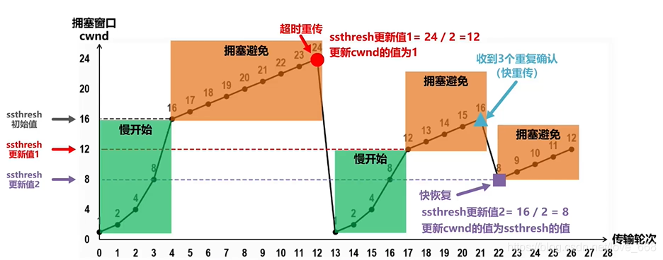

## TCP 三次握手/四次挥手

为什么 tcp 需要三次握手，而不是两次

2 次握手的问题：

- 半连接：发送方偶尔重传的连接请求可能会在 连接建立并完成后 又被接受方收到，于是接收方建立了连接，但发送方对此一无所知，没有建立连接
- 旧数据被当作新数据接收：在半连接的基础上，发送方偶尔重传的数据被接收方收到

在不可靠网络下（有丢包、延迟、乱序）：

- SYN 报文可能重复、滞后、乱序到达；

若少了第三次握手，会出现：

- 半连接（服务器以为连上了，客户端并没准备好）；
- 资源泄漏（服务器维持没用的连接）；
- 协议死锁（两边状态机不同步，后续传输异常）。

类比：

- 2 次握手；a 表明自己想与 b 建立连接，b 立刻同意并回复 a，然后 a 同意；
- 3 次握手：a 表明自己想与 b 建立连接，b 回应‘我也准备好了，并确认你想连接我’，a 再确认‘我收到你的确认，我们可以开始了’，此时两人才真正同意
- 3 次握手是一个“针对确认的确认”。
- 2 次握手的困境是，如果 a 是一个随意发出请求的人，b 立即同意后，却发现 a 并不是真正同意
- (两军问题：即便是 3 次握手也无法确保安全。握手次数理论上应该是无限的，才能确保双方都是真正同意)

3 次握手的流程， 客户端向服务器发送请求， 服务器接收到请求后发送 ACK 进行响应， 客户端收到服务器的 ACK 后， 再次发送 ACK 进行响应并建立连接， 服务器端收到确认响应后建立连接。 在这个过程中，请求通常包含一个序号， 而针对该请求的响应 ACK 与该序号有关。

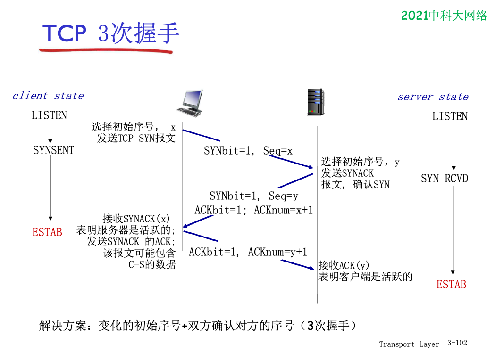

### 中止 tcp 连接：4 次挥手

总结： 客户端发出关闭连接命令， 服务器收到后回复确认， 此时客户端停止发送数据， 服务器仍可发送数据， 一段时间后， 服务器发送终止命令， 客户端收到后回复确认， 此时服务器收到确认，关闭连接， 而客户端在进步一段时间后也关闭连接， 释放资源

流程：发送方-接收方-接收方-发送方

- app 发出关闭连接命令，client tcp 向 server 发送 tcp 报文段(`FIN=1, seq=x`)
- server 接收到后，回送一个确认报文段(`ACK=1, ACKnum=x+1`)
- (一段静默时间，此时仍可以发送数据)
- server 发送终止报文段(`FIN=1`)
- client 收到后，回送一个确认报文段(`ACK=1`)
- server 关闭连接，client 仍会静默 2 倍的 msl 时间
- client 关闭连接
- 关闭连接后，释放主机上所有用于该连接的资源

msl(max segment lifetime)：最大段生存时间，代表任何报文在被丢弃前在网络中被允许存在的最长时间

## TCP 协议如何提高传输效率

### 拥塞控制

核心就是防止开始传输时由于传输数据过大，网络不好而引起的大量丢包问题，引入慢启动机制，开始先发送少量数据看网络是否堵塞，然后在决定以多大的速度传输数据。

### 滑动窗口

- 发送方一次可以发送多条数据
- 窗口大小指的是无需确认应答而可以继续发送数据的最大值
- 假设窗口大小为 4，发送前四个段，不需要等待任何 ACK，直接发送
- 收到第一个 ACK，滑动窗口向后移动，继续发送第五个段的数据，依次类推
- 操作系统为了维护这个滑动窗口，需要开辟一个发送缓冲区来记录当前没有应答的数据，而确认应答过的数据，会从缓冲区删除
- 窗口越大，则网络的吞吐率越高

#### 丢包处理机制：回退 N 步、选择重传

回退 N 步：

- 接收方：
  - 接收窗口大小为 1
  - 累积确认机制：只回复 累积的 ack
- 发送方：
  - 为 最早的那个未确认分组 设置定时器
  - 定时器超时后，重传**所有**未确认分组
- 例如，接收方收到了第 0、第 1 个包，丢失第 2 个包，即使后面收到了第 3、第 4 个包，接收方只会回复 `ack1`。等到发送方对于第 2 个包的计时器超时后，发送方会重传第 2 个包及其后面窗口里的所有包。

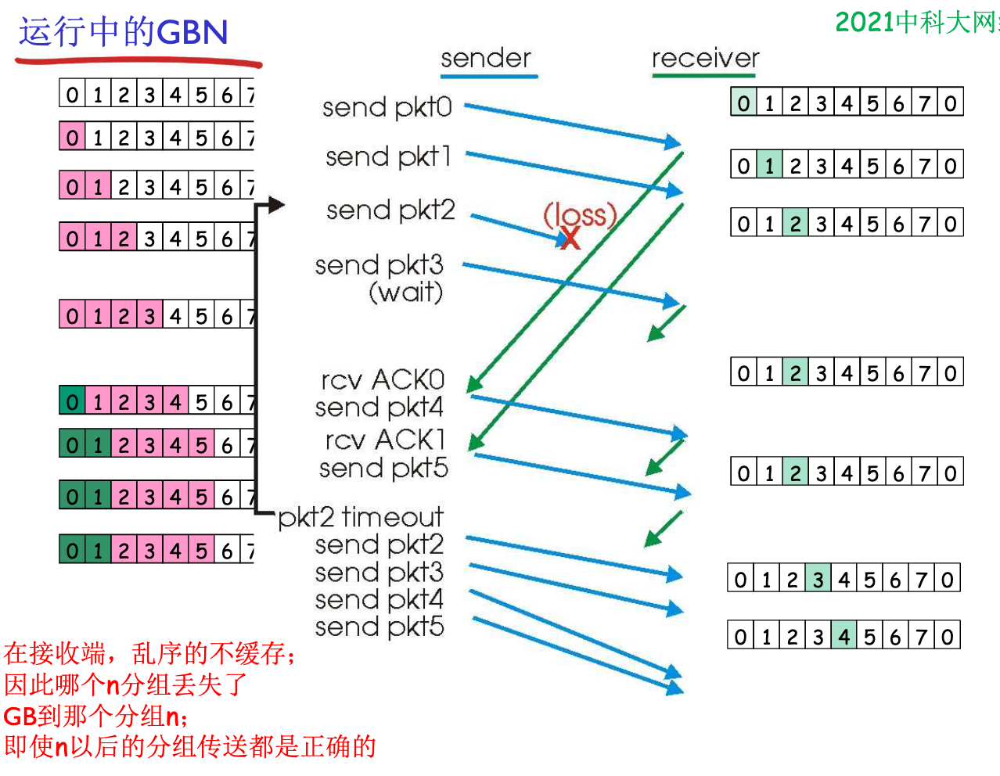

选择重传：

- 接收方：支持乱序接收
  - 对于每个正确接受的分组，发送 ACK(非累积确认)
  - 如果某个分组丢失，继续**缓存**后面**乱序**的分组。后续只用发送方重传单个丢失的分组
  - 最终将分组按顺序交付给上层
- 发送方：选择性重发
  - 为所有未确认分组 设置定时器
  - 只对没有收到 ACK 的分组进行重发
  - 当定时器超时后，只重传那个未确认分组

#### 流量控制

由于接收端处理数据是有限的，如果发送端发的太快，导致接收端缓冲区满了，这时发送端继续发送数据将会导致丢包，继而会引起一系列重传反应，因此 TCP 根据接收端的处理能力来决定发送的速度，这就是流量控制。

### 选择性确认 SACK

SACK 允许发送方在收到部分数据包的确认时，知道接收方已经接收到的数据范围，从而避免重传整个丢失的数据包。这种机制有助于减少网络延迟和减少冗余数据包的发送，从而提高网络传输效率

## 浏览器输入 URL 处理的过程

浏览器输入 URL 后，在结果返回浏览器前，主要有以下过程：

- 1. 用户输入网址后，进行 URL 解析，
- 2. 浏览器发起 DNS 查询请求；
- 3. 建立 TCP 连接，发送 HTTP 请求；
- 4. 服务器处理请求；
- 5. 浏览器接受 HTTP 响应，释放 TCP 连接；
- 6. 浏览器解析返回的资源和数据，渲染页面

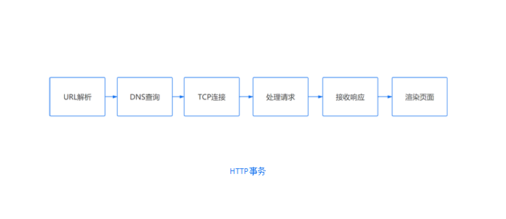

### 1. URL 解析

判断输入内容是合法 URL 还是搜索关键词，进行自动补全、字符编码等操作

使用 HSTS 强制客户端用 HTTPS 访问页面

进行安全检查，访问限制

检查缓存，若有，且没有过期，则直接返回页面

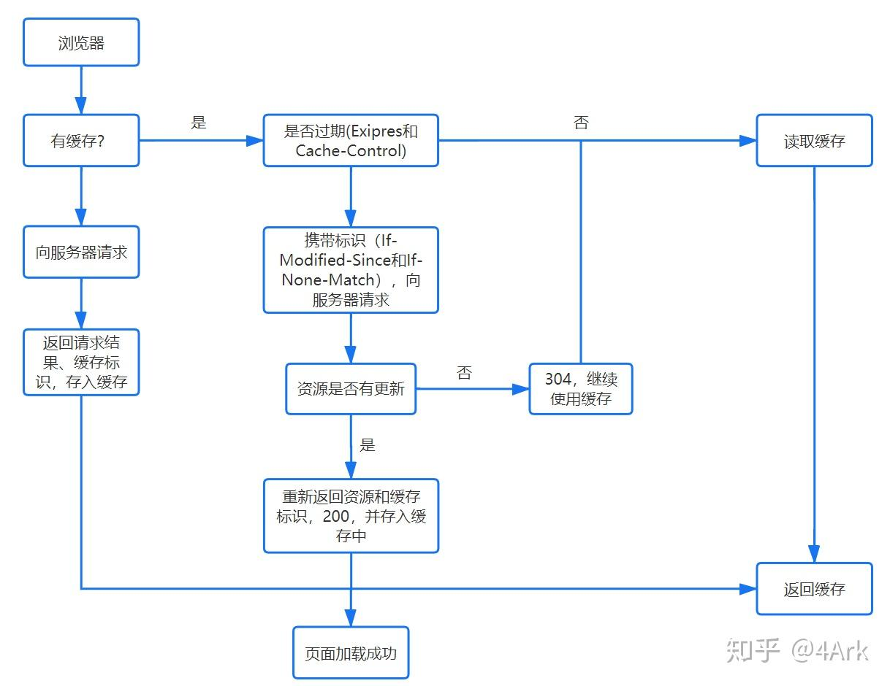

### 2. DNS 查询

URL 需要转换为 服务器的 IP 地址

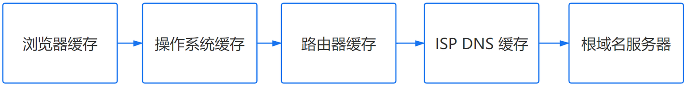

1. 浏览器缓存

浏览器会先检查是否在缓存中，没有则调用系统库函数进行查询。

2. 操作系统缓存

操作系统也有自己的 DNS 缓存，但在这之前，会向检查域名是否存在本地的 Hosts 文件里，没有则向 DNS 服务器发送查询请求。

3. 路由器缓存

路由器也有自己的缓存。

4. ISP DNS 缓存

ISP DNS 就是在客户端电脑上设置的首选 DNS 服务器，它们在大多数情况下都会有缓存。

5. 根域名服务器查询

在前面所有步骤没有缓存的情况下，本地 DNS 服务器会将请求转发到互联网上的根域，下面这个图很好的诠释了整个流程：

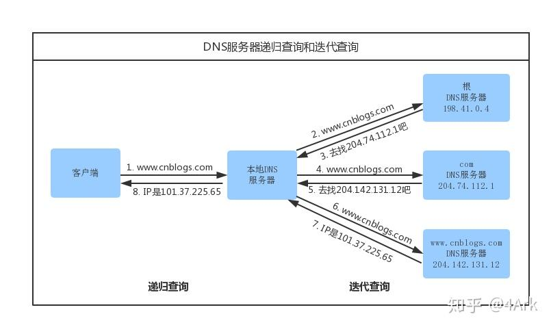

### 3. 建立 TCP 连接，发送 HTTP 请求

已知服务器的 IP 地址，浏览器构造 HTTP 请求报文，包括请求头和请求体，请求头包括请求方法、目标地址、遵循的协议等。

浏览器只能发送 GET、POST 方法，而打开网页使用的是 GET 方法

传输层：通过 3 次握手建立 tcp 连接

网络层：向数据包加入源 IP 和目的 IP，查找传输路线：

- 若目标地址与发送地址在同一网络，直接使用 MAC 地址发送
- 否则使用路由表查找下一跳的地址，并使用 ARP 协议查找对应的 MAC 地址发送

链路层：将数据包拆分为帧，帧包含标头和数据，标头包含数据的发送者、接收者和数据类型。通过广播，用 ARP 协议向本网络的所有设备发送数据，接收方根据收到的帧的标头与自己的 MAC 地址比较，一致就接收，否则丢弃

## 4. 服务器处理请求

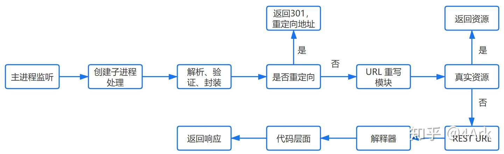

HTTPD 监听请求，开启一个子进程来处理请求

**处理请求**

接受 TCP 报文后，会对连接进行处理，对 HTTP 协议进行解析（请求方法、域名、路径等），并且进行一些验证：

- 验证是否配置虚拟主机
- 验证虚拟主机是否接受此方法
- 验证该用户可以使用该方法（根据 IP 地址、身份信息等）

**重定向**

假如服务器配置了 HTTP 重定向，就会返回一个 301 永久重定向响应，浏览器就会根据响应，重新发送 HTTP 请求（重新执行上面的过程）。

**URL 重写**

然后会查看 URL 重写规则，如果请求的文件是真实存在的，比如图片、html、css、js 文件等，则会直接把这个文件返回。

否则服务器会按照规则把请求重写到 一个 REST 风格的 URL 上。

然后根据动态语言的脚本，来决定调用什么类型的动态文件解释器来处理这个请求。

以 PHP 语言的 MVC 框架举例，它首先会初始化一些环境的参数，根据 URL 由上到下地去匹配路由，然后让路由所定义的方法去处理请求。

## 5. 浏览器接受 HTTP 响应

浏览器接收到来自服务器的响应资源后，会对资源进行分析。

首先查看 Response header，根据不同状态码做不同的事（比如上面提到的重定向）。

如果响应资源进行了压缩（比如 gzip），还需要进行解压。

然后，对响应资源做缓存。

接下来，根据响应资源里的 MIME 类型去解析响应内容（比如 HTML、Image 各有不同的解析方式）。

## 6. 渲染页面

### HTML 解析

- 解码
- 预解析
- 符号化
- 构建树

### CSS 解析

CSS 解析器就会处理它遇到的任何 CSS，根据语法规范解析出所有的 CSS 并进行标记化，然后我们得到一个规则表。

### 渲染树

其实这就是一个 DOM 树和 CSS 规则树合并的过程。

### 布局与绘制

确定渲染树种所有节点的几何属性，比如：位置、大小等等，最后输入一个盒子模型，它能精准地捕获到每个元素在屏幕内的准确位置与大小。

然后遍历渲染树，调用渲染器的 paint() 方法在屏幕上显示其内容。

合并渲染层：把以上绘制的所有图片合并，最终输出一张图片。

回流与重绘：回流的成本要比重绘高很多，所以我们应该尽量避免产生回流。

编译运行 js

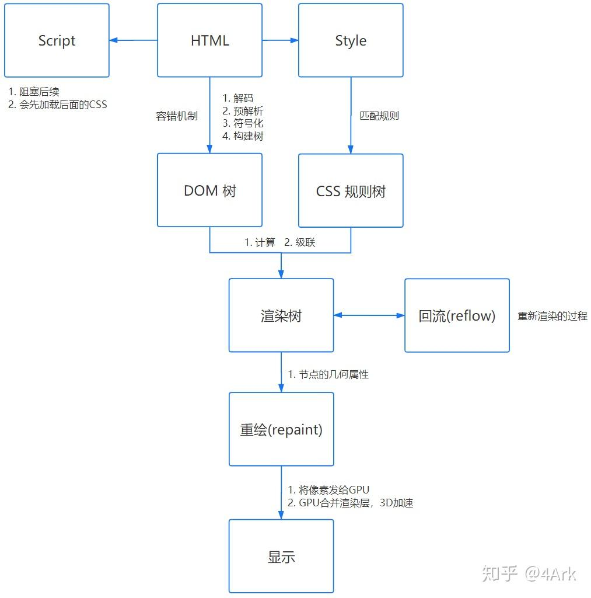

## HTTPS 的实现原理

HTTPS (Hypertext Transfer Protocol Secure) 是基于 HTTP 的扩展，用于计算机网络的安全通信，已经在互联网得到广泛应用。在 HTTPS 中，原有的 HTTP 协议会得到 TLS (安全传输层协议) 或其前辈 SSL (安全套接层) 的加密。

HTTPS 通过使用两种加密算法，即对称加密、非对称加密来保证数据传输安全

对称加密与非对称加密的区别：

- 对称加密：加密和解密使用同一个密钥
  - 优点：算法公开、计算量小、加密速度快、加密效率高，适合加密比较大的数据
- 非对称加密：加密和解密使用不同的密钥，即公钥和私钥
  - 实现机密信息交换的基本过程是：甲方生成一对密钥并将其中的一把作为公钥对外公开；得到该公钥的乙方使用公钥对机密信息进行加密后再发送给甲方；甲方再用自己保存的私钥对加密后的信息进行解密。

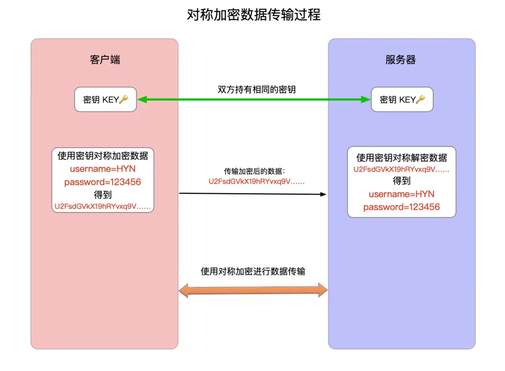

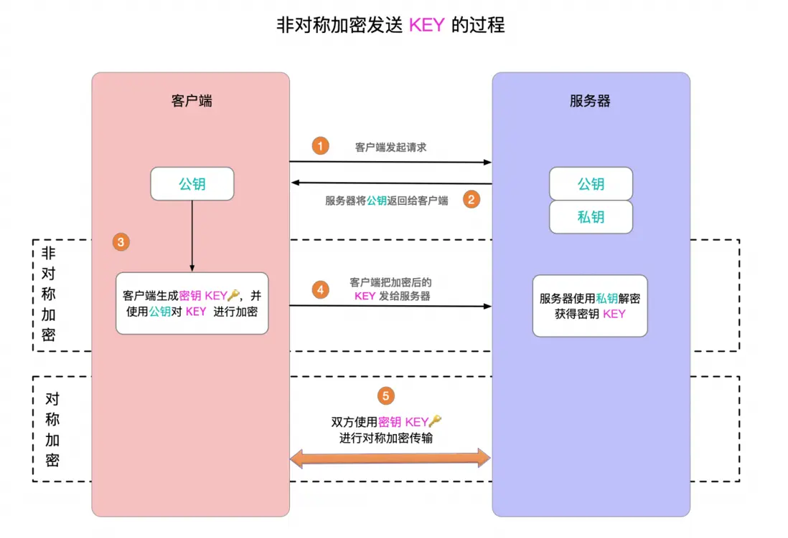

在上述过程中，客户端在拿到服务器的公钥后，会生成一个随机码 (用 KEY 表示，这个 KEY 就是后续双方用于对称加密的密钥)，然后客户端使用公钥把 KEY 加密后再发送给服务器，服务器使用私钥将其解密，这样双方就有了同一个密钥 KEY，然后双方再使用 KEY 进行对称加密交互数据。在非对称加密传输 KEY 的过程中，即便第三方获取了公钥和加密后的 KEY，在没有私钥的情况下也无法破解 KEY (私钥存在服务器，泄露风险极小)，也就保证了接下来对称加密的数据安全。而上面这个流程图正是 HTTPS 的雏形，HTTPS 正好综合了这两种加密算法的优点，不仅保证了通信安全，还保证了数据传输效率。

HTTPS 原理：
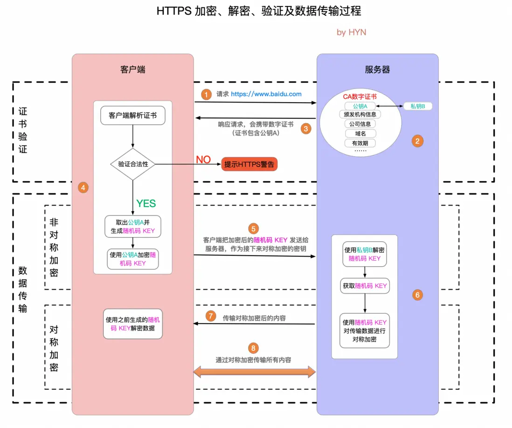

分为两个阶段：证书验证、数据传输

1.客户端请求 HTTPS 网址，然后连接到 server 的 443 端口 (HTTPS 默认端口，类似于 HTTP 的 80 端口)。

2.采用 HTTPS 协议的服务器必须要有一套数字 CA (Certification Authority)证书，证书是需要申请的，并由专门的数字证书认证机构(CA)通过非常严格的审核之后颁发的电子证书 (当然了是要钱的，安全级别越高价格越贵)。颁发证书的同时会产生一个私钥和公钥。私钥由服务端自己保存，不可泄漏。公钥则是附带在证书的信息中，可以公开的。证书本身也附带一个证书电子签名，这个签名用来验证证书的完整性和真实性，可以防止证书被篡改。

3.服务器响应客户端请求，将证书传递给客户端，证书包含公钥和大量其他信息，比如证书颁发机构信息，公司信息和证书有效期等。Chrome 浏览器点击地址栏的锁标志再点击证书就可以看到证书详细信息。

4.客户端解析证书并对其进行验证。如果证书不是可信机构颁布，或者证书中的域名与实际域名不一致，或者证书已经过期，就会向访问者显示一个警告，由其选择是否还要继续通信。如果证书没有问题，客户端就会从服务器证书中取出服务器的公钥 A。然后客户端还会生成一个随机码 KEY，并使用公钥 A 将其加密。

5.客户端把加密后的随机码 KEY 发送给服务器，作为后面对称加密的密钥。

6.服务器在收到随机码 KEY 之后会使用私钥 B 将其解密。经过以上这些步骤，客户端和服务器终于建立了安全连接，完美解决了对称加密的密钥泄露问题，接下来就可以用对称加密愉快地进行通信了。

7.服务器使用密钥 (随机码 KEY)对数据进行对称加密并发送给客户端，客户端使用相同的密钥 (随机码 KEY)解密数据。

8.双方使用对称加密愉快地传输所有数据。

## HTTP 与 HTTPS 协议的区别

- 最最重要的区别就是安全性，HTTP 明文传输，不对数据进行加密安全性较差。HTTPS (HTTP + SSL / TLS)的数据传输过程是加密的，安全性较好。
- 使用 HTTPS 协议需要申请 CA 证书，一般免费证书较少，因而需要一定费用。证书颁发机构如：Symantec、Comodo、DigiCert 和 GlobalSign 等。
- HTTP 页面响应速度比 HTTPS 快，这个很好理解，由于加了一层安全层，建立连接的过程更复杂，也要交换更多的数据，难免影响速度。
- 由于 HTTPS 是建构在 SSL / TLS 之上的 HTTP 协议，所以，要比 HTTP 更耗费服务器资源。
- HTTPS 和 HTTP 使用的是完全不同的连接方式，用的端口也不一样，前者是 443，后者是 80。

## HTTP 的状态码

类型：

- 信息响应 (100–199)
- 成功响应 (200–299)
- 重定向消息 (300–399)
- 客户端错误响应 (400–499)
- 服务端错误响应 (500–599)

常见：

- 200 OK 请求成功
- 301 Moved Permenantly 请求资源的 URL 已永久更改。在响应中给出了新的 URL。
- 404 Not Found 服务器找不到请求的资源。在浏览器中，这意味着无法识别 URL。
- 502 Bad Gateway 此错误响应表明服务器作为网关需要得到一个处理这个请求的响应，但是得到一个错误的响应。

## 重定向是什么

重定向（Redirect）是一种网络技术，指当用户访问某个网页或资源时，服务器通过发送特定指令，强制浏览器跳转到另一个指定的地址。此过程中，浏览器地址栏显示的 URL 会自动变为目标地址，用户通常会感知到页面发生了自动切换。

核心机制与类型：

重定向主要通过 HTTP 状态码实现，常见的类型包括：

- 301 永久重定向：告诉浏览器该资源已永久迁移至新地址。浏览器会缓存此关联，后续直接请求新地址。适用于网站换域名或页面永久搬迁。
- 302 临时重定向：告知浏览器资源仅临时移动。浏览器不会缓存，每次仍会先请求原地址，再被引导至新地址。适用于网站维护或临时跳转。

为什么要使用重定向？

- 网站迁移与优化：当网站更换域名、合并页面或删除旧内容时，确保用户和搜索引擎（如 Google）能找到新资源，避免出现“404 Not Found”错误。
- URL 规范化：将多种访问方式（如 http 与 https，或带 www 与不带 www 的域名）统一指向一个首选地址，有利于 SEO（搜索引擎优化）。
- 安全性与业务逻辑：在用户登录验证、OAuth 授权流程（通过 Redirect URI 回调）或将流量引导至安全环境时发挥重要作用。

与请求转发的区别

- 重定向：是由浏览器发起的二次请求，地址栏会改变，服务器告诉浏览器“去别处找”。
- 请求转发：是在服务器内部完成的，浏览器只发了一次请求，地址栏保持不变，用户对此过程无感知。

## 正向代理与反向代理

正向代理是一种位于客户端和服务器之间的代理服务器。客户端将请求发送给正向代理，然后由代理服务器将请求转发给目标服务器。服务器将响应返回给代理服务器，再由代理服务器将响应转发给客户端。正向代理对客户端是透明的，客户端无需知道实际服务器的地址。

正向代理特点：

1. 隐藏客户端身份： 正向代理可以隐藏客户端的真实 IP 地址，保护客户端的隐私。
2. 访问控制： 正向代理可以根据一定的规则限制或允许客户端的访问请求，实现访问控制功能。
3. 缓存加速： 正向代理可以缓存经常访问的页面或资源，提高访问速度，减轻服务器负担。

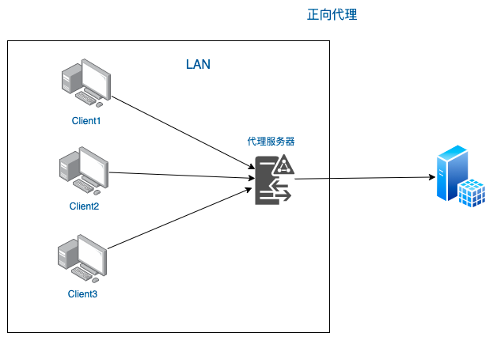

使用场景：

1. 突破网络限制： 在某些地区或网络环境下，用户可能无法直接访问某些网站或服务。此时，可以通过设置正向代理来突破这些限制，实现访问。
2. 网络安全： 通过正向代理，企业可以监控和管理员工的网络访问行为，隐藏客户端真实 IP，防止敏感数据泄露。
3. 内容过滤： 学校、图书馆等公共场所可以通过正向代理过滤不良内容，保护用户免受不良信息的侵害。
4. 提高访问速度： 代理服务器设置硬盘缓冲区，可以将部分高频请求的响应数据保存到缓冲区中，以提高访问速度。

3.1 反向代理概念
反向代理是一种位于服务器和客户端之间的代理服务器。客户端将请求发送给反向代理，然后由代理服务器根据一定的规则将请求转发给后端服务器。后端服务器将响应返回给代理服务器，再由代理服务器将响应转发给客户端。反向代理对客户端是透明的，客户端无需知道实际服务器的地址,只需将反向代理当作目标服务器一样发送请求就可以了。

3.2 反向代理特点

1. 负载均衡： 反向代理可以根据后端服务器的负载情况，将请求分发到不同的服务器上，实现负载均衡，提高系统的整体性能。
2. 安全性增强： 反向代理可以隐藏后端服务器的真实地址和端口，防止直接攻击（如 DoS/DDoS）。同时，还可以实现 SSL 加密、访问控制等安全功能。
3. 缓存优化： 反向代理可以缓存静态资源，减少后端服务器的负载，提高响应速度。

3.3 使用场景

1. Web 应用： 在 Web 应用中，反向代理常用于实现负载均衡、安全访问控制以及缓存优化等功能。
2. API 网关： API 网关通常采用反向代理的方式，对外部请求进行统一管理和调度，实现 API 的安全、高效访问。
3. CDN 加速： 内容分发网络（CDN）通过在全球范围内部署反向代理服务器，实现内容的就近访问和加速传输。

正反向代理的比较
4.1 相同点

1. 位置和功能： 正向代理和反向代理都位于客户端和真实服务器之间，它们的主要功能都是将客户端的请求转发给服务器，然后再将服务器的响应转发给客户端。
2. 提高访问速度： 两者都能通过缓存机制提高访问速度。当客户端请求某个资源时，如果代理服务器已经缓存了该资源，就可以直接从缓存中提供，而无需再次从原始服务器获取，从而节省了时间和带宽。

4.2 不同点

1. 代理对象： 正向代理是为客户端提供代理服务，即服务器不知道真正的客户端是谁。而反向代理则是为服务器提供代理服务，即客户端不知道真正的服务器是谁。
2. 架设位置： 正向代理通常是由客户端架设的，而反向代理则是由服务器架设的。
3. 用途和目的： 正向代理的主要用途是为在防火墙内的局域网客户端提供访问 Internet 的途径，侧重于解决访问限制问题。而反向代理的主要用途是将防火墙后面的服务器提供给 Internet 用户访问，其目的在于实现负载均衡、安全防护等。
4. 服务对象： 在正向代理中，服务器不知道真正的用户是谁；而在反向代理中，用户不知道真正的服务器是谁。

## 路由器和交换机分别在 OSI 7 层模型中的哪一层

1. 交换机 (Switch) —— 工作在 第二层：数据链路层
   交换机主要负责在一个局域网（LAN）内部转发数据。
   识别依据： 它通过 MAC 地址（网卡的物理地址）来识别设备。
   功能特点： 它像是一个楼层管理员。它知道每一户（设备）的门牌号（MAC 地址），并确保数据包能准确地送到同一个办公室内的某台电脑上。
   常用协议/技术： Ethernet（以太网）、VLAN。
2. 路由器 (Router) —— 工作在 第三层：网络层
   路由器负责在不同的网络之间转发数据（例如连接你的家和互联网）。
   识别依据： 它通过 IP 地址（逻辑地址）来寻址。
   功能特点： 它像是一个邮局。当你需要把邮件发往另一个城市（另一个网络）时，路由器负责规划路径，决定数据包该走哪条路才能到达目的地。
   常用协议/技术： IP、ICMP、OSPF、BGP。

## socket 创建客户端和服务器的交互步骤

服务端流程

- 创建 Socket：调用 socket() 创建一个套接字，作为通信端点。
- 绑定地址 (Bind)：使用 bind() 将套接字与服务器的 IP 地址及端口号（如
  ）绑定。
- 开启监听 (Listen)：调用 listen() 将套接字转为被动模式，开始监听客户端的连接请求。
- 接受连接 (Accept)：使用 accept() 阻塞等待，直到有客户端发起连接。连接建立后，它会返回一个用于通信的全新套接字。
- 数据传输：在连接的套接字上使用 recv() 接收数据，使用 send() 发送响应。
- 关闭连接：任务完成后调用 close() 关闭相关套接字，释放系统资源。

客户端流程

- 创建 Socket：调用 socket() 创建客户端套接字。
- 发起连接 (Connect)：使用 connect() 指定服务器的 IP 地址和端口号，向服务端发起连接请求。
- 数据传输：连接建立后，通过 send() 发送请求，通过 recv() 接收服务器的响应。
- 关闭连接：通信结束后调用 close() 关闭套接字。

关键点总结

- 多线程/多进程：为了让服务器同时处理多个客户端，通常会在 accept() 后创建一个新线程或进程来处理具体通信，从而使主线程能持续监听新的连接请求。
- 阻塞与非阻塞：默认情况下，accept、recv 等函数会阻塞程序运行，直到操作完成。在高性能应用中，常使用异步或非阻塞模式来提升效率。

## RPC 协议和 HTTP 协议的区别

RPC（远程过程调用）和 HTTP（超文本传输协议）的主要区别在于：RPC 专注于不同系统间的方法调用，通常基于 TCP 或更高效的二进制协议（如 Protobuf），注重性能与强类型定义，适合微服务内部高并发调用；HTTP 则属于应用层协议，通常用于 Web 浏览器与服务器通信，基于文本（如 JSON），通用性强但协议头较重。

以下是具体的对比分析：
设计目标与概念：RPC 的核心是“像调用本地方法一样调用远程服务”，不关心底层细节；HTTP 的核心是“超文本传输”，注重资源和状态的交互（如 RESTful API）。
通信协议与传输层：RPC 框架可以基于 TCP（如 Dubbo）或 HTTP/2（如 gRPC）实现，天然支持长连接；HTTP 主要使用 TCP 连接，常使用短连接或 HTTP/1.1 的 Keep-Alive。
数据序列化：RPC 通常使用高效的二进制序列化（如 Protobuf、Thrift），体积更小，速度快；HTTP 则普遍使用 JSON、XML 等文本格式，数据包更大，解析性能稍逊。
应用场景：
RPC：适合分布式系统、微服务架构中的内部高吞吐量、低延迟的服务间调用。
HTTP：适合 Web 应用程序、移动端 API 接口、跨平台跨语言的数据交互。
开发效率与复杂性：HTTP/RESTful 接口简单，易于测试和理解；RPC 框架需要预先定义接口文件（IDL），集成更复杂

## HTTP 的长连接和短连接

在 HTTP/1.0 中默认使用短连接。也就是说，客户端和服务器每进行一次 HTTP 操作，就建立一次连接，任务结束就中断连接。当客户端浏览器访问的某个 HTML 或其他类型的 Web 页中包含有其他的 Web 资源（如 JavaScript 文件、图像文件、CSS 文件等），每遇到这样一个 Web 资源，浏览器就会重新建立一个 HTTP 会话。

而从 HTTP/1.1 起，默认使用长连接，用以保持连接特性。使用长连接的 HTTP 协议，会在响应头加入这行代码：Connection:keep-alive

在使用长连接的情况下，当一个网页打开完成后，客户端和服务器之间用于传输 HTTP 数据的 TCP 连接不会关闭，客户端再次访问这个服务器时，会继续使用这一条已经建立的连接。Keep-Alive 不会永久保持连接，它有一个保持时间，可以在不同的服务器软件（如 Apache）中设定这个时间。实现长连接需要客户端和服务端都支持长连接。

HTTP 协议的长连接和短连接，实质上是 TCP 协议的长连接和短连接

短连接：适用于网页浏览等数据刷新频度较低的场景。

长连接：适用于客户端和服务端通信频繁的场景，例如聊天室，实时游戏等。

# 操作系统

## 进程和线程的区别

进程：是并发执行的程序在执行过程中分配和管理资源的基本单位，竞争计算机系统资源的基本单位。

线程：比进程更轻量级的存在。是进程的一个执行单元，也是 CPU 调度的基本单位

协程：比线程更轻量级的存在。一个线程可有多个子协程。协程的执行过程类似于子例程，例如无返回值的函数调用。协程由程序员操作

区别：

- **资源**：
  - 进程之间的资源独立，例如地址空间、内存、IO、cpu 等，利于资源的管理与保护；
  - 线程共享进程的资源
- **健壮性**：多进程要比多线程健壮
  - 一个进程崩溃后，在保护模式下不会对其他进程产生影响
  - 一个线程崩溃可能导致整个进程崩溃（因共享地址空间）。
- **开销**：
  - 进程：创建、销毁、切换（上下文切换）开销较大；
  - 线程：创建、销毁、切换开销较小，
- **根本区别**：
  - 线程是任务调度和执行的基本单位，进程不是
  - 进程是操作系统分配资源和独立运行的基本单位。
- 使用场景：
  - 对资源的管理和保护要求高，不限制开销和效率时，使用**多进程。**
  - 要求效率高，频繁切换时，资源的保护管理要求不是很高时，使用**多线程**。

例子：

- 打开一个浏览器应用：进程
- 浏览器中同时加载图片的线程、处理脚本的线程
- IO 操作：协程

总结：进程是操作系统资源分配的基本单位（如运行中的程序），拥有独立内存空间；线程是 CPU 调度和执行的最小单位，共享所属进程的资源。进程创建/切换开销大，线程较轻量、切换快。一个进程可包含多个线程，但至少包含一个。

### python 多线程的问题

由于全局解释锁 GIL 的存在，多线程在 python 中只能交替执行，无法有效利用多核 cpu

## 线程安全和线程同步如何实现

线程安全：线程安全是指多线程环境下，程序能够正确、稳定地运行，不会出现数据不一致或者其他不可预料的结果。

实现线程安全的主要方法包括：

- 避免共享状态：尽量让每个线程只操作自己的数据
- 将共享变量设计为不可变的（final
- 使用同步机制：当必须共享数据时，使用同步机制（如锁）来确保数据访问的原子性和顺序性。
- 使用线程安全的集合和类：Java 等语言提供了许多线程安全的集合和类，可以直接使用。

线程同步：线程同步是协调多个线程之间的执行顺序，以确保它们能够正确地共享资源。在多线程环境中，线程之间可能会争夺对共享资源的访问权，如果没有适当的同步机制，就可能导致数据不一致或其他问题。

线程同步的主要方法包括：

- **串行化**：如果有一个线程正在访问某共享（临界）资源，那么在它结束访问之前，其他线程不能执行访问同一资源的代码（访问临界资源的代码叫临界代码），其他线程想要访问同一资源，则它必须等待，直到那个线程访问完成，它才能获得访问的机会，现实中有很多这样的例子。比如高速公路上的汽车过检查站，假设检查站只有一个车道，则无论高速路上有多少车道，过检查站的时候只能一辆车接着一辆车，从单一车道鱼贯而入。
- **原子操作/变量：**
  - 原子变量的操作都是原子的。
  - 操作是原子性的，意味着它是一个不可细分的操作整体，原子变量的用户观察它，只能看到未完成和已完成 2 种状态，看不到半完成状态。
- **使用锁**：通过获取和释放锁来控制对共享资源的访问。当一个线程持有锁时，其他线程无法访问该资源，直到锁被释放。
  - 互斥锁 (synchronized)：确保在同一时间，只能有一个线程对该共享资源进行访问。
    - 当互斥锁处于未加锁状态时，则加锁成功（把锁设置为已加锁状态），并返回；当互斥锁处于已加锁状态时，那么试图对它加锁的线程会被阻塞，直到该互斥量被解锁。
  - 读写锁：与互斥锁类似。允许同时读，但写时互斥，适用于读多写少的场景
  - 自旋锁：获取锁失败时并不直接进入睡眠状态，而是忙等，即紧凑的执行 Test-And-Set 指令，直到 TAS 成功
  - 合理设置锁的粒度，粒度太大会降低性能，太小会增加代码编写复杂度。
- **条件变量**：用于生产者-消费者模式中，用于优化轮询等检查消息队列是否有消息的方式。
  - 条件变量能够让线程等待某个条件发生
  - 条件变量本身受互斥锁保护
  - 线程在改变条件变量前先获得锁，然后改变条件状态，再解锁，最后发出**通知**
  - 等待条件的睡眠中的线程在被通知唤醒前，必须先获得锁，再判断条件状态，如果条件不成立，则继续转入睡眠并释放锁。
- **使用 volatile 关键字**：java 中的 volatile 作为一种变量修饰符，表示这个变量的值可能在当前线程控制之外发生变化，每次都必须从“主存”读取，不能使用缓存或重排序优化。

## 死锁产生的原因及解决策略

死锁：多个线程因竞争资源而造成的一种僵局（互相等待），若无外力作用，这些进程都将无法向前推进。

死锁产生的原因：

1. 系统资源的竞争：通常系统中拥有的不可剥夺资源，其数量不足以满足多个进程运行的需要，使得进程在 运行过程中，会因争夺资源而陷入僵局，如磁带机、打印机等。只有对不可剥夺资源的竞争 才可能产生死锁，对可剥夺资源的竞争是不会引起死锁的。
2. 进程推进顺序：进程在运行过程中，请求和释放资源的顺序不当，也同样会导致死锁。例如，并发进程 P1、P2 分别保持了资源 R1、R2，而进程 P1 申请资源 R2，进程 P2 申请资源 R1 时，两者都 会因为所需资源被占用而阻塞。

3）信号量使用不当也会造成死锁。进程间彼此相互等待对方发来的消息，结果也会使得这些进程间无法继续向前推进。例如，进程 A 等待进程 B 发的消息，进程 B 又在等待进程 A 发的消息，可以看出进程 A 和 B 不是因为竞争同一资源，而是在等待对方的资源导致死锁。

死锁产生的必要条件：

产生死锁必须同时满足以下四个条件，只要其中任一条件不成立，死锁就不会发生。

- 互斥条件：进程要求对所分配的资源（如打印机）进行排他性控制，即在一段时间内某 资源仅为一个进程所占有。此时若有其他进程请求该资源，则请求进程只能等待。
- 不剥夺条件：进程所获得的资源在未使用完毕之前，不能被其他进程强行夺走，即只能 由获得该资源的进程自己来释放（只能是主动释放)。
- 请求和保持条件：进程已经保持了至少一个资源，但又提出了新的资源请求，而该资源 已被其他进程占有，此时请求进程被阻塞，但对自己已获得的资源保持不放。
- 循环等待条件：存在一种进程资源的循环等待链，链中每一个进程已获得的资源同时被 链中下一个进程所请求。

避免死锁：

- 加锁顺序（线程按照一定的顺序加锁）
  - 如果一个线程需要一些锁，那么它必须按照一个确定的顺序获取锁。它只有获得了从顺序上排在前面的锁之后，才能获取后面的锁。
- 加锁时限（线程尝试获取锁的时候加上一定的时限，超过时限则放弃对该锁的请求，并释放自己占有的锁）
- 死锁检测：
  - 每当一个线程获得了锁/请求锁，会在线程和锁相关的数据结构中（map、graph 等等）将其记下。
  - 当一个线程请求锁失败时，这个线程可以遍历锁的关系图看看是否有死锁发生。

当检测出死锁时，这些线程该做些什么呢？

- 释放所有锁，回退，并且等待一段随机的时间后重试。
- 更好的方案是给这些线程设置优先级，让一个（或几个）线程回退，剩下的线程就像没发生死锁一样继续保持着它们需要的锁
  - 如果赋予这些线程的优先级是固定不变的，同一批线程总是会拥有更高的优先级。为避免这个问题，可以在死锁发生的时候设置随机的优先级。

## 内存换出算法有哪些

内存换出算法（页面置换算法）在物理内存不足时，依据局部性原理将暂时不用的数据置换到硬盘（swap 分区）以腾出空间。常见算法包括 FIFO（先进先出）、LRU（最近最少使用）、Clock（时钟算法）及其改进版（第二次机会算法），Linux 内核多使用 LRU 的变体来优化性能。

- FIFO
- 最近最少用 LRU
- 最佳替换算法 OPT
- Clock（时钟算法）及其改进版（第二次机会算法）

### FIFO

原理：淘汰在内存中驻留时间最长的页面
特点：实现简单，但性能较差，可能会把频繁使用的页面换出。

FIFO 算法的 Belady 现象：增加可用物理页框数量，反而缺页异常更多了

### 最近最少用 LRU

原理：淘汰最近一段时间内最久未被访问的页面
优缺点：性能较好，符合局部性原理，但实现需要复杂的数据结构（如哈希表+双向链表）维护页面使用顺序，开销较大。

页面淘汰队列：存放当前在内存中的页号，每访问一页就调整一次

- 队列尾：指向最近访问的页
- 队列头：指向最近最少用的页
- 执行一次页面访问后，需要从队列中把该页调整到队列
- 发生缺页中断时总淘汰队列头所指示的页

### 最佳替换算法 OPT

每次淘汰掉：

- 以后不再访问的页
- 未来最长时间内不再被访问的页面

由于无法预测未来，因此该算法无法实现，仅用于衡量其他算法的性能

### Clock (时钟置换算法)

原理：一种近似 LRU 的算法。为每个页面设置一个访问位（R 位），当内存需要置换页面时，指针按环形移动，R 位为 1 则清 0 并跳过，R 位为 0 则直接淘汰。

改进（第二次机会算法）：结合 FIFO，不仅检查 R 位，还检查修改位 (M 位)，优先置换未修改过的页面，减少磁盘 I/O。

### Linux 内存管理策略

原理：

- Linux 内核通过 active_list（活跃）和 inactive_list（不活跃）两个双向链表来实现改进的 LRU 算法
- 当内存紧张时，内核会优先淘汰 inactive_list 中较少被访问的页面（从 inactive_list 的尾部开始，如果内存页的 PG_referenced 标志位为 1 时，将跳过此内存页，并且将此内存页的 PG_referenced 标志位设置为 0；如果内存页的 PG_referenced 标志位为 0 ，淘汰此页面）。
- 另外，处于 活跃链表 的内存页也有衰退的过程，衰退过程如下：
  - 如果内存页的 PG_referenced 标志位为 1，那么衰退过程将会把此内存页的 PG_referenced 标志位设置为 0。
  - 如果内存页的 PG_referenced 标志位为 0，那么衰退过程将会把此内存页移动到 非活跃链表 中。

## 进程/CPU 调度算法有哪些

当 cpu 空闲时，会依据 cpu 调度算法，选择某个在就绪队列中的进程来运行，

- 非抢占式调度：当进程正在运行时，它就会一直运行
- 抢占式调度：运行中的进程可以被打断，CPU 让其他进程先运行
- 先来先服务 FCFS
- 最短作业优先调度算法 SJF
- 高响应比优先调度算法
- 时间片轮转调度算法 Round Robin
- 最高优先级调度算法
- 多级反馈队列调度算法

### 先来先服务

每次选择就绪队列中的第一个进程，采用非抢占式

FCFS 对长作业有利，适用于 CPU 繁忙型作业的系统，而不适用于 I/O 繁忙型作业的系统。

### 最短作业优先

每次选择运行时间最短的进程，采用非抢占式

这显然对长作业不利，很容易造成一种极端现象。比如，一个长作业在就绪队列等待运行，而这个就绪队列有非常多的短作业，那么就会使得长作业不断的往后推，周转时间变长，致使长作业长期不会被运行。

### 高响应比优先

计算响应比优先级，每次选择优先级最高的进程

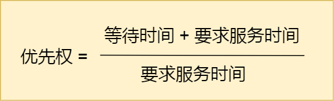

该算法权衡了短作业和长作业

### 时间片轮转

固定一个时间片，每个进程运行相同的时间片，一个时间片内没运行完的进程回到队尾

### 最高优先级

每次选择就绪队列中优先级最高的进程

优先级可以分为，静态优先级或动态优先级：

- 静态优先级：创建进程时候，优先级就确定且不变
- 动态优先级：根据进程的动态变化调整优先级，比如如果进程运行时间增加，则降低其优先级，如果进程等待时间（就绪队列的等待时间）增加，则升高其优先级，也就是随着时间的推移增加等待进程的优先级。

### 多级反馈队列

多级反馈队列是「时间片轮转算法」和「最高优先级算法」的综合和发展

原理：

- 设置了多个队列，赋予每个队列不同的优先级，每个队列优先级从高到低，同时优先级越高时间片越短；算法每次选择最高优先级队列的队头进程运行
- 新的进程会被放入到第一级队列的末尾，按先来先服务的原则排队等待被调度，如果在第一级队列规定的时间片没运行完成，则将其转入到第二级队列的末尾(即，降低优先级)，以此类推，直至完成；
- 当较高优先级的队列为空，才调度较低优先级的队列中的进程运行。如果进程运行时，有新进程进入较高优先级的队列，则停止当前运行的进程并将其移入到原队列末尾，接着让较高优先级的进程运行；

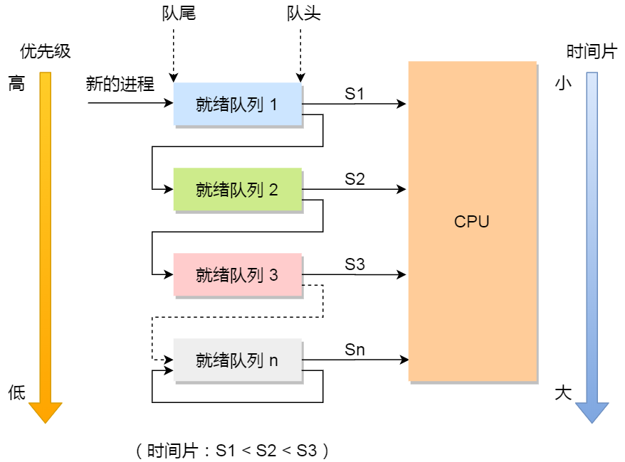

可以发现，对于短作业可能可以在第一级队列很快被处理完。对于长作业，如果在第一级队列处理不完，可以移入下次队列等待被执行，虽然等待的时间变长了，但是运行时间也会更长了，所以该算法很好的兼顾了长短作业，同时有较好的响应时间。

## 为什么采用多线程（多进程），对多线程（多进程）的理解

采用多线程或多进程主要为了提升程序并发执行能力、充分利用多核 CPU 资源、提高系统响应速度以及处理耗时任务（如 I/O 操作或复杂计算）。多线程适合 I/O 密集型任务，数据共享快、切换开销小；多进程适合计算密集型任务，隔离性好、更稳定，能利用独立内存空间避免单个任务崩溃影响整体。

一、 为什么采用多线程/多进程？

采用多线程的优势：

- 充分利用多核 CPU（并行计算）： 现代计算机多为多核，单线程只能占满一核。通过多线程或多进程，可以将任务分配到不同核心同时执行。
- 后台任务处理： 将耗时操作（如文件下载、数据库查询）放在后台线程中，避免阻塞主线程，保持程序流畅。
- 处理 I/O 密集型任务： 如网络请求、读写文件，线程在等待 I/O 时会让出 CPU，其他线程可继续工作，显著提高效率。
- 提高系统资源利用率：相比进程，线程是轻量级的，创建、销毁和切换成本更低。

多进程的优势：

- 充分利用多核 CPU

二、 对多线程与多进程的理解

1. 多线程 (Multithreading)

   本质： 同一进程内的多个执行流，共享进程的地址空间（内存、全局变量等）。
   优点： 通信方便（直接读写内存）、创建和切换快、系统开销小。
   缺点： 健壮性差（一个线程崩溃可能导致整个进程崩溃）、存在线程安全问题（需要加锁同步）、调试困难。
   适用场景： 网络 I/O 操作、数据库操作、共享数据频繁的后台任务。

2. 多进程 (Multiprocessing)

   本质： 操作系统进行资源分配和调度的基本单位，每个进程拥有独立的地址
   空间。
   优点： 健壮性好（一个进程崩溃不影响其他进程）、适合长时间运行的计算任务。
   缺点： 内存消耗大、创建和切换成本高、进程间通信（IPC）复杂。
   适用场景： CPU 密集型任务（如视频编码、科学计算）、需要高稳定性的服务。

## 并发和并行

并发：一个 cpu 在一段时间内同时处理多个任务。利用时间片等调度技术实现

- 即，一个时间段中有几个程序都处于已启动运行到运行完毕之间，且这几个程序都是在同一个 cpu 上运行。

并行：多 cpu 在某个时间点上同时处理多个任务

- 即，当系统有一个以上 CPU 时，当一个 CPU 执行一个进程时，另一个 CPU 可以执行另一个进程，两个进程互不抢占 CPU 资源

## 大量数据不能同时存入内存，该如何解决

三种对数据的预处理操作：压缩、分块、索引

- 压缩：
  - 无损压缩：不改变数据包含的信息。例如改变内存中数据的表示形式(用 0、1 比特代替某个有且两个值的数据)
  - 有损压缩：存储的数据丢失了一些原始数据里的细节信息，但理想情况下不会对计算结果造成影响
- 分块：每次计算只加载大量数据中的某一小块
- 索引：只将索引加载到内存，索引指向数据中的某些分块

## 守护进程是什么

守护进程（Daemon）是 Linux/Unix 系统后台运行的特殊进程，独立于控制终端，通常在系统启动时运行直至关机。它们在后台处理系统级任务（如网络服务、日志记录、数据库管理），如 sshd（SSH 服务）、httpd（Web 服务）、crond（定时任务）。特点是常驻内存、非交互式，名称通常以字母 "d" 结尾。

守护进程的核心特征与细节：

- 独立终端： 脱离控制终端、登录会话和进程组，不受用户注销影响。
- 用户层守护进程的父进程是 init 进程。对于用户层守护进程， 因为它真正的父进程在 fork 出子进程后就先于子进程 exit 退出了，所以它是一个由 init 继承的孤儿进程。
- 权限：多以 root 用户运行，以访问特殊资源（1-1024 端口）。

创建流程：

- fork 一个子进程，并终止父进程，使得子进程继续在后台运行
- 调用 setsid() 创建新会话，来脱离控制终端。
- 改变当前工作目录到根目录，防止占用卸载的文件系统。
- 设置进程的文件权限掩码为 0，清除从父进程那里继承来的掩码
- 关闭不需要的文件描述符。
- 运行方式：响应系统事件或请求（如 systemd 管理的后台服务）。

守护进程与服务的区别：

- Daemon（守护进程）： 是实现特定功能的后台程序（如 crond 进程）。
- Service（服务）： 提供的功能本身（如 cron 计划任务服务）。

## 什么是协程

协程（Coroutine）是一种用户态的轻量级执行单元，可以在执行过程中主动让出控制权（yield），稍后再从让出的地方继续执行。

协程的目标：当出现长时间的 I/O 操作时，通过让出目前的协程调度，执行下一个任务的方式，来消除上下文切换上的开销。

特点：

- 线程的切换由操作系统负责调度，**协程由用户自己进行调**度，因此减少了上下文切换，降低开销，提高了效率。
- 内存占用低，因此可以在相同的内存中开启更多的协程
- 代码结构清晰
- 适合 I/O 密集场景。但不适用于大量计算的多线程，遇到此种情况，更好实用线程去解决

原理：当出现 IO 阻塞的时候，由协程的调度器进行调度，通过将数据流立刻 yield 掉（主动让出），并且记录当前栈上的数据，阻塞完后立刻再通过线程恢复栈，并把阻塞的结果放到这个线程上去跑

## 线程的 6 种状态

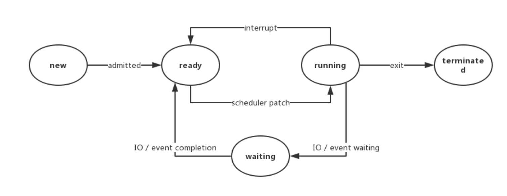

操作系统的线程主要有以下三个状态：

- 就绪状态(ready)：线程正在等待使用 CPU，经调度程序调用之后进入 running 状态。
- 执行状态(running)：线程正在使用 CPU。
- 等待状态(waiting): 线程经过等待事件的调用或者正在等待其他资源（如 I/O）。

java 线程的 6 种状态：新建、运行、阻塞、等待、超时等待和终止

### 新建

处于 NEW 状态的线程此时尚未启动。这里的尚未启动指的是还没调用 Thread 实例的 start()方法。

### 运行

运行中，或者在等待 CPU 分配资源。包含了 ready 和 running 两种状态

### 阻塞

正等待锁的释放以进入同步区

### 等待

处于等待状态的线程要想变成 "运行" 状态，需要其他线程唤醒。

### 超时等待

线程等待一个具体的时间，时间到后会被自动唤醒。

### 终止

线程执行完毕。
