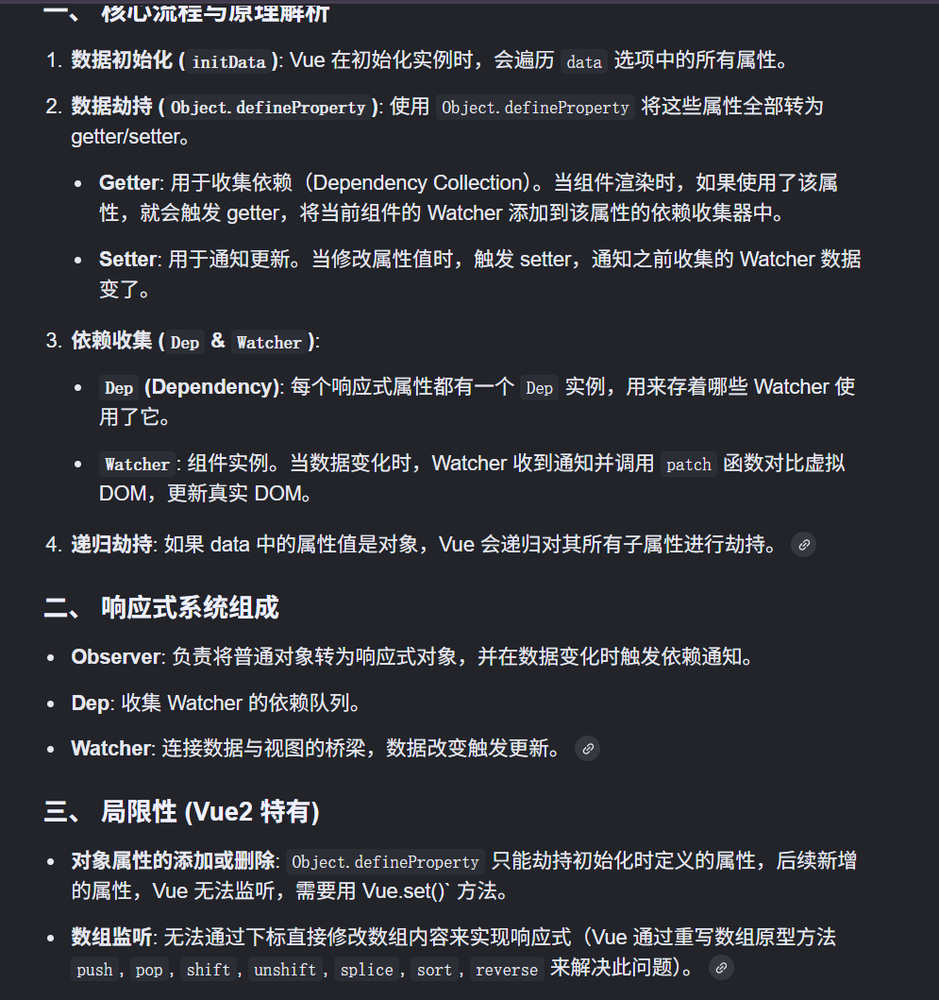

“这个问题我之前没有了解过，但是我想要通过我之前学过的知识来推断下，不能保证一定说对。”

任何问题：先给结论。再分点。再深入

## 自我介绍

面试官，您好，我叫jyx，毕业于南京大学计算机科学与技术专业，在校期间我除了学习专业课程以外，对前端知识体系也进行了系统的自学。

在项目方面，我主要用vue3开发了两个项目，第一个是组件库，整体设计参考了element ui，封装了一些常用组件，实现了基于虚拟列表的树形组件和具有校验功能的表单组件。第二个是后台管理系统，在这个项目中我主要开发前端，设计实现了基于角色的权限系统，并进行了前后端联调。

在技术方面，我熟悉html、css、js语言和vue2 vue3框架，以及 Vite 的基本使用。

我的学习能力强，做事认真细致，能够快速适应新环境。非常希望能在贵公司实习，进一步提升自己的技术能力，并为团队贡献自己的力量。

部门对于实习生的综合素质和技术有哪些要求

# html+css

语义化标签，例如 header、footer、nav、main、section 等

## 盒模型

盒模型由四个部分组成的，分别是 margin、border、padding 和 content。

- 标准盒模型的 width、height 只包含 content
- IE 盒模型的的 width、height 除了 content 本身，还包含了 border、padding

box-sizing 属性定义了元素的盒模型：

- content-box 表示标准盒模型（默认值）
- border-box 表示 IE 盒模型，即 width、height 包含 border、padding

## BFC

BFC 目的是形成一个相对于外界完全独立的空间，让内部的子元素不会影响到外部的元素

触发 BFC 的条件包含不限于：

- 根元素，即 HTML 元素
- 浮动元素：float 值为 left、right
- overflow 值不为 visible，为 auto、scroll、hidden
- display 的值为 inline-block、inltable-cell、table-caption、table、inline-table、flex、inline-flex、grid、inline-grid
- position 的值为 absolute 或 fixed

应用场景：

- 防止 margin 重叠（塌陷）：
  - 对于相邻的两个元素，在其中一个元素外面包裹一层容器，并触发这个容器生成一个 BFC，这样两个 p 就不属于同一个 BFC，则不会出现 margin 重叠
- 清除内部浮动，解决父元素高度塌陷问题：
  - 在子元素设置浮动后，父元素会发生高度的塌陷，也就是父元素的高度为 0 解决这个问题，只需要将父元素变成一个 BFC（比如 overflow: hidden），父容器就能自动包住浮动元素。
- 实现自适应多栏布局：左边宽高固定，右边宽度自适应。防止下方元素飞到上方内容
  - 给父元素和右边元素开启BFC

## 布局：Flex 和 Grid 的常用写法（两栏、三栏、圣杯、双飞翼）

定位与层叠上下文

移动端适配（rem/vw、1px 问题）

## 响应式布局

## 闭包

有权访问另一个函数作用域中的变量的函数。创建闭包的最常见方式是在一个函数内创建另一个函数，这个函数可以访问到当前函数的局部变量

优点：

- 创建全局私有变量，避免变量全局污染
- 可以实现封装、缓存

使用场景：

- 创建私有变量
- 延长变量的生命周期
- 封装类和模块
- 科里化函数

## 响应式原理

vue2

监听data的数据，组件data的数据一旦变化，立即触发视图的更新。

Vue2 的响应式核心是通过 ES5 的 Object.defineProperty() 劫持数据的 Getter 和 Setter，结合发布订阅模式（依赖收集）来实现的。当数据变化时，setter 通知Watcher，触发视图更新。

