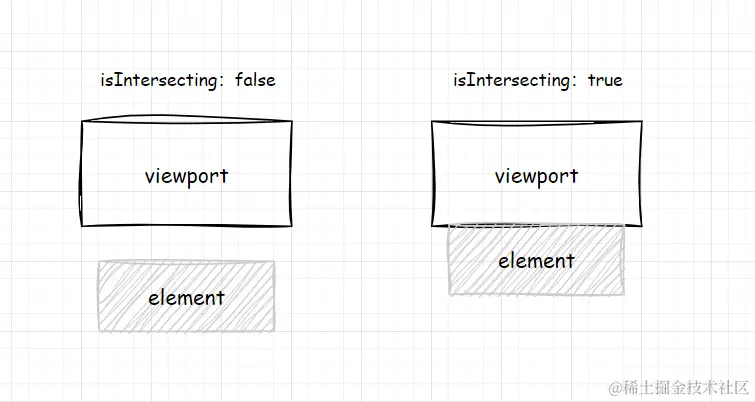

## 性能优化

有没有对项目做一些性能优化

- 工程化
- 数据结构
- 渲染速度

加载阶段

- 路由懒加载
- CDN
- gzip
- brotli
- preload

渲染阶段

- 虚拟列表
- 防抖节流
- keep-alive

请求阶段

- 缓存
- 分页
- debounce

构建阶段

- Tree Shaking
- chunk 拆分
- 按需加载

### 组件库

样式按需加载：每个组件有单独的 style.css，配合 unplugin-vue-components 自动引入

打包产物优化：同时输出ESM、CJS、UMD等格式，适配不同环境；external 掉 vue，避免重复打包 运行时库，配置完 externals 后，需要在 `public/index.html` 中引入对应的 CDN 文件

TypeScript 类型打包优化：使用 rollup-plugin-dts，将每个模块单独的.d.ts合并成入口处的index.d.ts，提高IDE 自动提示速度

虚拟列表组件优化：

- 列表项含有异步资源，会在渲染后再次改变高度。例如：图片异步加载、富文本展开、聊天消息（设置预估高度，使用ResizeObserver来监听高度改变，从而实时获取每一列表项的高度）

- 一个列表项元素很大时，出现跳跃式滚动怎么优化，白屏怎么优化...
- DOM复用：复用已有节点，只更新内容

表单组件优化：

- 校验逻辑在每次  `blur`/`submit`事件触发， 而非 `input` 
- 全量校验：Promise.all并行校验

性能瓶颈：

树组件：

- 节点勾选（尤其是全选/反选）若触发大量数据的响应式更新，会造成明显卡顿

### 后台管理系统

路由组件懒加载：使用箭头函数加 `import()` 来定义组件，实现路由级代码分割，页面按需加载。`component: () => import('@/views/user/index.vue')`

路由缓存：每次页面刷新，都会重新请求用户信息计算动态路由，可以考虑缓存到本地

Pinia 状态管理优化：拆分 store

大量数据优化：虚拟滚动列表、分页缓存、搜索框防抖

keep-alive缓存页面

### 优化的量化指标是怎么样的，如何验证优化是否有效

优化按需加载：

- 指标：bundle 体积
- 使用rollup-plugin*-*visualizer 插件来分析打包后每个页面的打包情况


用户体验导向

- **LCP (Largest Contentful Paint - 最大内容绘制):** 衡量加载速度。在用户视口内最大的图像或文本块完成渲染的时间。**标准：< 2.5秒**。
- **INP (Interaction to Next Paint - 交互到下次绘制):** 衡量交互响应能力。测量用户与页面交互（如点击、按键）到浏览器下一次绘制像素的时间。**标准：< 200毫秒**。
- **CLS (Cumulative Layout Shift - 累积布局偏移):** 衡量视觉稳定性。页面内容在渲染过程中的意外移动。**标准：< 0.1**。
- FCP（**First Contentful Paint - 首次内容绘制**），指页面从开始加载到第一个可视元素在屏幕上完成渲染的时间。

性能优化工具：

- Lighthouse：给出页面的详细分析报告，包括FCP、LCP、CLS、TTI、TBT、SI

## 项目中的难点

分析过程，如何拆解问题

## 开发项目的时候，有没有遇到什么bug，具体是怎么排查的

当时我希望在子组件 mounted 后，去获取并修改父组件中的某个 DOM 元素，比如动态调整父容器高度。

一开始我以为：

```
子组件 mounted
=> 父组件 DOM 一定已经完全挂载
```

所以直接通过 ref 或 querySelector 去操作父组件 DOM。

但实际运行时发现：

```
拿到的 DOM 是 null
或者 DOM 状态不正确
```

后来我专门打印了父子组件生命周期，发现：

- 父组件先 created
- 子组件 created
- 子组件 mounted
- 父组件 mounted

也就是说：

```
子组件 mounted 时
父组件 mounted 还没执行
```

所以这时候父组件某些依赖 mounted 初始化的 DOM 状态其实还不稳定。

后来我的解决方案是：

- 避免子组件直接操作父组件 DOM
- 改成通过 emit 通知父组件处理
- 如果必须等 DOM 更新完成，再结合 nextTick

例如：

```
await nextTick()
```

等页面 patch 完成后再操作。

这个问题之后，我对 Vue 的：

- 生命周期
- DOM patch 时机
- nextTick 本质

理解深了很多。

# 组件库

项目介绍：独立开发基于Vue3的组件库，完成基础组件封装与表单体系实现，支持按需加载。
技术栈：Vue3，Vite，TypeScript，SCSS

- 基于pnpm workspace搭建开发环境，制定BEM命名规范；编写完整TypeScript类型声明；
- 封装若干通用组件（如Button、Input、Form等），降低业务开发中的重复实现成本，提高组件复用率；
- 基于 Vite library mode 构建组件库，拆分组件入口，配合 ES Module 实现 Tree-shaking 与按需引入；
- 实现虚拟列表组件，通过维护可视区起止索引，仅渲染可见节点，结合预渲染缓冲区减少滚动抖动；
- 实现树形数据扁平化处理、异步加载、节点选择等功能；
- 基于provide/inject实现Form表单通信，实现字段注册、校验与统一提交。

## 讲讲你的项目 10 分钟

业务背景与痛点
技术选型及对比（为什么要用这个方案）
性能优化方案及前后数据对比
监控体系设计与降级策略

可维护性：组件遵循单向数据流与受控模式，数据遵循“父组件维护State -> 通过Props传给子组件 -> 子组件触发onChange -> 父组件更新State”的流程。

通过 BEM 命名方式（block 代码块、element 元素、modifier 装饰），命名更规范且清晰，模块层级关系简单清晰，而且 css 书写上也不必作过多的层级选择。

## 为什么是组件库

自己实现组件，更贴近更适合项目，建立团队规范。

虽然可以使用已有的组件库，但自己开发的组件库可以定制功能，使得功能更聚焦，或者便于后期优化性能。

有了组件库，在设计开发产品时可以节约时间成本

而且维护成本低，当UI、功能变更或者有bug时，只需修改组件库就能覆盖所有使用该组件库的项目。

沉淀技术经验：通过文档化和规范化，建立团队的知识库

品牌一致性：企业的产品线通常有特定的设计风格

### 你最初的思路是什么，怎么实现的

采用 monorepo 架构，将组件库代码、文档示例（playground）放在一个仓库下管理，共享依赖且方便本地调试。

制定了BEM命名规范，配合 SCSS 变量实现主题配置。

设计组件

实现具体的组件

## 为什么要组件化

组件是一个相对比较小的功能模块，不需要与外界有太多的通信，更不能依赖其他第三方

1. 业务中组件的开发：规范性弱、适应性低、与业务强耦合

组件可以仅供内部项目使用，此时组件设计会尽量贴合项目的风格。

比方说你的 App 是一个电商项目，你的产品详情页、列表页、购物车、搜索等页面肯定就是调用频次非常高的 VC 了，这些界面之间跳转都会非常频繁。如果不组件化，就造成了互相依赖并且高度耦合。

像商品详情页这些通常外部调入只需要传入一个 productID 就可以，而且高度依赖自己的业务功能的模块就可以将这些当成一个组件维护。后面需要修改里面的活动的显示、业务的增删都可以单独在组件里面改动而不需要改动别的代码。

2. 组件库：组件可以多个项目共同使用，此时组件设计会尽量通用化。

比方说 聊天类型的 App 中用到的聊天键盘，或者集成支付宝、微信等支付功能的支付插件。这些可以在多个不同的项目内部共享。甚至可以开源到社区中提供所有开发者使用的小插件，或者组件。

## 怎么看待业内主流的组件库，他们为什么这么封装

原子化：拆分粒度细(form -> formItem)，可以多种组合(formItem、input)，进一步提高可复用性

封装逻辑，暴露出props供用户自定义配置，便于使用

受控组件：数据保存在外部，手动实现更新逻辑，便于校验或者复杂逻辑

用户可以使用已有样式的完整组件库，也可以使用可自定义样式的逻辑组件库

通信一般使用provide/inject

一致性，风格统一

## 组件库的TypeScript类型推导是如何设计的 遇到过的复杂类型问题怎么解决

1. 定义一些可以在多个组件之间共享的全局类型
2. 定义针对特定组件的props类型，放在单独的type.ts文件里

作用：

- 约束组件的props类型，实现编译时校验；用户代码提示

通过defineEmits定义强类型emit

类型提示：GlobalComponents

类型定义应尽可能精简，同时提供足够的信息来描述类型的形状和行为。避免使用 any 或 unknown 类型

可以使用类型交叉（&）和类型联合（|）来**复用类型**。

## ts在项目的好处坏处

好处

- 提升代码可读性与可维护性：**类型是很好的注释和文档**。开发者通过函数签名即可清晰知道输入输出的数据结构，这对于多人协作和长期维护的大型项目尤为重要。
  静态类型检查，显著减少运行时错误：在编译阶段即可发现变量类型不匹配、属性名拼写错误等问题（如 Cannot read property 'foo' of undefined），减少了低级 Bug。
  极佳的开发体验与工具支持编辑器（如 VS Code）能提供精准的自动补全、类型定义跳转、重命名变量等功能，极大提升编码效率。
  支持面向对象特性：提供了接口 (Interface)、泛型 (Generics)、类 (Classes)、枚举 (Enums) 等强类型语言特性，有助于更好地实现复杂的设计模式。
  增强重构的信心：在修改复杂数据结构时，TS 能迅速指示出所有受影响的代码位置，防止改一处崩全处的状况。

需要显式定义类型、编写接口，增加了代码量和前期的开发工作量，不适用于快速原型开发或小型项目。

anyScript

复杂的类型体操（Type Gymnastics），语法过度嵌套，难以理解

需要编译

## 组件怎么设计

以按钮为例

需求分析：

- 确定业务使用场景，按钮需要有哪些功能，例如提交、取消、加载中、跳转
- 确定按钮样式，例如primary、info、danger
- 确定兼容性，例如适配移动端、支持国际化、多语言切换
- 使用频率：如果按钮使用频率高，对性能、复用性进行优化

组件设计：

- 样式：大中小
- 颜色：primary、secondary、warning、success
- 状态：默认、悬停、按下、禁用、加载中
- 交互：点击后有水波纹、动画；快捷键激活；loading状态时不能重复点击；focus ring/accessibility 支持
- 响应式：适配不同设备尺寸；块级按钮；宽度自适应

组件功能：

- 组件props：组件的大小 size、颜色展现类型 type、圆角 round、正在加载 loading、禁用 disabled、原始类型 native-type
- 插槽，用于传入图标
- 添加点击事件，传出事件给父组件调用

用vitepress编写文档

### 处理 class 合并

将组件内部生成的样式（BEM 规范）与用户在使用时传入的自定义样式合并。

组件内部类名：用工具函数拼接符合bem规范的类名。`.yx-button--primary .yx-button--small`

设置 inheritAttrs: false，关闭自动继承类名。使用v-bind="$attrs"或者useAttrs()接收用户传入的自定义类名

## 具体聊聊某个组件设计细节 

实现icon组件

文件结构：组件库存放在packages文件夹下，入口文件是index.js，具体组件在components下。

核心：利用vue的插件机制，将组件库或单个组件作为插件引入(app.use(UI))，在组件库或组件的install方法中用app.component注册全局组件

注意，Vue.use()传入的插件必须是一个对象或一个函数，当为对象时，该对象必须包含一个install方法。

主要思路：

- 组件定义：icon.vue + icon.ts → props + 样式 + slot
  - props 是父组件传给子组件的“配置项”或“参数”，让子组件可复用且可定制化。
- 类型封装：TS 提供类型提示和检查
- 插件包装：封装withInstall → 给组件附加 install 方法
  - install：Vue 插件机制的核心方法。作用是告诉 Vue：当你执行 app.use(插件) 时，该对象应该做哪些初始化或注册（例如用app.component注册全局组件）。
- 导出：components/icon/index.ts： `export default Icon;`→ 可单独 import 或全局注册（app.use())）、`export * from "./src/icon";`导出组件的类型定义（如 props 类型）、TypeScript 模块增强，告诉 Vue，全局组件库中有一个名为 `YxIcon` 的组件，类型为 `Icon`
- 用户既能通过 app.use(Icon) 全局引入，也能通过 import { Icon } 局部引入。
  - 在组件上定义install 方法，调用install方法即可执行app.component('YxIcon', Icon)注册为全局组件。
- 在模板中使用：`<YxIcon>` 或 `<yx-icon>` → 样式 + slot 内容生效

组件具体是如何起作用的？以 `<el-icon :size="20" color="red"><Edit/></el-icon>` 为例，数据通过两个路径进入组件：**属性透传、插槽分发**

- 属性透传：el-icon声明了用户可以传入的props，并将用户传入的props以计算属性的形式放到响应式style上
- `<Edit/>`作为el-icon的default插槽内容传入

类型提示：用ExtractPropTypes从props对象中提取类型并export

## 某个复杂功能是如何实现

虚拟列表/Form

## 支持按需加载

“组件库按需加载本质依赖 ES Module 的静态分析能力。构建时会拆分组件入口并保留模块结构，例如使用 Vite library mode 配合 Rollup 的 preserveModules 输出独立模块。业务项目引用组件后，构建工具可以基于 Tree-shaking 删除未使用模块，只保留实际引用的组件代码。同时通过 sideEffects 配置避免无效模块被错误保留。还会结合自动导入插件，把 import 转换成具体组件路径。”

代码编写阶段，就要将js与css分离，以便后续可以分开打包

可以两种方式引入组件：

全量引入

```ts
import yxUI from "@yx/yxUI";
app.use(yxUI);
```

按需引入

```ts
import Button from "@yx/components/button";
```

css需要手动引入或者使用插件unplugin-vue-components自动引入

## 懒加载

实现图片懒加载的核心思路是：先不要在 img 的 src 属性中填入真实的图片地址，而是将其存放在一个自定义属性（如 data-src）中。当图片滚动到可视区域时，再通过 IntersectionObserver 将 data-src 的值赋给 src。

IntersectionObserver：监测目标元素与视窗(viewport)的交叉状态



## 虚拟列表

针对“大量列表”的渲染优化技术。

虚拟列表：只渲染用户当前可见区域（Viewport）内的那几条，在滚动时动态地复用或替换这些节点。用一个占位空白元素撑开滚动条的总高度，让用户感觉是在滚动一个完整的列表。

### 定高虚拟列表

（1）首先先计算出由所有元素撑起的盒子(称之为container)的高度，撑开盒子，让用户能进行滚动操作。
（2）计算出可视区的起始索引、上缓冲区的起始索引以及下缓冲区的结束索引（就像上图滚动后，上缓冲区的起始索引为2，可视区起始索引为4，下缓冲区结束索引为9）。
（3）采用绝对定位(item通过position:absolute脱离文档流，relative是container)，计算上缓冲区到下缓冲区之间的每一个元素在contianer中的top值，只有知道top值才能让元素出现在可视区内。
（4）将上缓冲区到下缓冲区的元素塞到container中。

### 不定高虚拟列表

难点一：
由于每个元素高度不一，我们起先无法直接计算出container的总高度。
难点二：
每个元素高度不一，每个元素的top值不能通过itemSize \* index直接计算出top值。
难点三：
每个元素高度不一，不能直接通过scrollOffset / itemSize计算出已被滚动掉的元素的个数，很难获取到可视区的起始索引。

解决：

- container的总高度可以遍历整个数组计算好
  - 也假定为一个足够高的高度，不必精确计算（bug：在向下拉动滚动条时，鼠标和滚动条时位置对不上，但影响不大）
- 每一个元素的top值通过上一个元素的top值 + height计算，用map维护已经计算过的 `<元素, top值>`
- **可视区的起始索引**：第一个top值大于等于scrollTop的元素下标(二分查找)

具体实现：

- 估算整个列表高度
- 维护 offset **缓存**：用map实现，惰性计算并缓存元素的top值
- offset是单增的，用二分查找可视区的起始索引，即第一个top值大于等于scrollTop的元素下标
- 上下缓冲区
- 截取需要渲染的数据（包括缓冲区），放到container中
- absolute + translateY 定位

### 不定高虚拟列表+元素高度动态变化

背景：列表项含有异步资源，会在渲染后再次改变高度。例如：图片异步加载、富文本展开、聊天消息

通过img.onload和ResizeObserver在加载完成后更新列表。

使用ResizeObserver来监听列表项内容区域的高度改变，从而实时获取每一列表项的高度。

初始化时一次性请求全部数据可能会使后端处理时间增加，过大的响应体也会导致整体请求响应耗时增加，用户等待时间较长体感较差。因此我们结合懒加载的方式，在每次滚动触底时加载部分新数据

一个列表项元素很大时，出现跳跃式滚动怎么优化，白屏怎么优化...

### 虚拟列表的缓存怎么设计的

维护一个 Map（或数组），存储 `<元素Index, TopValue>`。

只有当用户滚动到未记录的区域时，才触发计算并存入 Map。

 确定可视区要渲染的数据，只需在缓存（Map）中找到第一个 `top >= scrollTop` 的元素作为 `startIndex`。

### 如何优化滚动性能（节流 / requestAnimationFrame）

## 实现Form

校验功能：

- 支持用户传入规则
- 支持单个 form-item 校验
- 支持校验整个 form（点击按钮）

| 组件               |           职责           |
| ------------------ | :----------------------: |
| `<yx-form>`      |  负责整体数据与整体校验  |
| `<yx-form-item>` | 负责规则处理与单字段校验 |
| `<yx-input>`     |    负责输入与触发事件    |

form组件provide校验函数，input组件inject校验函数，并在blur和change的时候校验

form 有多个 form-item，需要收集它们的 validate函数 来统一在 form 中调用，进行校验。

- form 通过provide提供 addField 方法供子组件调用
- 子组件inject获得addField方法，调用此方法来传递自己的 校验方法 给父组件 form
- Form 维护一个 fields 数组，当执行整表校验时，直接遍历这个数组里的 validate 函数

规则合并：优先获取 FormItem 自身的 rules，再根据 prop 属性从 Form 注入的 rules 中匹配对应字段，将两者合并成一个规则数组

异步校验：使用了async-validator库，form-item封装 validate 方法，返回一个 Promise。它负责过滤触发时机（trigger）、调用验证器、并根据结果更新自身的 validateState（成功或失败的 UI 状态）。


如何保证字段注册顺序：使用数组，按序存放

表单重置：将 form.model 中对应的字段恢复到组件挂载时的初始值、清除 FormItem 上的校验错误提示和红色边框状态、调用form-item的重置逻辑

### 项目中的表单组件是怎么数据通信的，具体讲讲

数据通信：provide inject 

例如，form 有多个 form-item，需要收集它们的 validate函数 来统一在 form 中调用，进行校验。

- form 通过provide注入表单数据、校验规则、以及 addField 方法供子组件调用
- 子组件form-item inject获得addField方法，调用此方法来传递自己的 校验方法 给祖先组件 form
- Form 维护一个 fields 数组，当执行整表校验时，直接遍历这个数组里的 validate 函数，也就是form-item的校验函数

form-item的校验函数的实现思路：通过inject获得表单数据、校验规则，合并自己和form提供的规则，交给async-validator进行校验

form-item 也向下 provide 了自己的 校验函数，表单控件（如 Input）可以 inject 它，在 blur/change 时主动调用 validate(trigger)，实现实时校验。

---

为什么不用props：避免props层层传递，导致中间组件虽然不需要该数据却必须接收props。

provide / inject的问题：

- 默认数据是不响应的，需要使用 ref 或 reactive
- inject的数据来源并不一目了然，难以调试；
- 组件耦合：子组件依赖了特定祖先组件中提供的数据。如果该子组件被迁移到其他没有该 provide 的场景中，组件就会报错，降低了组件的复用性
- 如果没有使用Symbol，可能会注入同名的 Key，导致子组件获取到错误的数据。


### 性能优化

防抖处理 (Debounce)： 在用户输入完毕后再执行校验。

对于不需要实时反馈的字段，改为失去焦点（blur）时校验，而非实时校验。

仅校验变动过的数据，避免保存时重新校验全量数据。

唯一性校验等需要调用后端API的场景，使用异步处理

## tree

核心：Tree组件的核心思路是将原始的嵌套树形数据结构拍平成一维数组,然后通过计算每个节点的深度(deep)、层级关系等信息,在渲染时动态计算缩进宽度、连接线等,从而实现树形结构的可视化。

Tree组件如何实现高性能大数据渲染?

- 将原始树形数据平铺为一维数组,便于后续计算
- 计算出实际需要渲染的节点数据,过滤隐藏的节点
- 利用虚拟列表只渲染可视区域的数据,实现大数据量的高效渲染

如何计算Tree组件中节点的展开/折叠?

- 父组件 (Tree)：维护一个 expandedKeys集合（记录哪些节点是展开的），并监听子组件定义的 toggle 事件。
- 子组件 (TreeNode)：点击展开图标时 emit toggle事件，传递自己的 key 给父组件，父组件将它加入到expandedKeys中，后续拍平时也会将它的子节点加入到数组中渲染。

实现点击节点内容高亮：

流程总结：子->父->祖->父->子

```
用户点击节点 label
        ↓
treenode将自己的数据传递给父组件tree：emit("select", node)
        ↓
tree 接收到node数据
        ↓
把新的选中列表发给上层APP：emit("update:selectedKeys", keys)
        ↓
祖先组件APP中的 selected-keys 更新 为tree传来的keys
        ↓
tree 的 watch 检测到APP的selectedKeys改变 → 自己的 selectedKeysRef 更新
        ↓
selectedKeys 通过 prop 从 tree 传回 treeNode
        ↓
treenode检查selectedKeys中是否有自己，如果有，UI 高亮实现选中效果
```

异步加载：允许用户自定义获取节点数据的异步函数，点击展开节点时异步加载数据，并将加载中的节点的展开UI禁用，替换成loading图标，防止重复请求。

### 为什么要扁平化

树形结构通常需要递归来遍历每个节点。

拍平后，可以实现 O(1) 时间复杂度的节点查找。

通常拍平时会记录parent、level、isLeaf等层级信息，先前的结构关系也不会丢失。

树组件基于虚拟列表组件实现。后续渲染时，当前数组里的内容，就是需要渲染的节点。

实现展开/收起效果时，只需根据该节点是否有expand标记（或者是否在expandedKeysSet中），在拍平时将它的子节点也一并加入数组中。

### 树转扁平结构怎么实现？时间复杂度？

DFS，对于处于展开状态的节点，遇到子节点就尝试将其拍平

O(N)

```ts
function flattenTreeData(treeData = [], parent = null) {
  const nodes = [];

  treeData.forEach((node) => {
    const newNode = {
      ...node,
      parent,
    };

    nodes.push(newNode);

    if (newNode.children) {
      nodes.push(...flattenTreeData(newNode.children, newNode));
    }
  });

  return nodes;
}
```

### 如何实现节点选中（单选 / 多选 / 半选）、“父子联动”选择

用三个集合分别存储处于单选 / 多选 / 半选状态的节点。

点击节点复选框后，节点通知父组件，父组件首先更新该节点状态为选中或未选中，并递归更新该节点的子节点。然后更新该节点的父节点的状态，根据其子节点的选中的状态，确定父节点是全选/半选/未选中，并向上递归更新父节点

## 实现upload

组件拆分为三个层次：
upload.vue (状态管理层)
└── upload-content.vue (交互触发层)
 └── upload-dragger.vue (拖拽层)
└── ajax.ts (网络请求层)

流程：
用户操作（点击/拖拽）
→ upload-content 收集 File 对象，分配 uid
→ 调用 onStart → upload组件 将文件加入 uploadFiles 列表
→ beforeUpload 钩子（可拦截）
→ ajax.ts 发起 XHR 请求
→ onProgress → upload组件 更新进度
→ onSuccess/onError → upload组件 更新状态，触发用户钩子

upload.vue：状态管理层

这是对外暴露的根组件，核心职责是维护文件列表状态，并将内部事件转换为用户钩子调用。

关键设计：用 computed 将 uploadContentProps传给子组件，在计算属性中注入所有内部事件处理器：

```
  ┌──────────┬──────────┬──────────────────────────────┐
  │ 内部事件 │ 触发时机 │           做了什么           │
  ├──────────┼──────────┼──────────────────────────────┤
  │          │          │ 构造 UpLoadFile              │
  │ onStart  │ 文件选中 │ 对象，生成预览 URL（URL.crea │
  │          │ 后       │ teObjectURL），加入          │
  │          │          │ uploadFiles 列表             │
  ├──────────┼──────────┼──────────────────────────────┤
  │ onProgre │ 上传中   │ 更新对应文件的 status 和     │
  │ ss       │          │ percentage                   │
  ├──────────┼──────────┼──────────────────────────────┤
  │ onSucces │ 上传成功 │ 更新 status = 'success'      │
  │ s        │          │                              │
  ├──────────┼──────────┼──────────────────────────────┤
  │ onError  │ 上传失败 │ 更新 status =                │
  │          │          │ 'error'，从列表中移除        │
  ├──────────┼──────────┼──────────────────────────────┤
  │          │          │ 先调用 beforeRemove          │
  │ onRemove │ 主动删除 │ 钩子，通过后才从列表中       │
  │          │          │ splice 移除                  │
  └──────────┴──────────┴──────────────────────────────┘
```

findFile 是贯穿整个状态管理的核心辅助函数，通过 uid 在 uploadFiles 中定位对应的 UpLoadFile。

upload-content组件负责触发文件选择和上传流程，是真正操作 DOM 和发起请求的地方。

两种触发方式：

- 点击上传：handleClick 触发隐藏的 `<input type="file">` 的 .click()，@change 事件拿到文件列表后调用 uploadFiles()。
- 拖拽上传：当 drag=true 时渲染 UploadDragger，监听其
  @file 事件，同样调用 uploadFiles()。

uploadFiles() 的核心流程：
遍历文件 → 分配 uid → 调用 onStart → 调用 upload()

upload() 的核心流程：
清空 input → 调用 beforeUpload 钩子 → 返回 false 则 onRemove 终止 → 调用 httpRequest 发起请求

upload-dragger组件会将收集到的文件通过emit传递给父组件upload-content。

实现上传进度条：监听 xhr.upload.progress 事件，计算 pecetange = loaded/total \* 100，回调 onProgress。

## 实现input

受控组件：受用户控制的组件

核心原理就是在更新自己的 data 值的同时，一起更新原生input DOM上的 value 。

用户使用：

```html
const state = reactive({ username: "", password: "" });
<yx-input placeholder="请输入用户名" v-model="state.username"></yx-input>
```

Vue 会自动把 `v-model="username"`编译成：

```js
:modelValue="username"
@update:modelValue="username = $event"
```

用户输入时，触发原生input元素的input事件，回调是emit update:modelValue通知父组件，父组件用update:modelValue修改modelValue。

父组件修改modelValue，子组件watch modelValue的变化，回调是更新原生input元素的value。

## 多语言怎么实现的

参考了element plus，只对组件自带文字进行多语言化，其余需要用户自行用Vue I18n插件实现

配置JSON对象

```
export default {
  name: 'zh-cn',
  el: {
    colorpicker: {
      confirm: '确定',
      clear: '清空',
    },
    datepicker: {
      now: '此刻',
      today: '今天',
      cancel: '取消',
    },
  }
}
```

使用provide inject传递文本。

## 如何实现在线主题定制的

修改全局scss变量

## 为什么选择 pnpm workspace

所有依赖集中存储在全局仓库（store）中，项目中的 node_modules 仅包含硬链接指向该仓库，相同依赖无论被多少项目引用，只有一份文件。


## 组件库的 CI/CD 和发布流程

1. 分支管理：

开发者在开发新特性或修复 bug 时，应该在新的分支（通常称为 feature 分支）上进行开发。完成开发后，提交一个 pull request 到 main 或 master 分支，并进行代码审查。

```
git checkout -b feature/new-component
# 开发过程...
git add .
git commit -m "Add new component"
git push origin feature/new-component
```

2. 代码检查：

使用如 ESLint、Stylelint 等工具进行代码检查，使用 Vitest 等工具进行单元测试和覆盖率检查。这些步骤可以在提交代码时或者 pull request 的过程中自动进行。

例如，可以在 package.json 中添加如下 scripts：

```
{
  "scripts": {
    "lint": "eslint --ext .js,.jsx,.ts,.tsx src",
    "test": "Vitest"
  }
}
```

并在 CI/CD 工具中（如 GitHub Actions、Jenkins 等）配置相应的任务：

3. 版本管理：
   在合并代码并发布新版本前，需要确认新的版本号，并生成相应的 changelog。可以使用如 standard-version 这样的工具自动化这个过程。

npx standard-version

4. 构建：
   使用如 Webpack、Rollup 等工具进行构建，生成可以在不同环境（如浏览器、Node.js）下使用的代码。

npm run build

5. 发布：
   将构建好的代码发布到 npm，同时更新文档网站。

npm publish

6. 部署：
   部署到github pages或者自建服务

## vite

### 为什么选择vite

vite：开箱即用

- 项目启动速度快
- 热模组更新（hmr），改动代码可以快速看到更新后的页面。
- 使用rollup打包，支持tree-shaking、lazy-loading、common-chunk-splitting

### vite的原理

vite快速启动项目的原理：

- vite将模组分为两类，依赖和源码
- 依赖，通常是静态的、使用JavaScript编写，vite使用esbuild提前进行打包这些依赖，esbuild基于go，速度快
- 源码通常是vue、css、typescript等非JavaScript代码，且会动态变化。初次加载时，不需要提供全部的源码 (例如按照路由划分的代码，只需提供当前路由对应的代码即可)。Vite基于ESM来提供源码，浏览器承担了部分打包工作，当收到浏览器请求时，Vite再实时进行转换和提供源码。并且，只有当某个组件被使用时，才会提供它背后的源码。

### vite热更新原理

- 监听项目文件变化
- 构建模块依赖图：每个节点维护一个数据结构，记录了importers（谁引用了我）
- 文件变化时，Vite 从变化的模块出发，**沿 importers 向上遍历**，找到第一个"能处理这次更新"的模块，称为 **HMR 边界（boundary）**
  - 找到边界  → 局部热替换
  - 找不到    → 整页刷新
- 通过 WebSocket 向客户端（运行在浏览器）发送更新消息，客户端执行热替换

为什么vue状态可以保留？

- 只改了 <template>  →  重新编译 render 函数，组件实例不销毁，状态保留
- 只改了 <style>     →  直接替换 CSS
- 改了 <script>      →  重新执行 setup，状态重置 ⚠️

**Webpack**：即便使用 HMR，修改代码后通常也需要重新计算和打包部分 bundle

### vite常用配置

- **`server.proxy`**：开发环境下解决跨域问题，将请求代理到目标服务器。
- plugins：插件，比如vue
- **`resolve.alias`**：设置别名，例如 `@` 代表 `src` 目录
- **`css.preprocessorOptions`**：配置 SCSS 等预处理器，scss全局变量配置。
- **`define`**：定义全局常量，可在代码中直接使用（如 `__APP_VERSION__`）。

### Vite library mode 的构建流程？

Vite 的库模式本质上是封装了 Rollup。

Vite 利用 esbuild 预构建依赖，并解析 TS/Vue 代码。将 vue 等对端依赖设为 external，防止把 Vue 框架也打包进组件库中。

根据配置，Rollup 会并行生成多种格式的 bundle。

默认情况下，Vite 会将所有组件的 CSS 抽离成一个 style.css。


### 输出格式有哪些（ESM / CJS / UMD）？

- ESM ES Module 现代工具链 (Vite, Webpack 5)，支持 Tree-shaking，使用 import/export
- CJS CommonJS 旧版 Node.js 环境，使用 require/module.exports，不支持静态优化
- UMD Universal Module Definition，浏览器 CDN、直接脚本引入，兼容性最强，能在全局变量、AMD、CJS 下运行。

### 为什么选择 ESM 支持 tree-shaking？

ESM 是静态的：import 必须在模块顶部。这意味着打包工具（如 Rollup/esbuild）在编译阶段就能通过静态分析建立依赖树，确定哪些函数从未被调用，从而安全地将其“抖掉”。

### Tree-shaking 的前提是什么？

必须使用 ESM 规范（import/export）。

代码必须是“纯”的（无副作用）：如果一个模块被引入后会修改全局变量（如 window.x = 1），打包工具就不敢删掉它。

编译器配置：构建工具需要开启优化选项（如 Vite 默认开启）。

### sideEffects 字段的作用？

在 package.json 中，sideEffects 告诉打包工具：“哪些文件即使没被直接引用，也不能删掉”。

# 后台管理

项目介绍：基于Vue3的后台管理系统，实现登录鉴权、用户管理、品牌与商品管理、权限管理等功能，支持动态路由与按钮级权限控制。
技术栈：Vue3，Vite，TypeScript，Vue-Router，Pinia，Element-Plus，Axios，Echarts

- 设计并实现 RBAC 权限模型，基于后端权限标识动态生成路由表，实现菜单按需加载与页面级权限控制；
- 结合路由白名单与登录态校验，限制未授权用户访问；通过本地持久化与路由守卫机制，解决页面刷新后动态路由丢失问题；
- 封装自定义指令（v-has），通过对DOM节点的挂载拦截，实现按钮级别的权限控制；
- 基于 Axios 封装请求层，统一处理错误码、token、Mock 切换，提高接口调用一致性；
- 使用Pinia统一管理token、用户信息、权限菜单、标签页和侧边栏状态，降低组件之间的通信复杂度


### [RBAC 模型](#rbac-模型)

**基于角色的访问控制（Role-Based Access Control，简称 RBAC）** 指的是通过用户的角色（Role）授权其相关权限，实现了灵活的访问控制，相比直接授予用户权限，要更加简单、高效、可扩展。

一个用户可以拥有若干角色，每一个角色又可以被分配若干权限这样，就构造成“用户-角色-权限” 的授权模型。在这种模型中，用户与角色、角色与权限之间构成了多对多的关系。

## 项目介绍

我主要是开发前端，后端由后端同学开发，用docker部署，然后自己进行接口联调。

权限系统主要是基于后端返回的用户数据，例如职位、可访问的菜单、可使用的按钮，前端根据后端数据动态添加路由或者添加自定义指令。

具体实现：

- 按钮权限控制：对于当前按钮组件，如果没有出现在用户信息buttons数组中，就从DOM树上卸载
- 菜单权限控制，每次用户登录时，根据用户数据中的可访问的菜单列表，将当前用户权限所能展示的路由动态添加到路由器router中。

## 项目中遇到的

## 为什么选择 Pinia 而不是 Vuex

API 更简洁，上手极其容易：Pinia 摒弃了 Vuex 中冗余的 Mutations，只有 State、Getters 和 Actions，大大减少了代码量，流程更加直观。

完美支持 TypeScript： 相比 Vuex 的复杂配置，Pinia 对 TS 的类型推断更成熟，使用时几乎零配置。

极致的 Composition API 体验： Pinia 的设计初衷就是为了配合 Vue 3 的 Composition API，可以像书写普通函数一样编写 Stores。

更加模块化（平铺结构）： 没有了 Vuex 的嵌套 Modules 概念，每个 Store 都是独立的，代码结构更加扁平化、易于维护。

更轻量级与高性能： 体积更小，在生产环境中运行效率更高

## 前端请求发出去到后端返回数据，中间发生了什么


## 跨域

同源策略：协议、域名、端口相同。浏览器的一个关键安全机制，限制一个“源”的脚本，去访问另一个“源”的资源。阻挡恶意脚本窃取用户数据。

跨域问题：协议、域名、端口中有任何一个不同


方案1：配置 Vite 代理，转发请求

本地开发阶段使用。

原理：浏览器请求mysite.com/api/login，Vite 发现匹配 /api，于是将请求转发给真正的后端 l192.168.1.10:8001/login。在浏览器视角，请求地址是`mysite.com/api/login`，同源。

```ts
// vite.config.ts
    // 代理跨域
export default defineConfig({
    server: {
      proxy: {
        [env.VITE_APP_BASE_API]: {
          target: env.VITE_SERVE, // Docker 后端地址
          changeOrigin: true,
          rewrite: (path) => path.replace(/^\/api/, ""),
        },
      },
    },
})
```

方案2：CORS

CORS：跨域资源共享，W3C标准

普通跨域请求：浏览器发请求时带上Origin字段说明本次请求来自哪个源，服务端设置`Access-Control-Allow-Origin：允许访问的域` 等响应头表示许可

带cookie跨域请求：在普通跨域请求基础上，额外操作

- 前端：axios开启withCredentials = true
- 后端：Access-Control-Allow-Credentials = true（允许前端带cookie）

非简单请求：对服务器有特殊要求的请求，比如请求方法是`PUT`或`DELETE`，或者`Content-Type`字段的类型是`application/json`。

非简单请求的CORS请求，会在正式通信之前，增加一次HTTP查询请求，称为"预检"请求（preflight）。

- 前端在请求头中添加自定义头信息
- 浏览器发现这是一个非简单请求，会自动发送一个"预检"请求，请求方法是`OPTIONS`，请求头包括**Access-Control-Request-Method**（请求会用到哪些方法）、**Access-Control-Request-Headers**（请求会额外发送的头信息字段）
- 服务器收到"预检"请求以后，响应头添加Access-Control-Allow-Origin，表示许可


方案3：Nginx反向代理

生产环境使用。

在一个服务器上配置规则来转发http请求到多个真实的服务器即可。

比如，前端请求frontend/api/login，浏览器会认为是同源。nginx根据转发规则，请求真正的服务器192.168.1.10:8001，注意服务器与服务器之间没有跨域问题。


## 前后端联调

简单 Mock：当后端接口还没好，前端如何用 Mock 数据先行开发

- 使用 `vite-plugin-mock`。在项目里建一个 `mock` 文件夹，存放数据、模拟接口

### restful

REST：一种软件架构风格。URL只用来定位资源，增删改查操作用HTTP协议里的动词（GET查/POST增/PUT改/DELETE删）来实现

RESTful 风格的系统通常有以下特点：

- 客户/服务器模型（b/s、c/s）
- 无状态：服务端不保存客户的状态
- 缓存，减少服务端客户端之间的信息传输
- 层次化：客户端并不固定地与一个服务器通信
- 统一的接口

优势：

- 前后端分离

常见的状态码（200/301/304/400/401/403/500 等）及其含义

### 登录认证与请求拦截

Token 交换与存储：登录接口返回 token 后，前端使用 Pinia 进行状态管理，并持久化到localStorage

Axios 请求拦截器：在拦截器中从 Pinia 获取 token，注入到请求头 Authorization: Bearer `<token>`。

Axios 响应拦截器：联调时需约定特定的错误码（如 401 代表 Token 失效，403 代表权限不足）。遇到 401 时，前端清除 Pinia 状态并重定向至 /login。

### 动态路由联调

- 用户登录：获取 Token。
- 路由前置守卫触发：在 router.beforeEach 中发现有 Token 但没有用户信息。
- 调用 userInfo()：
  - 请求后端，拿回权限标识（如 ['Acl', 'User']）。
  - 通过 filterAsyncRoute 算出该用户专属的路由表。
  - 动态挂载：使用 addRoute 注册路由。
- 路由挂载完成后，用户即可访问有权进入的页面。

### 按钮级权限控制联调

后端通常会在用户信息中返回一个字符串数组，如 ['user:add', 'user:edit', 'product:delete']。

前端通过判断当前按钮组件名称是否出现在数组中，决定挂载还是卸载。

## 动态路由

将路由分为三类：

- constantRoute（常量路由）：所有人都能访问（如登录页、404、首页）。
- asnycRoute（异步路由）：包含所有受限页面。这些页面在初始状态下没有注册到路由器中。
- anyRoute（任意路由）：匹配所有路径的通配符路由。必须放在最后注册，否则会拦截合法路由。

对比前端完整的异步路由表与后端返回的用户权限数据，过滤出当前用户可以展示的异步路由（递归），通过 router.addRoute()加入到路由器中

如果一个用户有多个角色，动态路由怎么合并：后端处理时会取并集，所以前端拿到的是已经合并了的路由

```ts
// store/user.ts
//用于过滤当前用户需要展示的异步路由
function filterAsyncRoute(asnycRoute: any, routes: any) {
    return asnycRoute.filter((item: any) => {
        if (routes.includes(item.name)) {
            if (item.children && item.children.length > 0) {
                //硅谷333账号:product\trademark\attr\sku
                item.children = filterAsyncRoute(item.children, routes);
            }
            return true;
        }
    })
}

//获取用户信息方法
async userInfo() {
    //获取用户信息进行存储仓库当中[用户头像、名字]
    let result: userInfoReponseData = await reqUserInfo();
    //如果获取用户信息成功，存储一下用户信息
    if (result.code == 200) {
        this.username = result.data.name;
        this.avatar = result.data.avatar;
        this.buttons = result.data.buttons;
        //计算当前用户需要展示的异步路由
        let userAsyncRoute = filterAsyncRoute(cloneDeep(asnycRoute), result.data.routes);
        //菜单需要的数据整理完毕
        this.menuRoutes = [...constantRoute, ...userAsyncRoute, anyRoute];
        //目前路由器管理的只有常量路由:用户计算完毕异步路由、任意路由动态追加
        [...userAsyncRoute, anyRoute].forEach((route: any) => {
            router.addRoute(route);
        });
        return 'ok';
    } else {
        return Promise.reject(new Error(result.message));
    }
},
```

```ts
// routes.ts

//对外暴露配置路由(常量路由):全部用户都可以访问到的路由
export const constantRoute = [
    {
        //登录
        path: '/login',
        component: () => import('@/views/login/index.vue'),
        name: 'login',
        meta: {
            title: '登录',//菜单标题
            hidden: true,//代表路由标题在菜单中是否隐藏  true:隐藏 false:不隐藏
            icon: "Promotion",//菜单文字左侧的图标,支持element-plus全部图标
        }
    }]

//异步路由
export const asnycRoute = [
    {
        path: '/acl',
        component: () => import('@/layout/index.vue'),
        name: 'Acl',
        meta: {
            title: '权限管理',
            icon: 'Lock'
        },
        redirect: '/acl/user',
        children: [
            {
                path: '/acl/user',
                component: () => import('@/views/acl/user/index.vue'),
                name: 'User',
                meta: {
                    title: '用户管理',
                    icon: 'User'
                }
            },
        ]
    }
    ,
]

//任意路由
export const anyRoute = {
    //任意路由
    path: '/:pathMatch(.*)*',
    redirect: '/404',
    name: 'Any',
    meta: {
        title: '任意路由',
        hidden: true,
        icon: 'DataLine'
    }
}
```

### 解决页面刷新后动态路由会丢失的情况：

页面刷新会导致内存中的所有状态（Vue 实例、Pinia 数据）全部丢失。

配置全局前置路由守卫，在导航发生前，首先检查是否登录(localstorage有token且合法)，然后检查是否有用户信息(pinia中的username)。如果已登录但用户信息为空，则重新触发获取用户信息并挂载路由的流程。

说说刷新后到页面显示的完整流程:

- 浏览器卸载当前页面，内存中的 Vue 实例、Pinia 数据（内含动态挂载的路由）全部销毁。
- 浏览器重新请求 index.html，加载 js等资源，Pinia 和 Router 实例重新创建
- 在 Pinia 的 userStore 初始化时，它会从 localStorage 中读取 Token 并存入内存，但 username、menuRoutes 是初始的空状态。路由器里只有 constantRoute（常量路由）。
- Router 发现当前地址是 /acl/user，触发 router.beforeEach：
  - 检查发现有token无username，执行 await userStore.userInfo()获取用户信息，挂载路由表
  - next({...to}) 中断当前的导航，并重新触发一次新的导航
- 再次进入 router.beforeEach，此时有token也有username，正常next放行
- Router 根据路由表找到了 /acl/user 对应的组件，vue渲染。

```ts
//全局前置守卫
    //to:你将要访问那个路由 from:你从来个路由而来 next:路由的放行函数
router.beforeEach(async (to: any, from: any, next: any) => {
    //获取token,去判断用户登录、还是未登录
    let token = userStore.token;
    //获取用户名字
    let username = userStore.username;
    //用户登录判断
    if (token) {
        //登录成功访问其余六个路由(登录排除)
        //有用户信息
        if (username) {
            //放行
            next();
        } else {
            //如果没有用户信息,在守卫这里发请求获取到了用户信息再放行
            try {
                //获取用户信息
                await userStore.userInfo();
                //放行
                //万一: 刷新的时候是异步路由,有可能获取到用户信息、异步路由还没有加载完毕,出现白屏
                next({...to}); // 中断当前的导航，并重新触发一次新的导航
            } catch (error) {
                //token失效
                //重定向至登录页
                await userStore.userLogout();
                next({ path: '/login', query: { redirect: to.path } })
            }
        }
    } else {
        //用户未登录
    }
})
```


## axios具体是怎么封装的，比如错误码怎么处理的

我们会对 axios 做二次封装，主要目的是统一请求规范和统一错误治理。

- 创建 axios 实例，统一配置 baseURL、超时时间 等基础配置。

- 添加**请求拦截器**：

  - 给请求头添加 token

  - 添加 GET 请求参数

- 添加**响应拦截器**：

  - 第一层是 HTTP 状态码，比如：401：token 失效，跳转登录页、403：无权限、500：服务端异常、网络超时：统一提示
  - 第二层是业务状态码。因为很多后端接口即使业务失败，HTTP 仍然返回 200，所以我们会根据后端约定的 code 字段统一判断。比如0：成功，10001：用户不存在

文件结构：在专门的文件夹下存放诸如用户登录的api，在utils文件夹下存放封装的工具函数，包括axios。

API 会按模块拆分，比如：

```
api/
  user.ts
  order.ts
  login.ts
```

实现类似用户登录的api时，直接使用这个封装好的axios实例即可。


## 项目中有没有使用数据结构或者是异步，举例说明

树形结构：筛选动态路由时，递归

Map：虚拟列表，缓存

Set：去重


登陆时，会异步请求token、userInfo等

路由懒加载：`component: () => import('@/views/...')` ，动态导入组件，只有当用户点击菜单切换路由时，浏览器才会异步下载对应的 JS 文件。优化了首屏加载速度（不至于一次性下载所有业务代码）。


这个项目描述已经进入“中级偏上”的范围，但风险点也很明显：很多关键词属于典型“可以背，但不一定真正做透”。面试要围绕“设计能力 + 细节实现 + 边界处理”来拆。

下面按模块拆解问题。

---

# 一、整体设计（先判断项目是否真实做过）

- 为什么要自己做组件库，而不是直接用 Element Plus 或 Ant Design Vue？
- 你的组件库解决了什么实际问题？有没有被业务使用？
- 组件库的设计目标是什么（性能 / 可维护性 / 统一规范）？
- 整体目录结构怎么设计？为什么这样分层？
- 如何保证组件 API 一致性？

---

# 二、Monorepo + 工程结构（pnpm workspace）

- 为什么选择 pnpm workspace？相比 lerna / turborepo 的差异？
- workspace 中如何组织包？（components / utils / theme 等）
- 组件之间如何引用？如何避免循环依赖？
- pnpm 的 hoisting 机制是什么？有没有踩过坑？
- 如何做版本管理和发布？

---

# 三、CSS 架构（BEM + SCSS）

- 为什么使用 BEM？解决什么问题？
- BEM 在组件库中如何落地？如何避免类名冲突？
- SCSS 的使用场景？是否做了主题变量（theme）设计？
- 是否支持主题切换（dark mode）？如何实现？
- 样式是全局注入还是按组件拆分？

---

# 四、TypeScript 设计（重点看是否“写过复杂类型”）

- 为什么要为组件写类型声明？解决什么问题？
- props 类型如何设计？如何做默认值推导？
- 如何定义组件的 `emit` 类型？
- 泛型在组件中有没有使用？
- 有没有遇到 TS 类型爆炸或推导失败的问题？怎么解决？
- 如何为用户提供良好的类型提示（IDE 体验）？

---

# 五、组件封装（核心能力）

## Button / Input（基础组件）

- Button 支持哪些状态（loading / disabled / size）？如何设计？
- 如何处理 class 合并？
- Input 如何处理受控 / 非受控？
- v-model 在 Vue3 中的实现机制？

## 组件设计深挖

- 如何保证组件“高复用”？
- 如何避免 props 过多导致 API 混乱？
- 是否有组合组件（compound components）设计？

---

# 六、构建与按需加载（Vite library mode）

- Vite library mode 的构建流程？
- 输出格式有哪些（ESM / CJS / UMD）？
- 为什么选择 ESM 支持 tree-shaking？
- Tree-shaking 的前提是什么？
- sideEffects 字段的作用？
- 如何实现按需引入？（是否借助 unplugin 或手写）
- CSS 如何按需加载？

---

# 七、虚拟列表（重点考算法与细节）

这是项目中最有含金量的部分。

- 虚拟列表的核心思想是什么？
- 如何计算可视区域的 start / end index？
- 容器高度和占位高度如何处理？
- 滚动时如何避免白屏？
- 预渲染缓冲区（buffer）如何设计？取多少合适？
- 如何处理动态高度（不是固定行高）？
- 如何优化滚动性能（节流 / requestAnimationFrame）？

---

# 八、树形组件（数据结构能力）

- 树转扁平结构怎么实现？时间复杂度？
- 为什么要扁平化？带来什么好处？
- 如何支持节点展开/收起？
- 异步加载如何设计？如何避免重复请求？
- 如何实现节点选中（单选 / 多选 / 半选）？
- 是否实现过“父子联动”选择？

---

# 九、Form 表单体系（架构设计重点）

## 通信机制

- 为什么使用 provide/inject？不用 props/emits 的原因？
- provide/inject 有什么问题？（响应性、调试困难）
- 如何保证字段注册顺序？

## 表单实现

- Form 和 FormItem 如何协作？
- 如何实现字段注册？
- 校验规则如何设计？是否支持 async validator？
- 如何实现统一提交？
- 如何做表单重置？

## 深挖

- 如何处理动态表单（字段增删）？
- 如何处理嵌套表单？
- 是否考虑过性能问题？

---

# 十、组件库通用问题（拉开层次）

- 如何做国际化（i18n）？
- 如何做无障碍（a11y）？
- 如何写单元测试？（是否用过 Vitest）
- 如何做文档？（是否用过 VitePress）
- 是否支持 SSR？

---

# 十一、实际问题追问（判断经验真实性）

- 虚拟列表有没有遇到滚动抖动？怎么解决？
- 表单校验有没有遇到竞态问题？
- Tree 组件数据量大时如何优化？
- 组件库发布后，如何处理 breaking change？

---

# 十二、反向压力测试（关键）

- 如果组件库体积变大，你如何优化？
- 如果用户反馈某组件性能差，你如何定位？
- 如果设计师频繁改 UI，如何应对？

---

# 核心判断点

1. 是否真的实现过复杂组件（虚拟列表 / Form）
2. 是否理解工程化（不仅是“用 Vite”）
3. 是否有 API 设计能力（组件库本质）
4. 是否考虑边界情况（动态数据 / 异步 / 性能）

---

# 总结（面试策略）

- 第一层：确认是否真实做过（项目细节 + 踩坑）
- 第二层：深挖一个点（虚拟列表 或 Form）
- 第三层：扩展设计能力（组件 API / 工程化）

真正有价值的候选人，会在以下两个点表现明显：

- 能解释“为什么这样设计”，而不是“这样实现了”
- 能讲出失败案例或 trade-off，而不是只有成功路径

这个项目属于典型中后台项目，但描述里已经出现了几个“中级前端分水岭”关键词：

* RBAC
* 动态路由
* 按钮级权限
* Axios 请求层
* 状态管理
* 登录鉴权

这种项目最容易出现的问题是：

“功能做了，但原理不清楚”
“会搭业务，不会设计架构”
“只会跟教程”

所以面试核心不是问 CRUD，而是：

* 权限模型是否真的理解
* 路由与状态是否真正打通
* 有没有考虑边界情况
* 是否能解释 trade-off

下面按模块拆。

---

# 一、项目整体架构（先确认项目真实性）

* 这个项目是单人完成还是多人协作？
* 权限系统是前后端谁主导设计？
* 菜单、路由、权限之间的数据结构是什么？
* 整个项目的目录结构怎么划分？
* 为什么选择 Pinia 而不是 Vuex？
* 项目里最复杂的模块是什么？

---

# 二、RBAC 权限模型（核心重点）

这是整个项目最重要的部分。

---

## 基础理解

* 什么是 RBAC？
* RBAC 中有哪些核心概念？
  * 用户
  * 角色
  * 权限
* 权限粒度有哪些？
  * 页面级
  * 按钮级

---

## 权限数据设计

* 后端返回的权限数据结构是什么？
* 权限标识如何命名？
* 路由和权限如何映射？

---

## 动态路由

* 动态路由是怎么实现的？
* 如何根据权限过滤路由？
* 前端动态添加路由使用哪个 API？
* `addRoute` 是什么时候执行的？
* 为什么页面刷新后动态路由会丢失？
* 你是怎么解决的？

这是高频追问。

很多人只会回答：

“因为刷新后内存没了”。

但真正要继续追：

* 为什么 Vue Router 不会自动恢复？
* 为什么 Pinia 持久化后还不够？
* 为什么必须重新 addRoute？

---

## 权限边界问题（非常关键）

* 用户在浏览器手动输入 URL 怎么办？
* 动态路由和路由守卫哪个优先？
* 如果后端权限被修改，前端如何同步？
* 如何防止前端权限被篡改？
* 前端权限控制是否真正安全？

这个问题是区分层次的重要点。

真正理解的人会说：

“前端权限本质是用户体验优化，真正安全依赖后端鉴权。”

---

# 三、登录鉴权（高频）

---

## Token

* token 存在哪里？
* 为什么不用 cookie？
* localStorage 有什么风险？
* token 过期怎么处理？
* 如何实现无感刷新？

---

## 登录流程

让候选人完整描述：

```text
登录 -> 获取 token -> 获取用户信息 -> 获取权限 -> 动态路由 -> 页面渲染
```

看他是否真正理解链路。

---

## 路由守卫

* beforeEach 和 afterEach 区别
* 路由守卫执行顺序
* 白名单机制怎么实现？
* 如何避免无限重定向？

---

# 四、按钮级权限（v-has）

这是另一个重点。

---

## 自定义指令

* Vue3 自定义指令生命周期有哪些？
* 为什么用指令而不是组件封装？

---

## v-has 实现

* v-has 的核心实现逻辑是什么？
* 如何获取当前用户权限？
* 没权限时是隐藏还是禁用？
* DOM 删除如何实现？

例如：

```ts
el.parentNode?.removeChild(el)
```

为什么这样做？

---

## 深挖问题

* 权限变化后如何更新？
* 指令是否响应式？
* 如果按钮很多，会不会有性能问题？

---

# 五、Axios 封装（非常高频）

---

## 请求封装

* 为什么要封装 Axios？
* axios 实例和全局 axios 区别
* 如何统一 baseURL？

---

## 拦截器

* 请求拦截器做什么？
* 响应拦截器做什么？
* 如何统一错误处理？

---

## token 处理

* 如何自动携带 token？
* 如何处理 token 失效？
* 多个请求同时 401 怎么办？

这是高级追问。

真正做过的人会提到：

* 请求队列
* refresh token
* retry

---

## Mock

* Mock 是怎么切换的？
* 开发环境和生产环境如何区分？

---

# 六、Pinia 状态管理

---

## 基础

* Pinia 和 Vuex 最大区别
* 为什么 Pinia 不需要 mutation？

---

## 状态设计

* 为什么 token 放 store？
* 哪些状态适合全局？
* 哪些状态不应该放 store？

---

## 持久化

* Pinia 持久化怎么做？
* 为什么刷新会丢状态？
* localStorage 和 sessionStorage 的选择？

---

# 七、后台管理系统中的真实业务问题

---

## 标签页（tabs）

* 标签页如何缓存？
* 如何实现关闭其他标签？
* 如何和 keep-alive 配合？

---

## 菜单系统

* 菜单是前端生成还是后端返回？
* 如何处理多级菜单？
* 如何实现菜单高亮？

---

## 商品管理

* 大表格性能怎么优化？
* 搜索筛选如何做？
* 分页是前端还是后端？

---

# 八、Echarts

虽然简历只写了用了 Echarts，但也可能问。

* 如何封装图表组件？
* resize 怎么处理？
* 页面切换时如何销毁实例？
* 数据更新如何优化？

---

# 九、性能优化（很关键）

* 首屏加载慢怎么优化？
* 动态路由是否影响首屏？
* 如何做路由懒加载？
* Element Plus 如何按需引入？
* 打包优化做过哪些？

---

# 十、项目深水区问题（拉开差距）

---

## 权限系统的 trade-off

* 为什么权限控制放前端？
* 为什么按钮级权限不用后端控制？
* RBAC 是否支持数据权限？

---

## 架构问题

* 如果权限非常复杂怎么办？
* 如果菜单上千条怎么办？
* 如何支持多租户？

---

# 十一、可能的现场题

---

## 现场实现权限过滤

```ts
function filterRoutes(routes, permissions)
```

---

## 手写 v-has

```html
<button v-has="'user:add'">
```

---

## 手写 Axios 拦截器

---

# 十二、重点观察点（作为面试官）

这个项目真正要看的，不是 CRUD。

而是：

## 1. 是否理解权限系统本质

很多人只会：

```ts
if(hasPermission)
```

但不知道：

* 权限边界
* 安全问题
* 权限模型设计

---

## 2. 是否理解动态路由生命周期

这是后台系统核心。

很多候选人：

“会 addRoute”
但不理解：

* 为什么刷新丢失
* 为什么白屏
* 为什么需要 next()

---

## 3. 是否具备工程抽象能力

例如：

* Axios 封装
* 状态管理
* 权限复用

---

# 最后一个高价值问题（推荐必问）

“如果现在让你重新设计这套后台权限系统，你会改什么？”

这个问题能直接看出：

* 是否真正理解项目
* 是否做过复盘
* 是否具备架构成长性
