# leetcode hot100

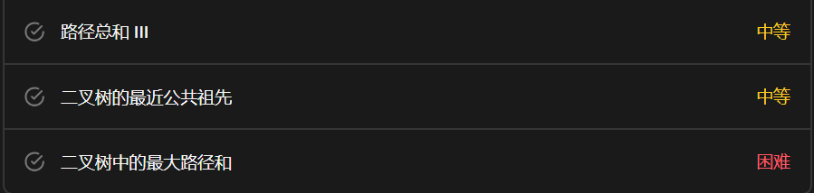

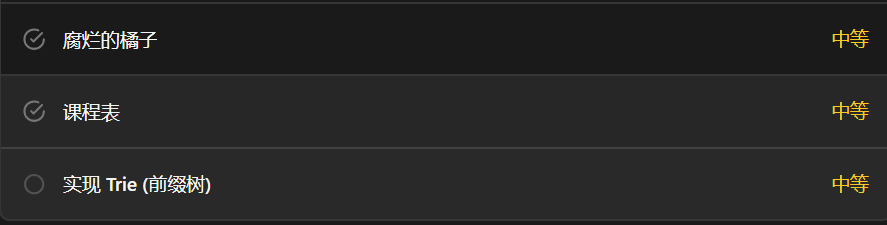

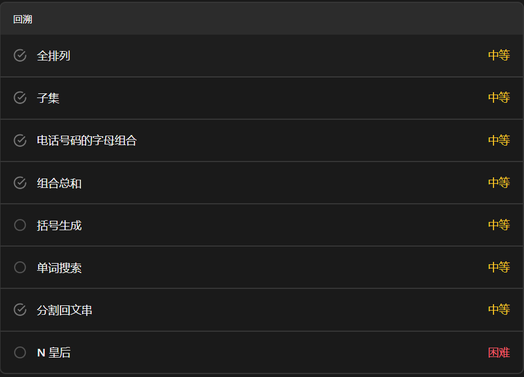

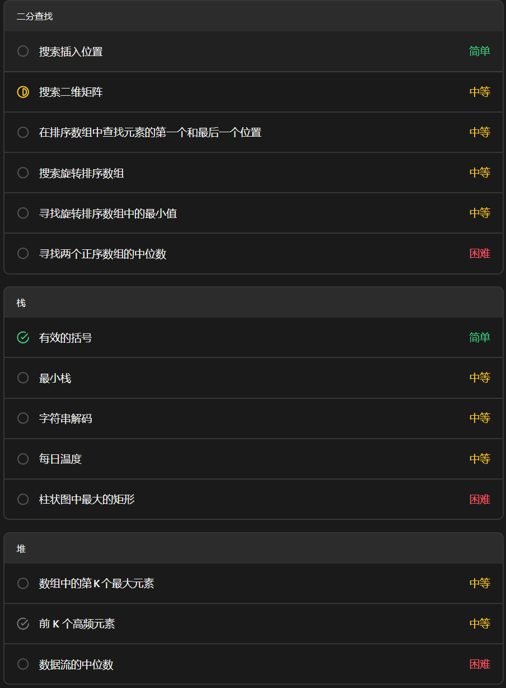

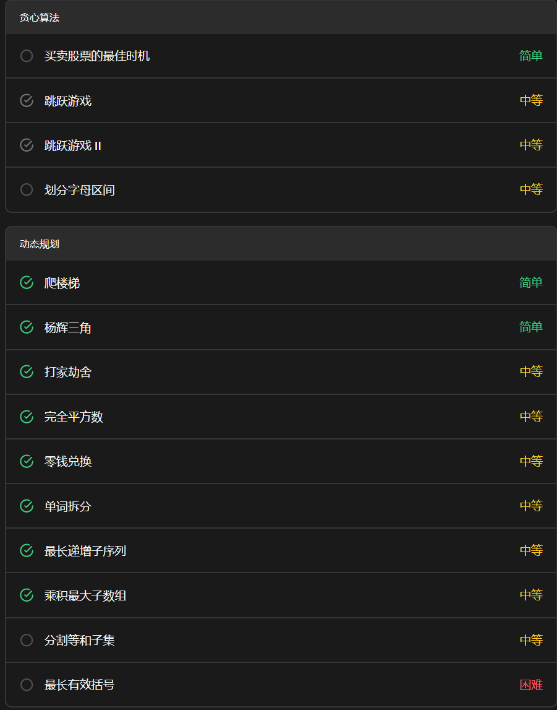


- 每道题至少做到：**理解题意 → 独立尝试 → 优化思路 → 总结模板**
- 不要只抄答案，尝试“默写”一遍
- 做一道题后，写一句话总结：这题考的核心是？什么套路？

动态规划是新人的一道坎，唯有坚持多练，至少要做 100 道才算入门。

一定要每隔一段时间复习，至于周期是看你自己的时间以及题量的，尤其是高频面试的期间，你甚至可以一天一个力扣 HOT100，我当时就是如此，低频率的情况下一般一天花 1-2 小时去复习即可，可以刷 20-40 题左右的题量，2-3 天也能完成 hot100 的题单了。（前提你已经刷过 2,3 遍至少了，才会有这样的速度）。

26/3/13 一轮

- [x] 哈希
- [x] 双指针
- [x] 滑动窗口
- [x] 子串
- [x] 普通数组
- [x] 矩阵
- [x] 链表
- [ ] 二叉树
- [ ] 图论
- [ ] 回溯
- [ ] 二分查找
- [x] 栈
- [ ] 堆
- [ ] 贪心算法
- [x] 动态规划
- [ ] 多维动态规划
- [ ] 技巧

## 常见算法

### 并查集

1. 将两个集合合并
2. 询问两个元素是否在一个集合当中

```cpp
// 暴力
belong[x] = a：x在集合a中
if(belong[x] == belong[y])：x、y是否在一个集合
```

每个集合用一棵树表示，树根的编号就是整个集合的编号，每个节点存储它的父节点，p[x]表示 x 的父节点

1. 判断树根：树根的 p[x] == x。`if(p[x] == x)`
2. 求 x 的集合编号：一直往上走。`while(p[x] != x) x = p[x];`
3. 合并两个集合：x、y 为两个集合的根节点，`p[x] = y`
4. 看是否在同一个集合(同一棵树)：`fd(x) == fd(y)`

```cpp

// 并查集 p[x] = y 表示y属于x
int p[N];

// 寻找x的根节点
int fd(int x){
    if(p[x] == x) return p[x];
    return fd(p[x]);
}

void merge(int x, int y){
    p[fd(x)] = fd(y);
}

int main(){
    int n,m,q,x,y;
    memset(p,-1,sizeof p);
    cin>>n>>m>>q;
    for(int i = 0; i <= n; i++) // 初始化：每个结点的祖先是它自己
        p[i] = i;
    while(m--){
        cin>>x>>y;
        merge(x,y);
    }
    while(q--){
        cin>>x>>y;
        if(fd(x) == fd(y)) cout<<"Yes"<<endl;
        else cout<<"No"<<endl;
    }
}

```

优化： 2. 往上走过一遍之后，直接把走过的路上的所有点连到找到的根节点上，后续无需再走。

`M a b`，将编号为 a 和 b 的两个数所在的集合合并，如果两个数已经在同一个集合中，则忽略这个操作；
`Q a b`，询问编号为 a 和 b 的两个数是否在同一个集合中；

```cpp
int p[N];

int find(int x){
    if(p[x] != x) p[x] = find(p[x]);
    return p[x];
}

int main(){
    int n, m;
    scanf("%d%d", &n, &m);
    for(int i = 1; i <= n; i++) p[i] = i;

    while(m--){
        char op[2];
        int a, b;
        scanf("%s%d%d", &op, &a, &b);
        if(op[0] == 'M') p[find(a)] = find(b);
        else{
            if(find(a) == find(b)) printf("Yes");
            else printf("No");
        }
    }
}
```

## 哈希

### 两数之和

法一：哈希

1. 遍历数组。每次从哈希表中查找，是否有 target-nums[i]的元素
2. 如果有，返回结果；如果没有，插入 nums[i]并继续
3. O(log n)

```cpp
    vector<int> twoSum(vector<int>& nums, int target) {
         unordered_map<int, int> hash_map; // 数组值-数组下标
         for(int i = 0; i < nums.size(); i++){
            auto it = hash_map.find(target - nums[i]);
            if(it != hash_map.end()){
                return {i, it->second};
            }
            else{
                hash_map[nums[i]] = i;
            }
         }
        return {};
    }
```

法二：

1. 升序排序
2. 双指针指向头尾，移动，直到等于 target
3. O(n)

```cpp
    vector<int> twoSum(vector<int>& nums, int target) {
         vector<pair<int,int>> arr;
         for(int i = 0; i < nums.size(); i++){
            arr.push_back({nums[i], i});
         }
         sort(arr.begin(), arr.end(), [](const pair<int,int>& a,const pair<int,int>& b){return a.first < b.first;});
         int p1 = 0, p2 = nums.size()-1;
         while(p1 != p2){
            if(arr[p1].first + arr[p2].first == target){
                return {arr[p1].second, arr[p2].second};
            }
            else if(arr[p1].first + arr[p2].first < target){
                p1++;
            }
            else {
                p2--;
            }
         }
        return {};
    }
```

### 字母异位词分组

- 哈希，将排序后的字符串作为 key，原始字符串作为 value
- 时间复杂度：m 是字符串长度，n 是字符串数组长度，O(n \* mlogm)
- 空间复杂度：O(nm)

```cpp
    vector<vector<string>> groupAnagrams(vector<string>& strs) {
        unordered_map<string, vector<string>> hash;
        for(auto it : strs){
            string key = it;
            ranges::sort(key);
            hash[key].push_back(it);
        }
        vector<vector<string>> res;
        res.reserve(hash.size());
        for(auto& [_, value] : hash){
            res.push_back(value);
        }
        return res;
    }
```

### 最长连续序列

法一：哈希集合

- 将数组转换成哈希集合，遍历集合
- 当前元素为 x，如果 x-1 不在集合中，就开始统计 x 开始的连续序列长度（不断查找 x+1 是否在集合中，如果在，增加连续序列的长度）；否则继续遍历。
- 这种做法保证每次都从连续序列的最小值开始统计序列长度
- 时间复杂度：O(N)，因为二重循坏中，每个元素最多遍历两次
- 优化：假设集合中有 m 个不同元素，如果已经有一条长度大于等于 m/2 的连续序列，则不可能有第二条长度大于 m/2 的连续序列。此时可以直接返回答案

```cpp
    int longestConsecutive(vector<int>& nums) {
        unordered_set<int> hash(nums.begin(), nums.end());
        int ans = 0;
        for (auto x : hash){
            if(hash.contains(x - 1)) continue;

            int y = x + 1;
            while(hash.contains(y)){
                y++;
            }
            ans = max(ans, y - x);
            if(ans * 2 >= hash.size()) break;
        }
        return ans;

    }
```

法二：排序

- 将数组升序排序
- 用一次遍历判断连续序列长度
- O(nlogn)

```cpp
int longestConsecutive(vector<int>& nums) {
    if(nums.empty()) return 0;
    int ans = 1;
    int ret = 0;
    sort(nums.begin(), nums.end());
    int tmp = nums[0];
    for(int i = 1; i < nums.size(); i++){
        if(nums[i] - tmp == 1){
            ans++;
        }
        else if(nums[i] == nums[i - 1]){
            tmp = nums[i - 1];
            continue;
        }
        else ret = max(ret, ans), ans = 1;
        tmp = nums[i];
    }
    ret = max(ret, ans);
    return ret;
}
```

## 双指针

### 移动零

法一：双指针

- 指针 p1、p2 指向数组开头，向后移动 p2 指针，如果 p2 指向的数字为非零，交换 p1、p2 指向的数字，同时将 p1 往后移动，保证 p1 始终指向已经处理好的序列的尾部
- 时间复杂度：O(n)，其中 n 为序列长度。每个位置至多被遍历两次。

```cpp
    void moveZeroes(vector<int>& nums) {
        int p1 = 0, p2 = 0;
        while(p2 < nums.size()){
            if(nums[p2]){
                swap(nums[p1], nums[p2]);
                p1++;
            }
            p2++;
        }
    }
```

### 盛最多水的容器

双指针：

- 将 p1、p2 分别指向数组的左右边界
- 每次总是将对应元素较小的指针往中间移动
  - 原因：每次将指针向中间移动是为了找更大的容量，将指针向中间移动时，容器的宽度一定是减小的。反证法，假设我们移动对应元素较大的指针，由于短板不变甚至可能更小，且宽度也减小，所以容量一定是减小的，没有考虑的必要。
- 过程中记录最大的容量

```cpp
    int maxArea(vector<int>& height) {
        int p1 = 0, p2 = height.size() - 1;
        int ans = 0;
        while(p1 < p2) {
            ans = max(ans, (p2 - p1) * min(height[p1], height[p2]));
            if(height[p1] < height[p2]) p1++;
            else if(height[p2] < height[p1]) p2--;
            else p1++;
        }
        return ans;
    }
```

### 三数之和

> 核心：转换为两数之和，并用双指针解决两数之和，同时注意去重（跳过和上一次相等的数字）

法一：双指针

- 升序排序
- 确定一个数 x，剩下的是两数之和问题：y+z == -x
- 两数之和：双指针指向头尾元素，如果相加大于 target，右指针左移；如果小于，左指针右移
- 去重：在添加完本次循环找到的答案后进行
  - x 如果和上一个数相等，跳过
  - y、z 如果和上一个数相等，跳过
- 优化：
  - 如果 x 和紧接着的两个数相加大于 0，则之后的枚举中三数之和不可能等于 0，退出枚举
  - 如果 x 和数组末尾的两个数相加小于 0，则 x 与后面的任何数的三数之和不可能等于 0，跳过这个 x

```cpp
    vector<vector<int>> threeSum(vector<int>& nums) {
        ranges::sort(nums);
        vector<vector<int>> res;
        int n = nums.size();
        for(int i = 0; i < n - 2; i++){
            int x = nums[i];
            if(i >= 1 && nums[i - 1] == x) continue; // 去重
            // 优化
            if(x + nums[i + 1] + nums[i + 2] > 0) break;
            if(x + nums[n - 1] + nums[n - 2] < 0) continue;
            // 两数之和
            int tar = 0 - x;
            int p1 = i + 1, p2 = n - 1;
            while(p1 < p2){
                int y = nums[p1], z = nums[p2];
                if(y + z < tar){
                    p1++;
                }
                else if(y + z > tar){
                    p2--;
                }
                else{
                    res.push_back({x, y, z});
                    p1++; p2--;
                    while(nums[p1]==nums[p1-1] && p1 < p2) p1++;
                    while(nums[p2]==nums[p2+1] && p1 < p2) p2--;
                }
            }
        }
        return res;
    }
```

### 接雨水

法一：单调栈

思路：

- 维护一个严格单调递减栈，存放数组下标
- 当新来的元素大于等于栈顶元素时，开始计算能接的雨水：
  - 横着计算雨水的面积。高度为【min(新来元素，栈中第二个元素对应的数组元素) - 栈顶元素对应的数组元素】，宽度为【新来元素的下标 - 栈中第二个元素 + 1】
  - 弹出栈顶，继续判断是否满足单调栈性质
- 新元素入栈
- 时间复杂度：O(N)

```cpp
    int trap(vector<int>& height) {
        int n = height.size();
        int stk[n];
        int tt = -1;
        int res = 0;
        for(int i = 0; i < n; i++){
            if(tt == -1) {
                stk[++tt] = i;
                continue;
            }
            while(height[stk[tt]] <= height[i] && tt > 0){
                int h = min(height[i], height[stk[tt - 1]]);
                int w = i - stk[tt - 1] - 1;
                res += (h - height[stk[tt]]) * w;
                tt--;
            }
            if(height[stk[tt]] <= height[i] && tt == 0) stk[tt] = i;
            else stk[++tt] = i;
        }
        return res;
    }
```

法二：前缀后缀和

- 计算出数组的前缀和数组、后缀和数组
- 竖着计算雨水的面积。每个位置能接的水是 min(当前位置前缀， 当前位置后缀) - 当前位置高度
- 时间复杂度：O(N)
- 空间复杂度：O(N)

```cpp
    int trap(vector<int>& height) {
        int n = height.size();
        int res = 0;
        int premax[n], sufmax[n];
        for(int i = 0; i < n; i++){
            premax[i] = sufmax[i] = 0;
        }
        premax[0] = height[0];
        for(int i = 1; i < n; i++){
            premax[i] = max(premax[i - 1], height[i]);
        }
        sufmax[n - 1] = height[n - 1];
        for(int i = n - 2; i >= 0; i--){
            sufmax[i] = max(sufmax[i + 1], height[i]);
        }
        for(int i = 0; i < n; i++){
            res += min(premax[i], sufmax[i]) - height[i];
        }
        return res;
    }
```

法三：双指针

- 优化：将前缀后缀和算法的空间复杂度优化到 O(1)
-

```cpp
    int trap(vector<int>& height) {
        int n = height.size();
        int res = 0;
        int premax=height[0], sufmax=height[n-1];
        int left = 0, right = n-1;
        while(left < right){
            premax = max(premax, height[left]);
            sufmax = max(sufmax, height[right]);
            if(premax < sufmax){
                res += premax - height[left];
                left++;
            }
            else{
                res += sufmax - height[right];
                right--;
            }
        }
        return res;
    }
```

## 滑动窗口

滑动窗口算法是一种基于**双指针**的高效算法，用于解决数组或字符串中连续子序列（子串/子数组）问题。其核心思路是定义一个由左右指针 `[left, right)` 维护的“窗口”，通过扩大右边界寻找可行解，满足条件后收缩左边界优化解

### 无重复字符的最长子串

思路： 哈希

- 用一个哈希集合存储当前遍历到的无重复字符子串的头尾指针，这里称它为窗口
- 每次加入新字符时，如果窗口中已有此字符，就一直弹出头指针指向的元素，直到没有该字符为止，然后加入这个新字符
- 时间复杂度：O(n)，其中 n 为 s 的长度。

```cpp
    int lengthOfLongestSubstring(string s) {
        unordered_set<char> hash;
        int ans = 0;
        for(int l = 0, r = 0; r < s.length(); r++){
            char c = s[r];
            while(hash.contains(c)){
                hash.erase(s[l]);
                l++;
            }
            hash.insert(c);
            ans = max(r - l + 1, ans);
        }
        return ans;
    }
```

### 找到字符串中所有字母异位词

思路：

- 窗口存放当前符合或即将符合要求的子串。
- 维护一个数组，数组下标是字母，存储该字母在目标 p 中出现的次数。
- 每次移动窗口右端点时，减少对应字母的出现次数
  - 如果为负数，说明窗口中出现了不符合要求的多余字符，移动左端点来排除多于字符
- 时间复杂度：时间复杂度：O(m+n)，其中 m 是 s 的长度，n 是 p 的长度。虽然写了个二重循环，但是内层循环中对 left 加一的总执行次数不会超过 m 次，所以滑窗的时间复杂度为 O(m)。

```cpp
    vector<int> findAnagrams(string s, string p) {
        int n = s.length();
        vector<int> ans;
        int cnt[26] = {};
        for(int i = 0; i < p.length(); i++){
            cnt[p[i] - 'a']++;
        }
        for(int l = 0, r = 0; r < n; r++){
            cnt[s[r] - 'a']--;
            while(cnt[s[r] - 'a'] < 0){
                cnt[s[l++] - 'a']++;
            }
            if(r - l + 1 == p.length()) ans.push_back(l);
        }
        return ans;
    }
```

## 动态规划

### 爬楼梯

思路：

- 状态转移方程：
  - 初始值：`dp[0] = dp[1] = 1`
  - 分类讨论：最后一次迈 1 步、最后一次迈 2 步
  - 状态转移方程：`dp[i] = dp[i - 1] + dp[i - 2]`
- 空间优化：不用数组

```cpp
    int climbStairs(int n) {
        int f1 = 1, f0 = 1;
        for(int i = 2; i <= n; i++){
            int newf = f0 + f1;
            f0 = f1;
            f1 = newf;
        }
        return f1;
    }
```

- 矩阵快速幂优化：将复杂度从 O(n)优化到 O(logn)

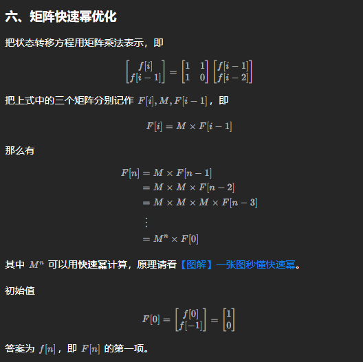

```cpp
class Solution {
public:
    using matrix = vector<vector<long long>>;
    matrix mul(matrix& a, matrix& b){
        int n = a.size(), m = b[0].size();
        matrix res = matrix(n, vector<long long>(m));
        for(int i = 0; i < n; i++){
            for(int k = 0; k < a[i].size(); k++){
                if(a[i][k] == 0) continue;
                for(int j = 0; j < m; j++){
                    res[i][j] += a[i][k] * b[k][j];
                }
            }
        }
        return res;
    }
    matrix mypow(matrix& x, int n, matrix& f0){
        matrix res = f0;
        while(n){
            if(n & 1){
                res = mul(x, res);
            }
            x = mul(x, x);
            n >>= 1;
        }
        return res;
    }
    int climbStairs(int n) {
        matrix f0 = {{1},{0}};
        matrix m = {{1,1},{1,0}};
        // fn = M^n * f0
        return mypow(m, n, f0)[0][0];
    }
};
```

快速幂：

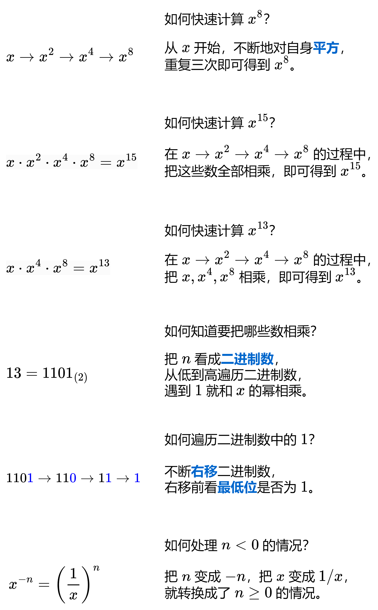

### 杨辉三角

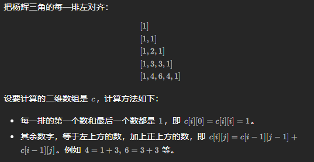

```cpp
    vector<vector<int>> generate(int numRows) {
        vector<vector<int>> ans(numRows);
        for(int i = 0; i < numRows; i++){
            ans[i].resize(i + 1, 1);
            for(int j = 1; j < i; j++){
                ans[i][j] = ans[i - 1][j] + ans[i - 1][j - 1];
            }
        }
        return ans;
    }
```

### 打家劫舍

思路一：记忆化搜索

- 回溯三问：
  - 当前操作：枚举第 i 个房子选/不选
  - 子问题：从前 i 个房子中得到的最大金额和
  - 下一个子问题：分类讨论
    - 不选：从前 i - 1 个房子中得到的最大金额和
    - 选：从前 i - 2 个房子中得到的最大金额和
- 递归：
  - `dfs[i] = max(nums[i] + dfs(i - 2), dfs(i - 1))`
- 优化：将递归的计算结果保存下来，下次递归到同样的入参时，直接返回先前返回的结果
- 时间复杂度：O(n)

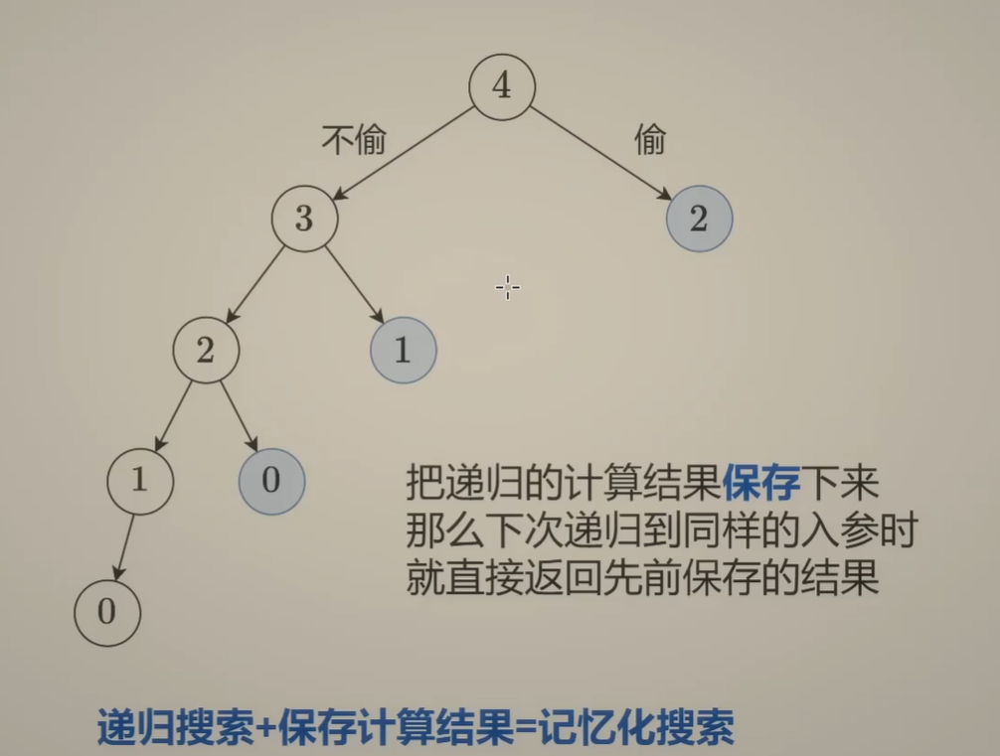

```cpp
    int memo[101];
    int dfs(int i, int n, vector<int>& nums){
        if(i < 0) return 0;
        if(memo[i] != -1) return memo[i];
        int choose = nums[i] + dfs(i - 2, n, nums);
        int not_choose = dfs(i - 1, n, nums);
        return memo[i] = max(choose, not_choose);
    }
    int rob(vector<int>& nums) {
        int n = nums.size();
        for(int i = 0; i < 101; i++) memo[i] = -1;
        dfs(n - 1, n, nums);
        return memo[n - 1];
    }
```

将记忆化搜索改为递推。

- 自顶向下计算：记忆化搜索
- 自底向上计算：递推

思路二：递推

```cpp
dfs[i] = max(nums[i] + dfs[i - 2], dfs[i - 1])
f[i] = max(f[i - 2] + nums[i], f[i - 1])
// 将f中的下标同时 + 2 （这样的话返回值也成了 f[i - 1 + 2] ）
f[i + 2] = max(f[i] + nums[i], f[i + 1])
```

```cpp
    int rob(vector<int>& nums){
        int n = nums.size();
        int f[200] = {};
        for(int i = 0; i < n; i++){
            f[i + 2] = max(f[i] + nums[i], f[i + 1]);
        }
        return f[n + 1];
    }
```

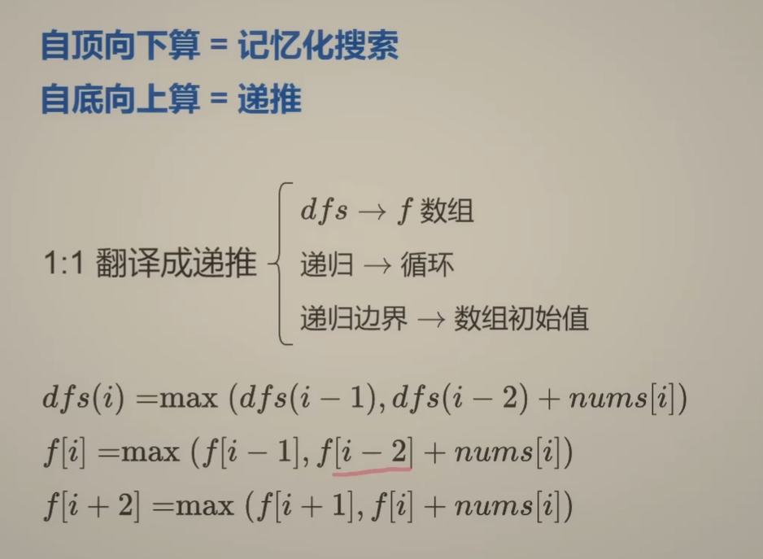

优化：空间复杂度优化成 O(1)

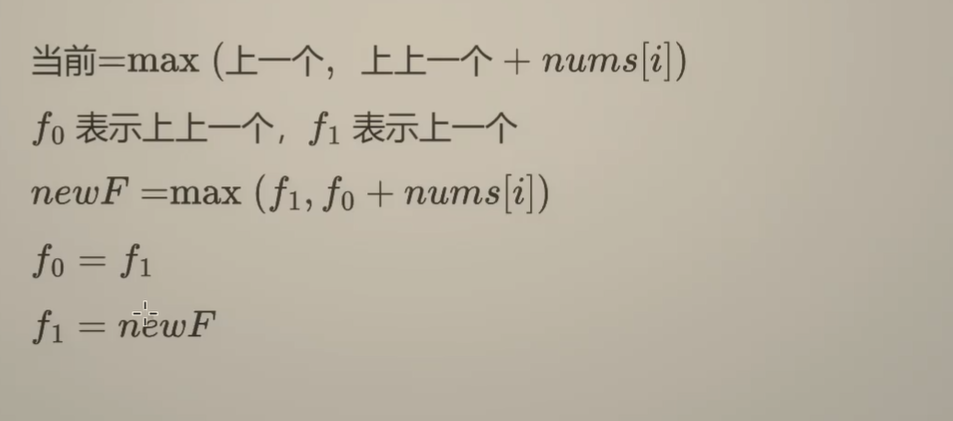

```cpp
    int rob(vector<int>& nums){
        int n = nums.size();
        int f0 = 0, f1 = 0, newF = 0;
        for(int i = 0; i < n; i++){
            newF = max(f0 + nums[i], f1);
            f0 = f1;
            f1 = newF;
        }
        return newF;
    }
```

### 0-1 背包

题目：有 n 个物品，第 i 个物品的体积为 `w[i]`，价值为 `v[i]`，每个物品最多选一个，求体积和不超过背包容量 `capacity`的最大价值和

回溯三问：

- 当前操作：枚举第 `i`个物品选或不选。不选：剩余容量不变；选：剩余容量减少 `w[i]`
- 子问题：在剩余容量为 c 时，从前 `i`个物品中得到的最大价值和
- 下一个子问题：分类讨论
  - 不选：在剩余容量为 c 时，从前 `i-1`个物品中得到的最大价值和
  - 选：在剩余容量为 `c - w[i]`时，从前 `i-1`个物品中得到的最大价值和
- `dfs[i, c] = max(dfs[i - 1, c], dfs[i - 1, c - w[i]] + v[i])`

```cpp
int w[n], int v[n];
int dfs(int i, int cap){
    if(i < 0) return 0;
    if(cap < w[i]) return dfs(i - 1, cap);
    return max(dfs(i - 1, cap), dfs(i - 1, cap - w[i]) + v[i]);
}
int zero_one_knapsack( int cap){
    return dfs(n - 1, cap);
}
```

记忆化搜索版：

```cpp
int w[n], int v[n];
int memo[n][n];
int dfs(int i, int cap){
    if(i < 0) return 0;
    if(memo[i][cap] != -1) return memo[i][cap];
    if(cap < w[i]) {
        return memo[i][cap] = dfs[i - 1][cap];
    }
    return memo[i][cap] = max(dfs(i - 1, cap), dfs(i - 1, cap - w[i]) + v[i]);
}
int zero_one_knapsack(int cap){
    for(int i = 0; i < n; i++){
        for(int j = 0; j < cap; j++){
            memo[i][j] = -1;
        }
    }
    return dfs(n - 1, cap);
}
```

#### 变形 1：至多装 capacity，求方案数/最大价值和

#### 变形 2：恰好装 capacity，求方案数/最大/最小价值和

```cpp
dfs[i, c] = dfs[i - 1, c] + dfs[i - 1, c - w[i]]
```

递推式：

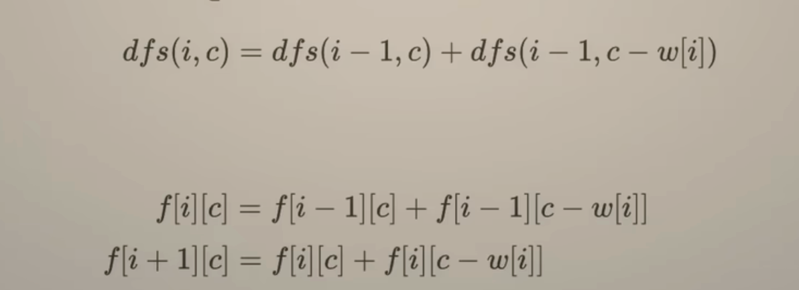

例题：494. 目标和

```cpp
class Solution {
public:
/*
数组之和：s
选择的正数的和：p
选择的负数的和：s - p
则 p - （s - p） = t
得出 p = (s+t) / 2
问题转化为：从数组中选出一些数，使其和为(s+t) / 2，共有多少种可能方案
模板：0-1背包变式 —— 恰好装 capacity，求方案数
dfs(i, c) = dfs(i - 1, c) + dfs(i - 1, c - nums[i])
f[i][c] = f[i-1][c] + f[i-1][c-nums[i]]
f[i+1][c] = f[i][c] + f[i][c-nums[i]]
*/
    int f[21][1001] = {};
    int findTargetSumWays(vector<int>& nums, int target) {
        for(auto c : nums){
            target += c;
        }
        if(target < 0 || target % 2) return 0; // (s+t)必须是偶数，否则不存在 p = (s+t) / 2
        target /= 2;
        int n = nums.size();
        f[0][0] = 1;
        for(int i = 0; i < n; i++){
            for(int c = 0; c <= target; c++){
                if(c < nums[i]) f[i + 1][c] = f[i][c];
                else f[i + 1][c] = f[i][c] + f[i][c - nums[i]];
            }
        }
        return f[n][target];
    }
};
```

#### 变形 3：至少装 capacity，求方案数/最小价值和

### 完全背包

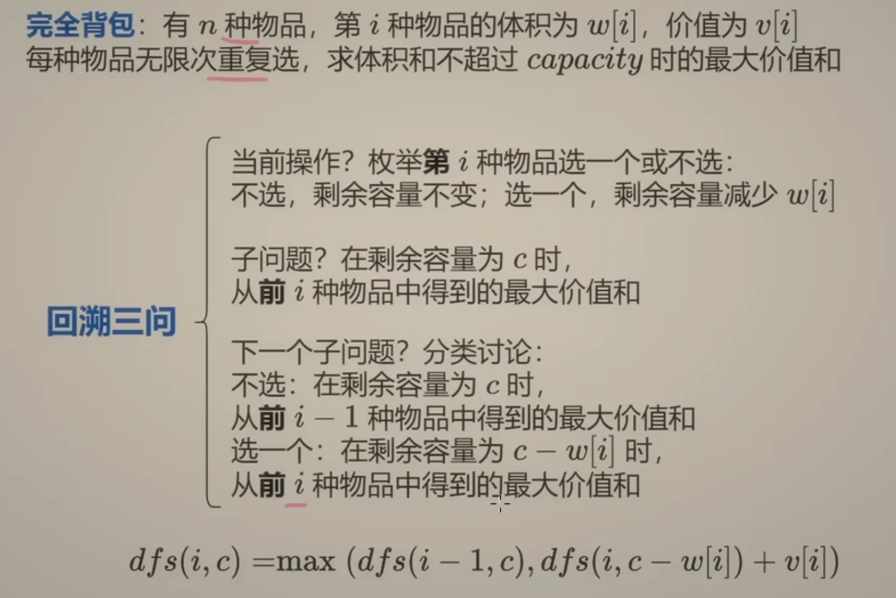

#### 变形 1：至多装 capacity，求方案数/最大价值和

#### 变形 2：恰好装 capacity，求方案数/最大/最小价值和

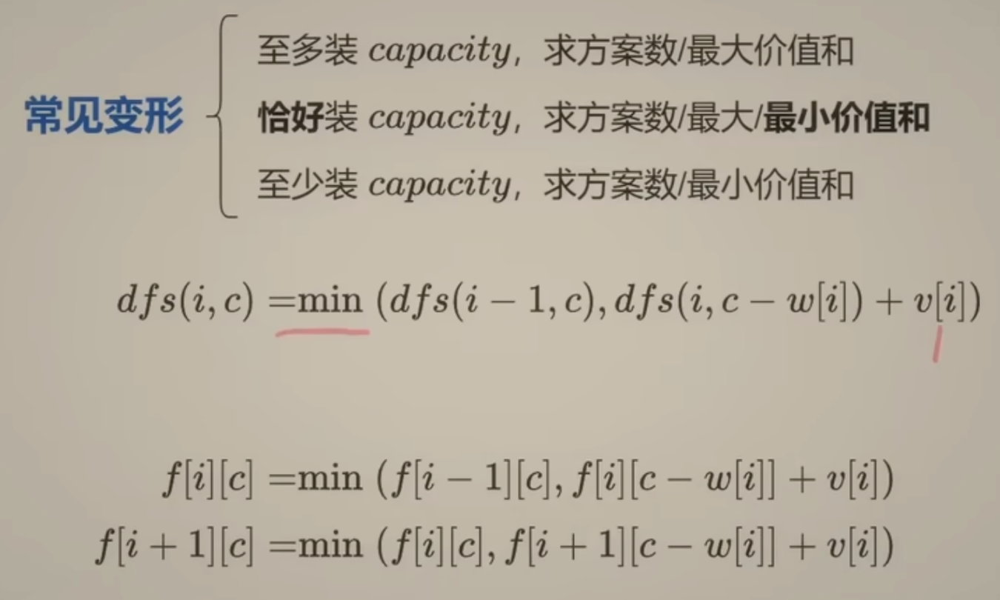

例题：零钱兑换

```cpp
class Solution {
public:
    int coinChange(vector<int>& coins, int amount) {
        int n = coins.size();
        // 数组元素初始化成无限大
        vector f(n + 1, vector<int>(amount + 1, INT_MAX / 2));
        f[0][0] = 0;
        for(int i = 0; i < n; i++){
            for(int c = 0; c <= amount; c++){
                if(c < coins[i]) f[i + 1][c] = f[i][c];
                else f[i + 1][c] = min(f[i][c], f[i + 1][c - coins[i]] + 1);
            }
        }
        return f[n][amount] < INT_MAX / 2 ? f[n][amount] : -1;
    }
};
```

空间优化：两个数组（滚动数组）

- 将数组下标模 2

```cpp
    int coinChange(vector<int>& coins, int amount) {
        int n = coins.size();
        vector f(2, vector<int>(amount + 1, INT_MAX / 2));
        f[0][0] = 0;
        for(int i = 0; i < n; i++){
            for(int c = 0; c <= amount; c++){
                if(c < coins[i]) f[(i + 1) % 2][c] = f[i % 2][c];
                else f[(i + 1) % 2][c] = min(f[i % 2][c], f[(i + 1) % 2][c - coins[i]] + 1);
            }
        }
        int ans = f[n % 2][amount];
        return ans == INT_MAX / 2 ? -1 : ans;
    }
```

#### 变形 3：至少装 capacity，求方案数/最小价值和

### 单词拆分

思路：递归

- 枚举最后一段的长度。例如 s=leetcode，枚举长度为 4，如果 code 在 wordDict 中，则问题变成：能否把 leet 划分为若干段，使得每段都在 wordDict 中
- 定义状态为 dfs(i)，表示能否把前缀 s[:i]（表示 s[0] 到 s[i−1] 这段子串）划分成若干段，使得每段都在 wordDict 中。
- 用记忆化搜索优化递归

```cpp
    unordered_map<string, bool> dict;
    int memo[301];
    bool dfs(string s, int i){
        if(i == 0) return true;
        if(memo[i] != -1) return memo[i];
        for(int j = 1; j <= i; j++){
            // s[i - j, i] 是否在dict中
            if(dict[s.substr(i - j, j)] && dfs(s, i - j)) return memo[i] = true;
        }
        return memo[i] = false;
    }
    bool wordBreak(string s, vector<string>& wordDict) {
        for(auto str : wordDict){
            dict[str] = true;
        }
        for(int i = 0; i <= 301; i++) memo[i] = -1;
        return dfs(s, s.size());
    }
```

### 最长递增子序列 LIS

思路：递归+记忆化搜索

- 回溯三问：
  - 子问题：以 `nums[i]`结尾的 LIS 长度
  - 当前操作：枚举 `nums[j]`
  - 下一个子问题：以 `nums[j]`结尾的 LIS 长度
- `dfs[i] = max(dfs[j]) + 1, j < i && nums[j] < nums[i]`
- 时间复杂度：O(n^2)
- 空间复杂度：O(n)

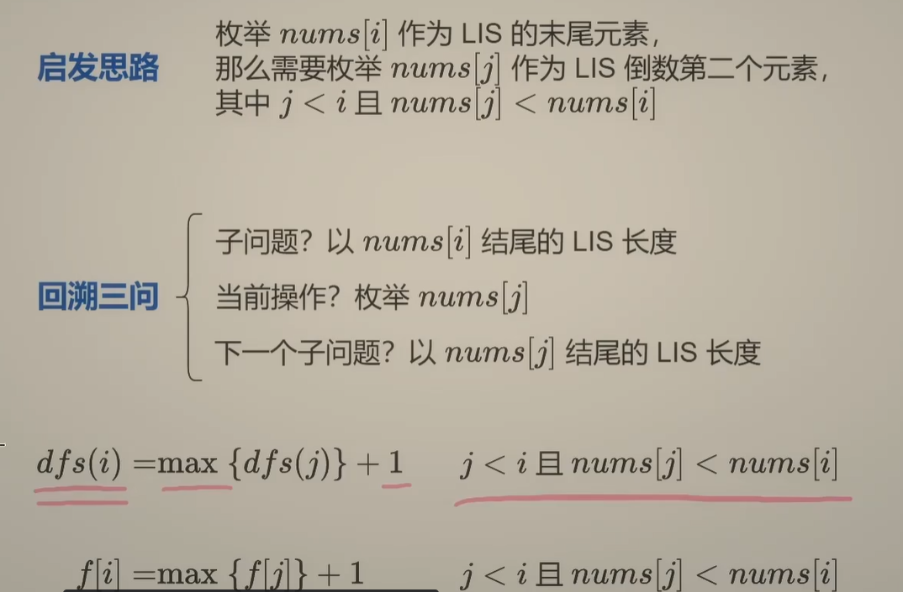

```cpp
class Solution {
public:
    int memo[2600];
    int dfs(int i, vector<int>& nums){
        if(i < 0) return 0;
        if(memo[i] != -1) return memo[i];
        int maxi = 0;
        for(int j = i - 1; j >= 0; j--){
            if(nums[j] < nums[i]){
                maxi = max(maxi, dfs(j, nums));
            }
        }
        return memo[i] = maxi + 1;
    }
    int lengthOfLIS(vector<int>& nums) {
        for(int i = 0; i < 2600; i++) memo[i] = -1;
        int ans = 0;
        int n = nums.size();
        for(int i = 0; i < n; i++){
            ans = max(ans, dfs(i, nums));
        }
        return ans;
    }
};
```

翻译为递推：

```cpp
class Solution {
public:
    int f[2600] = {};
    int lengthOfLIS(vector<int>& nums) {
        int ans = 0;
        int n = nums.size();
        for(int i = 0; i < n; i++){
            f[i] = 0;
            for(int j = 0; j < i; j++){
                if(nums[j] < nums[i]){
                    f[i] = max(f[i], f[j]);
                }
            }
            f[i]++;
        }
        for(int i = 0; i < n; i++){
            ans = max(ans, f[i]);
        }
        return ans;
    }
};
```

优化：贪心+二分查找

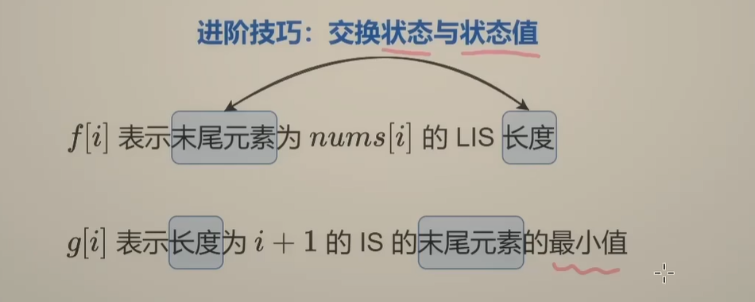

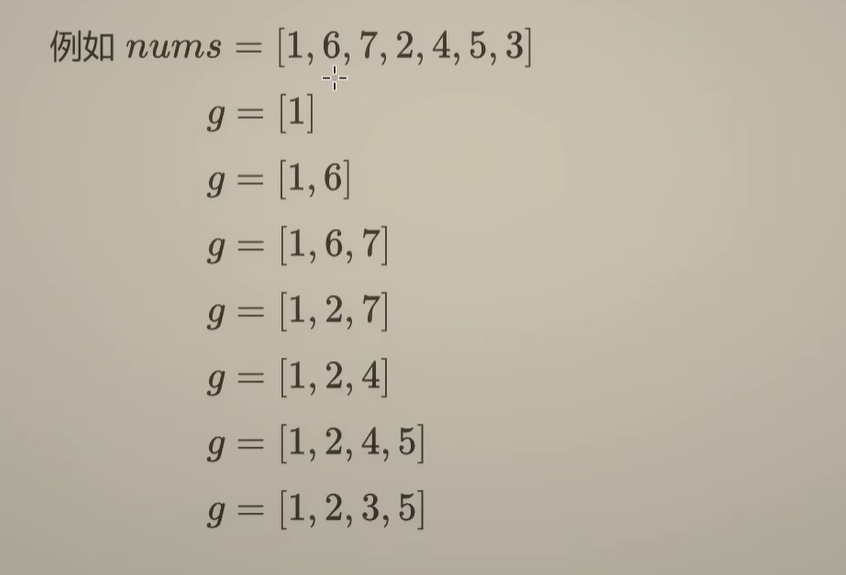

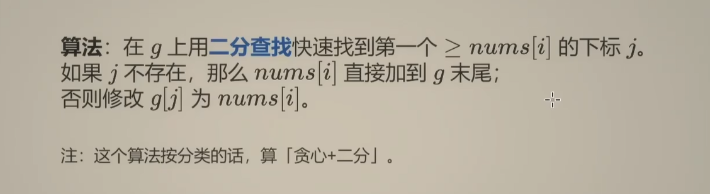

```cpp
class Solution {
public:
    int lengthOfLIS(vector<int>& nums) {
        int n = nums.size();
        int ans = 0;
        vector<int> g;
        for(int x : nums){
            auto it = ranges::lower_bound(g, x); // 查找第一个不小于 val 的元素位置
            if(it == g.end()) g.push_back(x);
            else *it = x;
        }
        return g.size();
    }
};
```

### 最大子数组和

思路：

- 定义 `f[i]`为以 `nums[i]`结尾的最大子数组和
- `f[i] = max(f[i - 1], 0) + nums[i], f[0] = nums[0]`
- 空间优化：只用一个变量记录

```cpp
class Solution {
public:
    int maxSubArray(vector<int>& nums) {
        vector<int> f(nums.size());
        f[0] = nums[0];
        for (int i = 1; i < nums.size(); i++) {
            f[i] = max(f[i - 1], 0) + nums[i];
        }
        return ranges::max(f);
    }
};
```

### 最大子数组乘积

思路：

- 定义 `f_max[i]`为以 `nums[i]`结尾的最大子数组乘积，`f_min[i]`为以 `nums[i]`结尾的最小子数组乘积
- `f_max[i] = max(f_max[i - 1]* nums[i], f_min[i - 1] * nums[i], nums[i]) , f[0] = nums[0]`
  - x 和前面的子数组拼起来，也就是在右端点下标为 i−1 的乘积最大子数组之后添加 x，那么 `f[i] = f_max[i - 1]* nums[i]`；也可以在右端点下标为 i−1 的乘积最小子数组之后添加 x，那么 `f[i] = f_min[i - 1] * nums[i]`。把这两种都算一下，这样我们就无需判断 x 到底是正还是负了。

```cpp
class Solution {
public:
    int maxProduct(vector<int>& nums) {
        vector<int> f_max(nums.size());
        vector<int> f_min(nums.size());
        int ans = INT_MIN, cur = 1;
        f_max[0] = f_min[0] = nums[0];
        for(int i = 1; i < nums.size(); i++){
            f_min[i] = min(f_max[i - 1] * nums[i],min(f_min[i - 1] * nums[i], nums[i]));
            f_max[i] = max(f_max[i - 1] * nums[i], max(f_min[i - 1] * nums[i], nums[i]));
        }
        return ranges::max(f_max);
    }
};
```

空间优化：

```cpp
class Solution {
public:
    int maxProduct(vector<int>& nums) {
        int ans = INT_MIN;
        int f_max =  1, f_min = 1;
        for(int x : nums){
            int tmp = f_max;
            f_max = max(f_max * x, max(f_min * x, x));
            f_min = min(tmp * x,min(f_min * x, x));
            ans = max(f_max, ans);
        }
        return ans;
    }
};
```

### 分割等和子集

思路：0-1 背包（恰好装满型），true or false

- 定义 `dfs(i, j)`为能否从 `nums[0]`到 `nums[i]`中选出一个和恰好等于 `j`的子序列
- 分类讨论：nums[i]选与不选
  - 选：问题变为能否从 `nums[0]`到 `nums[i - 1]`中选出一个和恰好等于 `j - nums[i]`的子序列，即 `dfs(i - 1, j - nums[i])`
  - 不选：问题变为能否从 `nums[0]`到 `nums[i - 1]`中选出一个和恰好等于 `j`的子序列，即 `dfs(i - 1, j)`
- 这两个只要有一个成立，`dfs(i, j)` 就是 true
- `dfs[i, j] = dfs[i - 1, j] || dfs[i - 1, j - nums[i]]`
- 时间复杂度：O(ns)，其中 n 是 nums 的长度，s 是 nums 的元素和的一半。
- 空间复杂度：O(ns)。

```cpp
class Solution {
public:
// 0-1背包：选出一些元素，使其总和恰好为tar
// dfs[i, c] = dfs[i - 1, c] || dfs[i - 1, c - nums[i]] (dfs[0, 0] = true)
    bool canPartition(vector<int>& nums) {
        int sum = reduce(nums.begin(), nums.end());
        if(sum % 2) return false;
        int tar = sum / 2;
        int n = nums.size();
        bool f[201][10002] = {};
        f[0][0] = true;
        for(int i = 0; i < n; i++){
            for(int c = 0; c <= tar; c++){
                if(c < nums[i]) f[i + 1][c] = f[i][c];
                else f[i + 1][c] = f[i][c] || f[i][c - nums[i]];
            }
        }
        return f[n][tar];
    }
};
```

- 空间优化：在计算 f[i+1] 时，只会用到 f[i]，不会用到比 i 更早的状态。因此可以去掉第一个维度，反复利用同一个一维数组。
- 空间复杂度：O(s)。

```cpp
    bool canPartition(vector<int>& nums) {
        int sum = reduce(nums.begin(), nums.end());
        if(sum % 2) return false;
        int tar = sum / 2;
        int n = nums.size();
        bool f[10002] = {};
        f[0] = true;
        for(auto x : nums){
            for(int c = tar; c >= x; c--){
                f[c] = f[c] || f[c - x];
            }
            if(f[tar]) return true;
        }
        return false;
    }
```

### 最长有效括号

思路：栈

要求最长有效括号的长度，需要尽可能延长有效括号，即寻找不能被匹配的 `)`的下标，和该下标之后已经匹配的括号下标。为了方便，在头部添加一个 `)`作为边界

维护一个栈，存储下标：

- 栈底是不能被匹配的 `)`。
- 其余是未被匹配的 `(`。

遍历 s，当前字母为 c：

- 如果 c 是左括号，入栈
- 否则，
  - 如果栈中有 `(`，弹出，当前字母下标减去栈顶下标是可能答案
  - 如果栈中没有 `(`，当前元素变为新栈底

```js
var longestValidParentheses = function (s) {
  let ans = 0;
  let stk = new Stack();
  stk.push(-1);
  for (let i = 0; i < s.length; i++) {
    if (s[i] == "(") {
      stk.push(i);
    } else if (stk.size() > 1) {
      stk.pop(); // 抵消
      ans = Math.max(ans, i - stk.peek());
    } else {
      stk.pop();
      stk.push(i);
    }
  }
  return ans;
};
```

## 链表

### 回文链表

法一：栈

- 将链表的前半段压入栈
- 继续遍历链表后半段，比较每个元素和栈顶元素是否相同
- 但空间复杂度不满足 O(1)

法二：原地反转后半段链表

- 找到链表中间节点（快慢指针）
- 反转中间节点后的链表
- 比较两个链表是否相等
- 时间复杂度：O(n)
- 空间复杂度：O(1)

```cpp
class Solution {
public:
    // 找链表的中间节点
    ListNode* middleNode(ListNode* head){
        ListNode* s = head, *f = head;
        while(f && f->next){
            s = s->next;
            f = f->next->next;
        }
        return s;
    }
    bool isPalindrome(ListNode* head) {
        ListNode* cur = middleNode(head);
        // 反转链表
        ListNode* next = cur->next;
        cur->next = NULL;
        while(next){
            ListNode* tmp = next->next;
            next->next = cur;
            cur = next;
            next = tmp;
        }
        // 判断回文链表
        ListNode* head2 = cur;
        while(head2){
            if(head->val != head2->val) return false;
            head = head->next;
            head2 = head2->next;
        }
        return true;
    }
};
```

### 环形链表

#### 判断链表中是否有环

思路：快慢指针

- s 每次走一步，f 走两步，如果 s==f，则有环

#### 找出入环点

思路：floyd 判圈算法

- 设头节点到入环口需要走 a 步
- 快慢指针相遇后，再走 a 步就是入环点。
  - 即，让头指针与慢指针一起走，相遇的位置就是入环点
- 时间复杂度：O(N), 空间复杂度：O(1)
  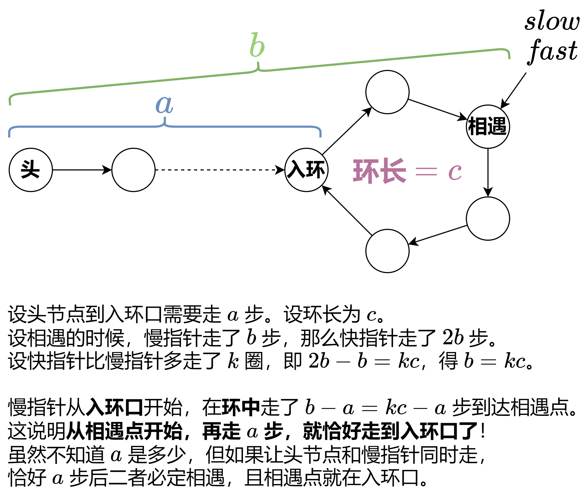

```cpp
    ListNode *detectCycle(ListNode *head) {
        ListNode* s = head, *f = head;
        int flag = 0;
        while(f && f-> next){
            s = s->next;
            f = f->next->next;
            if(s == f) {
                while(head != s){
                    head = head->next;
                    s = s->next;
                }
                return s;
            }
        }
        return NULL;
    }
```

### k 个一组翻转链表

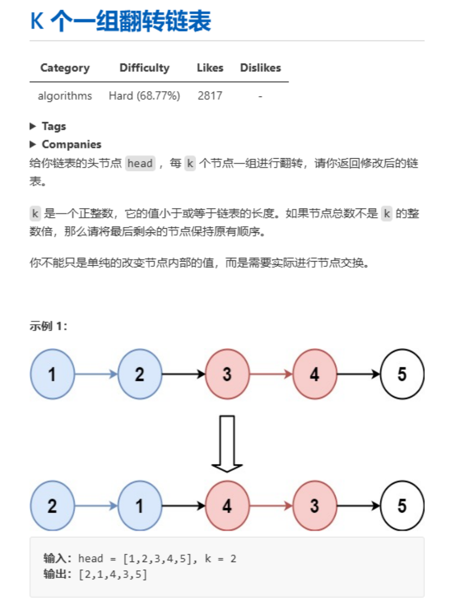

法一：Recursive solution has O(n) space complexity because of call stacks.

```cpp
class Solution {
public:
    ListNode* reverseKGroup(ListNode* head, int k) {
        ListNode* cur = head;
        for(int i = 0; i < k; i++){
            if(cur == nullptr) return head;
            cur = cur->next;
        }
        cur = head;
        ListNode* prev = nullptr, *nxt = nullptr;
        for(int i = 0; i < k; i++){
            nxt = cur->next;
            cur->next = prev;
            prev = cur;
            cur = nxt;
        }
        head->next = reverseKGroup(cur, k);
        return prev;
    }
};
```

法二：Iterative solution has O(1) space complexity.

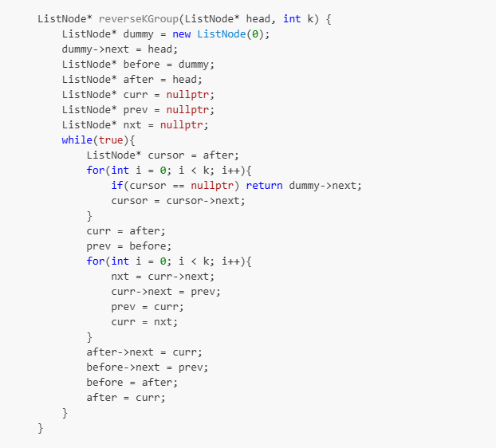

### 排序链表

思路：归并排序 merge sort

- 将链表从中间拆为两部分
- 递归对两个链表调用归并排序
- 将有序的两个链表 merge 成一个有序链表
- 时间/空间复杂度：O(NlogN)
- 优化：空间复杂度 O(1)
  - 迭代版归并排序

### 合并 K 个升序链表

法一：最小堆

- 初始化最小堆：所有链表的头节点
- 每次弹出堆顶，作为有序链表的节点，并将它的 next 节点放进最小堆

priority_queue 默认是一个最大堆，这意味着队列的顶部元素总是具有最大的值。

```cpp
class Solution {
public:
    // 声明一个自定义类型的优先队列，需要提供比较函数
    struct cmp{
        bool operator()(ListNode* a, ListNode* b){
            return a->val > b->val; // 这里定义了最小堆
        }
    };

    ListNode* mergeKLists(vector<ListNode*>& lists) {
        ListNode* dummy = new ListNode(0);
        ListNode* dh = dummy;
        priority_queue<ListNode*, vector<ListNode*>, cmp> minheap;
        for(auto c : lists){
            if(c) minheap.push(c);
        }
        while(minheap.size()){
            ListNode* cur = minheap.top();
            minheap.pop();
            if(cur->next) minheap.push(cur->next);
            dh->next = cur;
            dh = dh->next;
        }
        return dummy->next;
    }
};
```

法二：归并排序

- 把 lists 一分为二（均分），先合并前一半的链表，再合并后一半的链表，然后把这两个链表合并成最终的链表。

```cpp
class Solution {
    ListNode* mergeTwoLists(ListNode* h1, ListNode* h2){
        ListNode* dummy = new ListNode(-1);
        ListNode* cur = dummy;
        while(h1 && h2){
            if(h1->val < h2->val) {
                cur->next = h1;
                h1 = h1->next;
            } else {
                cur->next = h2;
                h2 = h2->next;
            }
            cur = cur->next;
        }
        if(h1) cur->next = h1;
        if(h2) cur->next = h2;
        return dummy->next;
    }

    ListNode* mergeKLists(vector<ListNode*>& lists, int i, int j){
        if(j - i + 1 == 0) return nullptr;
        if(j - i + 1 == 1) return lists[i];

        int mid = (i + j) / 2;
        return mergeTwoLists(mergeKLists(lists, i, mid),
                    mergeKLists(lists, mid + 1, j));
    }
public:
    ListNode* mergeKLists(vector<ListNode*>& lists) {
        return mergeKLists(lists, 0, lists.size() - 1);
    }
};
```

### LRU

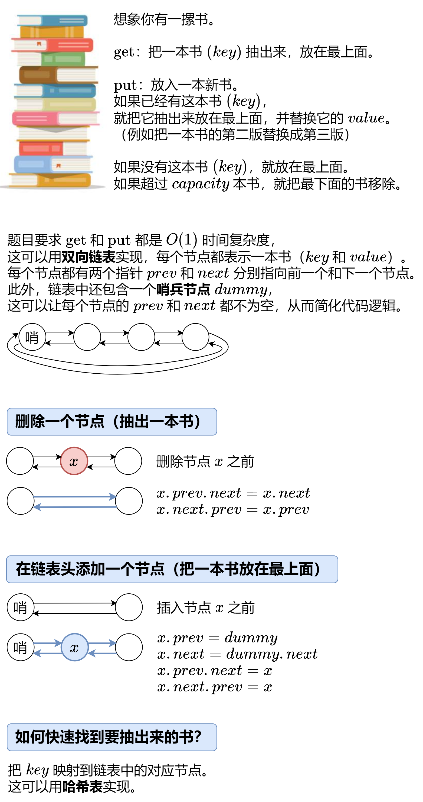

```cpp
class LRUCache {
    struct ListNode{
        int key;
        int value;
        ListNode* prev;
        ListNode* next;
        ListNode(): key(-1), value(-1), prev(nullptr), next(nullptr) {}
        ListNode(int key, int value): key(key), value(value), prev(nullptr), next(nullptr) {}
        ListNode(int key, int value, ListNode* prev, ListNode* next): key(key), value(value), prev(prev), next(next) {}
    };

    ListNode* dummy;
    int len = 0;
    int max_len = 0;

    unordered_map<int, ListNode*> key2node;

    // 在链表头添加一个节点
    void add_to_top(ListNode* node){
        node->prev = dummy;
        node->next = dummy->next;
        node->prev->next = node;
        node->next->prev = node;
        key2node[node->key] = node;
        len++;
    }

    // 删除一个节点
    void delete_node(ListNode* tar){
        tar->prev->next = tar->next;
        tar->next->prev = tar->prev;
        key2node[tar->key] = nullptr;
        len--;
    }

public:
    LRUCache(int capacity) {
        dummy = new ListNode();
        dummy->prev = dummy;
        dummy->next = dummy;
        max_len = capacity;
    }

    int get(int key) { // 将一本书抽出来，放在最上面
        ListNode* tar = key2node[key];
        if(tar == nullptr) return -1;
        delete_node(tar);
        add_to_top(tar);
        return tar->value;
    }

    void put(int key, int value) {
        ListNode* tar = key2node[key];
        if(tar){ // 如果已经有这本书，就把它抽出来放在最上面
            delete_node(tar);
            add_to_top(tar);
            tar->value = value;
        }
        else{ // 如果没有，就放在最上面
            ListNode* node = new ListNode(key, value);
            add_to_top(node);
        }
        if(len > max_len){ // 如果容量超了，就把最下面的书移除
            delete_node(dummy->prev);
        }
    }
};
```

## 子串

### 和为 K 的子数组

法一：前缀和

- 计算前缀和数组：`s[0] = 0, s[1] = nums[0], s[i] = s[i - 1] + nums[i - 1]`
- 双重循环，找前缀和数组之差等于目标值的即为子串
- 优化：哈希表
  - 双重循环的目标是找 `s[j] - s[i] == k`，我们可以转换成已知 `s[i]` 用哈希表找 `s[j] - k`

注意：前缀和数组长度是 `n + 1`，必须要包含一个 `s[0] = 0`，这样才能统计到 `nums[0] == k`

```cpp
    int subarraySum(vector<int>& nums, int k) {
        int n = nums.size();
        int pre[n + 1];
        pre[0] = 0; pre[1] = nums[0];
        for(int i = 2; i < n + 1; i++){
            pre[i] = pre[i - 1] + nums[i - 1];
        }
        int cnt = 0;
        unordered_map<int, int> hash;
        for(int i = 0; i < n + 1; i++){
            int tar = pre[i] - k;
            if(hash.contains(tar)){
                cnt += hash[tar];
            }
            hash[pre[i]]++;;
        }
        return cnt;
    }
```

优化 2：直接在遍历的时候计算前缀和

### 滑动窗口最大值

法一：单调队列

- 维护一个长度为窗口大小、单调递减的双向队列，存储元素下标
- 每次元素从右边进入，最左边是当前最大值
  - 如果队首元素离开窗口，出队

```cpp
    vector<int> maxSlidingWindow(vector<int>& nums, int k) {
        deque<int> q;
        vector<int> res;
        int n = nums.size();
        for(int i = 0; i < n; i++){
            while(q.size() && nums[i] >= nums[q.back()]){
                q.pop_back();
            }
            q.push_back(i);
            while(q.front() < i + 1 - k) q.pop_front();
            if(i >= k - 1) res.push_back(nums[q.front()]);
        }
        return res;
    }
```

### 最小覆盖子串

思路：双指针

- 左右指针指向 s 头部，移动右指针，直到涵盖了 t 的所有字符
- 然后在此条件下。移动左指针
- 如果移动左指针后不能满足条件，继续移动右指针。如此往复，直到右指针达到 s 终点

```cpp
class Solution {
public:
    int ht_fin[128] = {};
    bool check(int ht[]){
        for(int i = 'A'; i <= 'Z'; i++){
            if(ht[i] < ht_fin[i]) return false;
        }
        for(int i = 'a'; i <= 'z'; i++){
            if(ht[i] < ht_fin[i]) return false;
        }
        return true;
    }
    string minWindow(string s, string t) {
        int len = s.size(), lent = t.size();
        int ht[128] = {};
        for(auto c : t){
            ht_fin[c]++;
        }
        int ans_left = 0, ans_right = INT_MAX;
        int left = 0, right = 0;
        for(;right < len; right++){
            ht[s[right]]++;
            while(left <= right && right - left + 1 >= lent && check(ht)) {
                if(ans_right - ans_left > right - left){
                    ans_left = left, ans_right = right;
                }
                ht[s[left]]--;
                left++;
            }
        }
        return ans_right == INT_MAX ? "" : s.substr(ans_left, ans_right - ans_left + 1);
    }
};
```

## 二叉树

二叉树的遍历分成三种，按照根节点的访问先后分为：

- 先序遍历（先根遍历）：先访问根节点，然后访问左子树， 最后访问右子树。
- 中序遍历（中根遍历）：先访问左子树，然后访问根节点， 最后访问右子树。
- 后序遍历（后根遍历）：先访问左子树，然后访问右子树， 最后访问根节点。

验证 BST：中序遍历是严格递增数组

### 从前序与中序遍历序列构造二叉树

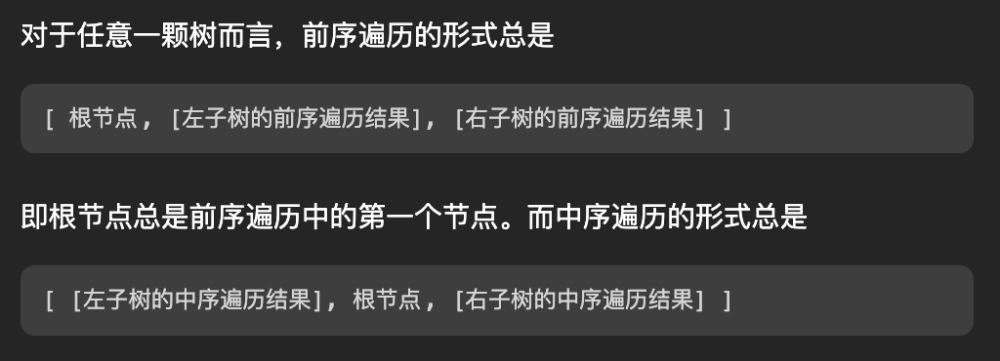

## 二分查找

lower_bound: 用于在有序序列中查找第一个大于或等于给定值的元素的位置。

找到单增数组 a 中 >=x 的数中**最小**的那个

```c
   while (l < r){
      int mid = (l + r) >> 1;
      if(a[mid] >= x) r = mid;
      else l = mid + 1;
   }
   cout << a[l];
```

找到单增数组 a 中 <=x 的数中**最大**的那个

```c
   while (l < r)
   {
      int mid = (l + r + 1) >> 1;
      if(a[mid] <= x) l = mid;
      else r = mid - 1;
   }
   cout << a[l];
```

### 在排序数组中查找元素的第一个和最后一个位置

```js
// 如果 lower 为 true，则查找第一个大于等于 target 的下标
// 否则查找第一个大于 target 的下标
function binary_search(nums, target, is_lower) {
  let l = 0,
    r = nums.length - 1,
    ans = nums.length;
  while (l <= r) {
    const mid = Math.floor((l + r) >> 1);
    if (target < nums[mid] || (is_lower && target <= nums[mid])) {
      r = mid - 1;
      ans = mid;
    } else {
      l = mid + 1;
    }
  }
  return ans;
}
var searchRange = function (nums, target) {
  let ans = [-1, -1];
  const leftIdx = binary_search(nums, target, true);
  const rightIdx = binary_search(nums, target, false) - 1;
  if (
    leftIdx <= rightIdx &&
    rightIdx < nums.length &&
    nums[leftIdx] === target &&
    nums[rightIdx] === target
  ) {
    ans = [leftIdx, rightIdx];
  }
  return ans;
};
```

## 栈

### 最小栈

思路：两个栈

```CPP
class MinStack {
private:
    stack<int> s1;
    stack<int> s2;
public:
    void push(int x) {
	    s1.push(x);
	    if (s2.empty() || x <= getMin())  s2.push(x);
    }
    void pop() {
	    if (s1.top() == getMin())  s2.pop();
	    s1.pop();
    }
    int top() {
	    return s1.top();
    }
    int getMin() {
	    return s2.top();
    }
};
```

### 柱状图中最大的矩形

思路：单调栈

- 核心思路：**高度固定时，尽可能延伸矩阵的宽度**。
- 以某个柱子为基准，向左边寻找**第一个比它矮的柱子**、向右边寻找第一个比它矮的柱子，两者下标之差 - 1 为宽，基准柱子本身高度为高，面积为宽\*高
  - 例如 `h = {2 1 5 6 2 3}`，柱子 `h[2] = 5`左边第一个比它矮的柱子是 `h[1] = 1`，右边第一个比它矮的柱子是 `h[4] = 2`，则形成的宽度为 `4 - 1 - 1 = 2`，高度是它本身 `5`，所以柱子 5 能形成的最大面积是 `2 * 5 = 10`
- 如何快速找到第一个比它矮的柱子：单调递增栈（存放元素下标）
  - 记基准柱为 cur，左边第一个比它矮的柱子为 left，右边第一个比它矮的柱子为 right
  - 遍历数组并尝试向栈中添加元素 x。直至栈为空
    - 若 x 小于栈顶元素：cur = 栈顶，right = x，left = 栈顶下一个元素，计算面积
    - 否则，直接加入栈
  - 注意：考虑边界情况，在数组两侧添加 0。

```cpp
class Solution {
public:
    int largestRectangleArea(vector<int>& heights) {
        stack<int> stk;
        heights.push_back(0);
        heights.insert(heights.begin(), 0);
        int ans = 0;
        for(int i = 0; i < heights.size(); i++){
            int x = heights[i];
            while(stk.size() && x < heights[stk.top()]) {
                if(stk.top() == 0 && i == heights.size() - 1) break; // 两端0
                int cur = stk.top();
                stk.pop();
                int left = stk.top();
                int right = i;
                ans = max(ans, (right - left - 1) * heights[cur]);
            }
            stk.push(i);
        }
        return ans;
    }
};
```

## 普通数组

### 轮转数组

法一：使用额外的数组

法二：环状替换

从位置 0 开始，最初令 temp=nums[0]。根据规则，位置 0 的元素会放至 (0+k)modn 的位置，令 x=(0+k)modn，此时交换 temp 和 nums[x]，完成位置 x 的更新。然后，我们考察位置 x，并交换 temp 和 nums[(x+k)modn]，从而完成下一个位置的更新。不断进行上述过程，直至回到初始位置 0。

法三：数组翻转：
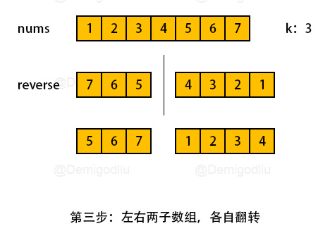

### 缺失的第一个正数

思路：原地哈希

- 第一次遍历：通过不断交换元素，使得数组中下标为 i 的元素是 i
- 第二次遍历：找到第一个不是 i 的元素，即为答案

```cpp
class Solution {
public:
    int firstMissingPositive(vector<int>& nums) {
        int n = nums.size();
        for(int i = 0; i < n; i++){
            // 如果当前学生的学号在 [1,n] 中，但（真身）没有坐在正确的座位上
            while(1 <= nums[i] && nums[i] <= n && nums[nums[i] - 1] != nums[i]){
                swap(nums[i], nums[nums[i] - 1]); // 那么就交换 nums[i] 和 nums[j]，其中 j 是 i 的学号
            }
        }

        for(int i = 0; i < n; i++){
            if(nums[i] != i + 1){
                return i + 1;
            }
        }

        return n + 1;
    }
};
```

## 矩阵

### 矩阵置零

思路：

- 用第一行/第一列存储该行/该列是否要置 0 的信息
- 用两个额外 bool 变量存储第一行/第一列是否包含 0，最后根据这两个变量决定第一行和第一列是否置 0

### 旋转图像

思路：两次翻转

- 转置（沿对角线翻转）+ 行翻转

### 搜索二维矩阵 II

思路：排除法

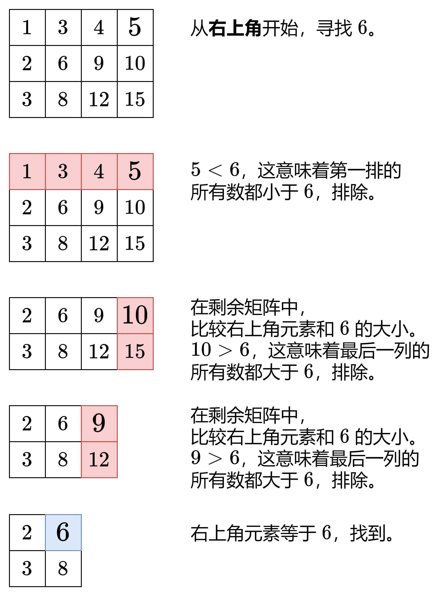

## 技巧

### 多数元素

尝试设计一个 O(n) 一次遍历，同时只用到 O(1) 额外空间的算法。

想象一众武林高手比武，谁会笑到最后？用「擂台赛」打比方：

- 擂主登场：nums[0] 成为初始擂主，生命值为 1。
- 挑战者出现：遍历后续元素，作为挑战者。
- 比武：如果挑战者与擂主属于同一门派（值相同），那么擂主生命值加 1，否则擂主生命值减 1。
- 擂主更迭：如果比武后，擂主生命值降为 0（同归于尽），那么下一个挑战者成为新的擂主，生命值为 1。
- 最后在擂台上的那人，便是武林盟主（绝对众数）。

思路：相异的数字相互抵消

- 维护一个计数器 `cnt`，令答案为第一个元素，初始化 `cnt = 1`，遍历数组
  - 若当前元素与答案相同，`cnt++`；否则，`cnt--`。
  - 如果 `cnt < 0`，就将答案替换为当前元素，`cnt = 1`

还可以用栈实现：

- 如果新的数字和栈顶元素相异，那就弹出栈顶元素，相当于抵消掉了（剩下的所有数字依然满足存在一个严格众数）。
- 如果和栈顶元素相同，就继续压入栈中。最后看栈里面的元素即可

### 颜色分类

思路：插入排序

- `nums[0]`到 `nums[i - 1]`是有序的，将 `nums[i]`插入，使得其依旧有序

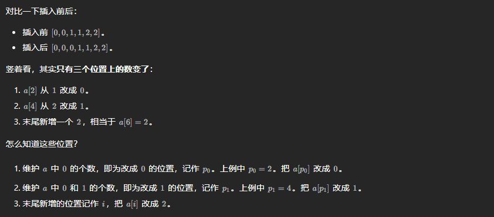
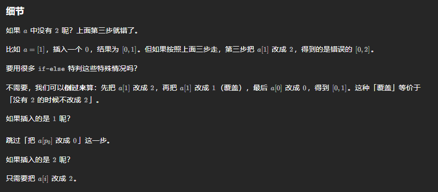

- 时间复杂度：O(n)
- 空间复杂度：O(1)

```cpp
class Solution {
public:
    void sortColors(vector<int>& nums) {
        vector<int> res(nums.size());
        int idx_0 = 0, idx_1 = 0;
        for(int i = 0; i < nums.size(); i++){
            int x = nums[i];
            nums[i] = 2;
            if(x <= 1){
                nums[idx_1++] = 1;
            }
            if(x == 0) {
                nums[idx_0++] = 0;
            }
        }
    }
};
```

### 下一个排列

背：从后往前先找第一个导致逆序的数 nums[i]，再从后往前找第一个比 nums[i]大的数 nums[j]，交换 nums[i]和 nums[j]，交换之后后边还是有序的(降序)，用双指针反转就是升序了

分析：
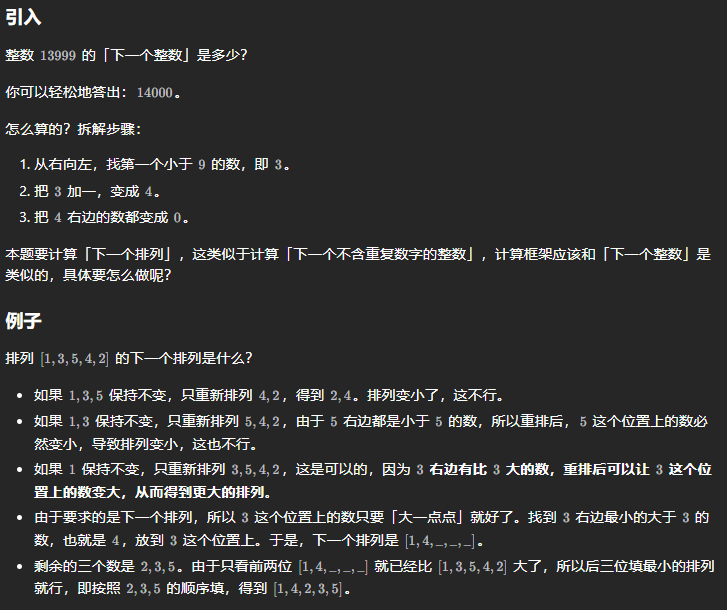

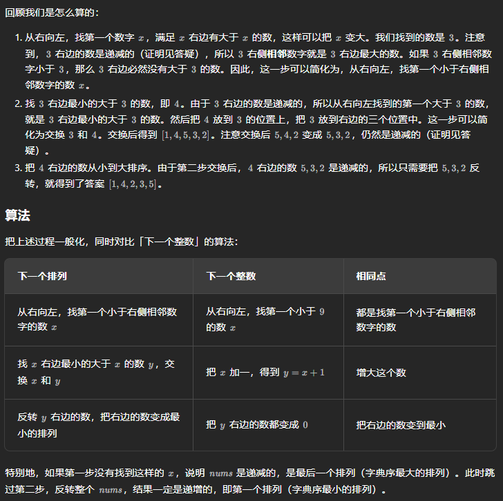

思路：找尽可能靠右的【较小数】和尽可能小的【较大数】，交换

- 首先从后向前查找第一个严格递增顺序对 `(i,i + 1)`，满足 `a[i] < a[i + 1]`。这样「较小数」即为 `a[i]`。此时 `[i + 1,n)` 必然是下降序列。
- 如果找到了顺序对，那么在区间 `[i + 1,n)` 中从后向前查找第一个元素 j 满足 `a[i] < a[j]`。这样「较大数」即为 `a[j]`。
- 交换 `a[i]` 与 `a[j]`，此时可以证明区间 `[i + 1,n)` 必为降序。我们可以直接使用双指针反转区间 `[i + 1,n)` 使其变为升序，而无需对该区间进行排序。

#### 【变式】上一个排列

思路：把每个元素变成相反数，找上一个排列就变成找下一个排列了，最后再取相反数变回来。

### 寻找重复数

构造一个有向图，边`a -> b`的含义是`nums[a] = b`，即`val`为`i`，`next`为`nums[i]`


如果有环，则入环口就是重复元素。（注意应从 0 开始寻找，其他的环不算）


判断入环口：快慢指针相遇，然后头指针与慢指针并行，直到相遇

```js
var findDuplicate = function (nums) {
  const n = nums.length;
  let slow = (fast = 0);
  while (true) {
    slow = nums[slow];
    fast = nums[nums[fast]];
    if (slow == fast) break;
  }
  let head = 0;
  while (head !== slow) {
    slow = nums[slow];
    head = nums[head];
  }
  return slow;
};
```
